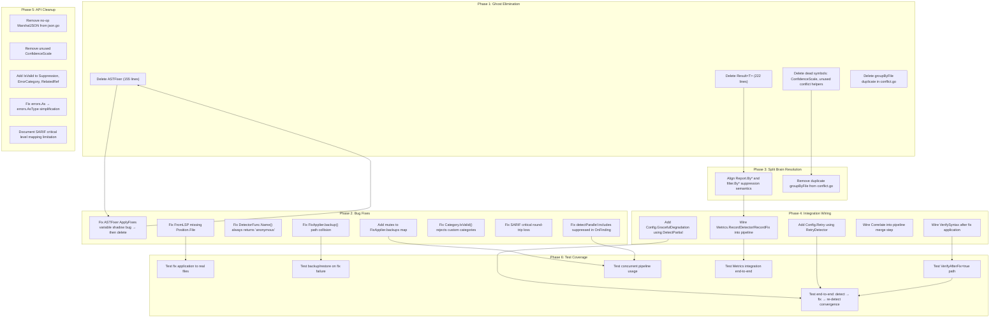

# go-finding Comprehensive Cleanup Plan

**Date:** 2026-04-15 17:28
**Status:** Planning
**Scope:** Full codebase audit → ghost elimination → split brain resolution → integration wiring

---

## Audit Summary

| Metric                               | Value                            |
| ------------------------------------ | -------------------------------- |
| Total lines of Go code               | 8,891                            |
| Root package statements coverage     | 94.6%                            |
| Pipeline package statements coverage | 81.0%                            |
| Lint issues                          | 0 (golangci-lint)                |
| Ghost exported symbols               | ~25 (across ~600 lines)          |
| Split brains                         | 3 pairs                          |
| Missing integrations                 | 7 features built but never wired |
| Untested critical paths              | 6                                |

### What We Got Right

- Core types (`Finding`, `Severity`, `Position`, `Range`) are clean and well-tested
- SARIF output is comprehensive and spec-compliant
- Pipeline detect-triage-fix loop is solid at the core
- LSP conversion works correctly (one-way)
- Commit `5401572` fixed 16 real bugs (nil panics, integer underflow, mutation bugs, state accumulation)

### What We Got Wrong

1. **Scope creep**: Built `Result[T]` (222 lines of Rust cosplay) that nobody uses. Built `ASTFixer` (155 lines) that duplicates `FixApplier`. Built `RetryDetector`, `DetectPartial`, `Correlate` — all orphaned.
2. **Split brains**: Two fix appliers, two filter systems, two group-by implementations — each pair with subtly different semantics.
3. **Integration gaps**: Metrics recording, partial detection, retry wrapping, correlation — all built, none wired into `Pipeline.Run()`.
4. **Test gaps**: No test for actual fix application to files, no test for backup/restore, no test for `VerifyAfterFix`, no concurrent pipeline test.

---

## Execution Graph

---

## 24-Task Plan (30-100 min each)

Sorted by importance / impact / effort / customer-value.

| #   | Task                                                                                                                                                                                                                                                 | Files                                                                      | Impact    | Effort | Customer Value                                            |
| --- | ---------------------------------------------------------------------------------------------------------------------------------------------------------------------------------------------------------------------------------------------------- | -------------------------------------------------------------------------- | --------- | ------ | --------------------------------------------------------- |
| 1   | **Delete `Result[T]`** — 222 lines of unused Rust-style Result type. Zero consumers. Tests only.                                                                                                                                                     | `result.go`, `result_test.go`                                              | 🔴 High   | 5 min  | Removes 222 lines of misleading API surface               |
| 2   | **Delete `ASTFixer`** — 155 lines, duplicate of `FixApplier`, never called by pipeline. Has a variable shadow bug in `ApplyFixes`. Fix the bug first, then delete entire file + tests.                                                               | `pipeline/astfix.go`, `pipeline/astfix_test.go`                            | 🔴 High   | 15 min | Eliminates split brain #1, removes 155 lines of dead code |
| 3   | **Fix `FromLSP` missing `Position.File`** — `FromLSP()` returns Findings with empty `Position.File`, making them invalid. Fix to extract file from `LSPRelatedInfo.URI`.                                                                             | `lsp.go`, `lsp_test.go`                                                    | 🔴 High   | 30 min | Makes LSP round-trip actually work                        |
| 4   | **Fix `DetectorFunc.Name()` always "anonymous"** — Every `DetectorFunc` reports name "anonymous" making metrics useless. Add `NamedDetectorFunc(name, fn)` or change pattern.                                                                        | `pipeline/pipeline.go`, `pipeline/pipeline_test.go`                        | 🟠 Medium | 30 min | Makes metrics and logging meaningful                      |
| 5   | **Wire `Metrics.RecordDetector()` and `RecordFix()` into pipeline** — Fields `DetectorTimes`, `FindingsFound`, `FixesApplied` are always empty because nobody calls these methods.                                                                   | `pipeline/pipeline.go`, `pipeline/metrics.go`                              | 🟠 Medium | 45 min | Makes Metrics actually useful for consumers               |
| 6   | **Fix `FixApplier.backup()` path collision** — Uses `filepath.Base()` for temp file names, causing collisions for same-named files in different directories. Use hash of full path instead.                                                          | `pipeline/pipeline.go`                                                     | 🟠 Medium | 20 min | Prevents data loss in real projects                       |
| 7   | **Add mutex to `FixApplier.backups` map** — Map is read/written from parallel goroutines in `detectParallel`. Race condition.                                                                                                                        | `pipeline/pipeline.go`                                                     | 🔴 High   | 15 min | Prevents data races                                       |
| 8   | **Fix `detectParallel` includes suppressed findings in `OnFinding`** — `detectParallel` calls `notifyFinding` on ALL findings including suppressed. `detectSequential` filters first. Inconsistent behavior.                                         | `pipeline/pipeline.go`, `pipeline/pipeline_test.go`                        | 🟠 Medium | 30 min | Consistent behavior regardless of parallelism mode        |
| 9   | **Align `Report.By*` and `filter.By*` suppression semantics** — `Report.BySeverity()` auto-filters suppressed, `filter.BySeverity()` does not. Same name, different behavior. Document or unify.                                                     | `report.go`, `filter.go`                                                   | 🟠 Medium | 45 min | Prevents confusing bugs for consumers                     |
| 10  | **Fix `Category.IsValid()` for custom categories** — Rejects any string not in the predefined set, but examples and real usage use custom strings like `"go-vet"`. Change to always-valid (document convention) or add explicit `"custom"` sentinel. | `category.go`, `category_test.go`                                          | 🟠 Medium | 30 min | Unblocks real-world usage                                 |
| 11  | **Delete dead symbols: `ConfidenceScale`, `HasConflicts()`, `GroupFixesByConflict()`, `groupByFile()`** — All only used in their own tests or not at all.                                                                                            | `sarif.go`, `pipeline/conflict.go`                                         | 🟡 Low    | 10 min | Removes confusing API surface                             |
| 12  | **Remove no-op `MarshalJSON` from `json.go`** — The alias pattern produces identical output to default marshaling. Pure dead code.                                                                                                                   | `json.go`, `json_test.go`                                                  | 🟡 Low    | 15 min | Removes misleading code                                   |
| 13  | **Fix SARIF critical round-trip loss** — `SeverityCritical` maps to SARIF `"error"`, but `FromSARIFLevel("error")` returns `SeverityError`. Document limitation or add SARIF extension.                                                              | `sarif.go`, `sarif_test.go`                                                | 🟠 Medium | 45 min | Prevents silent data loss in SARIF pipelines              |
| 14  | **Add `DetectPartial` as `Config.GracefulDegradation` option** — Wire the existing `DetectPartial` into `Pipeline.Run()` behind a config flag. Currently orphaned.                                                                                   | `pipeline/pipeline.go`, `pipeline/partial.go`, `pipeline/pipeline_test.go` | 🟠 Medium | 60 min | Adds resilience option for production use                 |
| 15  | **Add `Config.Retry` option using `RetryDetector`** — Wire existing `RetryDetector` into pipeline. Add `Config.RetryConfig` field.                                                                                                                   | `pipeline/pipeline.go`, `pipeline/retry.go`, `pipeline/pipeline_test.go`   | 🟠 Medium | 60 min | Adds retry resilience for flaky detectors                 |
| 16  | **Add `IsValid()` to `Suppression`, `ErrorCategory`, `RelatedRef`** — These types have no validation. Add `IsValid() bool` to each.                                                                                                                  | `suppression.go`, `errors.go`, `finding.go`                                | 🟡 Low    | 30 min | Defensive programming, catches bad data early             |
| 17  | **Test fix application to real files** — No test creates a file, runs pipeline with fix, verifies file content changed. Critical untested path.                                                                                                      | `pipeline/pipeline_test.go` or new file                                    | 🟠 Medium | 60 min | Verifies the core value proposition actually works        |
| 18  | **Test backup/restore on fix failure** — `FixApplier.restore()` is never tested. If fix corrupts file, restore path is unverified.                                                                                                                   | `pipeline/pipeline_test.go` or new file                                    | 🟠 Medium | 45 min | Verifies data safety mechanism works                      |
| 19  | **Test `VerifyAfterFix=true` end-to-end** — No test exercises this config option. The verification path is completely untested.                                                                                                                      | `pipeline/pipeline_test.go`                                                | 🟠 Medium | 45 min | Verifies verification loop works                          |
| 20  | **Test concurrent pipeline usage** — No test for parallel detectors hitting same pipeline. Race conditions possible.                                                                                                                                 | `pipeline/pipeline_test.go`                                                | 🟠 Medium | 45 min | Verifies thread safety claims                             |
| 21  | **Fix `errors.As` → `errors.AsType` simplification** — gopls hint, modernize to Go 1.22+ pattern.                                                                                                                                                    | `errors.go`                                                                | 🟡 Low    | 5 min  | Code modernization                                        |
| 22  | **Wire `Correlate()` into pipeline merge step or delete** — `Correlate` + `Correlation` types are never used. Either wire into pipeline or delete.                                                                                                   | `merge.go`, `pipeline/pipeline.go`                                         | 🟡 Low    | 60 min | Either adds value or removes dead code                    |
| 23  | **Clean up unused writes in pipeline_test.go** — Lines 445-448 assign to fields never read.                                                                                                                                                          | `pipeline/pipeline_test.go`                                                | 🟡 Low    | 5 min  | Removes test smell                                        |
| 24  | **Remove `CalculateStats` unused parameters** — Has 4 unused parameters (`f`, `fset`, `beforeCode`, `afterCode`). Only `results` is used.                                                                                                            | `pipeline/astfix.go`                                                       | 🟡 Low    | 5 min  | Code cleanup (delete with ASTFixer)                       |

**Total estimated effort: ~14 hours**

---

## 60-Task Granular Breakdown (max 12 min each)

Sorted by importance / impact / effort / customer-value.

### Phase 1: Ghost Elimination (Fastest value, lowest risk)

| #   | Task                                                       | File(s)                   | Time  |
| --- | ---------------------------------------------------------- | ------------------------- | ----- |
| 1   | Delete `result.go` (222 lines)                             | `result.go`               | 2 min |
| 2   | Delete `result_test.go`                                    | `result_test.go`          | 2 min |
| 3   | Verify build + tests pass after Result deletion            | —                         | 3 min |
| 4   | Fix `ASTFixer.ApplyFixes` variable shadow bug (line 40-56) | `pipeline/astfix.go`      | 5 min |
| 5   | Delete `pipeline/astfix.go` (155 lines)                    | `pipeline/astfix.go`      | 2 min |
| 6   | Delete `pipeline/astfix_test.go`                           | `pipeline/astfix_test.go` | 2 min |
| 7   | Verify build + tests pass after ASTFixer deletion          | —                         | 3 min |
| 8   | Delete `ConfidenceScale` constant from sarif.go            | `sarif.go`                | 2 min |
| 9   | Delete `HasConflicts()` from conflict.go                   | `pipeline/conflict.go`    | 2 min |
| 10  | Delete `GroupFixesByConflict()` from conflict.go           | `pipeline/conflict.go`    | 2 min |
| 11  | Delete unused `groupByFile()` from conflict.go             | `pipeline/conflict.go`    | 2 min |
| 12  | Delete `CanApplyASTFix()` from astfix.go (or with file)    | `pipeline/astfix.go`      | 1 min |
| 13  | Verify build + tests pass after dead symbol cleanup        | —                         | 3 min |

### Phase 2: Bug Fixes (High impact, medium effort)

| #   | Task                                                                       | File(s)                     | Time   |
| --- | -------------------------------------------------------------------------- | --------------------------- | ------ |
| 14  | Fix `FromLSP` to set `Position.File` from `LSPRelatedInfo.URI`             | `lsp.go`                    | 8 min  |
| 15  | Add test for `FromLSP` with file path                                      | `lsp_test.go`               | 10 min |
| 16  | Fix `DetectorFunc.Name()` — add `NamedDetectorFunc(name, fn)` constructor  | `pipeline/pipeline.go`      | 8 min  |
| 17  | Add test for `NamedDetectorFunc`                                           | `pipeline/pipeline_test.go` | 8 min  |
| 18  | Fix `FixApplier.backup()` to use path hash instead of `filepath.Base`      | `pipeline/pipeline.go`      | 8 min  |
| 19  | Add mutex to `FixApplier.backups` map                                      | `pipeline/pipeline.go`      | 6 min  |
| 20  | Fix `detectParallel` to filter suppressed before `notifyFinding`           | `pipeline/pipeline.go`      | 6 min  |
| 21  | Add test for parallel detection with suppressed findings                   | `pipeline/pipeline_test.go` | 10 min |
| 22  | Fix `Category.IsValid()` to accept custom categories                       | `category.go`               | 5 min  |
| 23  | Update `Category.IsValid()` tests for custom categories                    | `category_test.go`          | 5 min  |
| 24  | Fix SARIF critical round-trip: document or add `levelProperties` extension | `sarif.go`                  | 10 min |
| 25  | Add SARIF round-trip test for critical severity                            | `sarif_test.go`             | 8 min  |
| 26  | Simplify `errors.As` to `errors.AsType`                                    | `errors.go`                 | 2 min  |

### Phase 3: Split Brain Resolution (Medium impact)

| #   | Task                                                                    | File(s)                  | Time   |
| --- | ----------------------------------------------------------------------- | ------------------------ | ------ |
| 27  | Document `Report.By*` auto-filters suppressed; `filter.By*` does not    | `report.go`, `filter.go` | 5 min  |
| 28  | Add `filter.NotSuppressed` to all `Report.By*` methods (unify behavior) | `report.go`              | 8 min  |
| 29  | Verify unified filter behavior with tests                               | `report_test.go`         | 10 min |

### Phase 4: Integration Wiring (Highest customer value)

| #   | Task                                                                    | File(s)                              | Time   |
| --- | ----------------------------------------------------------------------- | ------------------------------------ | ------ |
| 30  | Add `RecordDetector(name, duration, count)` calls in `detectSequential` | `pipeline/pipeline.go`               | 6 min  |
| 31  | Add `RecordDetector(name, duration, count)` calls in `detectParallel`   | `pipeline/pipeline.go`               | 6 min  |
| 32  | Add `RecordFix(strategy, applied)` calls in `applyDirectFixes`          | `pipeline/pipeline.go`               | 6 min  |
| 33  | Add test verifying Metrics fields are populated after Run               | `pipeline/pipeline_test.go`          | 10 min |
| 34  | Add `Config.GracefulDegradation bool` field                             | `pipeline/pipeline.go`               | 3 min  |
| 35  | Wire `DetectPartial` into `detect()` when config is set                 | `pipeline/pipeline.go`               | 8 min  |
| 36  | Add test for pipeline with GracefulDegradation                          | `pipeline/pipeline_test.go`          | 10 min |
| 37  | Add `Config.RetryConfig *RetryConfig` field                             | `pipeline/pipeline.go`               | 3 min  |
| 38  | Auto-wrap detectors with `RetryDetector` when config is set             | `pipeline/pipeline.go`               | 8 min  |
| 39  | Add test for pipeline with retry config                                 | `pipeline/pipeline_test.go`          | 10 min |
| 40  | Decide: wire `Correlate()` into merge step or delete it                 | `merge.go`                           | 12 min |
| 41  | Execute decision from #40 (wire or delete)                              | `merge.go` or `pipeline/pipeline.go` | 10 min |
| 42  | Wire `VerifySyntax` call after fix when available                       | `pipeline/pipeline.go`               | 8 min  |

### Phase 5: API Cleanup (Low effort, polish)

| #   | Task                                                                     | File(s)                               | Time  |
| --- | ------------------------------------------------------------------------ | ------------------------------------- | ----- |
| 43  | Remove no-op `MarshalJSON` for `Finding` alias                           | `json.go`                             | 3 min |
| 44  | Remove no-op `MarshalJSON` for `Report` alias                            | `json.go`                             | 3 min |
| 45  | Update `json_test.go` to verify default marshaling works                 | `json_test.go`                        | 5 min |
| 46  | Add `Suppression.IsValid() bool`                                         | `suppression.go`                      | 4 min |
| 47  | Add `ErrorCategory.IsValid() bool`                                       | `errors.go`                           | 4 min |
| 48  | Add `RelatedRef.IsValid() bool`                                          | `finding.go`                          | 4 min |
| 49  | Add tests for new `IsValid` methods                                      | respective `*_test.go`                | 8 min |
| 50  | Delete unused writes in `pipeline_test.go:445-448`                       | `pipeline/pipeline_test.go`           | 2 min |
| 51  | Delete `LineJSON` (only used in own test)                                | `json.go`, `json_test.go`             | 3 min |
| 52  | Delete `PrettyJSON` (only used in own test)                              | `json.go`, `json_test.go`             | 3 min |
| 53  | Delete `FormatDiagnostic` (only used in own test)                        | `diagnostic.go`, `diagnostic_test.go` | 3 min |
| 54  | Delete `FromSARIFLevel` (only used in own test)                          | `sarif.go`, `sarif_test.go`           | 3 min |
| 55  | Decide: keep or delete `FormatPartialErrors` (only used in own test)     | `pipeline/partial.go`                 | 5 min |
| 56  | Decide: keep or delete `Correlate`/`Correlation` (only used in own test) | `merge.go`                            | 5 min |

### Phase 6: Test Coverage (Highest long-term value)

| #   | Task                                                                     | File(s)                     | Time   |
| --- | ------------------------------------------------------------------------ | --------------------------- | ------ |
| 57  | Write end-to-end test: create file → detect → fix → verify file changed  | `pipeline/pipeline_test.go` | 12 min |
| 58  | Write backup/restore test: apply fix → simulate failure → verify restore | `pipeline/pipeline_test.go` | 12 min |
| 59  | Write `VerifyAfterFix=true` integration test                             | `pipeline/pipeline_test.go` | 12 min |
| 60  | Write concurrent pipeline test: parallel detectors → verify no races     | `pipeline/pipeline_test.go` | 12 min |

---

## Architectural Decisions Log

| Decision                          | Rationale                                                                             | Tradeoff                                                                                                        |
| --------------------------------- | ------------------------------------------------------------------------------------- | --------------------------------------------------------------------------------------------------------------- |
| Delete `Result[T]`                | Zero consumers. 222 lines. Not idiomatic Go.                                          | Lose Rust-style error handling. Consumers can use `finding.Finding` directly or `(T, error)`.                   |
| Delete `ASTFixer`                 | Duplicates `FixApplier`. Never wired. Has bugs.                                       | Lose syntax verification. Can re-add as `FixApplier.VerifySyntax` later.                                        |
| Keep `DetectPartial` + wire       | Real value for production resilience. Already built.                                  | Adds config surface. Must test.                                                                                 |
| Keep `RetryDetector` + wire       | Real value for flaky detectors. Already built.                                        | Adds config surface. Must test.                                                                                 |
| Unify filter semantics            | Same name should mean same behavior. `Report.By*` should use `filter.By*` internally. | Slight behavior change for `Report.By*` users (they already get suppression filtering — just make it explicit). |
| Fix `Category.IsValid` for custom | Real tools use custom categories. Rejecting them is wrong.                            | Lose strict taxonomy enforcement. Document convention instead.                                                  |

---

## Risk Assessment

| Risk                                                | Mitigation                                                                                               |
| --------------------------------------------------- | -------------------------------------------------------------------------------------------------------- |
| Deleting `Result[T]` breaks external consumers      | It's a library, but `Result[T]` is clearly over-engineered for this domain. Accept the breaking change.  |
| Unifying filter semantics changes behavior          | Only affects code that relied on `filter.By*` NOT filtering suppressed. Low risk, document in CHANGELOG. |
| Wiring `DetectPartial` changes detect loop behavior | Gated behind `Config.GracefulDegradation`. Opt-in. Zero risk.                                            |
| Wiring `RetryDetector` changes detector behavior    | Gated behind `Config.RetryConfig`. Opt-in. Zero risk.                                                    |

---

_Generated by Crush (AI Assistant) — 2026-04-15_
