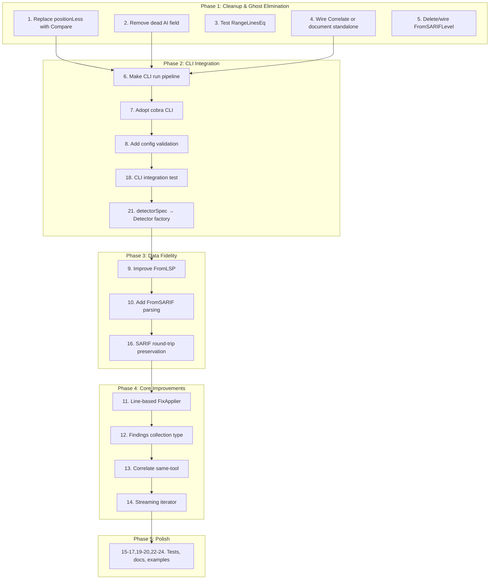

# go-finding Execution Plan V4 — Honest Audit & Integration Focus

**Date:** 2026-04-17
**Status:** Execution Plan
**Predecessor:** EXECUTION_PLAN_V3.md (12/25 tasks completed)

---

## Part 1: BRUTALLY HONEST AUDIT

### What Did We Forget?

| # | Finding | Severity | Details |
|---|---------|----------|---------|
| 1 | **CLI is a ghost** | Critical | `cmd/go-finding/main.go:94` does `_ = cfg` — entire pipeline never runs. Config loaded, parsed, thrown away. |
| 2 | **TriageResult.AI is a ghost field** | High | Pipeline triages AI-fixable findings but never acts on them. Dead code path. |
| 3 | **positionLess duplicates Compare** | Medium | `pipeline/conflict.go:138` has manual comparison that `Position.Compare` now provides. |
| 4 | **FromLSP is an orphan** | Medium | `lsp.go:FromLSP()` exists, has tests, but nothing calls it. Not wired into any workflow. |
| 5 | **FromSARIFLevel is an orphan** | Low | Only used in its own test. Created for a `FromSARIF` parser that doesn't exist yet. |
| 6 | **AnalysisDiagnostic is an orphan** | Medium | `diagnostic.go:AnalysisDiagnostic()` converts to go/analysis.Diagnostic but nothing uses it. |
| 7 | **detectorSpec parsed but unused** | Medium | `cmd/go-finding/main.go` parses `detectorSpec` from config but never creates detectors from it. |
| 8 | **RangeLinesEq has no tests** | Low | Only untested function in root package. |
| 9 | **SARIF conversion loses FixStrategy, Confidence, Timestamp** | Medium | ToSARIF only preserves SeverityCritical via Properties. Other fields are lost. |
| 10 | **Correlate is standalone — not wired into pipeline** | Medium | Works but consumers must call it manually. Not integrated in Pipeline.Run(). |

### What's Stupid That We Do Anyway?

| # | Stupid Thing | Why It's Stupid | Fix |
|---|-------------|-----------------|-----|
| 1 | Building ghost systems | We create FromLSP, FromSARIFLevel, AnalysisDiagnostic, Correlate without wiring them into anything. Code without users is waste. | Wire them in or delete them. |
| 2 | CLI that does nothing | We have a 170-line CLI with config loading, profiling, and flag parsing that prints "No detectors" and exits. | Either make it work or reduce to a minimal stub. |
| 3 | Duplicating comparison logic | `positionLess` in conflict.go was written before `Position.Compare` existed. Now we have two implementations that can diverge. | Replace positionLess with Position.Compare. |
| 4 | TriageResult.AI collected but never used | Pipeline categorizes AI fixes, stores them, then ignores them. Dead allocation. | Either implement AI fix path or remove the field until needed. |

### Did We Lie? Split Brains?

| # | Split Brain / Inconsistency | Fix |
|---|----------------------------|-----|
| 1 | **Report.BySeverity() vs Filter(report.Findings, BySeverityAtLeast())** — two API paths for same operation | Report methods delegate to filter.go (OK), but naming differs: `BySeverity` vs `BySeverityAtLeast` |
| 2 | **SeverityCritical maps to "error" in SARIF** — can't round-trip critical severity | Already partially fixed (Properties stores original), but `FromSARIF` doesn't read it back |
| 3 | **FromSARIFLevel returns SeverityWarning for unknown** — but `SeverityInfo` might be more appropriate for unknowns | Minor, but worth aligning |
| 4 | **Config validation in V3 plan (T2-02) targets a CLI stub** — validating config for a program that does nothing is premature | Focus on making CLI work first, then validate |

### How Can We Be Less Stupid?

1. **Stop building ghost systems.** Every new function MUST have a caller in the same PR/commit.
2. **Integrate before extending.** FromLSP, Correlate, AnalysisDiagnostic need integration paths, not more standalone utilities.
3. **Make the CLI work.** A working CLI is worth more than 10 new utility functions.
4. **Delete dead code aggressively.** If it has no callers and no planned callers this week, delete it.

### Scope Creep Assessment

The V3 plan had 25 tasks. Many are **library ergonomics** (Compare, Equal, Stringer, Findings type) that feel good but don't deliver customer value. Customer value = **a tool that finds and fixes issues**. The plan should prioritize:

1. **Making existing systems work end-to-end** (CLI, pipeline integration)
2. **Eliminating ghost systems** (wire or delete)
3. **Then** ergonomics and new features

### Test Assessment

- **Root package**: 89% of files have tests. `range_utils.go` is the gap.
- **Pipeline**: 100% of files have tests.
- **Examples**: 0% test coverage — acceptable for examples.
- **CLI**: 0% test coverage — critical gap once CLI actually does something.
- **Missing**: Integration test that runs the full pipeline end-to-end through the CLI.

### What Contributes to Customer Value?

| Customer Value | Current State | Gap |
|---------------|---------------|-----|
| Run detectors and report findings | Pipeline works in library mode | CLI doesn't use it |
| Convert between formats (SARIF, JSON, LSP) | Output works, parsing incomplete | FromSARIF needed for import |
| Fix issues automatically | Pipeline applies direct fixes | Only naive strings.Replace |
| Correlate findings across tools | Correlate function exists | Not wired into pipeline |

---

## Part 2: ARCHITECTURAL IMPROVEMENTS

### Architecture Decisions Causing Problems Now

| Decision | Problem | Improvement |
|----------|---------|-------------|
| CLI built with raw flag package | Can't add subcommands cleanly, no help system | Adopt cobra (industry standard) |
| FixApplier uses strings.Replace | Breaks on multi-occurrence, whitespace-insensitive | Line-range-based replacement using Range fields |
| SARIF is output-only | Can't import findings from other tools | Add FromSARIF parsing |
| Pipeline ignores AI fixes | TriageResult.AI is dead code | Remove until AI integration is real |
| Ghost functions without callers | Maintenance burden, false sense of completeness | Wire in or delete |

### Library Recommendations

| Library | Purpose | Verdict |
|---------|---------|---------|
| `github.com/owenrumney/go-sarif/v2` | SARIF parsing | Adopt for FromSARIF only (keep ToSARIF zero-dep) |
| `github.com/spf13/cobra` | CLI framework | Adopt for cmd/go-finding |
| `github.com/charmbracelet/fang` | Batteries-included cobra apps | Evaluate alongside cobra |
| `samber/lo` | Slice/map utilities | **Not needed** — Go 1.26 has `maps`, `slices` in stdlib |
| `samber/mo` | Monads | **Not needed** — over-engineering for this library |
| `knadh/koanf` | Config | **Not needed** — yaml.v3 + flag is sufficient |
| `onsi/ginkgo` | BDD tests | **Not needed** — stdlib testing + table-driven is the Go way |
| `sqlc`, `gin`, `templ`, `htmx` | Web/DB | **Not applicable** — this is a library, not a web service |

### Type Model Improvements

| Type | Current | Improvement | Value |
|------|---------|-------------|-------|
| `Findings []Finding` | Doesn't exist — `[]Finding` everywhere | Collection type with Filter/Sort/GroupBy | Reduces boilerplate, enables method chaining |
| `TriageResult` | `AI` field unused | Remove `AI` field until needed | Eliminates dead code |
| `FixApplier` | Stateless function | Line-based applier using Range | Correctness fix |
| `LSPDiagnostic` | Missing fields for round-trip | Add Properties map to FromLSP return | Data loss prevention |

---

## Part 3: EXECUTION PLAN (24 tasks, ~30-100min each)

Sorted by **Impact / Effort** — highest ROI first.

| # | Task | Impact | Effort | Customer Value |
|---|------|--------|--------|----------------|
| 1 | Replace positionLess with Position.Compare | High | Low | Code quality |
| 2 | Remove dead TriageResult.AI field | Medium | Low | Code quality |
| 3 | Add tests for RangeLinesEq | Low | Low | Test coverage |
| 4 | Wire Correlate into Pipeline (or document as standalone) | High | Medium | Feature completeness |
| 5 | Delete or wire FromSARIFLevel orphan | Low | Low | Code hygiene |
| 6 | Make CLI actually run pipeline with detectors from examples | Critical | Medium | **Customer value** |
| 7 | Adopt cobra for CLI | Medium | Medium | UX |
| 8 | Add config validation (Validate method) | Medium | Low | Robustness |
| 9 | Improve FromLSP — preserve lost data in Metadata | Medium | Low | Data fidelity |
| 10 | Add FromSARIF parsing (use go-sarif/v2) | High | Medium | **Interoperability** |
| 11 | Line-based FixApplier using Range | High | Medium | **Correctness** |
| 12 | Add Findings collection type | Medium | Medium | API ergonomics |
| 13 | Improve Correlate — same-tool support | Medium | Medium | Feature completeness |
| 14 | Add streaming iterator for large sets | Low | High | Scalability |
| 15 | Wire AnalysisDiagnostic into example | Low | Low | Example quality |
| 16 | SARIF round-trip: preserve all fields in Properties | Medium | Low | Data fidelity |
| 17 | Add property tests for Compare/Equal | Low | Low | Test quality |
| 18 | Add CLI integration test | High | Medium | **Test coverage** |
| 19 | Clean up branching example (unused ctx, fmt.Sprintf) | Low | Low | Example quality |
| 20 | Update doc.go with new API surface | Medium | Low | Documentation |
| 21 | Add detectorSpec → Detector factory in CLI | High | Medium | **Customer value** |
| 22 | Wire FromLSP into example or test utility | Low | Low | Integration |
| 23 | Remove gopls false-positive hints (document remaining) | Low | Low | Code hygiene |
| 24 | Update AGENTS.md with final state | Medium | Low | Documentation |

---

## Part 4: EXECUTION GRAPH

---

## Part 5: FINE-GRAINED TASKS (60 tasks, ~12min each)

### Phase 1: Cleanup & Ghost Elimination (Tasks 1-10)

| # | Micro-Task | File(s) | Est. |
|---|-----------|---------|------|
| 1 | Replace `positionLess(a, b)` with `a.Compare(b) < 0` in conflict.go | pipeline/conflict.go | 12min |
| 2 | Run tests, verify conflict detection still works | pipeline/*_test.go | 2min |
| 3 | Remove `AI []finding.Finding` from TriageResult | pipeline/pipeline.go | 5min |
| 4 | Remove AI case from triage() switch | pipeline/pipeline.go | 3min |
| 5 | Update pipeline tests that reference TriageResult.AI | pipeline/pipeline_test.go | 5min |
| 6 | Add TestRangeLinesEq with equal/not-equal cases | range_utils_test.go (new) | 10min |
| 7 | Add doc comment to Correlate: "Standalone utility, not wired into Pipeline.Run()" | merge.go | 3min |
| 8 | Delete `FromSARIFLevel` function (only used in own test) | sarif.go | 3min |
| 9 | Delete TestFromSARIFLevel test | sarif_test.go | 2min |
| 10 | Run full test suite, commit Phase 1 | all | 5min |

### Phase 2: CLI Integration (Tasks 11-25)

| # | Micro-Task | File(s) | Est. |
|---|-----------|---------|------|
| 11 | Rewrite cmd/go-finding/main.go to accept detector registrations | cmd/go-finding/main.go | 15min |
| 12 | Import example detectors into CLI (staticcheck, govet) | cmd/go-finding/main.go | 10min |
| 13 | Wire config → pipeline.Config → Pipeline.New → Run | cmd/go-finding/main.go | 15min |
| 14 | Wire pipeline result → Report → output (text/json/sarif) | cmd/go-finding/main.go | 10min |
| 15 | Test CLI manually: `go run ./cmd/go-finding --dir=. --format=json` | — | 5min |
| 16 | Add `go run ./cmd/go-finding --help` verification | — | 3min |
| 17 | `go get github.com/spf13/cobra`, create root command | cmd/go-finding/ | 10min |
| 18 | Create `run` subcommand with cobra flags | cmd/go-finding/ | 12min |
| 19 | Create `convert` subcommand (JSON↔SARIF) | cmd/go-finding/ | 10min |
| 20 | Move config loading to separate file cmd/go-finding/config.go | cmd/go-finding/ | 8min |
| 21 | Add Validate() method on pipelineConfigFile | cmd/go-finding/config.go | 10min |
| 22 | Add tests for Validate: bad timeout, negative iterations, empty detector name | cmd/go-finding/config_test.go | 12min |
| 23 | Add CLI integration test: run pipeline with stub detector | cmd/go-finding/main_test.go | 12min |
| 24 | Create detectorSpec → Detector factory using examples | cmd/go-finding/detectors.go | 15min |
| 25 | Run full test suite, commit Phase 2 | all | 5min |

### Phase 3: Data Fidelity (Tasks 26-35)

| # | Micro-Task | File(s) | Est. |
|---|-----------|---------|------|
| 26 | Add LSPMetadata struct to lsp.go with lost fields | lsp.go | 5min |
| 27 | Update FromLSP to store FixStrategy, Category, Confidence in Metadata | lsp.go | 8min |
| 28 | Add FromLSP round-trip test | lsp_test.go | 10min |
| 29 | `go get github.com/owenrumney/go-sarif/v2` | go.mod | 3min |
| 30 | Add FromSARIF(data []byte) (*Report, error) | sarif.go | 15min |
| 31 | Add SARIF test fixture (real SARIF file from govet output) | testdata/ | 5min |
| 32 | Add FromSARIF tests with fixture | sarif_test.go | 12min |
| 33 | Update ToSARIF to preserve ALL fields in Properties (not just SeverityCritical) | sarif.go | 10min |
| 34 | Update FromSARIF to read Properties back into Finding fields | sarif.go | 8min |
| 35 | Run full test suite, commit Phase 3 | all | 5min |

### Phase 4: Core Improvements (Tasks 36-48)

| # | Micro-Task | File(s) | Est. |
|---|-----------|---------|------|
| 36 | Refactor FixApplier.applyToFile to use line-range from Finding.Range | pipeline/pipeline.go | 15min |
| 37 | Read file lines, replace lines [start..end], write back | pipeline/pipeline.go | 12min |
| 38 | Fallback to strings.Replace when Range is nil | pipeline/pipeline.go | 5min |
| 39 | Add line-based fix test with multi-line replacement | pipeline/pipeline_test.go | 10min |
| 40 | Create findings.go with `type Findings []Finding` | findings.go (new) | 5min |
| 41 | Add Filter, SortBy, GroupByFile, Contains methods | findings.go | 15min |
| 42 | Delegating existing filter.go functions internally | findings.go | 8min |
| 43 | Add Findings tests | findings_test.go (new) | 12min |
| 44 | Add SameTool option to Correlate (default false) | merge.go | 10min |
| 45 | Update Correlate to check same-tool pairs when enabled | merge.go | 12min |
| 46 | Add Correlate same-tool tests | merge_test.go | 8min |
| 47 | Create iterator.go with FindingIterator interface | iterator.go (new) | 10min |
| 48 | Add JSONL file iterator implementation | iterator.go | 12min |

### Phase 5: Polish (Tasks 49-60)

| # | Micro-Task | File(s) | Est. |
|---|-----------|---------|------|
| 49 | Add iterator tests | iterator_test.go | 10min |
| 50 | Wire AnalysisDiagnostic into govet example | examples/govet/main.go | 8min |
| 51 | Fix branching example: use ctx, remove unnecessary fmt.Sprintf | examples/branching/main.go | 5min |
| 52 | Wire FromLSP into a test utility or example | example_test.go | 8min |
| 53 | Add property tests for Compare (total order, antisymmetry) | property_test.go | 10min |
| 54 | Add property tests for Equal (reflexivity, symmetry, transitivity) | property_test.go | 8min |
| 55 | Update doc.go with new API (Compare, Findings, sentinel errors, CategoryUnused) | doc.go | 10min |
| 56 | Update AGENTS.md with final file listing and architecture | AGENTS.md | 8min |
| 57 | Document remaining gopls false-positive hints in code comments | *_test.go | 5min |
| 58 | Final test suite run + vet + build verification | all | 5min |
| 59 | Update EXECUTION_PLAN_V3.md success criteria checkboxes | docs/planning/ | 3min |
| 60 | git push | — | 2min |

---

## Success Criteria

- [ ] All ghost systems either wired in or deleted
- [ ] CLI runs pipeline end-to-end with real detectors
- [ ] CLI uses cobra with subcommands
- [ ] Config validation works
- [ ] SARIF round-trip preserves all fields
- [ ] FromSARIF parsing available
- [ ] FixApplier uses line-range replacement
- [ ] No duplicate comparison logic
- [ ] All tests pass, coverage ≥ 95%
- [ ] No dead code in production files

---

*Plan created: 2026-04-17*
*Based on: Full codebase audit, ghost system analysis, architectural review*
