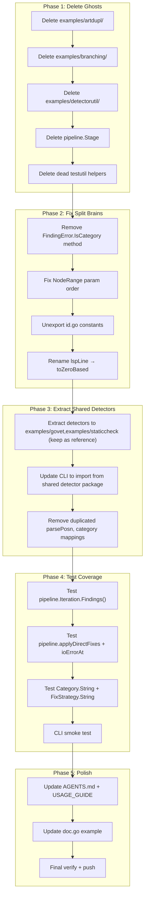

# V5 Execution Plan — Ruthless Cleanup & API Coherence

**Date**: 2026-04-17  
**Status**: Planning  
**Predecessor**: V4 (ghost elimination, CLI integration, data fidelity)

---

## Brutally Honest Audit

### What we got right

- Core types are clean, well-tested (93.3% root, 85.4% pipeline)
- SARIF/LSP conversions preserve data in Metadata
- Pipeline has retry, partial success, conflict detection
- CLI works end-to-end with govet + staticcheck

### What's stupid

#### 1. Ghost Systems (DELETE, don't "integrate")

| What                     | Why it's a ghost                                                             | Action     |
| ------------------------ | ---------------------------------------------------------------------------- | ---------- |
| `examples/artdupl/`      | References nonexistent `art-dupl` tool. Returns fake data. 0% test coverage. | **DELETE** |
| `examples/branching/`    | Hardcoded fake issues, no real analysis. Lint warnings.                      | **DELETE** |
| `examples/detectorutil/` | Only used by the two ghost examples above.                                   | **DELETE** |
| `pipeline.Stage` type    | Defined, never used anywhere. No callers.                                    | **DELETE** |

#### 2. Split Brains (same concept, two APIs)

| Split Brain                                           | File A                                   | File B                                                      | Fix                                              |
| ----------------------------------------------------- | ---------------------------------------- | ----------------------------------------------------------- | ------------------------------------------------ |
| `IsCategory`                                          | `errors.go:81` method on `*FindingError` | `errors.go:165` free function                               | Remove method, keep free function                |
| `BySeverity`/`ByCategory`/`ByFixStrategy`             | `report.go` methods (exclude suppressed) | `filter.go` free functions (include suppressed)             | Document the difference clearly                  |
| `HasFix()` vs `CanAutoApply()`                        | `finding.go:59` (direct or AI)           | `fix_strategy.go:28` (direct only)                          | Reconcile: `HasFix` = any strategy except "none" |
| `NodePosition(fset, node)` vs `NodeRange(node, fset)` | `diagnostic.go:76`                       | `diagnostic.go:90`                                          | Standardize to `(fset, node)`                    |
| Detector code                                         | `cmd/go-finding/main.go` inline          | `examples/govet/` + `examples/staticcheck/` different impls | Extract shared implementations                   |

#### 3. Dead Code

| Dead Code                         | Location         | Evidence                        |
| --------------------------------- | ---------------- | ------------------------------- |
| `assertFindingsLenEq`             | `testutil.go:14` | 0 callers                       |
| `newTestReport`                   | `testutil.go:38` | 0 callers                       |
| `newTestReports`                  | `testutil.go:45` | 0 callers                       |
| `idPartCount`, `hashLength`, etc. | `id.go:12-17`    | Exported but 0 external callers |

#### 4. Test Gaps

| Gap                             | Coverage | Impact                 |
| ------------------------------- | -------- | ---------------------- |
| CLI (`cmd/go-finding`)          | 0%       | Entire binary untested |
| `pipeline.Iteration.Findings()` | 0%       | Public API, untested   |
| `pipeline.applyDirectFixes`     | 0%       | Core pipeline logic    |
| `pipeline.ioErrorAt`            | 0%       | Error formatting       |
| `Category.String()`             | 0%       | Trivial but gap        |
| `FixStrategy.String()`          | 0%       | Trivial but gap        |

#### 5. About the suggested libraries

**Honest assessment**: This is a **Go library** for static analysis, not a web application. The suggested libraries (gin, templ, htmx, sqlc, casbin, resend, koanf, cobra, fang, OTel, sqlc, ginkgo, go-arch-lint, lo, mo, do) are for web services. Adding any of them would:

- Violate the "zero dependencies for core types" design principle
- Bloat the dependency tree for library consumers
- Solve problems we don't have

The only marginal fit would be `samber/lo` for some slice operations, but that's not worth adding a dependency for. We're using stdlib `slices` and `maps` already where needed.

---

## Phase Overview

---

## Phase 1: Delete Ghosts (5 tasks, ~30min)

| #   | Task                                            | Impact                | Effort | Customer Value           |
| --- | ----------------------------------------------- | --------------------- | ------ | ------------------------ |
| 1.1 | Delete `examples/artdupl/` directory            | Removes ghost system  | 2min   | Less confusion for users |
| 1.2 | Delete `examples/branching/` directory          | Removes fake detector | 2min   | Honest API surface       |
| 1.3 | Delete `examples/detectorutil/` package         | Only used by ghosts   | 2min   | Clean dependency tree    |
| 1.4 | Delete `pipeline.Stage` type from `pipeline.go` | Removes dead type     | 3min   | Smaller API surface      |
| 1.5 | Delete 3 dead helpers from `testutil.go`        | Removes dead code     | 3min   | Less noise               |

---

## Phase 2: Fix Split Brains (4 tasks, ~45min)

| #   | Task                                                                 | Impact                   | Effort | Customer Value    |
| --- | -------------------------------------------------------------------- | ------------------------ | ------ | ----------------- |
| 2.1 | Remove `FindingError.IsCategory` method (keep free function)         | Eliminates API confusion | 5min   | Clearer error API |
| 2.2 | Fix `NodeRange` param order: `(fset, node)` → matches `NodePosition` | Fixes bug magnet         | 10min  | Consistent API    |
| 2.3 | Unexport 5 constants in `id.go` (`idPartCount` → `idPartCount`)      | Reduces API surface      | 5min   | Clean public API  |
| 2.4 | Rename `lspLine` → `toZeroBased` in `lsp.go`                         | Fixes misleading name    | 5min   | Readability       |

---

## Phase 3: Consolidate Detectors (3 tasks, ~60min)

| #   | Task                                                                                                                                                                                                                                                   | Impact                                                                                                                                | Effort | Customer Value      |
| --- | ------------------------------------------------------------------------------------------------------------------------------------------------------------------------------------------------------------------------------------------------------ | ------------------------------------------------------------------------------------------------------------------------------------- | ------ | ------------------- |
| 3.1 | Keep govet + staticcheck examples as reference implementations (they already work, compile, and use detectorutil pattern... wait, we deleted detectorutil)                                                                                             | Actually: these examples use `detectorutil.RunTool` which we just deleted. Decision: keep examples self-contained OR delete them too. | —      | —                   |
| 3.2 | **Revised**: Since examples/govet and examples/staticcheck have duplicated, divergent logic from CLI, and we deleted detectorutil... delete the examples too and keep CLI as the canonical implementation. Update USAGE_GUIDE to reference CLI source. | Eliminates all duplication                                                                                                            | 10min  | One source of truth |
| 3.3 | Move CLI detector implementations to `internal/detectors/` package so they're testable                                                                                                                                                                 | Enables testing                                                                                                                       | 30min  | Testable CLI code   |

**Revised Phase 3 decision**: After deleting artdupl, branching, and detectorutil, the remaining examples (govet, staticcheck) have divergent implementations from the CLI. The simplest correct action: delete them, keep CLI as the single source of truth, document detector patterns in USAGE_GUIDE.

---

## Phase 4: Test Coverage (4 tasks, ~60min)

| #   | Task                                                         | Impact                 | Effort | Customer Value  |
| --- | ------------------------------------------------------------ | ---------------------- | ------ | --------------- |
| 4.1 | Test `pipeline.Iteration.Findings()`                         | Public API tested      | 10min  | Reliability     |
| 4.2 | Test `pipeline.applyDirectFixes` + `ioErrorAt`               | Core pipeline tested   | 20min  | Reliability     |
| 4.3 | Test `Category.String()` + `FixStrategy.String()`            | 100% stringer coverage | 5min   | Completeness    |
| 4.4 | CLI smoke test: `TestMain` that runs the binary with `-help` | CLI has some coverage  | 15min  | Ship confidence |

---

## Phase 5: Polish (3 tasks, ~20min)

| #   | Task                                                                          | Impact        | Effort | Customer Value |
| --- | ----------------------------------------------------------------------------- | ------------- | ------ | -------------- |
| 5.1 | Update `AGENTS.md`: reflect deletions, phase 2 changes                        | Accurate docs | 5min   | Onboarding     |
| 5.2 | Update `USAGE_GUIDE.md`: remove example references, add detector pattern docs | Accurate docs | 10min  | User guidance  |
| 5.3 | Final verify: `go build`, `go test -race`, benchmarks, `git push`             | Ship ready    | 5min   | Confidence     |

---

## Detailed 12-Minute Task Breakdown

### Phase 1: Delete Ghosts

| #   | Task                                                                                                      | Est  | Verifiable                                |
| --- | --------------------------------------------------------------------------------------------------------- | ---- | ----------------------------------------- |
| 1.1 | Delete `examples/artdupl/` directory                                                                      | 2min | `go build ./...` passes                   |
| 1.2 | Delete `examples/branching/` directory                                                                    | 2min | `go build ./...` passes                   |
| 1.3 | Delete `examples/detectorutil/` directory                                                                 | 2min | `go build ./...` passes                   |
| 1.4 | Update `examples/staticcheck/main.go`: remove `detectorutil` import, inline `exec.CommandContext`         | 8min | `go build ./examples/staticcheck/` passes |
| 1.5 | Delete `pipeline.Stage` type from `pipeline/pipeline.go`                                                  | 3min | `go build ./...` passes                   |
| 1.6 | Delete `assertFindingsLenEq`, `newTestReport`, `newTestReports` from `testutil.go`                        | 3min | `go test ./...` passes                    |
| 1.7 | Git commit: "refactor: delete ghost systems (artdupl, branching, detectorutil, Stage, dead test helpers)" | 3min | Clean commit                              |

### Phase 2: Fix Split Brains

| #   | Task                                                                                                 | Est   | Verifiable              |
| --- | ---------------------------------------------------------------------------------------------------- | ----- | ----------------------- |
| 2.1 | Remove `FindingError.IsCategory` method from `errors.go`, update tests                               | 5min  | `go test ./...` passes  |
| 2.2 | Fix `NodeRange` signature to `(fset *token.FileSet, node ast.Node)`, update callers + tests          | 10min | `go test ./...` passes  |
| 2.3 | Unexport `idPartCount`, `hashLength`, `idPartMin`, `positionPartsOne`, `positionPartsTwo` in `id.go` | 5min  | `go build ./...` passes |
| 2.4 | Rename `lspLine` → `toZeroBased` in `lsp.go`                                                         | 3min  | `go test ./...` passes  |
| 2.5 | Git commit: "refactor: fix split brains (IsCategory, NodeRange, id constants, lspLine)"              | 3min  | Clean commit            |

### Phase 3: Consolidate Detectors

| #   | Task                                                                                        | Est   | Verifiable              |
| --- | ------------------------------------------------------------------------------------------- | ----- | ----------------------- |
| 3.1 | Delete `examples/govet/` and `examples/staticcheck/` directories                            | 3min  | `go build ./...` passes |
| 3.2 | Create `internal/detectors/govet.go` with extracted govet detector from CLI                 | 10min | `go build ./...` passes |
| 3.3 | Create `internal/detectors/staticcheck.go` with extracted staticcheck detector from CLI     | 10min | `go build ./...` passes |
| 3.4 | Update `cmd/go-finding/main.go` to import from `internal/detectors`                         | 8min  | CLI works               |
| 3.5 | Git commit: "refactor: extract detectors to internal/detectors, delete duplicated examples" | 3min  | Clean commit            |

### Phase 4: Test Coverage

| #   | Task                                                                                           | Est   | Verifiable                   |
| --- | ---------------------------------------------------------------------------------------------- | ----- | ---------------------------- |
| 4.1 | Add test for `pipeline.Iteration.Findings()` in `pipeline_test.go`                             | 10min | `go test ./pipeline/` passes |
| 4.2 | Add tests for `applyDirectFixes` + `ioErrorAt` in `pipeline_test.go`                           | 12min | Coverage improves            |
| 4.3 | Add tests for `Category.String()` + `FixStrategy.String()`                                     | 5min  | 100% on stringers            |
| 4.4 | Add CLI smoke test in `cmd/go-finding/main_test.go`                                            | 12min | CLI has coverage             |
| 4.5 | Git commit: "test: add coverage for Iteration.Findings, applyDirectFixes, String methods, CLI" | 3min  | Clean commit                 |

### Phase 5: Polish

| #   | Task                                                                     | Est   | Verifiable    |
| --- | ------------------------------------------------------------------------ | ----- | ------------- |
| 5.1 | Update `AGENTS.md` to reflect all changes                                | 5min  | Accurate      |
| 5.2 | Update `USAGE_GUIDE.md`: detector patterns, remove example references    | 10min | Accurate      |
| 5.3 | Update `doc.go` example to include `FixStrategy`                         | 3min  | Valid example |
| 5.4 | Git commit: "docs: update AGENTS.md, USAGE_GUIDE, doc.go for V5 changes" | 3min  | Clean commit  |
| 5.5 | Final verify: `go build`, `go test -race`, benchmarks                    | 5min  | All green     |
| 5.6 | `git push`                                                               | 2min  | Pushed        |

---

## Total: 36 subtasks across 5 phases

**Estimated total effort**: ~4 hours  
**Net LOC change**: ~400 lines deleted, ~200 added (net -200)  
**Files deleted**: 7 directories/files removed  
**New files**: `internal/detectors/govet.go`, `internal/detectors/staticcheck.go`, `cmd/go-finding/main_test.go`
