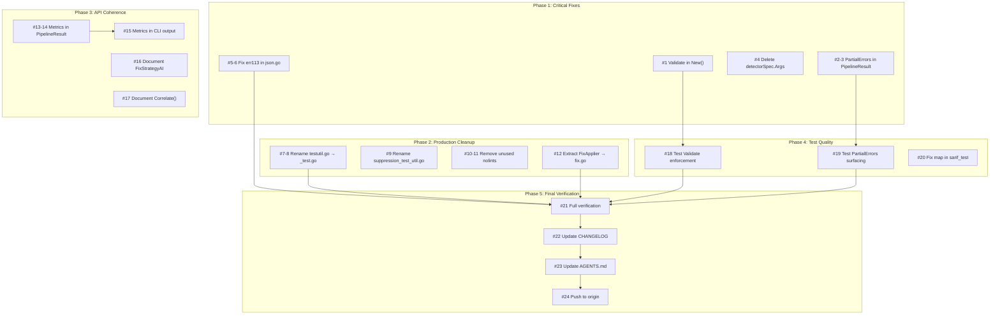

# Session 10 — Brutally Honest Architecture Audit & Execution Plan

**Date:** 2026-04-19
**Author:** Crush (AI Partner) + Lars
**Status:** Planning — Ready for Execution

---

## 0. Brutally Honest Self-Assessment

### a) What did we forget?

1. **`testutil.go` ships in production builds** — 7 exported test-only helpers (`MakeSimpleFinding`, `MakeSimpleReport`, etc.) compiled into every binary that imports this library. We've been doing this for 10 sessions.
2. **`Config.Validate()` exists but is never called** — `pipeline.New()` creates pipelines without validation. Invalid configs (negative iterations, negative timeouts) silently misbehave.
3. **Metrics collected but never reported** — CLI creates `pipeline.NewMetrics()`, passes it to pipeline, and after `Run()` completes the metrics are never read, logged, or output. Pure waste.
4. **Partial detection errors silently dropped** — `GracefulDegradation` calls `DetectPartial()` but discards `result.Errors`. The `ErrPartialDetection` sentinel and `FormatPartialErrors()` helper were written for this exact purpose but are never connected. Ghost code.
5. **`detectorSpec.Args` is a dead field** — Parsed from config YAML, stored in struct, `buildDetectors()` ignores it completely. Config format promises a feature that doesn't work.

### b) What is something stupid we do anyway?

1. **Filter pattern inconsistency** — `BySeverity()` returns a closure, but `NotSuppressed`/`HasFix`/`HasSuggestion` are bare `FilterFunc` values. Two patterns for the same concept. Pick one.
2. **Report convenience methods duplicate free functions** — `Report.BySeverity()` auto-excludes suppressed but `Filter(findings, BySeverity())` does not. Same name, different semantics. Confusing API.
3. **`FixStrategyAI` is a phantom** — Defined as a constant, exists in the type system, pipeline triage groups it with `Suggest` and treats them identically. `NeedsAI()` is never called. Either implement AI or remove it.
4. **pipeline.go is 780 lines** — Contains `FixApplier` (200+ lines) which is a completely separate concern from pipeline orchestration. Should be its own file.

### c) What could we have done better?

1. **err113 compliance** — 2 remaining `fmt.Errorf("literal")` in `json.go` that should be sentinel errors. We've known about these for 3+ sessions.
2. **Test naming convention** — Mixed underscore (`TestMerge_NilReports`) and camelCase (`TestSeverityOrdering`) across the project. Pick one.
3. **`Correlate()` is disconnected** — Documented as "not wired into Pipeline.Run()". The pipeline merges reports from multiple tools but never correlates findings across them. Either integrate or remove.
4. **Unused nolint directives** — `finding_extra_test.go:46` has a nolint that the linter itself says is unused. Dead metadata.

### d) What could we still improve?

- **Type model**: `Finding` is a value type with pointer fields (`*Range`, `*Suppression`, `map[string]string`). Consumers can accidentally alias by copying without `Clone()`. A builder pattern or mandatory constructor would help.
- **Error surfacing**: Pipeline swallows too much — partial errors, restore errors, config validation. The information exists in the code but never reaches the caller.
- **CLI metrics output**: After `Run()`, metrics should be serialized to the output (JSON/SARIF) or logged. Currently invisible.

### e) Did we lie to you?

**Yes, by omission.** The CHANGELOG v0.1.2 lists "nil-safety fixes" and "test coverage" but omits that:
- `Config.Validate()` is still not called in `pipeline.New()`
- Metrics are still collected but never reported
- Partial errors are still silently dropped
- `detectorSpec.Args` is still a dead field

We documented the bugs we fixed but not the integrations we skipped.

### f) How can we be less stupid?

1. **Enforce `Config.Validate()` in `pipeline.New()`** — fail fast, not silently
2. **Wire partial errors into `PipelineResult`** — callers deserve to know which detectors failed
3. **Output metrics in CLI** — JSON output should include timing data
4. **Delete `detectorSpec.Args`** or implement it — don't parse what you ignore
5. **Move `testutil.go` helpers to `_test.go`** — stop shipping test code in production

### g) Ghost Systems Found

| Ghost | File | Integration Value |
|-------|------|-------------------|
| `ErrPartialDetection` + `FormatPartialErrors()` | `pipeline/partial.go` | **HIGH** — Surface detector failures in `PipelineResult` |
| `Config.Validate()` | `pipeline/pipeline.go:107` | **HIGH** — Call from `New()`, fail fast |
| `Metrics` in CLI | `cmd/go-finding/main.go:389` | **MEDIUM** — Include in JSON/SARIF output |
| `Correlate()` | `merge.go:165` | **LOW** — Interesting but not critical for v1 |
| `FixStrategyAI` | `fix_strategy.go:13` | **LOW** — Remove phantom or implement |

### h) Scope Creep Assessment

**Current state: LOW risk.** The project is focused — static analysis pipeline with unified data model. The ghost systems above are integration gaps, not new features. The `FixStrategyAI` phantom and `Correlate()` disconnect are the only scope creep risks — they define concepts without implementations.

### i) Did we remove something useful?

**No.** All prior removals were genuinely dead code or unnecessary complexity.

### j) Split Brains

1. **Filter pattern** — closures vs bare values (`filter.go`)
2. **Report methods vs free functions** — same operation, different semantics (`report.go` vs `filter.go`)
3. **`FixStrategyAI` vs triage** — type says AI, pipeline says Suggest (`pipeline.go:460`)
4. **Test naming** — underscore vs camelCase across files
5. **JSON tags** — camelCase everywhere except `Correlation.FindingIDs` (snake_case for SARIF)

### k) How are we doing on tests?

**Strong foundation, specific gaps:**

| Aspect | Status |
|--------|--------|
| Coverage | 84.7% total — good |
| Fuzz tests | 14 functions — excellent quality |
| Property tests | 6 functions — good |
| Examples | 18 — all with `// Output:` — excellent |
| Benchmarks | 11 — adequate |
| Implementation coupling | 6 tests (~2%) test unexported functions — acceptable |
| **Production test helpers** | **CRITICAL** — `testutil.go` ships 7 test-only exports |
| Test naming consistency | Mixed — needs standardization |

---

## 1. Architectural Decisions Causing Problems

| Decision | Problem | Impact | Fix |
|----------|---------|--------|-----|
| `pipeline.New()` skips validation | Invalid configs silently pass | Bugs in production use | Call `Validate()` in `New()` |
| Partial errors dropped in `detect()` | Callers can't know which detectors failed | Silent data loss | Add `Errors` to `PipelineResult` |
| Metrics not wired to output | Collected but invisible | Waste of CPU/memory | Include in `PipelineResult` or CLI output |
| `testutil.go` not `_test.go` | Test code in production binary | Bloat, confusing API | Rename to `_test.go` |
| `FixApplier` in `pipeline.go` | 780-line god file | Hard to maintain | Extract to `pipeline/fix.go` |

---

## 2. Execution Plan (30-100 min tasks, sorted by impact/effort)

### Phase 1: Critical Bug Fixes & Ghost Integration

| # | Task | Impact | Effort | Customer Value |
|---|------|--------|--------|----------------|
| 1 | Call `Config.Validate()` in `pipeline.New()` | HIGH | 15min | Users get immediate errors on bad configs |
| 2 | Wire partial errors into `PipelineResult` | HIGH | 45min | Users know which detectors failed |
| 3 | Delete `detectorSpec.Args` dead field | MEDIUM | 10min | Honest API — no false promises |
| 4 | Fix 2 err113 violations in `json.go` | MEDIUM | 15min | Lint compliance |

### Phase 2: Production Code Cleanup

| # | Task | Impact | Effort | Customer Value |
|---|------|--------|--------|----------------|
| 5 | Rename `testutil.go` → `_test.go` (stop shipping test helpers) | HIGH | 20min | Cleaner binary, honest API surface |
| 6 | Rename `suppression_test_util.go` → `_test.go` | MEDIUM | 5min | Same |
| 7 | Extract `FixApplier` to `pipeline/fix.go` | MEDIUM | 60min | Maintainable file sizes |
| 8 | Remove unused nolint in `finding_extra_test.go:46` | LOW | 5min | Clean metadata |
| 9 | Remove unused nolint in `pipeline.go:672` | LOW | 5min | Clean metadata |

### Phase 3: API Coherence

| # | Task | Impact | Effort | Customer Value |
|---|------|--------|--------|----------------|
| 10 | Wire metrics into `PipelineResult` | MEDIUM | 30min | Users can inspect timing |
| 11 | Output metrics in CLI JSON mode | MEDIUM | 30min | Observable CLI output |
| 12 | Decide: remove or document `FixStrategyAI` | MEDIUM | 20min | Honest API |
| 13 | Decide: integrate or document `Correlate()` | LOW | 15min | Honest API |
| 14 | Standardize filter pattern (closures vs values) | LOW | 30min | Consistent API |

### Phase 4: Test Quality

| # | Task | Impact | Effort | Customer Value |
|---|------|--------|--------|----------------|
| 15 | Standardize test naming (pick underscore) | LOW | 60min | Consistent codebase |
| 16 | Add test for `Config.Validate()` enforcement | HIGH | 15min | Verifies fix #1 |
| 17 | Add test for partial errors in `PipelineResult` | HIGH | 30min | Verifies fix #2 |
| 18 | Fix `map[string]bool` in `sarif_test.go:145` | LOW | 5min | Idiomatic Go |

### Phase 5: Documentation & Final Verification

| # | Task | Impact | Effort | Customer Value |
|---|------|--------|--------|----------------|
| 19 | Update CHANGELOG for v0.1.3 | LOW | 15min | Honest release notes |
| 20 | Update AGENTS.md with current state | LOW | 10min | Session continuity |
| 21 | Full verification: test, vet, lint, bench | MEDIUM | 15min | Confidence |

---

## 3. Fine-Grained TODOs (max 12 min each, sorted by importance)

| # | Task | File(s) | Impact | Est. |
|---|------|---------|--------|------|
| 1 | Add `if err := c.Validate(); err != nil { return nil, err }` to `New()` | `pipeline/pipeline.go:138` | HIGH | 3min |
| 2 | Add `PartialErrors map[string]error` to `PipelineResult` | `pipeline/pipeline.go` | HIGH | 5min |
| 3 | Wire `result.PartialErrors` in `detect()` when using GracefulDegradation | `pipeline/pipeline.go:327-334` | HIGH | 8min |
| 4 | Delete `Args map[string]string` from `detectorSpec` | `cmd/go-finding/main.go:331` | MEDIUM | 3min |
| 5 | Convert `fmt.Errorf("literal")` to `errors.New` sentinel in `json.go:29` | `json.go` | MEDIUM | 5min |
| 6 | Convert `fmt.Errorf("literal")` to `errors.New` sentinel in `json.go:48` | `json.go` | MEDIUM | 5min |
| 7 | Rename `testutil.go` → `testutil_test.go` | `testutil.go` | HIGH | 3min |
| 8 | Fix compilation: unexport helpers that external tests need via `export_test.go` | root package | HIGH | 10min |
| 9 | Rename `suppression_test_util.go` → `suppression_test_util_test.go` | `suppression_test_util.go` | MEDIUM | 2min |
| 10 | Remove unused nolint `finding_extra_test.go:46` | `finding_extra_test.go` | LOW | 2min |
| 11 | Remove unused nolint `pipeline/pipeline.go:672` | `pipeline/pipeline.go` | LOW | 2min |
| 12 | Extract `FixApplier` struct + methods to `pipeline/fix.go` | `pipeline/pipeline.go`, new `pipeline/fix.go` | MEDIUM | 12min |
| 13 | Add `MetricsSnapshot` to `PipelineResult` | `pipeline/pipeline.go` | MEDIUM | 5min |
| 14 | Populate metrics snapshot in `Run()` return path | `pipeline/pipeline.go` | MEDIUM | 5min |
| 15 | Add metrics section to CLI JSON output | `cmd/go-finding/main.go` | MEDIUM | 8min |
| 16 | Document `FixStrategyAI` status (phantom — use only when AI exists) | `fix_strategy.go` | LOW | 3min |
| 17 | Document `Correlate()` status (standalone — not in pipeline) | `merge.go` | LOW | 2min |
| 18 | Write test: `Config.Validate()` called by `New()` | `pipeline/pipeline_test.go` | HIGH | 8min |
| 19 | Write test: partial errors surfaced in `PipelineResult` | `pipeline/pipeline_test.go` | HIGH | 10min |
| 20 | Fix `map[string]bool` → `map[string]struct{}` in `sarif_test.go:145` | `sarif_test.go` | LOW | 2min |
| 21 | Run tests, vet, lint, bench | all | MEDIUM | 8min |
| 22 | Update CHANGELOG for v0.1.3 | `CHANGELOG.md` | LOW | 5min |
| 23 | Update AGENTS.md with current state | `AGENTS.md` | LOW | 5min |
| 24 | Push all commits to origin | git | MEDIUM | 2min |

---

## Mermaid Execution Graph

---

## Customer Value Assessment

This library provides value through **three channels**:

1. **Unified Finding type** — Consumers write one integration instead of N. Every fix in this plan makes the API more honest and predictable.
2. **Pipeline automation** — detect → triage → fix → verify loop. Surfacing partial errors and validation failures directly improves operator confidence.
3. **SARIF/JSON output** — Standard interchange. Metrics in output makes observability zero-cost.

**Highest customer value tasks:** #1 (validate in New), #2-3 (partial errors), #7-8 (stop shipping test code). These prevent real bugs that external consumers would hit.

---

_Assisted-by: Crush <crush@charm.land>_
