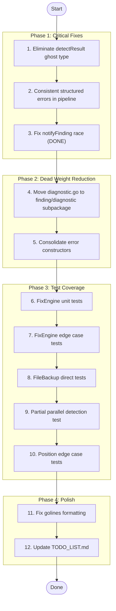

# Deep Codebase Hardening Plan

**Created:** 2026-04-29_23-01
**Scope:** Race fixes, dead code elimination, test coverage, architecture cleanup

## Honest Self-Assessment

### What We Got Wrong

1. **Race condition shipped** — `notifyFinding` was unprotected since parallel detection was added. Every `Pipeline.Run()` with `ParallelDetectors: true` and an `OnFinding` callback was racy.
2. **`detectResult` is a ghost type** — identical to `PartialResult` with different field names. Pure overhead.
3. **`golang.org/x/tools` is dead weight** — `diagnostic.go` has ZERO production callers but forces a heavy transitive dep on every consumer.
4. **Inconsistent error handling** — `fix_applier.go` uses structured errors; `pipeline.go` uses raw `fmt.Errorf`. Same package, different patterns.
5. **`FixStrategyAI` is a phantom** — reserved value with no distinct behavior. Grouped with `Suggest` in triage, grouped with `Direct` in `HasFix()`. Contradictory.

### What's Actually Good

- Core types are clean, immutable-by-convention
- Builder API is well-designed
- SARIF round-trip fidelity is solid
- Test suite is extensive (fuzz, property, integration, unit)
- Lint passes clean

### Ghost Systems Found

1. `detectResult` → identical to `PartialResult` → **ELIMINATE**
2. `diagnostic.go` → no production callers → **MOVE to subpackage**
3. `FixStrategyAI` → phantom constant → **Keep but document clearly**

## Execution Graph

## Task Breakdown — Phase 1 (30-100 min each)

| #   | Task                                                    | Impact | Effort    | Files                                                                                    |
| --- | ------------------------------------------------------- | ------ | --------- | ---------------------------------------------------------------------------------------- |
| 1   | Eliminate `detectResult` ghost type                     | Med    | 30min     | `pipeline/pipeline.go`, `pipeline/partial.go`                                            |
| 2   | Consistent structured errors in pipeline                | Med    | 45min     | `pipeline/pipeline.go`, `pipeline/partial.go`, `pipeline/verify.go`, `pipeline/retry.go` |
| 3   | ~~Fix notifyFinding race~~                              | High   | ~~30min~~ | ~~`pipeline/pipeline.go`, `pipeline/partial.go`~~ **DONE**                               |
| 4   | Move `diagnostic.go` to `finding/diagnostic` subpackage | High   | 60min     | `diagnostic.go` → `diagnostic/`, `go.mod`                                                |
| 5   | Consolidate error constructors                          | Low    | 20min     | `errors.go`                                                                              |

## Task Breakdown — Phase 3 (30-100 min each)

| #   | Task                                                                   | Impact | Effort | Files                              |
| --- | ---------------------------------------------------------------------- | ------ | ------ | ---------------------------------- |
| 6   | FixEngine unit tests                                                   | High   | 45min  | NEW `pipeline/fix_engine_test.go`  |
| 7   | FixEngine edge case tests (empty input, out-of-bounds, multiple fixes) | Med    | 30min  | `pipeline/fix_engine_test.go`      |
| 8   | FileBackup direct tests                                                | Med    | 30min  | NEW `pipeline/file_backup_test.go` |
| 9   | Partial parallel detection test                                        | Med    | 20min  | `pipeline/partial_test.go`         |
| 10  | Position edge case tests (intersectionByOffset, checkColumnRange)      | Med    | 30min  | `position_extra_test.go`           |

## Task Breakdown — Phase 4 (30-100 min each)

| #   | Task                                     | Impact | Effort | Files          |
| --- | ---------------------------------------- | ------ | ------ | -------------- |
| 11  | Fix golines formatting across codebase   | Low    | 15min  | Various        |
| 12  | Update TODO_LIST.md with completed items | Low    | 15min  | `TODO_LIST.md` |
