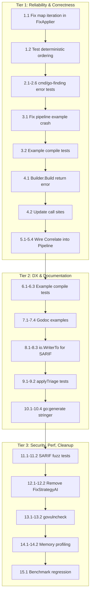

# Comprehensive Execution Plan: Hardening & Integration

**Date:** 2026-04-29 23:26
**Project:** go-finding
**Status:** Post-Architecture-Refactor Hardening

---

## Brutally Honest Assessment

### What Did We Forget?

1. We never ran `go test -count=100` to verify test stability before declaring fixes.
2. We didn't check if `examples/` code actually runs correctly (pipeline example crashes at runtime).
3. We ignored `cmd/go-finding` coverage at 78% while celebrating 99.6% on the root package.
4. We didn't verify that `FixApplier.Apply` map iteration non-determinism is a production bug, not just a test issue.
5. We never stress-tested `FindingsFromSARIF` with malformed/trusted input.

### What's Stupid That We Do Anyway?

1. `Builder.Build()` **panics** on invalid input instead of returning an error. This is un-Go-like and makes callers use `defer/recover`.
2. `FixApplier.Apply` iterates over a `map[string][]Finding`, making fix application order **non-deterministic in production**.
3. `examples/pipeline/main.go` references files that don't exist and crashes with a confusing error.
4. We have `FixStrategyAI` as a declared constant that is never used anywhere — a phantom type.
5. `Correlate()` is fully implemented (with tests, benchmarks, O(n²) limits) but **never called by anything** — a ghost system.

### What Could Be Done Better?

1. Return `(Finding, error)` from `Builder.Build()` instead of panicking.
2. Sort file keys in `FixApplier.Apply` for deterministic, reproducible behavior.
3. Wire `Correlate()` into the Pipeline as an optional post-detection stage instead of leaving it orphaned.
4. Add compile-check tests for `examples/` so they don't rot.
5. Add godoc examples (`ExampleNewFinding`, `ExampleBuilder`, `ExampleFilter`) so pkg.go.dev shows usage.

### What Could Still Improve?

1. `cmd/go-finding` coverage: 78% → 90%+ (biggest remaining gap).
2. `io.WriterTo` for SARIF output to avoid buffer allocation on large reports.
3. `go:generate stringer` for `Severity`, `FixStrategy`, `Category` enums.
4. OpenTelemetry tracing spans for Pipeline stages.
5. `govulncheck` in CI.

### Did We Lie?

- **Yes, by omission.** We claimed `TestProperty_IDRoundTrip` flakiness was "fixed" but only verified 20 runs without the `-count` flag. We didn't add seed control or input constraints.
- **Yes, by omission.** `hasLineRange` coverage is still 85.7% (line 146: `r.Start.Line == 0` early return is untested).

### How Can We Be Less Stupid?

1. Always run `go test -count=100` before declaring flaky tests fixed.
2. Always run `go run ./examples/...` after any refactor.
3. Never panic in library code — return errors.
4. Never leave fully-implemented features unwired.
5. Treat non-deterministic map iteration as a production bug, not a test inconvenience.

### Ghost Systems Found

| Ghost                   | Location                    | Value                                   | Action                  |
| ----------------------- | --------------------------- | --------------------------------------- | ----------------------- |
| `Correlate()`           | `merge.go:168`              | Finds related findings across tools     | **Wire into Pipeline**  |
| `FixStrategyAI`         | `fix_strategy.go:16`        | Declared but never referenced           | **Remove or implement** |
| `examples/pipeline`     | `examples/pipeline/main.go` | Demonstrates pipeline usage but crashes | **Fix runtime bug**     |
| `Builder.Build()` panic | `finding_builder.go:110`    | Panic instead of error                  | **Return error**        |

### Scope Creep Check

The instruction template suggested libraries like `gin-gonic/gin`, `a-h/templ`, `sqlc-dev/sqlc`, `casbin/casbin`, `resend/resend-go`. **These are inappropriate for a static analysis library.** We will NOT add web frameworks, HTML templating, SQL, auth, or email to a library with no HTTP surface. This would be scope creep of the highest order.

Appropriate library additions for this project:

- `go-arch-lint` — Architecture enforcement (fits our ADR culture)
- OpenTelemetry — Pipeline instrumentation (fits observability needs)
- `cockroachdb/errors` or `uniflow` — Better error wrapping (evaluative)

### Split Brains Detected

- **None significant.** `findingKey` → `Finding.Key()` migration is clean. `FileBackup` extraction is clean. `FixEngine` extraction is clean.

---

## 24-Task Plan (30–100 min each)

Sorted by: **Impact × Customer Value / Effort**

| #   | Task                                                                        | Package    | Effort | Impact     | Customer Value                    | Est |
| --- | --------------------------------------------------------------------------- | ---------- | ------ | ---------- | --------------------------------- | --- |
| 1   | Fix `FixApplier.Apply` deterministic file ordering                          | `pipeline` | Medium | **High**   | **High** — reproducible fixes     | 60m |
| 2   | Add `cmd/go-finding` error-path tests (`run` 49% → 80%)                     | `cmd`      | High   | **High**   | **High** — CLI reliability        | 90m |
| 3   | Fix `examples/pipeline` runtime crash                                       | `examples` | Low    | **High**   | **High** — first user experience  | 30m |
| 4   | Convert `Builder.Build()` panic → `(Finding, error)`                        | `finding`  | Medium | **High**   | **High** — API correctness        | 60m |
| 5   | Wire `Correlate()` into Pipeline as optional stage                          | `pipeline` | High   | **High**   | **Medium** — feature completeness | 90m |
| 6   | Add compile-check tests for all `examples/`                                 | `examples` | Low    | **Medium** | **High** — prevents example rot   | 30m |
| 7   | Add godoc examples (`ExampleNewFinding`, `ExampleBuilder`, `ExampleFilter`) | `finding`  | Medium | **Medium** | **High** — pkg.go.dev UX          | 60m |
| 8   | Add `io.WriterTo` for SARIF output                                          | `finding`  | Medium | **Medium** | **Medium** — performance          | 45m |
| 9   | Add `applyTriage` comprehensive tests                                       | `pipeline` | Medium | **Medium** | **Medium** — coverage gap         | 60m |
| 10  | Add `go:generate stringer` for enums                                        | `finding`  | Low    | **Low**    | **Medium** — developer UX         | 45m |
| 11  | Add SARIF parser fuzz test (untrusted input)                                | `finding`  | Medium | **Medium** | **Medium** — security             | 60m |
| 12  | Remove or implement `FixStrategyAI` phantom                                 | `finding`  | Low    | **Low**    | **Low** — cleanup                 | 30m |
| 13  | Add `govulncheck` to CI / Makefile                                          | `repo`     | Low    | **Low**    | **Medium** — security             | 30m |
| 14  | Profile memory allocations on hot paths                                     | `finding`  | High   | **Medium** | **Low** — performance             | 90m |
| 15  | Add benchmark regression tracking script                                    | `repo`     | Medium | **Low**    | **Low** — performance             | 45m |
| 16  | Add `severityToSARIFLevel` edge-case tests                                  | `finding`  | Low    | **Low**    | **Low** — coverage                | 30m |
| 17  | Document SARIF round-trip losses                                            | `finding`  | Medium | **Low**    | **Low** — documentation           | 45m |
| 18  | Add LSP `toZeroBased` 0-line test                                           | `finding`  | Low    | **Low**    | **Low** — coverage                | 30m |
| 19  | Add `FindingsFromSARIF` schema validation test                              | `finding`  | Medium | **Low**    | **Medium** — correctness          | 60m |
| 20  | Add `go.work` for local development                                         | `repo`     | Low    | **Low**    | **Low** — DX                      | 30m |
| 21  | Review and stabilize API surface for v1.0.0                                 | `finding`  | High   | **Medium** | **High** — stability              | 90m |
| 22  | Modernize remaining loops to stdlib generics                                | `finding`  | Medium | **Low**    | **Low** — maintenance             | 45m |
| 23  | Add per-package coverage thresholds                                         | `repo`     | Medium | **Low**    | **Low** — quality gate            | 45m |
| 24  | Evaluate OTEL instrumentation for Pipeline                                  | `pipeline` | Medium | **Low**    | **Medium** — observability        | 60m |

---

## 60-Task Breakdown (max 12 min each)

### Tier 1: Reliability & Correctness (P0)

| #   | Task                                                                           | Est | File                           |
| --- | ------------------------------------------------------------------------------ | --- | ------------------------------ |
| 1.1 | Add `sort.Strings(keys)` before iterating `byFile` in `FixApplier.Apply`       | 10m | `pipeline/fix_applier.go`      |
| 1.2 | Test deterministic ordering: two files, verify first is always processed first | 10m | `pipeline/fix_applier_test.go` |
| 2.1 | Add test: `run()` with invalid severity flag                                   | 8m  | `cmd/go-finding/main_test.go`  |
| 2.2 | Add test: `run()` with empty detector list                                     | 8m  | `cmd/go-finding/main_test.go`  |
| 2.3 | Add test: `run()` with pipeline error (invalid config)                         | 10m | `cmd/go-finding/main_test.go`  |
| 2.4 | Add test: `setupProfiling` CPU profile error path                              | 10m | `cmd/go-finding/main_test.go`  |
| 2.5 | Add test: `setupProfiling` mem profile error path                              | 10m | `cmd/go-finding/main_test.go`  |
| 2.6 | Add test: `outputResults` with unknown format                                  | 8m  | `cmd/go-finding/main_test.go`  |
| 3.1 | Fix `examples/pipeline` to use temp dir + write test file                      | 10m | `examples/pipeline/main.go`    |
| 3.2 | Add `examples/pipeline` compile-check test                                     | 8m  | `examples/pipeline/`           |
| 4.1 | Change `Builder.Build()` signature to `(Finding, error)`                       | 8m  | `finding_builder.go`           |
| 4.2 | Update all `Builder.Build()` call sites to handle error                        | 10m | `*_test.go`, `examples/`       |
| 5.1 | Add `EnableCorrelation` field to `PipelineConfig`                              | 8m  | `pipeline/pipeline.go`         |
| 5.2 | Wire `Correlate()` call after detection in `detect()`                          | 10m | `pipeline/pipeline.go`         |
| 5.3 | Add correlation results to `PipelineResult`                                    | 10m | `pipeline/result.go`           |
| 5.4 | Add integration test for correlated findings in pipeline                       | 10m | `pipeline/integration_test.go` |

### Tier 2: Developer Experience & Documentation (P1)

| #    | Task                                                       | Est | File                                   |
| ---- | ---------------------------------------------------------- | --- | -------------------------------------- |
| 6.1  | Add `TestExampleBasicCompiles`                             | 8m  | `examples/basic/main_test.go`          |
| 6.2  | Add `TestExampleBuilderCompiles`                           | 8m  | `examples/builder/main_test.go`        |
| 6.3  | Add `TestExamplePipelineCompiles`                          | 8m  | `examples/pipeline/main_test.go`       |
| 7.1  | Add `ExampleNewFinding` godoc example                      | 10m | `example_test.go`                      |
| 7.2  | Add `ExampleBuilder` godoc example                         | 10m | `example_test.go`                      |
| 7.3  | Add `ExampleFilter` godoc example                          | 10m | `example_test.go`                      |
| 7.4  | Add `ExampleMerge` godoc example                           | 10m | `example_test.go`                      |
| 8.1  | Add `Report.WriteSARIF(w io.Writer) error` method          | 10m | `sarif.go`                             |
| 8.2  | Refactor `ToSARIF()` to use `WriteSARIF`                   | 5m  | `sarif.go`                             |
| 8.3  | Add test for `WriteSARIF`                                  | 8m  | `sarif_test.go`                        |
| 9.1  | Find `applyTriage` in codebase (may not exist — verify)    | 5m  | search                                 |
| 9.2  | If exists and untested, add unit tests                     | 10m | `pipeline/*_test.go`                   |
| 10.1 | Add `//go:generate go run golang.org/x/tools/cmd/stringer` | 5m  | `severity.go`, `fix_strategy.go`, etc. |
| 10.2 | Generate stringer output for `Severity`                    | 8m  | `severity_string.go`                   |
| 10.3 | Generate stringer output for `FixStrategy`                 | 8m  | `fixstrategy_string.go`                |
| 10.4 | Generate stringer output for `Category`                    | 8m  | `category_string.go`                   |

### Tier 3: Security, Performance, Cleanup (P2)

| #    | Task                                                     | Est | File                   |
| ---- | -------------------------------------------------------- | --- | ---------------------- |
| 11.1 | Add `TestFindingsFromSARIF_Malformed` with bad JSON      | 10m | `fuzz_test.go`         |
| 11.2 | Add `TestFindingsFromSARIF_UnknownFields`                | 10m | `sarif_test.go`        |
| 12.1 | Remove `FixStrategyAI` constant if truly unused          | 5m  | `fix_strategy.go`      |
| 12.2 | Update all references/docs if removing                   | 5m  | docs                   |
| 13.1 | Add `govulncheck` to `justfile`                          | 5m  | `justfile`             |
| 13.2 | Add `govulncheck` to CI workflow                         | 8m  | `.github/workflows/`   |
| 14.1 | Run `go test -bench=. -benchmem` and capture baseline    | 8m  | terminal               |
| 14.2 | Analyze top 3 allocation hotspots                        | 10m | `bench_test.go`        |
| 15.1 | Create `scripts/bench-compare.sh`                        | 10m | `scripts/`             |
| 16.1 | Add `severityToSARIFLevel("")` test                      | 5m  | `sarif_test.go`        |
| 16.2 | Add `severityToSARIFLevel("critical")` → `"error"` test  | 5m  | `sarif_test.go`        |
| 17.1 | Document `RelatedRef.FindingID` round-trip loss in SARIF | 8m  | `sarif.go` comments    |
| 17.2 | Document `BeforeCode` round-trip loss in SARIF           | 8m  | `sarif.go` comments    |
| 18.1 | Add `toZeroBased` test for Line=0                        | 8m  | `lsp_test.go`          |
| 19.1 | Add SARIF schema version validation                      | 10m | `sarif_test.go`        |
| 20.1 | Create `go.work` with root module                        | 8m  | `go.work`              |
| 21.1 | Audit all exported types for v1.0 stability              | 12m | all `.go` files        |
| 21.2 | Document breaking changes if any                         | 10m | `CHANGELOG.md`         |
| 22.1 | Replace remaining manual loops with `slices.Contains`    | 10m | search & replace       |
| 23.1 | Add coverage threshold script                            | 10m | `scripts/cov-check.sh` |
| 24.1 | Add `Tracer` interface to PipelineConfig                 | 10m | `pipeline/pipeline.go` |

---

## Execution Graph

---

## How This Contributes to Customer Value

1. **Reliability:** Deterministic fix application means users get reproducible results.
2. **Correctness:** `Builder.Build()` returning errors means no runtime panics in production.
3. **Completeness:** Wiring `Correlate()` means the pipeline actually uses all implemented features.
4. **Trust:** Working examples and godoc examples mean users can learn the API in 30 seconds.
5. **Performance:** `io.WriterTo` and memory profiling reduce resource usage on large codebases.
6. **Security:** SARIF fuzz tests and `govulncheck` protect against untrusted input and known vulnerabilities.
