# Comprehensive Deepening Plan

**Date:** 2026-04-29
**Project:** go-finding
**Current State:** 93.1% coverage, all tests pass, lint clean, 3 architectural refactors completed (FileBackup, FixEngine, runOneDetector)

---

## Guiding Principles

1. **Never break the build** — every commit must pass tests and lint
2. **Commit after every self-contained change**
3. **Leverage existing code** before writing from scratch
4. **Prefer established libraries** over hand-rolled solutions where they add real value
5. **Small steps, high impact** — each task is 15–60 minutes of focused work

---

## Pareto Analysis

| Effort | Impact | Cumulative | What it buys                                                                             |
| ------ | ------ | ---------- | ---------------------------------------------------------------------------------------- |
| 1%     | 51%    | 51%        | Close 0% coverage gaps; modernize `Finding.Equal`; extract `findingKey`                  |
| 4%     | 80%    | 80%        | All above + embedded `Finding` sub-structs; auto-sync `Report.Summary`; remove dead code |
| 20%    | 99%    | 99%        | All above + `go-sarif` evaluation; benchmark suite; full CLI coverage                    |

---

## Execution Graph

```mermaid
graph TD
    subgraph Phase1["Phase 1: Coverage & Correctness"]
        A1["1. FilterConflictingFixes + AnalyzeConflicts tests"]
        A2["2. Verifier.Verify error-path tests"]
        A3["3. RetryConfig.Validate edge-case tests"]
        A4["4. FixApplier error-path tests"]
        A5["5. PrettyJSON / LineJSON error-path tests"]
        A6["6. SARIF import path tests"]
        A7["7. intersectionByOffset + HasOffset tests"]
        A8["8. Range.Contains edge-case tests"]
    end

    subgraph Phase2["Phase 2: Code Quality"]
        B1["9. Modernize Finding.Equal with slices.Equal"]
        B2["10. Extract findingKey shared utility"]
        B3["11. Retry sentinel errors"]
        B4["12. Modernize stdlib usage"]
        B5["13. Remove unused //nolint directives"]
        B6["14. Archive stale planning docs"]
        B7["15. Delete stale coverage files"]
    end

    subgraph Phase3["Phase 3: Type Model"]
        C1["16. Group Finding into embedded sub-structs"]
        C2["17. Auto-sync Report.Summary"]
        C3["18. Finding constructor validation"]
    end

    subgraph Phase4["Phase 4: Libraries & Performance"]
        D1["19. Evaluate go-sarif library"]
        D2["20. Add hot-path benchmarks"]
        D3["21. Profile memory allocations"]
    end

    Phase1 --> Phase2 --> Phase3 --> Phase4
```

---

## Task Details

### Phase 1: Coverage & Correctness

#### 1. FilterConflictingFixes + AnalyzeConflicts Tests

- **Files:** `pipeline/conflict_test.go`
- **Problem:** 0% coverage for top-level `FilterConflictingFixes` and `AnalyzeConflicts`
- **Solution:** Add unit tests for overlapping ranges, different files, empty input
- **Work:** Low | **Impact:** High

#### 2. Verifier.Verify Error-Path Tests

- **Files:** `pipeline/verify_test.go`
- **Problem:** No tests for detector failure during verification
- **Solution:** Add test where verifier detector returns error
- **Work:** Low | **Impact:** Medium

#### 3. RetryConfig.Validate Edge-Case Tests

- **Files:** `pipeline/retry_test.go`
- **Problem:** Missing coverage for boundary conditions (BaseDelay == MaxDelay, zero values)
- **Solution:** Add table-driven tests for Validate edge cases
- **Work:** Low | **Impact:** Medium

#### 4. FixApplier Error-Path Tests

- **Files:** `pipeline/fix_applier_test.go`
- **Problem:** 87% coverage; missing rollback-on-backup-failure, write-permission-denied
- **Solution:** Add tests for backup failure mid-batch, read-only file write failure
- **Work:** Medium | **Impact:** Medium

#### 5. PrettyJSON / LineJSON Error-Path Tests

- **Files:** `json_test.go`
- **Problem:** No tests for JSON marshal errors on malformed findings
- **Solution:** Add tests with invalid UTF-8, circular references (if possible)
- **Work:** Low | **Impact:** Medium

#### 6. SARIF Import Path Tests

- **Files:** `sarif_test.go`
- **Problem:** `findingFromSarResult` missing tests for rule metadata, help URI, markdown descriptions
- **Solution:** Add round-trip tests for SARIF properties → Finding → SARIF
- **Work:** Medium | **Impact:** Medium

#### 7. intersectionByOffset + HasOffset Tests

- **Files:** `position_test.go`
- **Problem:** 0% coverage for offset-based intersection logic
- **Solution:** Add tests for ranges with offsets only, mixed line/offset
- **Work:** Low | **Impact:** Medium

#### 8. Range.Contains Edge-Case Tests

- **Files:** `position_test.go`
- **Problem:** 80% coverage; missing inverted ranges, zero values
- **Solution:** Add tests for zero line, inverted range, offset-only containment
- **Work:** Low | **Impact:** Medium

### Phase 2: Code Quality

#### 9. Modernize Finding.Equal with slices.Equal

- **Files:** `finding.go`
- **Problem:** Hand-rolled Related slice comparison; inconsistent with Position.Equal
- **Solution:** Use `slices.Equal(f.Related, other.Related)` since RelatedRef is comparable
- **Work:** Low | **Impact:** Medium

#### 10. Extract findingKey Shared Utility

- **Files:** `pipeline/verify.go`, `merge.go`
- **Problem:** `findingKey` duplicated in verify.go; `merge.go` uses inline logic
- **Solution:** Extract to `finding.go` as exported `Key()` method or package function
- **Work:** Low | **Impact:** Medium

#### 11. Retry Sentinel Errors

- **Files:** `pipeline/retry.go`
- **Problem:** 4 `errors.New()` calls used inline; not reusable for `errors.Is`
- **Solution:** Convert to package-level sentinel errors
- **Work:** Low | **Impact:** Low

#### 12. Modernize stdlib Usage

- **Files:** Various
- **Problem:** Some manual loops where `slices.Contains`, `maps.Keys` would suffice
- **Solution:** Replace with Go 1.21+ helpers where it improves readability
- **Work:** Low | **Impact:** Low

#### 13. Remove Unused //nolint Directives

- **Files:** `lsp_test.go:217`, `conflict.go:137`, `pipeline.go` (check current)
- **Problem:** Stale linter suppressions confuse readers
- **Solution:** Remove verified-unused directives
- **Work:** Very Low | **Impact:** Low

#### 14. Archive Stale Planning Docs

- **Files:** `docs/planning/`
- **Problem:** Superseded planning docs clutter the directory
- **Solution:** Move to `docs/planning/archive/` or delete if fully obsolete
- **Work:** Low | **Impact:** Low

#### 15. Delete Stale Coverage Files

- **Files:** `cover.out`, `coverage.out` in repo root
- **Problem:** Generated files committed accidentally
- **Solution:** Delete and add to `.gitignore`
- **Work:** Very Low | **Impact:** Low

### Phase 3: Type Model

#### 16. Group Finding into Embedded Sub-structs

- **Files:** `finding.go`, `finding_builder.go`, ALL callers
- **Problem:** 20+ top-level fields; `Equal` is 80 lines; `Builder` has 15 `With*` methods
- **Solution:** Group into `Identity`, `Location`, `Fix`, `Context` embedded structs
- **Work:** High | **Impact:** High
- **Breaking:** Yes — major API change

#### 17. Auto-sync Report.Summary

- **Files:** `report.go`
- **Problem:** `ComputeSummary()` must be called manually after every mutation
- **Solution:** Compute summary automatically inside `AddFinding` / `AddFindings`
- **Work:** Medium | **Impact:** Medium

#### 18. Finding Constructor Validation

- **Files:** `finding.go`
- **Problem:** `NewFinding()` generates ID but doesn't validate required fields
- **Solution:** Add validation in constructor or make `IsValid()` part of construction
- **Work:** Low | **Impact:** Medium

### Phase 4: Libraries & Performance

#### 19. Evaluate go-sarif Library

- **Files:** `sarif.go`, `go.mod`
- **Problem:** Hand-rolled SARIF types; maintenance burden; schema drift risk
- **Solution:** Evaluate `github.com/owenrumney/go-sarif` vs current implementation
- **Work:** Medium | **Impact:** Medium

#### 20. Add Hot-Path Benchmarks

- **Files:** New `bench_test.go` files
- **Problem:** No benchmarks for merge, filter, SARIF, ID generation
- **Solution:** Add `BenchmarkMerge`, `BenchmarkFilter`, `BenchmarkToSARIF`
- **Work:** Medium | **Impact:** Medium

#### 21. Profile Memory Allocations

- **Files:** Various
- **Problem:** Unknown allocation hotspots
- **Solution:** Run `go test -bench=.` with memory profiling; document findings
- **Work:** Low | **Impact:** Low

---

## Risk Register

| Risk                                          | Mitigation                                                        |
| --------------------------------------------- | ----------------------------------------------------------------- |
| Embedded structs break external consumers     | Save for Phase 3; clearly document breaking change                |
| go-sarif library incompatible with round-trip | Thorough evaluation before adoption; keep hand-rolled as fallback |
| Auto-sync Summary hurts performance           | Benchmark before/after; keep manual option if needed              |
| Test additions reveal latent bugs             | Fix bugs as found; never skip failing tests                       |

---

## Completion Criteria

- [ ] All new tests pass
- [ ] Coverage ≥ 95% for all packages
- [ ] Lint clean (`just lint` → 0 issues)
- [ ] `go test ./...` passes
- [ ] No breaking changes in Phases 1–2
- [ ] Breaking changes (Phase 3) documented in CHANGELOG.md

---

_Assisted-by: Crush <crush@charm.land>_
