# Performance Optimization Plan — FixEngine & Core Hot Paths

> **Date:** 2026-06-14
> **Context:** Following the comprehensive performance analysis report (`docs/research/performance-analysis.html`), this plan addresses all identified bottlenecks using the Pareto principle.
> **Goal:** Eliminate the critical FixEngine bottleneck, optimize hot paths, and verify all improvements with benchmarks — without breaking build, tests, or existing semantics.

---

## Pareto Breakdown

### The 1% that delivers 51% of the result

| #     | Task                             | File                         | Impact                                                                                                                                                                                                                                                                                                                                                      |
| ----- | -------------------------------- | ---------------------------- | ----------------------------------------------------------------------------------------------------------------------------------------------------------------------------------------------------------------------------------------------------------------------------------------------------------------------------------------------------------- |
| **1** | **FixEngine single-pass buffer** | `pipeline/fix_engine.go:169` | Rewrite `applyEditsWithConflicts` to use a pre-allocated `bytes.Buffer` in a single pass instead of creating a new `[]byte` per edit via `append(append(append(...)))`. This changes the complexity from **O(n×F)** to **O(F+R)** where F = file size, R = total replacement size. Benchmark impact: 443 MB → ~5 MB allocations, 291s → ~3s for 1000 edits. |

### The 4% that delivers 64% of the result

| #     | Task                                      | File                           | Impact                                                                                                                                                                                          |
| ----- | ----------------------------------------- | ------------------------------ | ----------------------------------------------------------------------------------------------------------------------------------------------------------------------------------------------- |
| 1     | FixEngine single-pass buffer (above)      | `fix_engine.go`                | 100× allocation reduction                                                                                                                                                                       |
| **2** | **LineOffsetIndex cache in LineProvider** | `pipeline/fix_provider.go:98`  | `buildLineOffsetIndex(content)` is called per-finding inside `LineProvider.Edits()`. When applying 100 fixes to the same 10k-line file, the index is rebuilt 100 times. Cache it once per file. |
| **3** | **offsetLineDistance → binary search**    | `pipeline/fix_provider.go:302` | Currently scans bytes one-by-one to count newlines: O(n) per occurrence. Replace with binary search on the line offset index: O(log n).                                                         |

### The 20% that delivers 80% of the result

| #   | Task                             | File                                              | Impact                                                                                                                                                           |
| --- | -------------------------------- | ------------------------------------------------- | ---------------------------------------------------------------------------------------------------------------------------------------------------------------- |
| 4   | File content cache in FixApplier | `pipeline/fix_applier.go`                         | Same file read up to 4× per iteration. Add `map[string][]byte` cache with write-invalidation.                                                                    |
| 5   | Pre-allocate result slices       | `merge.go`, `conflict.go`, `diff.go`, `verify.go` | `correlateByOverlap`, `correlateByProximity`, `DetectConflicts`, `Diff`, `DiffFindings` all start with nil slices. Pre-allocate with `make([]T, 0, len(input))`. |
| 6   | Pre-allocate GroupBy maps        | `filter.go:163-200`                               | `GroupBy`, `GroupByFile`, `GroupBySeverity`, `GroupByCategory` don't pre-size their result maps.                                                                 |
| 7   | Use strings.Builder in dedupKey  | `merge.go:178-196`                                | `fmt.Sprintf` for position/rule dedup keys allocates a format string. `strings.Builder` avoids the format parser overhead.                                       |
| 8   | Stream subprocess output         | `internal/detectors/govet.go`                     | Replace `cmd.Output()` (full buffer) with `cmd.StdoutPipe()` + `json.Decoder` for streaming JSON parse.                                                          |

### Remaining work (beyond 80%)

| #   | Task                                     | Impact                                   |
| --- | ---------------------------------------- | ---------------------------------------- |
| 9   | Add before/after FixEngine benchmarks    | Verify improvements quantitatively       |
| 10  | Add LineProvider cached-index benchmarks | Verify index caching benefit             |
| 11  | Update performance analysis HTML         | Re-run benchmarks, document improvements |
| 12  | Update AGENTS.md                         | Document performance decisions           |
| 13  | Full test suite verification             | `go test -race -count=1 ./...`           |
| 14  | Lint verification                        | `golangci-lint run ./...`                |

### Explicitly OUT OF SCOPE (to avoid Verschlimmbesserung)

| Item                                       | Reason                                                                                     |
| ------------------------------------------ | ------------------------------------------------------------------------------------------ |
| `sync.Pool` for SARIF structs              | High complexity, risk of state leaking, moderate gain (15-22 allocs/finding is acceptable) |
| Avoid `readFindings()` copy in SARIF paths | Thread safety is more important than one O(n) copy                                         |
| Pool dedup key map                         | Marginal gain, adds complexity                                                             |
| GPU acceleration                           | Not applicable to branch-heavy static analysis                                             |
| Replace SHA-256 with faster hash           | Collision resistance is a correctness requirement                                          |

---

## Medium-Granularity Plan (15 tasks, 30-100 min each)

Sorted by importance/impact/effort/customer-value.

| #   | Task                                       | Impact       | Effort | Files                                       | Est.   |
| --- | ------------------------------------------ | ------------ | ------ | ------------------------------------------- | ------ |
| M1  | FixEngine single-pass buffer rewrite       | **Critical** | Medium | `fix_engine.go`                             | 45 min |
| M2  | FixEngine test verification                | **Critical** | Low    | `fix_engine_test.go`                        | 30 min |
| M3  | LineOffsetIndex cache in LineProvider      | **High**     | Medium | `fix_provider.go`                           | 60 min |
| M4  | offsetLineDistance binary search           | **High**     | Low    | `fix_provider.go`                           | 30 min |
| M5  | FixApplier file content cache              | **High**     | Medium | `fix_applier.go`                            | 60 min |
| M6  | Pre-allocate result slices (correlate)     | **Medium**   | Low    | `merge.go`                                  | 30 min |
| M7  | Pre-allocate result slices (conflict/diff) | **Medium**   | Low    | `conflict.go`, `diff.go`, `verify.go`       | 30 min |
| M8  | Pre-allocate GroupBy maps                  | **Medium**   | Low    | `filter.go`                                 | 30 min |
| M9  | strings.Builder in dedupKey                | **Low-Med**  | Low    | `merge.go`                                  | 30 min |
| M10 | Stream subprocess output                   | **Medium**   | Medium | `internal/detectors/govet.go`               | 45 min |
| M11 | Add/update benchmarks                      | **Medium**   | Low    | `fix_engine_bench_test.go`, `bench_test.go` | 45 min |
| M12 | Update performance analysis HTML           | **Low**      | Low    | `docs/research/performance-analysis.html`   | 30 min |
| M13 | Update AGENTS.md                           | **Low**      | Low    | `AGENTS.md`                                 | 30 min |
| M14 | Full test suite verification               | **Critical** | Low    | —                                           | 30 min |
| M15 | Lint verification + fix                    | **Medium**   | Low    | —                                           | 30 min |

---

## Fine-Granularity Plan (62 tasks, max 15 min each)

### M1: FixEngine single-pass buffer (8 tasks)

| #   | Sub-task                                                                                 | Est.   |
| --- | ---------------------------------------------------------------------------------------- | ------ |
| F1  | Read and understand current `applyEditsWithConflicts` logic                              | 5 min  |
| F2  | Write `applyEditsToContent(content, appliedEdits)` helper using `bytes.Buffer`           | 10 min |
| F3  | Refactor `applyEditsWithConflicts` to separate conflict detection from application       | 10 min |
| F4  | Add pre-allocation size calculation (finalSize = len(content) + Σ(replacement - length)) | 5 min  |
| F5  | Handle edge case: no applied edits (return original content)                             | 5 min  |
| F6  | Handle edge case: single edit (skip buffer overhead)                                     | 5 min  |
| F7  | Verify existing FixEngine tests pass                                                     | 10 min |
| F8  | Run FixEngine benchmarks to confirm improvement                                          | 10 min |

### M2: FixEngine test verification (3 tasks)

| #   | Sub-task                                                | Est.   |
| --- | ------------------------------------------------------- | ------ |
| F9  | Run `go test -run TestFixEngine ./pipeline/...`         | 5 min  |
| F10 | Add test for large edit count (100+ edits on same file) | 10 min |
| F11 | Add test for mixed insert/replace/delete edits          | 10 min |

### M3: LineOffsetIndex cache (5 tasks)

| #   | Sub-task                                                       | Est.   |
| --- | -------------------------------------------------------------- | ------ |
| F12 | Add `lineIndex []int` field to FixEngine or pass via context   | 10 min |
| F13 | Modify `LineProvider.Edits` to accept/use cached index         | 10 min |
| F14 | Build index once in `ApplyWithConflicts` and pass to providers | 10 min |
| F15 | Verify LineProvider tests pass                                 | 10 min |
| F16 | Benchmark before/after                                         | 10 min |

### M4: offsetLineDistance binary search (3 tasks)

| #   | Sub-task                                                               | Est.   |
| --- | ---------------------------------------------------------------------- | ------ |
| F17 | Rewrite `offsetLineDistance` to use binary search on line offset index | 10 min |
| F18 | Update `SubstringProvider.Edits` to build/pass index                   | 10 min |
| F19 | Verify SubstringProvider tests pass                                    | 10 min |

### M5: FixApplier file content cache (5 tasks)

| #   | Sub-task                                            | Est.   |
| --- | --------------------------------------------------- | ------ |
| F20 | Add `contentCache map[string][]byte` to FixApplier  | 10 min |
| F21 | Implement `readFile` method with cache lookup       | 10 min |
| F22 | Invalidate cache entry after write in `applyToFile` | 10 min |
| F23 | Clear cache on Close                                | 5 min  |
| F24 | Verify FixApplier tests pass                        | 10 min |

### M6: Pre-allocate result slices — correlate (3 tasks)

| #   | Sub-task                                   | Est.   |
| --- | ------------------------------------------ | ------ |
| F25 | Pre-allocate in `correlateByOverlap`       | 10 min |
| F26 | Pre-allocate in `correlateByProximity`     | 10 min |
| F27 | Pre-allocate in `correlateRangesAndPoints` | 10 min |

### M7: Pre-allocate result slices — conflict/diff (4 tasks)

| #   | Sub-task                                                  | Est.   |
| --- | --------------------------------------------------------- | ------ |
| F28 | Pre-allocate in `DetectConflicts` groups slice            | 10 min |
| F29 | Pre-allocate in `detectConflictsInFile` groups/conflicts  | 10 min |
| F30 | Pre-allocate in `Diff` added/removed/modified/unchanged   | 10 min |
| F31 | Pre-allocate in `DiffFindings` fixed/newFindings/modified | 10 min |

### M8: Pre-allocate GroupBy maps (4 tasks)

| #   | Sub-task                              | Est.   |
| --- | ------------------------------------- | ------ |
| F32 | Pre-size `GroupBy` result map         | 10 min |
| F33 | Pre-size `GroupByFile` result map     | 10 min |
| F34 | Pre-size `GroupBySeverity` result map | 10 min |
| F35 | Pre-size `GroupByCategory` result map | 10 min |

### M9: strings.Builder in dedupKey (2 tasks)

| #   | Sub-task                                             | Est.   |
| --- | ---------------------------------------------------- | ------ |
| F36 | Replace `fmt.Sprintf` in `DeduplicateByPosition` key | 10 min |
| F37 | Replace `fmt.Sprintf` in `DeduplicateByRule` key     | 10 min |

### M10: Stream subprocess output (4 tasks)

| #   | Sub-task                                                      | Est.   |
| --- | ------------------------------------------------------------- | ------ |
| F38 | Change `cmd.Output()` to `cmd.StdoutPipe()` in govet detector | 10 min |
| F39 | Use `json.NewDecoder(pipe).Decode()` for streaming parse      | 10 min |
| F40 | Verify govet detector tests pass                              | 10 min |
| F41 | Check staticcheck detector for same pattern                   | 10 min |

### M11: Add/update benchmarks (4 tasks)

| #   | Sub-task                                         | Est.   |
| --- | ------------------------------------------------ | ------ |
| F42 | Run full benchmark suite and record baseline     | 10 min |
| F43 | Add benchmark for LineProvider with cached index | 10 min |
| F44 | Add benchmark for pre-allocated Correlate        | 10 min |
| F45 | Record all before/after numbers                  | 10 min |

### M12: Update performance analysis HTML (2 tasks)

| #   | Sub-task                                           | Est.   |
| --- | -------------------------------------------------- | ------ |
| F46 | Update benchmark tables with new numbers           | 10 min |
| F47 | Update recommendations section to mark fixed items | 10 min |

### M13: Update AGENTS.md (2 tasks)

| #   | Sub-task                                                  | Est.   |
| --- | --------------------------------------------------------- | ------ |
| F48 | Add performance optimization session notes                | 10 min |
| F49 | Document new patterns (single-pass buffer, content cache) | 10 min |

### M14: Full test suite (3 tasks)

| #   | Sub-task                           | Est.   |
| --- | ---------------------------------- | ------ |
| F50 | Run `go test -race -count=1 ./...` | 10 min |
| F51 | Fix any test failures              | 10 min |
| F52 | Verify race detector is clean      | 10 min |

### M15: Lint + final verification (3 tasks)

| #   | Sub-task                                  | Est.   |
| --- | ----------------------------------------- | ------ |
| F53 | Run `golangci-lint run ./...`             | 10 min |
| F54 | Fix any lint issues in changed files      | 10 min |
| F55 | Final `go build ./...` and `go vet ./...` | 10 min |

---

## Execution Graph (Mermaid)

```mermaid
graph TD
    subgraph "Phase 1: 1% → 51%"
        F1[F1: Read applyEditsWithConflicts] --> F2[F2: Write applyEditsToContent helper]
        F2 --> F3[F3: Separate conflict detection from application]
        F3 --> F4[F4: Pre-allocation size calc]
        F4 --> F5[F5: Edge case: no edits]
        F5 --> F6[F6: Edge case: single edit]
        F6 --> F7[F7: Verify existing tests]
        F7 --> F8[F8: Run FixEngine benchmarks]
    end

    subgraph "Phase 2: 4% → 64%"
        F8 --> F12[F12: Add lineIndex field]
        F12 --> F13[F13: Modify LineProvider.Edits]
        F13 --> F14[F14: Build index in ApplyWithConflicts]
        F14 --> F15[F15: Verify LineProvider tests]
        F15 --> F16[F16: Benchmark index cache]
        F16 --> F17[F17: Rewrite offsetLineDistance]
        F17 --> F18[F18: Update SubstringProvider]
        F18 --> F19[F19: Verify SubstringProvider tests]
    end

    subgraph "Phase 3: 20% → 80%"
        F19 --> F20[F20: Add contentCache to FixApplier]
        F20 --> F21[F21: readFile with cache]
        F21 --> F22[F22: Invalidate after write]
        F22 --> F23[F23: Clear on Close]
        F23 --> F24[F24: Verify FixApplier tests]

        F24 --> F25[F25-F27: Pre-allocate Correlate]
        F25 --> F28[F28-F31: Pre-allocate Conflict/Diff]
        F28 --> F32[F32-F35: Pre-allocate GroupBy]
        F32 --> F36[F36-F37: strings.Builder dedupKey]
        F36 --> F38[F38-F41: Stream subprocess]
    end

    subgraph "Phase 4: Verify & Document"
        F38 --> F42[F42-F45: Benchmarks]
        F42 --> F50[F50-F52: Full test suite]
        F50 --> F53[F53-F55: Lint + build]
        F53 --> F46[F46-F47: Update HTML report]
        F46 --> F48[F48-F49: Update AGENTS.md]
    end

    style F2 fill:#f85149,color:#fff
    style F12 fill:#d29922,color:#fff
    style F20 fill:#3fb950,color:#fff
    style F50 fill:#58a6ff,color:#fff
```

---

## Risk Assessment

| Risk                                        | Likelihood | Mitigation                                                                                                      |
| ------------------------------------------- | ---------- | --------------------------------------------------------------------------------------------------------------- |
| FixEngine output differs from old algorithm | Low        | Phase separation: detect conflicts first, apply second. Same frontier logic. Existing tests verify correctness. |
| LineOffsetIndex cache becomes stale         | Low        | Index is immutable per file content snapshot. FixApplier reads file once per apply cycle.                       |
| File content cache returns stale data       | Medium     | Invalidate on write. Clear on Close. Never share across pipeline iterations.                                    |
| offsetLineDistance binary search off-by-one | Medium     | Extensive edge-case testing. Compare with linear scan in tests.                                                 |
| Streaming subprocess breaks JSON parsing    | Low        | json.Decoder handles streaming natively. Same struct types.                                                     |

---

## Success Criteria

- [ ] `go test -race -count=1 ./...` passes
- [ ] `golangci-lint run ./...` passes (0 new issues)
- [ ] `go build ./...` succeeds
- [ ] FixEngine 1000-edit benchmark: <5s wall time (was 291s)
- [ ] FixEngine 1000-edit benchmark: <10MB allocations (was 443MB)
- [ ] All existing tests pass without modification
- [ ] No behavioral changes to public API
