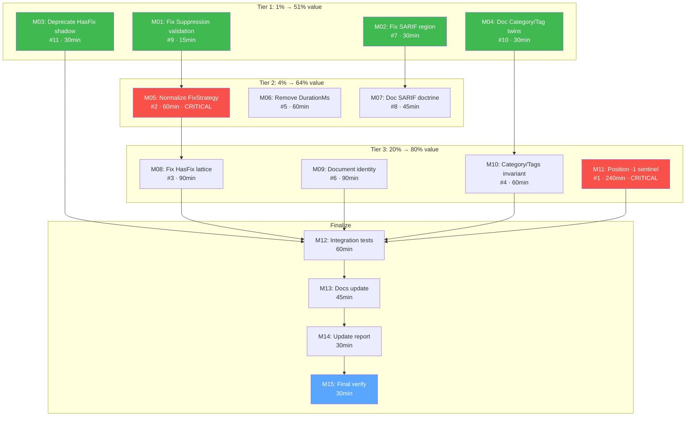

# Split-Brain Resolution — Comprehensive Execution Plan

**Date:** 2026-06-17 22:59
**Branch:** master
**Scope:** Resolve all 11 split-brain issues identified in `docs/research/SPLIT-BRAIN.html`
**Pre-requisite:** Build passes, all tests pass with `-race -count=1`

---

## Context

The [Split-Brain Audit](../research/SPLIT-BRAIN.html) identified 11 data-model issues where the same concept lives in two or more disagreeing places. This plan resolves all 11. The project is pre-v1.0 (v0.7.0), so breaking changes are acceptable.

### Key constraints

- **DO NOT BREAK BUILD** — every task must leave `go build ./...` and `go test -race -count=1 ./...` green
- **Commit after each issue** — atomic, self-contained commits per split-brain fix
- **Test every change** — add tests proving the fix, add tests proving the old bug is caught
- Two issues (#1, #2) are documented v1.0.0 release blockers requiring owner decisions — we resolve them per the report's recommendations

### Verified facts that de-risk the plan

| Fact                                                                  | Impact on plan                     |
| --------------------------------------------------------------------- | ---------------------------------- |
| `Position.IsZero()` is only called in tests, not production code      | Changing its semantics is low-risk |
| `HasOffset()` is defined but never called in production code          | Very low risk to change            |
| `Summary.DurationMs` is only in one definition + one test             | Trivial to remove                  |
| `HasFix`/`HasSuggestion` free functions only appear in doc.go example | Easy to deprecate/rename           |
| All 11 issues have runnable verification code                         | Every fix can be proven            |

---

## Pareto Breakdown

### The 1% that delivers 51% of the result

Four tiny fixes that (a) fix real bugs, (b) establish validation/documentation patterns, and (c) carry near-zero risk:

| Issue                                        | Fix                                                      | Effort | Why it's 1%                                                  |
| -------------------------------------------- | -------------------------------------------------------- | ------ | ------------------------------------------------------------ |
| **#9** Suppression accepts unknown kinds     | 1-line fix: call `Kind.IsValid()`                        | 15 min | Smallest possible fix; establishes "nested validate" pattern |
| **#7** SARIF exports two disagreeing regions | 5-line fix: `findingFixRegion` respects `Range.End`      | 30 min | Fixes wrong SARIF output immediately                         |
| **#11** `HasFix` name shadowing              | Deprecate free functions, add `WithFix`/`WithSuggestion` | 30 min | Clears naming clutter; mechanical                            |
| **#10** Category/Tag twin methods            | Documentation only                                       | 30 min | Clears ambiguity for the bigger Category/Tags work           |

**Total: ~105 min for 51% of value.**

### The 4% that delivers 64% of the result

Add three medium-effort fixes that resolve the Critical blocker and clean up structural confusion:

| Issue                               | Fix                                                          | Effort | Why it's 4%                                          |
| ----------------------------------- | ------------------------------------------------------------ | ------ | ---------------------------------------------------- |
| **#2** FixStrategy `""` vs `"none"` | Normalize `""` → `"none"` in `Validate()` + all entry points | 60 min | Resolves v1.0.0 Critical blocker; fixes Equal() lies |
| **#5** Three duration fields        | Remove `Summary.DurationMs`; update consumers                | 60 min | Removes vestigial field; single source of truth      |
| **#8** SARIF property bag doctrine  | Document boundary + centralize coercion helper               | 45 min | Prevents doctrine erosion; documentation + refactor  |

**Cumulative: ~270 min for 64% of value.**

### The 20% that delivers 80% of the result

Add four structural fixes that require careful sequencing:

| Issue                             | Fix                                                           | Effort  | Why it's 20%                                          |
| --------------------------------- | ------------------------------------------------------------- | ------- | ----------------------------------------------------- |
| **#3** Four fixability predicates | Make `HasFix()` respect `Validate()`; document lattice        | 90 min  | Depends on #2; fixes pipeline misrouting              |
| **#6** Three identity definitions | Document canonical identity; write ADR #12; deprecate `Key()` | 90 min  | Mostly documentation + ADR                            |
| **#4** Category/Tags overlap      | Add validation invariant (Option B)                           | 60 min  | Non-breaking now; full deprecation batched for v1.0.0 |
| **#1** Position zero-value        | Adopt `-1` sentinel; update constructors; update IsZero       | 240 min | Critical v1.0.0 blocker; large blast radius           |

**Cumulative: ~750 min (12.5 hr) for 80% of value.**

### Remaining 20% of effort

| Task                                                | Effort |
| --------------------------------------------------- | ------ |
| Cross-cutting integration tests for all fixes       | 60 min |
| Update AGENTS.md, RELEASE_CRITERIA.md, CHANGELOG.md | 45 min |
| Update SPLIT-BRAIN.html with resolution status      | 30 min |
| Final full-suite verification (race + lint + bench) | 30 min |

---

## Medium-Granularity Plan (15 tasks, 30–240 min each)

Sorted by execution order (importance/impact/effort/customer-value).

| #   | Task                                                                      | Issue | Impact   | Effort  | Dependencies |
| --- | ------------------------------------------------------------------------- | ----- | -------- | ------- | ------------ |
| M01 | Fix Suppression validation to reject unknown kinds                        | #9    | Low      | 15 min  | None         |
| M02 | Fix SARIF fix-region to respect Range.End                                 | #7    | Medium   | 30 min  | None         |
| M03 | Deprecate HasFix/HasSuggestion free functions; add WithFix/WithSuggestion | #11   | Cosmetic | 30 min  | None         |
| M04 | Document Category/Tag IsValid vs IsStandard contract                      | #10   | Low      | 30 min  | None         |
| M05 | Normalize FixStrategy "" → "none" in Validate + all entry points          | #2    | Critical | 60 min  | None         |
| M06 | Remove Summary.DurationMs; update tests and consumers                     | #5    | High     | 60 min  | None         |
| M07 | Document SARIF property bag doctrine boundary                             | #8    | Medium   | 45 min  | None         |
| M08 | Fix HasFix() to respect Validate(); document fixability lattice           | #3    | High     | 90 min  | M05          |
| M09 | Document finding identity; write ADR #12; align Key() with GenerateID     | #6    | Medium   | 90 min  | None         |
| M10 | Add Category/Tags consistency validation invariant                        | #4    | High     | 60 min  | M04          |
| M11 | Resolve Position zero-value: adopt -1 sentinel for Offset                 | #1    | Critical | 240 min | None         |
| M12 | Write integration tests for all split-brain fixes                         | All   | High     | 60 min  | M01–M11      |
| M13 | Update AGENTS.md, RELEASE_CRITERIA.md, CHANGELOG.md                       | All   | Medium   | 45 min  | M01–M11      |
| M14 | Update SPLIT-BRAIN.html with "RESOLVED" status badges                     | All   | Low      | 30 min  | M01–M11      |
| M15 | Final verification: build + race + lint + bench regression                | All   | Critical | 30 min  | M01–M14      |

**Total estimated effort: ~13.5 hours**

---

## Fine-Granularity Breakdown (75 tasks, max 15 min each)

Each medium task is decomposed into 3–8 sub-tasks of ≤15 min.

### M01 — Fix Suppression validation (#9) → 3 tasks

| #    | Sub-task                                                                            | Max   |
| ---- | ----------------------------------------------------------------------------------- | ----- |
| F001 | Change `Suppression.IsValid()` to call `s.Kind.IsValid()` instead of `s.Kind != ""` | 5 min |
| F002 | Add test: `Suppression{Kind:"garbage"}.IsValid()` returns false                     | 5 min |
| F003 | Add test: `Finding.Validate()` catches bad suppression kind                         | 5 min |

### M02 — Fix SARIF fix-region (#7) → 4 tasks

| #    | Sub-task                                                                       | Max    |
| ---- | ------------------------------------------------------------------------------ | ------ |
| F004 | Refactor `findingFixRegion()` to call `findingRegion()` for End coordinates    | 10 min |
| F005 | Add test: multi-line finding exports matching location + fix regions           | 10 min |
| F006 | Add round-trip test: multi-line Direct fix → SARIF → re-import preserves Range | 10 min |
| F007 | Run existing SARIF round-trip tests; verify no regression                      | 5 min  |

### M03 — Deprecate HasFix/HasSuggestion free functions (#11) → 4 tasks

| #    | Sub-task                                                                  | Max   |
| ---- | ------------------------------------------------------------------------- | ----- |
| F008 | Add `// Deprecated:` comment to `HasFix` and `HasSuggestion` in filter.go | 5 min |
| F009 | Add `WithFix` and `WithSuggestion` replacement functions                  | 5 min |
| F010 | Update doc.go example to use `WithFix`                                    | 5 min |
| F011 | Add test verifying both old (deprecated) and new functions work           | 5 min |

### M04 — Document Category/Tag twin methods (#10) → 3 tasks

| #    | Sub-task                                                                                          | Max    |
| ---- | ------------------------------------------------------------------------------------------------- | ------ |
| F012 | Rewrite `Category.IsValid` / `Category.IsStandard` doc comments with clear "when to use" guidance | 10 min |
| F013 | Rewrite `Tag.IsValid` / `Tag.IsStandard` doc comments to match                                    | 10 min |
| F014 | Add godoc example showing both methods and when to use each                                       | 10 min |

### M05 — Normalize FixStrategy (#2) → 7 tasks

| #    | Sub-task                                                                         | Max    |
| ---- | -------------------------------------------------------------------------------- | ------ |
| F015 | Add `NormalizeFixStrategy(fs FixStrategy) FixStrategy` helper in fix_strategy.go | 10 min |
| F016 | Call normalizer in `Finding.Validate()` — mutate field to canonical form         | 10 min |
| F017 | Call normalizer in `Builder.Build()`                                             | 5 min  |
| F018 | Call normalizer in `findingFromSarResult()` (sarif_import.go)                    | 5 min  |
| F019 | Call normalizer in `FromLSP()` (lsp.go)                                          | 5 min  |
| F020 | Add test: `Finding{Strategy:""}` after Validate() has Strategy=="none"           | 10 min |
| F021 | Add test: empty and "none" are Equal() after normalization                       | 10 min |

### M06 — Remove Summary.DurationMs (#5) → 5 tasks

| #    | Sub-task                                                                       | Max    |
| ---- | ------------------------------------------------------------------------------ | ------ |
| F022 | Remove `DurationMs` field from `Summary` struct (report.go:76)                 | 5 min  |
| F023 | Delete `TestComputeSummary_PreservesDurationMs` test (report_extra_test.go:77) | 5 min  |
| F024 | Search and update any JSON/schema references to `durationMs`                   | 10 min |
| F025 | Update AGENTS.md gotcha entry for DurationMs                                   | 5 min  |
| F026 | Add `ComputeSummary` test verifying no duration field exists                   | 10 min |

### M07 — Document SARIF property bag doctrine (#8) → 4 tasks

| #    | Sub-task                                                                   | Max    |
| ---- | -------------------------------------------------------------------------- | ------ |
| F027 | Add doctrine-boundary comment block to `sarifResult.Properties` field      | 10 min |
| F028 | Add `stringProp` helper documentation in sarif_import.go                   | 10 min |
| F029 | Add test: every metadata key survives SARIF round-trip                     | 15 min |
| F030 | Add test: non-string property values are gracefully dropped (not panicked) | 10 min |

### M08 — Fix HasFix to respect Validate (#3) → 6 tasks

| #    | Sub-task                                                                    | Max    |
| ---- | --------------------------------------------------------------------------- | ------ |
| F031 | Rewrite `HasFix()` to require code for FixStrategyDirect                    | 10 min |
| F032 | Add `""` → FixStrategyNone handling in HasFix (also normalized)             | 5 min  |
| F033 | Add doc comment documenting the fixability lattice (HasFix ⊇ IsAutoFixable) | 10 min |
| F034 | Add test: Direct-without-code → HasFix()=false (was true)                   | 10 min |
| F035 | Add test: IsAutoFixable() ⟹ HasFix() property holds                         | 10 min |
| F036 | Verify `DefaultTriageFunc` routes correctly with new HasFix semantics       | 10 min |

### M09 — Document finding identity (#6) → 5 tasks

| #    | Sub-task                                                              | Max    |
| ---- | --------------------------------------------------------------------- | ------ |
| F037 | Write ADR #12: canonical finding identity = GenerateID output         | 15 min |
| F038 | Update `Key()` doc to reference GenerateID as canonical               | 10 min |
| F039 | Update `dedupKey()` doc to frame strategies as deliberate relaxations | 10 min |
| F040 | Add test: Key() == ID when ID is set                                  | 10 min |
| F041 | Add identity definition to `docs/DOMAIN_LANGUAGE.md`                  | 10 min |

### M10 — Category/Tags consistency validation (#4) → 5 tasks

| #    | Sub-task                                                               | Max    |
| ---- | ---------------------------------------------------------------------- | ------ |
| F042 | Add invariant check in `Validate()`: Tags must not contradict Category | 15 min |
| F043 | Add test: conflicting Category/Tags fails validation                   | 10 min |
| F044 | Add test: Tags containing Category value is allowed                    | 10 min |
| F045 | Document Category/Tags relationship in `Finding` struct doc            | 10 min |
| F046 | Add ADR #13 note: plan to deprecate Category in v1.0.0                 | 10 min |

### M11 — Resolve Position zero-value (#1) → 12 tasks

| #    | Sub-task                                                                                      | Max    |
| ---- | --------------------------------------------------------------------------------------------- | ------ |
| F047 | Change `Position.IsZero()` to check `Offset == -1` instead of `Offset == 0`                   | 10 min |
| F048 | Update `Pos()` constructor to set `Offset: -1`                                                | 5 min  |
| F049 | Update `NewRange()` / `NewRangePtr()` to set `Offset: -1` on both positions                   | 10 min |
| F050 | Update `NewFinding()` to set `Position.Offset = -1` when not provided                         | 10 min |
| F051 | Update `FromLSP()` to set `Offset: -1` on all positions                                       | 10 min |
| F052 | Update `findingFromSarResult()` / `applySarifPosition()` to set `Offset: -1`                  | 10 min |
| F053 | Update `Range.Length()` / `Range.HasEnd()` / `containsByOffset()` — already use `< 0`, verify | 10 min |
| F054 | Update `Position.String()` and related display methods                                        | 5 min  |
| F055 | Update all test fixtures that construct `Position{}` directly                                 | 15 min |
| F056 | Add test: `Position{}.IsZero()`=false, `Position{}.HasOffset()`=true (consistent)             | 10 min |
| F057 | Add test: constructor-built Position with Offset=-1: IsZero()=true, HasOffset()=false         | 10 min |
| F058 | Run full test suite; fix any remaining Position{} assumption failures                         | 15 min |

### M12 — Integration tests for all fixes → 5 tasks

| #    | Sub-task                                                                | Max    |
| ---- | ----------------------------------------------------------------------- | ------ |
| F059 | Add `splitbrain_test.go` with end-to-end tests for #2, #3, #7           | 15 min |
| F060 | Add property test: FixStrategy normalization is idempotent              | 10 min |
| F061 | Add property test: HasFix ⊇ IsAutoFixable invariant                     | 10 min |
| F062 | Add integration test: SARIF round-trip preserves all fields after fixes | 15 min |
| F063 | Add integration test: Position consistency across constructors          | 10 min |

### M13 — Documentation updates → 4 tasks

| #    | Sub-task                                                     | Max    |
| ---- | ------------------------------------------------------------ | ------ |
| F064 | Update AGENTS.md: remove resolved gotchas, add new behaviors | 15 min |
| F065 | Update RELEASE_CRITERIA.md: mark blockers #1, #2 as resolved | 10 min |
| F066 | Add CHANGELOG.md entries for all 11 fixes                    | 15 min |
| F067 | Update architecture-decisions.md with ADR #12 and #13        | 10 min |

### M14 — Update SPLIT-BRAIN.html → 3 tasks

| #    | Sub-task                                                         | Max    |
| ---- | ---------------------------------------------------------------- | ------ |
| F068 | Add "✅ RESOLVED" badges to each fixed issue in SPLIT-BRAIN.html | 15 min |
| F069 | Add resolution commit references                                 | 10 min |
| F070 | Update executive summary with resolution stats                   | 10 min |

### M15 — Final verification → 5 tasks

| #    | Sub-task                                                               | Max    |
| ---- | ---------------------------------------------------------------------- | ------ |
| F071 | Run `go build ./...` — verify zero errors                              | 5 min  |
| F072 | Run `go test -race -count=1 ./...` — verify all pass                   | 15 min |
| F073 | Run `nix run .#lint` or `golangci-lint run ./...` — verify zero issues | 15 min |
| F074 | Run benchmark regression check if baseline exists                      | 15 min |
| F075 | Final git commit + push                                                | 5 min  |

---

## Execution Graph

### Parallel execution strategy

Tasks with no dependencies between them can be executed in parallel:

- **Wave 1 (parallel):** M01, M02, M03, M04, M06, M09, M11 — 7 independent tasks
- **Wave 2 (after M05):** M05, M07 — M07 depends on M02 only
- **Wave 3 (after M05+M08):** M08, M10 — M10 depends on M04 only
- **Wave 4 (after all fixes):** M12 → M13 → M14 → M15

---

## Risk Mitigation

| Risk                                           | Mitigation                                                                     |
| ---------------------------------------------- | ------------------------------------------------------------------------------ |
| Position #1 change breaks many tests           | F058 dedicated to fixing test fixtures; run tests after each sub-task          |
| FixStrategy normalization breaks consumer code | Pre-v1.0; document in CHANGELOG; normalization only makes "" into "none"       |
| HasFix semantics change breaks triage          | F036 explicitly verifies DefaultTriageFunc; M08 depends on M05                 |
| DurationMs removal breaks JSON consumers       | Field was caller-set (never computed); remove with `omitempty` so JSON shrinks |

---

## Success Criteria

- [ ] All 11 split-brain issues resolved with code changes
- [ ] Each fix has dedicated tests proving the bug is caught
- [ ] `go build ./...` passes
- [ ] `go test -race -count=1 ./...` passes
- [ ] `golangci-lint run ./...` passes (zero issues)
- [ ] SPLIT-BRAIN.html updated with resolution status
- [ ] AGENTS.md, RELEASE_CRITERIA.md, CHANGELOG.md updated
- [ ] ADR #12 (identity) and #13 (Category deprecation plan) written
- [ ] All changes committed with detailed messages and pushed

---

_Assisted-by: Crush <crush@charm.land>_
