# SUPERB Improvement Plan — go-finding

> **Date:** 2026-07-05  
> **Branch:** `modularize/unix-style`  
> **Base:** `dddb2c7` (fix: ApplyWithDetails now returns applied findings instead of input)  
> **Reviews:** Full code review (196 files) + Consumer audit (20 projects)  
> **Goal:** Close every actionable finding from both reviews — API gaps, bugs, docs, type safety, performance.

---

## Pareto Breakdown

### The 1% that delivers 51%

| #       | Task                                                    | Why                                                                                                                                                            | Impact                                                   |
| ------- | ------------------------------------------------------- | -------------------------------------------------------------------------------------------------------------------------------------------------------------- | -------------------------------------------------------- |
| **M01** | Add `ApplyToContent()` — content-level fix function     | BuildFlow reinvents the FixEngine with manual `strings.Replace` because the FixApplier is filesystem-bound. A content-level API eliminates the #1 reinvention. | Unblocks BuildFlow + any consumer with in-memory content |
| **M02** | Add `pipeline.Detect()` — one-shot convenience function | 12 of 15 consumers don't use the Pipeline because it's overkill for their needs. A simple `Detect(ctx, detectors...) → []Finding` opens the door.              | Unlocks pipeline adoption for 80% of consumers           |
| **M03** | Rewrite Quick Start — Builder pattern first             | CQA + library-policy skip the Builder (bypassing validation) because the README shows `NewFinding` first. Copy-paste behavior dominates.                       | Improves code quality across all 15 consumers            |

### The 4% that delivers 64% (adds to the above)

| #       | Task                                                                                   | Why                                                                     |
| ------- | -------------------------------------------------------------------------------------- | ----------------------------------------------------------------------- |
| **M05** | Fix lying predicates and names (IsValid, columnAdjacent, FilterInvalid, IsAutoFixable) | Lying names cause real bugs in every consumer that trusts them          |
| **M06** | Fix Position.IsValid semantics                                                         | Returns true for "not set" values — directly causes incorrect filtering |
| **M07** | Fix staticcheck SA category mapping                                                    | SA codes are correctness, not style — every SA finding is misclassified |
| **M08** | Export registry sentinel errors                                                        | Public registry with private errors — defeats `errors.Is`               |
| **M09** | Fix concurrency bugs (file_backup race, PrettyJSONFiltered TOCTOU)                     | Real race conditions in production paths                                |
| **M11** | Fix IntervalIndex doc/name honesty                                                     | Claims O(log n+k), is O(n+k) — the lie is worse than the code           |

### The 20% that delivers 80% (adds to the above)

| #       | Task                                                 | Why                                                                        |
| ------- | ---------------------------------------------------- | -------------------------------------------------------------------------- |
| **M04** | Document type-alias + migration patterns             | Go-structure-linter's pattern is the gold standard — nobody knows about it |
| **M10** | CLI signal handling + robustness                     | Ctrl+C doesn't work; Close() errors silently dropped                       |
| **M12** | Add FilePath branded type to Position                | The one place it matters, it isn't used                                    |
| **M13** | Fix SARIF suppressed findings emission               | Unnecessary data loss — SARIF supports suppressions natively               |
| **M14** | Add FixEngine documentation + example                | Discoverability gap — consumers don't know it exists                       |
| **M15** | Remove dead code                                     | FixStrategyAI, Key(), duplicate assertions, no-op checks                   |
| **M16** | Fix retry + config validation                        | Zero-delay hot-loop retries possible                                       |
| **M17** | Add RelationKind.IsValid + fix Suppression.Rule type | Type safety gaps                                                           |

### The 80% that delivers 100% (the rest)

| #       | Task                                             | Why                                                   |
| ------- | ------------------------------------------------ | ----------------------------------------------------- |
| **M18** | Fix gotoken improvements                         | O(n) scan, dead test code, error signaling            |
| **M19** | Fix performance hotspots                         | O(N²) conflict lookup, per-finding syscall            |
| **M20** | Fix LSP/Analysis data loss + context propagation | LSP ID loss breaks Diff/Correlate                     |
| **M21** | Consolidate presentation + cleanup               | Badge/Emoji in domain layer, escapeMarkdownCell panic |
| **M22** | Fix CLI flag naming + config                     | Lying flag name, dead mutex, config noise             |

---

## Medium-Grain Plan (22 tasks, 15–60 min each)

| #   | Tier | Task                                              | Impact    | Effort | Module        |
| --- | ---- | ------------------------------------------------- | --------- | ------ | ------------- |
| M01 | 1%   | Add `ApplyToContent()` content-level fix function | Very High | 45m    | pipeline      |
| M02 | 1%   | Add `pipeline.Detect()` one-shot convenience      | Very High | 30m    | pipeline      |
| M03 | 1%   | Rewrite Quick Start — Builder first               | Very High | 30m    | docs          |
| M04 | 20%  | Document type-alias + migration patterns          | High      | 30m    | docs          |
| M05 | 4%   | Fix lying predicates and names                    | High      | 45m    | core+pipeline |
| M06 | 4%   | Fix Position.IsValid semantics                    | High      | 30m    | core          |
| M07 | 4%   | Fix staticcheck SA category mapping               | High      | 15m    | CLI           |
| M08 | 4%   | Export registry sentinel errors                   | High      | 15m    | core          |
| M09 | 4%   | Fix concurrency bugs (race + TOCTOU)              | High      | 30m    | pipeline+core |
| M10 | 20%  | CLI signal handling + robustness                  | Medium    | 45m    | CLI           |
| M11 | 4%   | Fix IntervalIndex doc/name honesty                | Medium    | 15m    | core          |
| M12 | 20%  | Add FilePath branded type to Position             | Medium    | 30m    | core          |
| M13 | 20%  | Fix SARIF suppressed findings emission            | Medium    | 45m    | core          |
| M14 | 20%  | Add FixEngine documentation + example             | Medium    | 30m    | docs          |
| M15 | 20%  | Remove dead code                                  | Medium    | 30m    | all           |
| M16 | 20%  | Fix retry + config validation                     | Medium    | 30m    | pipeline+CLI  |
| M17 | 20%  | Add RelationKind.IsValid + Suppression.Rule type  | Medium    | 15m    | core          |
| M18 | 80%  | Fix gotoken improvements                          | Low       | 30m    | gotoken       |
| M19 | 80%  | Fix performance hotspots                          | Low       | 45m    | pipeline      |
| M20 | 80%  | Fix LSP/Analysis data loss + context              | Low       | 45m    | core+analysis |
| M21 | 80%  | Consolidate presentation + cleanup                | Low       | 30m    | core          |
| M22 | 80%  | Fix CLI flag naming + config                      | Low       | 30m    | CLI           |

**Total estimated effort: ~10 hours**

---

## Fine-Grain Plan (82 tasks, max 15 min each)

### Tier 0 — 1% → 51% (M01, M02, M03)

| #    | Task                                                                         | Parent | Est |
| ---- | ---------------------------------------------------------------------------- | ------ | --- |
| F001 | Read FixEngine + FixApplier to understand content-level extraction           | M01    | 10m |
| F002 | Write `ApplyToContent(content []byte, fixes []Finding) ([]byte, int, error)` | M01    | 15m |
| F003 | Write tests for ApplyToContent (multi-fix, no-match, empty)                  | M01    | 15m |
| F004 | Document ApplyToContent in README Fix Providers section                      | M01    | 10m |
| F005 | Write `pipeline.Detect(ctx, detectors...) ([]Finding, error)` convenience    | M02    | 15m |
| F006 | Write tests for Detect (parallel, context cancel, empty)                     | M02    | 15m |
| F007 | Document Detect in README Pipeline section                                   | M02    | 10m |
| F008 | Rewrite README Quick Start to show Builder first                             | M03    | 15m |
| F009 | Mark NewFinding as "lower-level — prefer Builder" in docs                    | M03    | 10m |
| F010 | Update integration-guide.md to show Builder pattern                          | M03    | 10m |

### Tier 1 — 4% → 64% (M05–M11)

| #    | Task                                                        | Parent | Est |
| ---- | ----------------------------------------------------------- | ------ | --- |
| F011 | Add OffsetUnknown = -1 constant, replace scattered literals | M05    | 10m |
| F012 | Fix IsAutoFixable to call NormalizeFixStrategy              | M05    | 10m |
| F013 | Rename columnAdjacent → columnCoincident (internal)         | M05    | 10m |
| F014 | Fix offsetAdjacent → offsetCoincident + `> 0` → `>= 0`      | M05    | 10m |
| F015 | Rename FilterInvalid → IsInvalid (add deprecated alias)     | M05    | 10m |
| F016 | Fix Position.IsValid to require Line > 0; add HasFile       | M06    | 15m |
| F017 | Audit and fix all IsValid callers in core                   | M06    | 10m |
| F018 | Fix staticcheckCategory: SA prefix → CategoryCorrectness    | M07    | 10m |
| F019 | Fix test expectation in detectors_test.go                   | M07    | 5m  |
| F020 | Export ErrDetectorRegistered + ErrUnknownDetector           | M08    | 10m |
| F021 | Keep old unexported vars as aliases for internal use        | M08    | 5m  |
| F022 | Fix file_backup.go: enabled → atomic.Bool                   | M09    | 10m |
| F023 | Fix PrettyJSONFiltered: hold lock through summary compute   | M09    | 15m |
| F024 | Rename interval_tree.go → interval_index.go                 | M11    | 5m  |
| F025 | Correct IntervalIndex doc to O(n + k)                       | M11    | 10m |

### Tier 2 — 20% → 80% (M04, M10, M12–M17)

| #    | Task                                                           | Parent | Est |
| ---- | -------------------------------------------------------------- | ------ | --- |
| F026 | Add type-alias pattern section to integration-guide.md         | M04    | 15m |
| F027 | Add types-only → pipeline migration guide                      | M04    | 15m |
| F028 | Add Report.findings → FindingsSnapshot migration note          | M04    | 10m |
| F029 | Add signal.NotifyContext to CLI main.go                        | M10    | 10m |
| F030 | Fix writeOutput to check Close() error                         | M10    | 10m |
| F031 | Add error on unknown detector names                            | M10    | 10m |
| F032 | Validate output format at flag-parse time                      | M10    | 10m |
| F033 | Change parseSeverity to return zero on error                   | M10    | 10m |
| F034 | Change Position.File from string to FilePath                   | M12    | 15m |
| F035 | Fix all constructors using Position.File (Pos, NewRange, etc.) | M12    | 15m |
| F036 | Verify JSON serialization unchanged                            | M12    | 5m  |
| F037 | Add SARIFOption with IncludeSuppressed                         | M13    | 15m |
| F038 | Emit SARIF suppressions arrays on findings                     | M13    | 15m |
| F039 | Test SARIF round-trip with suppressed findings                 | M13    | 15m |
| F040 | Write docs/guides/fix-engine.md with real example              | M14    | 15m |
| F041 | Show standalone FixApplier usage without pipeline              | M14    | 15m |
| F042 | Remove FixStrategyAI dead constant                             | M15    | 5m  |
| F043 | Remove Key() dead branch + keySeparator relocation             | M15    | 10m |
| F044 | Remove duplicate goast interface assertion                     | M15    | 5m  |
| F045 | Remove no-op line*shift var * assertion                        | M15    | 5m  |
| F046 | Inline NewFixApplier → NewFixApplierWithProviders              | M15    | 5m  |
| F047 | Remove dead pipeline findings reset                            | M15    | 5m  |
| F048 | Fix RetryConfig: require BaseDelay > 0 if MaxRetries > 0       | M16    | 10m |
| F049 | Document MaxIterations=0 semantics                             | M16    | 10m |
| F050 | Add RelationKind.IsValid() method                              | M17    | 10m |
| F051 | Fix RelatedRef.IsValid to check Relation                       | M17    | 5m  |
| F052 | Change Suppression.Rule string → RuleName                      | M17    | 10m |

### Tier 3 — 80% → 100% (M18–M22)

| #    | Task                                                        | Parent | Est |
| ---- | ----------------------------------------------------------- | ------ | --- |
| F053 | Cache resolved root in groupFindingsBySafePath              | M19    | 15m |
| F054 | Fix applyEditsWithConflicts O(N²) → sorted frontier         | M19    | 15m |
| F055 | Cache byteConflictEngine on Pipeline                        | M19    | 10m |
| F056 | Deduplicate filterByFileEdits cancellation checks           | M19    | 10m |
| F057 | Add gotoken FindFileByName map index cache                  | M18    | 15m |
| F058 | Remove dead nil check in gotoken_test.go                    | M18    | 5m  |
| F059 | Add start ≤ end validation to NodeByteRange                 | M18    | 10m |
| F060 | Fix LSP ToLSP to persist original ID in property bag        | M20    | 15m |
| F061 | Document nil fact stubs limitation in analysis adapter      | M20    | 10m |
| F062 | Populate BeforeCode in FromDiagnostic or downgrade strategy | M20    | 10m |
| F063 | Move Badge()/Emoji() to a presentation helper package       | M21    | 15m |
| F064 | Guard escapeMarkdownCell against maxLen < 3                 | M21    | 5m  |
| F065 | Fix DetectorFunc.Name() "anonymous" → ""                    | M21    | 5m  |
| F066 | Split adapters.go into contextutil.go + adapters.go         | M21    | 15m |
| F067 | Add Deprecated comments to pipeline re-exports              | M21    | 10m |
| F068 | Rename -severity → -min-severity (keep deprecated alias)    | M22    | 10m |
| F069 | Remove flag-value noise from config parse errors            | M22    | 10m |
| F070 | Fix fix_provider_registry dead mutex                        | M22    | 10m |
| F071 | Deduplicate fix provider names before resolution            | M22    | 10m |
| F072 | Add `-dir` existence check early                            | M22    | 5m  |

### Remaining cleanup (opportunistic)

| #    | Task                                             | Parent | Est |
| ---- | ------------------------------------------------ | ------ | --- |
| F073 | Add ConflictReason typed string                  | M05    | 10m |
| F074 | Fix parseInt redundant wrapper in id.go          | M15    | 5m  |
| F075 | Document SortFindingsByID mutates input          | M15    | 5m  |
| F076 | Add staticcheck default confidence doc comment   | M22    | 5m  |
| F077 | Fix merge.go dedupKey default case documentation | M16    | 5m  |
| F078 | Fix AnyOf empty-predicates documentation         | M15    | 5m  |
| F079 | Add NamedFindingBuilder helper doc to README     | M03    | 5m  |
| F080 | Fix double-newline in lineProviderInsertionEdit  | M16    | 10m |
| F081 | Add StageHook Before hooks for Triage/Process    | M16    | 15m |
| F082 | Add ContextCanceled checks in filterByFileEdits  | M19    | 10m |

---

## Execution Graph

```mermaid
graph TD
    subgraph "Tier 0: 1% → 51%"
        M01[M01: ApplyToContent]
        M02[M02: pipeline.Detect]
        M03[M03: Quick Start Builder-first]
    end

    subgraph "Tier 1: 4% → 64%"
        M05[M05: Lying predicates]
        M06[M06: Position.IsValid]
        M07[M07: staticcheck SA category]
        M08[M08: Export registry errors]
        M09[M09: Concurrency bugs]
        M11[M11: IntervalIndex honesty]
    end

    subgraph "Tier 2: 20% → 80%"
        M04[M04: Type-alias + migration docs]
        M10[M10: CLI robustness]
        M12[M12: FilePath in Position]
        M13[M13: SARIF suppressions]
        M14[M14: FixEngine docs]
        M15[M15: Dead code removal]
        M16[M16: Config validation]
        M17[M17: RelationKind + Suppression]
    end

    subgraph "Tier 3: 80% → 100%"
        M18[M18: gotoken improvements]
        M19[M19: Performance fixes]
        M20[M20: LSP/Analysis data loss]
        M21[M21: Presentation cleanup]
        M22[M22: CLI flags + config]
    end

    M01 --> M14
    M02 --> M04
    M03 --> M04
    M05 --> M06
    M06 --> M12
    M08 --> M22
    M09 --> M13
    M11 --> M19

    M01 --> TIER2[Tier 2]
    M02 --> TIER2
    M03 --> TIER2
    M05 --> TIER2
    M06 --> TIER2
    M07 --> TIER2
    M08 --> TIER2
    M09 --> TIER2
    M11 --> TIER2

    TIER2 --> TIER3[Tier 3]

    style M01 fill:#e63946,color:#fff
    style M02 fill:#e63946,color:#fff
    style M03 fill:#e63946,color:#fff
    style M05 fill:#f4d35e
    style M06 fill:#f4d35e
    style M07 fill:#f4d35e
    style M08 fill:#f4d35e
    style M09 fill:#f4d35e
    style M11 fill:#f4d35e
```



---

## Context

### Why this plan exists

Two reviews identified the work:

1. **Full code review** (196 Go files, ~35k lines) — 7 critical/high, 38 medium, 31 low findings
2. **Consumer audit** (20 projects) — 3 API gaps causing widespread reinvention, 5 consumer-level issues

The consumer audit revealed the root causes of reinvention:

- **FixEngine reinvention (BuildFlow):** API gap — no content-level fix function
- **Pipeline non-adoption (12/15 consumers):** API/naming gap — Pipeline is too heavyweight for the common case
- **Builder bypass (CQA, library-policy):** Docs gap — Quick Start shows `NewFinding` first
- **Severity mapping (5 consumers):** NOT a problem — legitimate domain translation

### Constraints

- **DO NOT BREAK BUILD** — all changes must compile and pass tests
- **Non-breaking API additions preferred** — add new functions, don't rename exported ones
- For renamed exports: keep deprecated aliases
- Branded types are safe to add (JSON marshals identically to string)
- Commit after each medium task with detailed messages

### Verification

After each medium task:

```bash
go build ./...          # workspace build
go vet ./...            # workspace vet
go test -count=1 ./...  # workspace tests (per-module for sub-modules)
```

After all tasks:

```bash
GOWORK=off go build ./...  # per-module isolation (run in each module dir)
```
