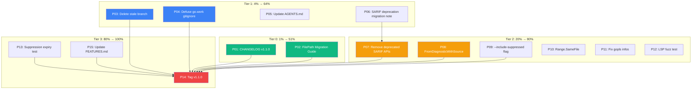

# v1.1.0 Release Plan — go-finding

> **Date:** 2026-07-06 02:36
> **Branch:** `master`
> **Since v1.0.0:** 138 commits — multi-module split, 22 Pareto improvement tasks, FilePath migration, SARIF suppressions, LSP fidelity
> **Goal:** Ship v1.1.0 with clean CHANGELOG, migration guide, dead branch cleanup, and the go.work .gitignore bomb defused.

---

## Pareto Breakdown

### The 1% that delivers 51%

| #       | Task                                           | Why                                                                                                                                                      | Impact                                           |
| ------- | ---------------------------------------------- | -------------------------------------------------------------------------------------------------------------------------------------------------------- | ------------------------------------------------ |
| **P01** | Update CHANGELOG.md with v1.1.0 section        | Nobody knows what changed in 138 commits. The CHANGELOG `[Unreleased]` section is empty. This is the #1 blocker for anyone consuming the library.        | Everyone reading the repo                        |
| **P02** | Update MIGRATION_v1.0.md with FilePath section | The migration guide documents branded types but DOESN'T mention `Position.File` changing from `string` to `FilePath` — the most breaking change we made. | Every consumer with `Position{File: someString}` |

### The 4% that delivers 64% (adds to the above)

| #       | Task                                           | Why                                                                                                                                            |
| ------- | ---------------------------------------------- | ---------------------------------------------------------------------------------------------------------------------------------------------- |
| **P03** | Delete `modularize/unix-style` branch          | Stale merged branch causing confusion. 30-second fix.                                                                                          |
| **P04** | Defuse go.work .gitignore bomb                 | BuildFlow's managed block ignores go.work/go.work.sum but they're tracked. A `git rm --cached` + push would lose workspace files for everyone. |
| **P05** | Update AGENTS.md module structure table        | Module table doesn't mention the convenience functions, SARIFOption, or LSPDiagnosticData.                                                     |
| **P06** | Update MIGRATION guide with SARIF deprecations | `ToSARIFFiltered`/`WriteSARIFFiltered` deprecated but not mentioned in migration.                                                              |

### The 20% that delivers 80% (adds to the above)

| #       | Task                                                     | Why                                                                                                                        |
| ------- | -------------------------------------------------------- | -------------------------------------------------------------------------------------------------------------------------- |
| **P07** | Remove deprecated `ToSARIFFiltered`/`WriteSARIFFiltered` | Dead code that adds maintenance burden. Clean break for v1.1.                                                              |
| **P08** | Extract `FromDiagnosticWithSource` variant               | `analysis.FromDiagnostic` now does `os.ReadFile` — hidden I/O in a pure conversion. Add variant that accepts source bytes. |
| **P09** | Add `--include-suppressed` CLI flag                      | CLI always includes suppressed findings in SARIF now. Users should control this.                                           |
| **P10** | Add `Range.SameFile()` validation method                 | `Range.Start.File` and `Range.End.File` can differ with no check.                                                          |
| **P11** | Clean up 3 gopls `infertypeargs` infos                   | adapter_test.go has unnecessary type arguments.                                                                            |
| **P12** | Add LSP fuzz test                                        | SARIF has fuzz tests, LSP doesn't.                                                                                         |

### The 80% that delivers 100% (the rest)

| #       | Task                                         | Why                                                         |
| ------- | -------------------------------------------- | ----------------------------------------------------------- |
| **P13** | Add SARIF suppression expiry round-trip test | ExpiresAt export/import not tested with actual timestamp.   |
| **P14** | Tag v1.1.0                                   | After all above is done, tag the release.                   |
| **P15** | Update FEATURES.md                           | Stale — doesn't mention multi-module structure or new APIs. |

---

## Medium-Grain Plan (15 tasks, 15–60 min each)

| #   | Tier | Task                                                                         | Impact    | Effort | Module   |
| --- | ---- | ---------------------------------------------------------------------------- | --------- | ------ | -------- |
| P01 | 1%   | Write CHANGELOG.md v1.1.0 section                                            | Very High | 30m    | docs     |
| P02 | 1%   | Add FilePath migration section to MIGRATION_v1.0.md                          | Very High | 15m    | docs     |
| P03 | 4%   | Delete stale `modularize/unix-style` branch                                  | High      | 2m     | git      |
| P04 | 4%   | Fix go.work .gitignore conflict (move outside buildflow block)               | High      | 15m    | root     |
| P05 | 4%   | Update AGENTS.md with new APIs (SARIFOption, LSPDiagnosticData, convenience) | Medium    | 15m    | docs     |
| P06 | 4%   | Add SARIF deprecation note to MIGRATION guide                                | Medium    | 10m    | docs     |
| P07 | 20%  | Remove deprecated `ToSARIFFiltered`/`WriteSARIFFiltered`                     | Medium    | 15m    | core     |
| P08 | 20%  | Extract `FromDiagnosticWithSource` — remove disk I/O from conversion         | Medium    | 30m    | analysis |
| P09 | 20%  | Add `--include-suppressed` CLI flag                                          | Medium    | 30m    | CLI      |
| P10 | 20%  | Add `Range.SameFile()` + validation                                          | Low       | 15m    | core     |
| P11 | 20%  | Fix 3 gopls `infertypeargs` in adapter_test.go                               | Low       | 5m     | core     |
| P12 | 20%  | Add LSP fuzz test                                                            | Low       | 30m    | core     |
| P13 | 80%  | Add SARIF suppression expiry round-trip test                                 | Low       | 15m    | core     |
| P14 | 80%  | Tag v1.1.0                                                                   | High      | 2m     | git      |
| P15 | 80%  | Update FEATURES.md with current state                                        | Low       | 30m    | docs     |

**Total estimated effort: ~4.5 hours**

---

## Fine-Grain Plan (38 tasks, max 15 min each)

### Tier 0 — 1% → 51% (P01, P02)

| #    | Task                                                                | Parent | Est |
| ---- | ------------------------------------------------------------------- | ------ | --- |
| F001 | Read current CHANGELOG to understand format                         | P01    | 5m  |
| F002 | Draft v1.1.0 CHANGELOG entries (breaking, added, fixed, deprecated) | P01    | 10m |
| F003 | Write CHANGELOG.md v1.1.0 section                                   | P01    | 10m |
| F004 | Read MIGRATION_v1.0.md branded types section                        | P02    | 5m  |
| F005 | Add `Position.File` FilePath migration subsection                   | P02    | 10m |
| F006 | Add `GroupByFile` return type change migration note                 | P02    | 5m  |

### Tier 1 — 4% → 64% (P03–P06)

| #    | Task                                                                 | Parent | Est |
| ---- | -------------------------------------------------------------------- | ------ | --- |
| F007 | Delete `modularize/unix-style` branch (local + remote)               | P03    | 2m  |
| F008 | Read .gitignore to find exact go.work lines in buildflow block       | P04    | 5m  |
| F009 | Add `# go.work is tracked — see manual block above` comment override | P04    | 5m  |
| F010 | Verify `git check-ignore go.work` returns nothing                    | P04    | 3m  |
| F011 | Add SARIFOption + LSPDiagnosticData + convenience funcs to AGENTS.md | P05    | 10m |
| F012 | Add deprecation note for ToSARIFFiltered in MIGRATION guide          | P06    | 10m |

### Tier 2 — 20% → 80% (P07–P12)

| #    | Task                                                                  | Parent | Est |
| ---- | --------------------------------------------------------------------- | ------ | --- |
| F013 | Remove `ToSARIFFiltered` method from sarif_export.go                  | P07    | 5m  |
| F014 | Remove `WriteSARIFFiltered` method from sarif_export.go               | P07    | 5m  |
| F015 | Remove `sarifLogFiltered` helper                                      | P07    | 5m  |
| F016 | Build + test after SARIF deprecation removal                          | P07    | 5m  |
| F017 | Write `FromDiagnosticWithSource(d, fset, source, ...)` in analysis.go | P08    | 10m |
| F018 | Refactor `FromDiagnostic` to delegate to `WithSource` variant         | P08    | 10m |
| F019 | Build + test analysis module                                          | P08    | 5m  |
| F020 | Add `includeSuppressed` bool to cliFlags struct                       | P09    | 5m  |
| F021 | Register `--include-suppressed` flag in parseFlags                    | P09    | 5m  |
| F022 | Conditionally pass `WithIncludeSuppressed()` based on flag            | P09    | 5m  |
| F023 | Build + test CLI module                                               | P09    | 5m  |
| F024 | Write `Range.SameFile() bool` method in range.go                      | P10    | 5m  |
| F025 | Add `SameFile` test                                                   | P10    | 5m  |
| F026 | Fix 3 unnecessary type arguments in adapter_test.go                   | P11    | 5m  |
| F027 | Write LSP fuzz test (ToLSP → FromLSP property)                        | P12    | 15m |

### Tier 3 — 80% → 100% (P13–P15)

| #    | Task                                                                | Parent | Est |
| ---- | ------------------------------------------------------------------- | ------ | --- |
| F028 | Write SARIF suppression expiry test with real timestamp             | P13    | 10m |
| F029 | Read FEATURES.md current state                                      | P15    | 5m  |
| F030 | Update FEATURES.md with multi-module, SARIFOption, LSP, convenience | P15    | 15m |
| F031 | Update FEATURES.md status indicators                                | P15    | 10m |
| F032 | Run full verification suite (build, vet, race, GOWORK=off, lint)    | P14    | 10m |
| F033 | Tag v1.1.0                                                          | P14    | 2m  |

---

## Mermaid Execution Graph

