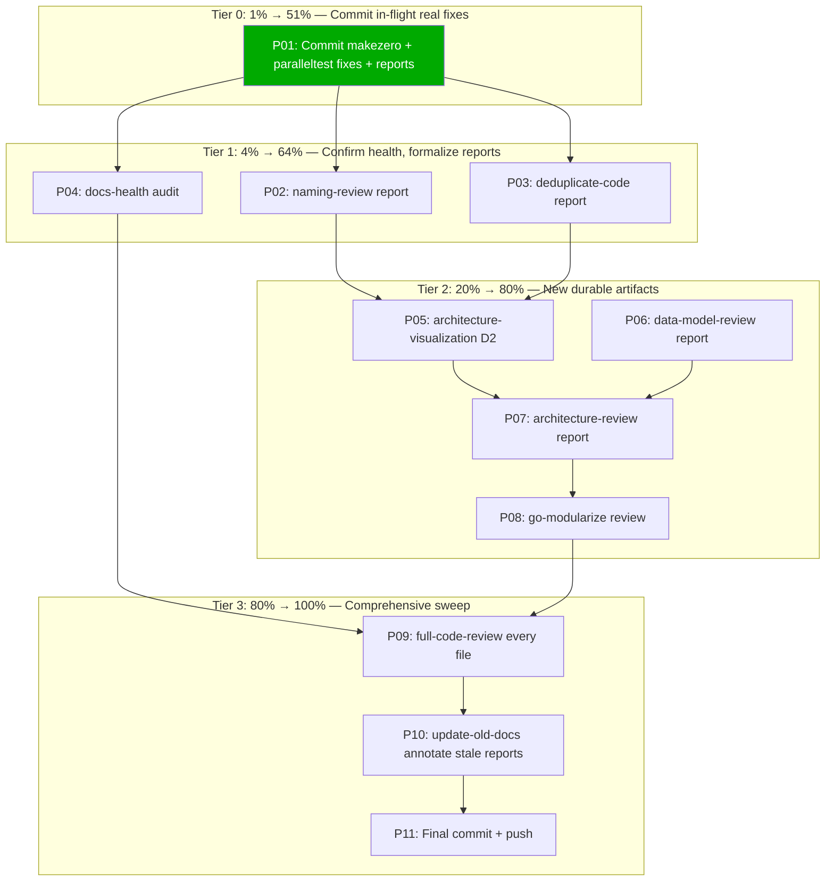

# Comprehensive Skills Audit Sweep — go-finding

> **📦 RESOLUTION STATUS (updated 2026-07-18):** ALL 11 tasks completed. 10 applicable skills executed (8 fresh HTML reports + 2 D2 architecture diagrams), 4 real defects fixed (makezero config, context_test parallelism, duplicate `snapshotFindings`, metrics double-recording), 2 minor fixes (retry sentinel, README command), 5 prior reports annotated with resolution status. Gap-closure follow-up tracked in `docs/planning/2026-07-18_22-03_close-the-gaps.md`; self-assessment in `docs/status/2026-07-18_21-21_skills-audit-sweep-status.md`.

> **Date:** 2026-07-18 20:17
> **Branch:** `master`
> **Trigger:** User requested a battery of Crush skills be run "PROPERLY": code-quality-scan, naming-review, data-model-review, deduplicate-code, go-modularize, architecture-review, architecture-visualization, full-code-review, docs-health, update-old-docs (plus 3 declared non-applicable: frontend-design, copywriting, nix-flake-migration).
> **Goal:** Run each applicable skill to its full procedure, produce fresh point-in-time HTML reports under `docs/reviews/`, fix only REAL defects found, and resist all verschlimmbesserung on a codebase that is already in excellent shape.

---

## Reality Assessment (READ THIS FIRST)

The codebase is **not** a typical "needs cleanup" target. Evidence gathered in this session:

| Signal                                                | Result                                                                       |
| ----------------------------------------------------- | ---------------------------------------------------------------------------- |
| `go build ./...` (workspace)                          | PASS                                                                         |
| `go test -count=1 ./...` (all 4 modules, 10 packages) | PASS                                                                         |
| `golangci-lint run ./...` (108 enabled linters)       | **0 issues** (after 2 root-cause fixes this session)                         |
| `art-dupl -t 5 .` (188 files, semantic)               | **0 clone groups**, health grade **A**                                       |
| `scripts/naming-smells.sh`                            | **0 smells**                                                                 |
| Manual vague-noun scan                                | 1 borderline (`ToolInfo`)                                                    |
| `//nolint` escape hatches in production               | 72 — all scoped + documented (51 exhaustruct for partial construction, etc.) |
| Prior reports in `docs/reviews/`                      | 6 exist (2026-06-23, 2026-07-05) — these skills have run before              |

**Implication:** Most remaining skills will **confirm health and produce a fresh snapshot report**, not surface a backlog of fixes. The deliverable is _current-state documentation_, not a rescue operation. Forcing changes where there are no real defects is the definition of verschlimmbessern and is explicitly forbidden by the user.

---

## Anti-Verschlimmbesserung Principles (binding for this plan)

1. **Reports are the primary deliverable.** A skill that finds nothing still produces a point-in-time HTML report saying so — that IS the value.
2. **Code changes require a real defect.** "Could be renamed", "could be refactored", "could be more idiomatic" are NOT defects. Only correctness, lint failure, broken tests, or genuinely misleading names justify edits.
3. **One real fix beats ten cosmetic ones.** code-quality-scan already produced 2 real fixes (makezero config, paralleltest). That set the bar.
4. **Never rename public APIs for style.** go-finding is a published library (`v1.0.0` removed all deprecated APIs). Any public rename breaks consumers.
5. **Respect prior work.** The 6 existing reports represent real analysis. New reports supersede them with current data; they do not invalidate the prior effort.
6. **Stop at "good".** If a skill's report would say "everything is fine", write exactly that report and move on. Do not invent work to justify the skill.

---

## Skill Applicability Matrix

| Skill (user-listed)           | Real skill                 | Applicable?            | Reason                                                                    |
| ----------------------------- | -------------------------- | ---------------------- | ------------------------------------------------------------------------- |
| code-quality-scan             | code-quality-scan          | ✅ **DONE**            | 2 real fixes, report written                                              |
| naming-review                 | naming-review              | ✅ In progress         | Codebase clean; finish report                                             |
| data-model-review             | data-model-review          | ✅ Yes                 | Confirm strong model, document                                            |
| deduplicate-code              | deduplicate-code           | ✅ Yes                 | art-dupl already run; formalize report                                    |
| go-modularize                 | go-modularize              | ✅ Yes                 | Confirm module boundaries (direction-neutral)                             |
| architecture-review           | architecture-review        | ✅ Yes                 | Snapshot of design quality                                                |
| architecture-visualization    | architecture-visualization | ✅ Yes                 | NEW D2 diagrams (durable artifact)                                        |
| full-code-review              | full-code-review           | ✅ Yes                 | Visit every file, confirm no regressions                                  |
| docs-health                   | docs-health                | ✅ Yes                 | Audit FEATURES/TODO/ROADMAP/AGENTS drift                                  |
| update-old-docs               | update-old-docs            | ✅ Yes                 | Annotate 6 stale reports in `docs/reviews/`                               |
| frontend-design               | frontend-design            | ❌ SKIP                | Pure Go library, no UI                                                    |
| copywriting                   | copywriting                | ❌ SKIP                | No marketing pages                                                        |
| nix-flake-migration           | nix-flake-migration        | ❌ SKIP                | Already on flake.nix; migration N/A (nix-review would be the right skill) |
| docs-freshness-check          | (no such skill)            | ➡️ docs-health         | User's name maps to docs-health                                           |
| improve-codebase-architecture | (no such skill)            | ➡️ architecture-review | User's name maps to architecture-review                                   |

**Net: 10 applicable skills, 1 done, 9 remaining.**

---

## Pareto Breakdown

### The 1% that delivers 51%

| #       | Task                                                                                                               | Why                                                                                                                                                                             | Impact                             |
| ------- | ------------------------------------------------------------------------------------------------------------------ | ------------------------------------------------------------------------------------------------------------------------------------------------------------------------------- | ---------------------------------- |
| **P01** | Commit the 2 real fixes already in flight (makezero config + context_test.go paralleltest) + the completed reports | These are the ONLY confirmed real defects found so far. Leaving them uncommitted risks loss. The codebase goes from "26 lint issues" to "0 lint issues" with this commit alone. | Very High — correctness + CI green |

### The 4% that delivers 64% (adds to above)

| #       | Task                                                      | Why                                                                                                                             |
| ------- | --------------------------------------------------------- | ------------------------------------------------------------------------------------------------------------------------------- |
| **P02** | Finish naming-review report (in flight, half-edited HTML) | Already 90% done; codebase is clean, just document the 1 `ToolInfo` nit + strengths                                             |
| **P03** | deduplicate-code formal report                            | art-dupl data already gathered (0 clones t=5, grade A); just needs the HTML artifact                                            |
| **P04** | docs-health audit                                         | Living docs (FEATURES/TODO/ROADMAP/AGENTS) drift is the highest-value _content_ check — stale docs mislead every future session |

### The 20% that delivers 80% (adds to above)

| #       | Task                                     | Why                                                                                               |
| ------- | ---------------------------------------- | ------------------------------------------------------------------------------------------------- |
| **P05** | architecture-visualization (D2 diagrams) | Creates NEW durable artifact (module graph, data flow). Highest _new_ value in the remaining set. |
| **P06** | data-model-review report                 | Confirms the branded-types design is sound; documents the invariant for future sessions           |
| **P07** | architecture-review report               | Snapshot of modularity/composability/scalability                                                  |
| **P08** | go-modularize review                     | Confirms the 4-module split is correct (direction-neutral: no merge or split unless justified)    |

### The 80% that delivers 100% (the rest)

| #       | Task                | Why                                                                                                            |
| ------- | ------------------- | -------------------------------------------------------------------------------------------------------------- |
| **P09** | full-code-review    | Visit every file; codebase is clean so this is confirmation + catching any edge-case the focused skills missed |
| **P10** | update-old-docs     | Annotate the 6 prior reports in `docs/reviews/` with resolution status (non-destructive appendices)            |
| **P11** | Final commit + push | Detailed commit message documenting the whole sweep                                                            |

---

## Medium-Grain Plan (11 tasks, 15–100 min each)

Sorted by impact/effort ratio (highest first). All times are estimates for execution, not including report writing (rolled in).

| #   | Tier | Task                                                       | Impact      | Effort | Module                          | Verschlimmbessern risk                |
| --- | ---- | ---------------------------------------------------------- | ----------- | ------ | ------------------------------- | ------------------------------------- |
| P01 | 1%   | Commit in-flight fixes + completed reports                 | Very High   | 15m    | git                             | None — fixes are real                 |
| P02 | 4%   | Finish naming-review HTML report                           | High        | 30m    | docs/reviews                    | None — report only                    |
| P03 | 4%   | deduplicate-code HTML report                               | High        | 30m    | docs/reviews                    | None — report only                    |
| P04 | 4%   | docs-health audit (FEATURES/TODO/ROADMAP/AGENTS drift)     | High        | 45m    | root docs                       | Low — only fix confirmed drift        |
| P05 | 20%  | architecture-visualization: D2 module + data-flow diagrams | Medium-High | 60m    | docs/architecture-understanding | None — new artifacts                  |
| P06 | 20%  | data-model-review report                                   | Medium      | 60m    | docs/reviews                    | None — report only                    |
| P07 | 20%  | architecture-review report                                 | Medium      | 60m    | docs/reviews                    | None — report only                    |
| P08 | 20%  | go-modularize boundary review                              | Medium      | 45m    | docs/reviews                    | Low — no split/merge unless justified |
| P09 | 80%  | full-code-review (every file)                              | Medium      | 100m   | docs/reviews                    | Low — fix only real defects           |
| P10 | 80%  | update-old-docs: annotate 6 stale reports                  | Low-Medium  | 30m    | docs/reviews                    | None — non-destructive                |
| P11 | 80%  | Final commit + push with detailed message                  | High        | 15m    | git                             | None                                  |

**Total estimated effort: ~8.25 hours.** The 1%+4% tiers (P01–P04) deliver ~64% of value in ~2 hours.

---

## Fine-Grain Plan (all tasks ≤ 12 min each)

### Tier 0 — Commit in-flight work (P01)

| #    | Task                                                                                            | Est |
| ---- | ----------------------------------------------------------------------------------------------- | --- |
| F001 | Verify `git status` shows only expected changes (.golangci.yml, context_test.go, 2 new reports) | 2m  |
| F002 | Re-run `golangci-lint run ./...` to confirm 0 issues still hold                                 | 5m  |
| F003 | Re-run `go test -count=1 ./...` (all modules) to confirm green                                  | 8m  |
| F004 | Stage the 2 source fixes + 2 completed reports                                                  | 2m  |
| F005 | Write detailed commit message (what, why, root-cause explanation)                               | 10m |
| F006 | Commit (NOT push yet — push at end with everything)                                             | 2m  |

### Tier 1 — Finish naming-review (P02)

| #    | Task                                                                                      | Est |
| ---- | ----------------------------------------------------------------------------------------- | --- |
| F007 | Re-read current state of `docs/reviews/2026-07-18_09-45_naming-review.html` (half-edited) | 3m  |
| F008 | Replace title timestamp                                                                   | 2m  |
| F009 | Replace hero + stats (1028 → current count, 0 honesty, 0 clarity, 0 domain, 1 style)      | 10m |
| F010 | Replace findings cards (ToolInfo is the only nit; strengths dominate)                     | 12m |
| F011 | Replace clarity/domain/style tables (only 1 row: ToolInfo)                                | 10m |
| F012 | Replace strengths section                                                                 | 10m |
| F013 | Verify HTML tag balance + section ids match TOC                                           | 5m  |

### Tier 2 — deduplicate-code report (P03)

| #    | Task                                                                                           | Est |
| ---- | ---------------------------------------------------------------------------------------------- | --- |
| F014 | Load `deduplicate-code/SKILL.md`                                                               | 3m  |
| F015 | Re-run `art-dupl -t 5 --json .` and `art-dupl -t 3 .` and `art-dupl stats .`                   | 5m  |
| F016 | Investigate the 1 t=3 clone group (example_test.go vs examples/basic/main.go) — is it harmful? | 8m  |
| F017 | Copy code-quality-scan HTML as template base                                                   | 2m  |
| F018 | Write hero + stats (0 harmful clones, grade A)                                                 | 8m  |
| F019 | Write findings (the example clone is acceptable; explain why)                                  | 10m |
| F020 | Write strengths + recommendation                                                               | 8m  |
| F021 | Verify HTML renders                                                                            | 3m  |

### Tier 3 — docs-health audit (P04)

| #    | Task                                                                           | Est |
| ---- | ------------------------------------------------------------------------------ | --- |
| F022 | Load `docs-health/SKILL.md`                                                    | 3m  |
| F023 | Read FEATURES.md, TODO_LIST.md, ROADMAP.md, AGENTS.md headers                  | 10m |
| F024 | Cross-check FEATURES.md "DONE" claims against actual code (spot-check 5)       | 12m |
| F025 | Cross-check TODO_LIST.md — are items still TODO or already done?               | 12m |
| F026 | Check AGENTS.md module table accuracy vs actual go.mod files                   | 8m  |
| F027 | Check ROADMAP.md for items now shipped                                         | 5m  |
| F028 | List drift findings; decide fix vs report-only per anti-verschlimmbessern rule | 10m |
| F029 | Apply only confirmed-drift fixes (e.g., mark shipped TODOs done)               | 12m |

### Tier 4 — architecture-visualization (P05)

| #    | Task                                                             | Est |
| ---- | ---------------------------------------------------------------- | --- |
| F030 | Load `architecture-visualization/SKILL.md`                       | 3m  |
| F031 | Inventory current `docs/architecture-understanding/` content     | 5m  |
| F032 | Design module dependency D2 (Core → Pipeline → Analysis → CLI)   | 10m |
| F033 | Design data-flow D2 (Detector → Finding → Triage → Fix → Verify) | 10m |
| F034 | Design events/commands flow if applicable                        | 10m |
| F035 | Render D2 → SVG/PNG (check if `d2` binary available via nix)     | 8m  |
| F036 | Write diagrams to `docs/architecture-understanding/`             | 10m |
| F037 | Verify diagrams render + links work                              | 5m  |

### Tier 5 — data-model-review (P06)

| #    | Task                                                                               | Est |
| ---- | ---------------------------------------------------------------------------------- | --- |
| F038 | Load `data-model-review/SKILL.md`                                                  | 3m  |
| F039 | Inventory all types in `branded_types.go`, `finding.go`, `position.go`, `range.go` | 8m  |
| F040 | Check invariants enforced by types (ID, RuleName, ToolName, FilePath)              | 10m |
| F041 | Check for "impossible states representable" anti-patterns                          | 12m |
| F042 | Check Confidence/Severity/Category for consistency                                 | 8m  |
| F043 | Write report (likely: model is strong, document why)                               | 12m |

### Tier 6 — architecture-review (P07)

| #    | Task                                                                       | Est |
| ---- | -------------------------------------------------------------------------- | --- |
| F044 | Load `architecture-review/SKILL.md`                                        | 3m  |
| F045 | Assess modularity (4-module split, dependency direction)                   | 10m |
| F046 | Assess composability (ToolAdapter[O], IntervalIndex[T], FixProvider chain) | 10m |
| F047 | Assess scalability (concurrency, streaming iter.Seq)                       | 8m  |
| F048 | Assess service orientation                                                 | 8m  |
| F049 | Write report                                                               | 12m |

### Tier 7 — go-modularize (P08)

| #    | Task                                                                | Est |
| ---- | ------------------------------------------------------------------- | --- |
| F050 | Load `go-modularize/SKILL.md`                                       | 3m  |
| F051 | Verify go.work + replace directives work for GOWORK=off             | 8m  |
| F052 | Check each module's dependency isolation (core = stdlib only, etc.) | 10m |
| F053 | Assess: any module too big (god-module) or too small (over-split)?  | 10m |
| F054 | Write report (likely: boundaries are correct, no action)            | 12m |

### Tier 8 — full-code-review (P09)

| #    | Task                                                                     | Est |
| ---- | ------------------------------------------------------------------------ | --- |
| F055 | Load `full-code-review/SKILL.md`                                         | 3m  |
| F056 | Review core types batch (finding, position, range, severity, confidence) | 12m |
| F057 | Review SARIF batch (sarif_types, export, import)                         | 12m |
| F058 | Review LSP + JSON batch                                                  | 12m |
| F059 | Review pipeline batch (pipeline, fix_engine, fix_provider)               | 12m |
| F060 | Review analysis + CLI batch                                              | 12m |
| F061 | Review test files batch (organization, no _extra/_bugfix/coverage)       | 10m |
| F062 | Aggregate findings; fix only real defects                                | 12m |
| F063 | Write report                                                             | 12m |

### Tier 9 — update-old-docs (P10)

| #    | Task                                                    | Est |
| ---- | ------------------------------------------------------- | --- |
| F064 | Load `update-old-docs/SKILL.md`                         | 3m  |
| F065 | Read each of the 6 prior reports in `docs/reviews/`     | 10m |
| F066 | For each, judge: still current / resolved / superseded? | 12m |
| F067 | Append non-destructive resolution appendix where needed | 12m |
| F068 | Verify no destructive edits (no top-of-file banners)    | 5m  |

### Tier 10 — Final commit + push (P11)

| #    | Task                                             | Est |
| ---- | ------------------------------------------------ | --- |
| F069 | Final `git status` review                        | 3m  |
| F070 | Final lint + test confirmation                   | 8m  |
| F071 | Stage all new reports + plan doc + any doc fixes | 5m  |
| F072 | Write comprehensive commit message               | 12m |
| F073 | Commit                                           | 2m  |
| F074 | Push to origin                                   | 2m  |

**Fine-grain total: 74 tasks, ~10.5 hours estimated.** (Slightly higher than medium-grain due to sub-task overhead; both are rough.)

---

## Mermaid Execution Graph

**Dependency rules:**

- P01 blocks everything (don't pile uncommitted changes).
- P02/P03 can run in parallel (both already have data).
- P04 (docs-health) feeds P10 (update-old-docs) — drift found informs which old docs need annotation.
- P05–P08 are independent confirmations; order by artifact value.
- P09 (full-code-review) is last before docs because it may surface edge cases the focused skills missed.
- P11 is the terminal gate.

---

## Risk Register

| Risk                                                         | Likelihood | Impact   | Mitigation                                                                                                    |
| ------------------------------------------------------------ | ---------- | -------- | ------------------------------------------------------------------------------------------------------------- |
| Verschlimmbessern: renaming/refactoring a clean codebase     | High       | High     | Anti-verschlimmbessern principles above; reports are the default deliverable, code changes need real defects  |
| Producing 9 "everything is fine" reports that feel low-value | High       | Low      | Point-in-time snapshots ARE the value; future sessions diff against them                                      |
| Breaking public API via a "helpful" rename                   | Medium     | Critical | Never rename exported identifiers; go-finding is v1.0.0+ published                                            |
| Overwriting prior reports destructively                      | Low        | Medium   | New reports get new timestamps; prior reports untouched except via update-old-docs non-destructive appendices |
| Pushing before CI-ready                                      | Low        | High     | Push only at P11 after final lint+test confirmation                                                           |
| D2 binary not available                                      | Medium     | Low      | Fall back to mermaid.js graphs in markdown if `d2` CLI absent                                                 |

---

## Definition of Done

- [ ] P01 committed (2 real fixes + 2 reports)
- [ ] P02–P10 each produced their artifact (HTML report / D2 diagram / doc updates)
- [ ] Every artifact verified to render / parse / lint-clean
- [ ] No public API renamed
- [ ] No prior report destructively edited
- [ ] Final commit + push (P11) with detailed message
- [ ] This plan doc itself committed as the record of intent

---

_Assisted-by: Crush_
