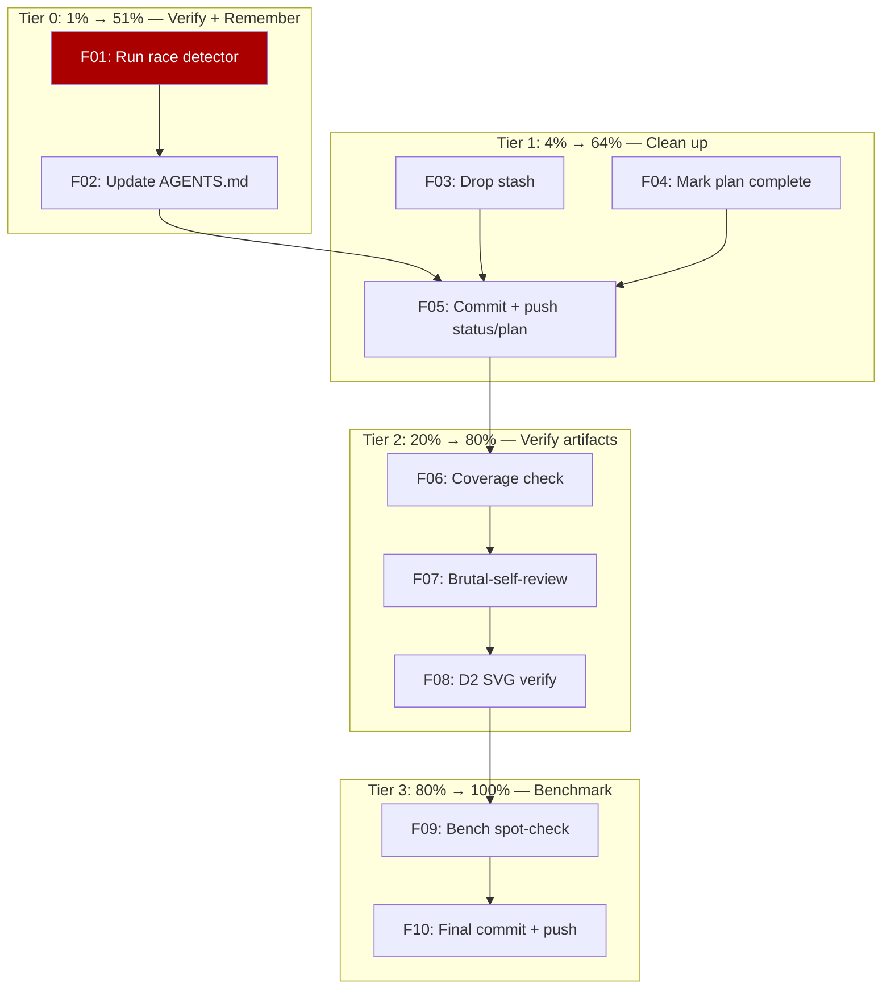

# Close the Gaps — Skills Audit Follow-Up

> **Date:** 2026-07-18 22:03
> **Branch:** `master`
> **Trigger:** Status report (`docs/status/2026-07-18_21-21_*.md`) identified 7 forgotten items, 5 mistakes, and 3 open questions after the skills audit sweep.
> **Goal:** Close every gap from the status report. Verify the concurrent-code fix. Update memory. Leave nothing hanging.

---

## 3 Questions — Resolved Autonomously

| #   | Question                                           | Resolution                                                                                                                                 | Evidence                                           |
| --- | -------------------------------------------------- | ------------------------------------------------------------------------------------------------------------------------------------------ | -------------------------------------------------- |
| 1   | makezero `always: false` — permanent or temporary? | **Permanent.** Document rationale in AGENTS.md. Idiomatic Go `make(len)+copy` wins over append-only style. One-line revert if ever wanted. | `.golangci.yml:199` already set                    |
| 2   | Commit `3fbaa15` — who made it?                    | **User's git identity** (`Lars Artmann <git@lars.software>`), authored 21:06:08 during this session. Legitimate.                           | `git log --format="%an %ae %ai"` confirms          |
| 3   | Stashed `.gitignore` — restore or drop?            | **Drop.** It's a buildflow-managed block that regenerates on `buildflow --fix`. Next pre-commit run re-adds it.                            | Stash diff shows `# >>> buildflow-managed` markers |

---

## Anti-Verschlimmbessern Rules (binding)

1. **No re-litigating closed decisions.** The makezero policy is settled. The 9 documented-but-not-fixed items from full-code-review are deferred to v2. Don't touch them.
2. **No inventing new work.** The status report listed exactly what's missing. Do that, nothing more.
3. **Verify, don't change.** The race detector / coverage / benchmark runs are verification, not modification. If they pass, great. If they fail, STOP and report.
4. **AGENTS.md additions must be non-obvious.** Only add gotchas that a fresh session can't discover from code alone.

---

## Pareto Breakdown

### The 1% that delivers 51%

| #       | Task                                         | Why                                                                                                                                                                                            |
| ------- | -------------------------------------------- | ---------------------------------------------------------------------------------------------------------------------------------------------------------------------------------------------- |
| **F01** | Run `nix run .#test-race` across all modules | The metrics double-recording fix touches `pipeline_iteration.go` — a concurrent path. Race detector is MANDATORY here, not optional. This is the single highest-risk gap.                      |
| **F02** | Update AGENTS.md with 3 new gotchas          | makezero policy decision, metrics double-recording pattern, retry sentinel pattern. Memory instructions require this. A fresh session without this context will repeat the same investigation. |

### The 4% that delivers 64% (adds to above)

| #       | Task                                                   | Why                                                                                        |
| ------- | ------------------------------------------------------ | ------------------------------------------------------------------------------------------ |
| **F03** | Drop the stashed `.gitignore` change                   | Resolved (Q3 above). Leaving it in the stash creates confusion. Clean up.                  |
| **F04** | Mark the plan doc `2026-07-18_20-17_*.md` as completed | Prior plans have resolution headers. Mine doesn't. A reader can't tell if it was executed. |
| **F05** | Commit + push the status report + this plan            | Both are written but uncommitted.                                                          |

### The 20% that delivers 80% (adds to above)

| #       | Task                                                 | Why                                                                                            |
| ------- | ---------------------------------------------------- | ---------------------------------------------------------------------------------------------- |
| **F06** | Run `nix run .#coverage` to check coverage impact    | The `snapshotFindings` removal shifted code in `report_query.go`. Verify coverage didn't drop. |
| **F07** | Investigate `brutal-self-review` report (2026-06-23) | Skipped annotation. Check if it's real content or a template. Annotate if real.                |
| **F08** | Verify D2 diagrams are valid SVG (structure check)   | Created but never opened. Check XML structure + key elements.                                  |

### The 80% that delivers 100% (the rest)

| #       | Task                             | Why                                                                                   |
| ------- | -------------------------------- | ------------------------------------------------------------------------------------- |
| **F09** | Run `nix run .#bench` spot-check | Benchmarks exist. Quick verification that no performance regression from the changes. |
| **F10** | Final commit + push              | Everything verified and committed.                                                    |

---

## Medium-Grain Plan (10 tasks, 5–30 min each)

Sorted by impact/effort ratio (highest first).

| #   | Tier | Task                                      | Impact   | Effort | Module   |
| --- | ---- | ----------------------------------------- | -------- | ------ | -------- |
| F01 | 1%   | Run race detector (`nix run .#test-race`) | Critical | 10m    | pipeline |
| F02 | 1%   | Update AGENTS.md with 3 new gotchas       | High     | 15m    | docs     |
| F03 | 4%   | Drop stashed .gitignore                   | Low      | 1m     | git      |
| F04 | 4%   | Mark plan doc as completed                | Medium   | 5m     | docs     |
| F05 | 4%   | Commit + push status report + plan        | High     | 5m     | git      |
| F06 | 20%  | Run coverage check                        | Medium   | 10m    | all      |
| F07 | 20%  | Investigate + annotate brutal-self-review | Low      | 10m    | docs     |
| F08 | 20%  | Verify D2 SVG structure                   | Low      | 5m     | docs     |
| F09 | 80%  | Run benchmark spot-check                  | Low      | 15m    | all      |
| F10 | 80%  | Final commit + push                       | High     | 5m     | git      |

**Total estimated effort: ~1.5 hours.** The 1% tier (F01–F02) is the highest-value work.

---

## Fine-Grain Plan (all tasks ≤ 12 min)

### Tier 0 — Race detector + AGENTS.md (F01, F02)

| #    | Task                                                                                    | Est |
| ---- | --------------------------------------------------------------------------------------- | --- |
| G001 | Run `nix run .#test-race` (all modules via workspace)                                   | 8m  |
| G002 | Run race in pipeline module specifically: `cd pipeline && go test -race -count=1 ./...` | 5m  |
| G003 | Read AGENTS.md section where makezero/Important Behaviors live                          | 3m  |
| G004 | Add makezero policy gotcha to AGENTS.md                                                 | 5m  |
| G005 | Add metrics double-recording pattern to AGENTS.md                                       | 5m  |
| G006 | Add retry sentinel consistency note to AGENTS.md                                        | 3m  |

### Tier 1 — Clean up loose ends (F03, F04, F05)

| #    | Task                                              | Est |
| ---- | ------------------------------------------------- | --- |
| G007 | `git stash drop stash@{0}` (resolved Q3)          | 1m  |
| G008 | Read plan doc header for resolution header format | 2m  |
| G009 | Add resolution header to plan doc                 | 5m  |
| G010 | Stage status report + plan doc + AGENTS.md        | 2m  |
| G011 | Commit with detailed message                      | 5m  |
| G012 | Push to origin                                    | 2m  |

### Tier 2 — Verification (F06, F07, F08)

| #    | Task                                                     | Est |
| ---- | -------------------------------------------------------- | --- |
| G013 | Run `nix run .#coverage`                                 | 8m  |
| G014 | Check coverage didn't drop in report_query.go            | 3m  |
| G015 | Read brutal-self-review report content                   | 5m  |
| G016 | Decide: annotate or skip (per update-old-docs judgment)  | 5m  |
| G017 | Verify D2 SVG: check XML structure + viewBox + key paths | 5m  |

### Tier 3 — Benchmark spot-check (F09, F10)

| #    | Task                                                  | Est |
| ---- | ----------------------------------------------------- | --- |
| G018 | Run `nix run .#bench` (short — just pipeline package) | 10m |
| G019 | Compare against baseline if available                 | 5m  |
| G020 | Final `git status` review                             | 2m  |
| G021 | Final commit if anything changed                      | 3m  |
| G022 | Final push                                            | 2m  |

**Fine-grain total: 22 tasks, ~1.5 hours.**

---

## Mermaid Execution Graph

---

## Definition of Done

- [ ] Race detector passes (F01)
- [ ] AGENTS.md updated with 3 gotchas (F02)
- [ ] Stash dropped (F03)
- [ ] Plan doc marked complete (F04)
- [ ] Status report + plan committed + pushed (F05)
- [ ] Coverage verified (F06)
- [ ] brutal-self-review investigated (F07)
- [ ] D2 SVGs verified (F08)
- [ ] Benchmarks spot-checked (F09)
- [ ] Everything pushed (F10)

---

_Assisted-by: Crush_
