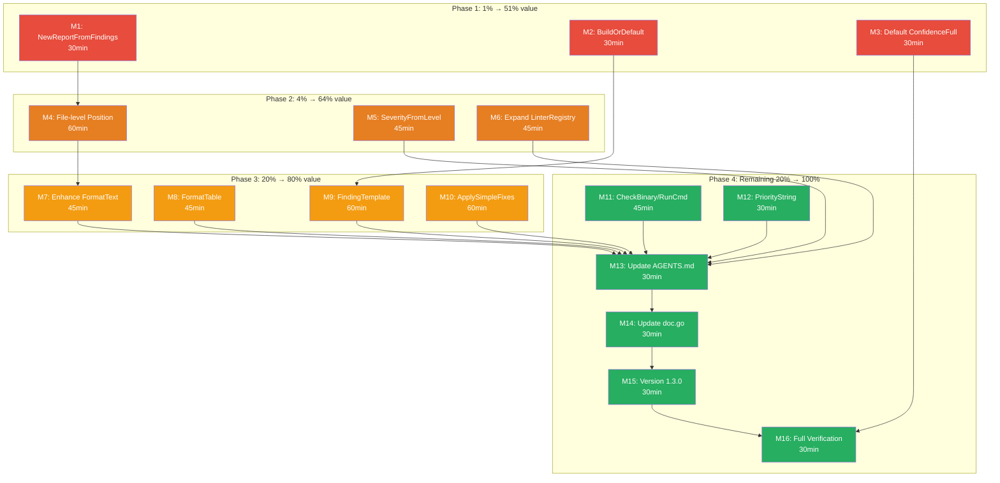
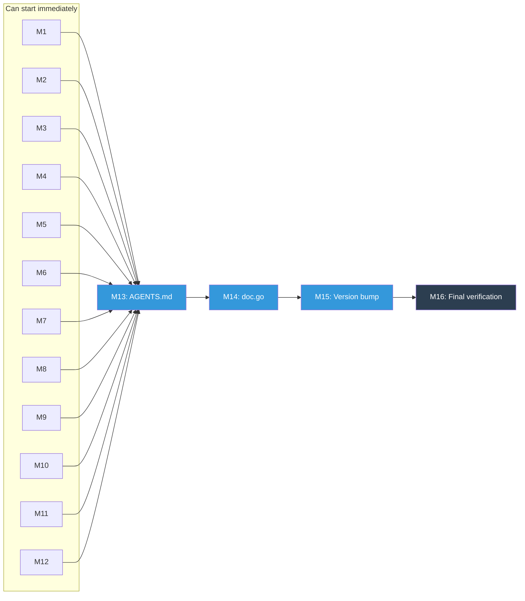

# Consumer-Driven API Improvements — Making go-finding a Better Fit

> **Date:** 2026-07-22 17:56
> **Branch:** `master`
> **Trigger:** Full audit of all 22 consumers of `go-finding` across `~/projects/`
> **Goal:** Eliminate the boilerplate and friction every consumer independently works around, without breaking the excellent data model they already depend on.

---

## Context

go-finding is used by 22 projects (14 with actual Go code imports). The **data model is excellent** — consumers love `Finding`, `Severity`, `Category`, `Builder`, SARIF output, and the type aliases (`type Issue = finding.Finding`). But every consumer independently reinvents the same workarounds for the same friction points. This plan addresses those friction points with **additive API changes only** — zero breaking changes to existing types or signatures.

### Methodology

Audited every Go file importing `github.com/larsartmann/go-finding` across:

| Consumer                     | Module(s) Used             | Key Pattern                                                                      |
| ---------------------------- | -------------------------- | -------------------------------------------------------------------------------- |
| go-auto-upgrade              | core                       | `if line == 0 { line = 1 }` workaround; custom finding factory                   |
| BuildFlow                    | core                       | `SafeBuildFinding()` wrapper; `ApplyTextFixes()` reinvention                     |
| go-checker-helpers           | core                       | `SafeBuildFinding()`; `NewReport()` 4-line wrapper; `ApplyDirectFixes()`         |
| go-structure-linter          | core + pipeline            | Full pipeline integration; custom IssueBuilder; 16 output formats                |
| golangci-lint-auto-configure | core                       | 50+ linter→category map; `configPosition()` workaround; `buildFinding()` wrapper |
| oxlint-auto-configure        | core                       | `mapSeverity()`; plugin→category map; custom Detector                            |
| Code-Quality-Agent           | core                       | `mapSeverity()` + reverse `severityToPriority()`; Adapter pattern                |
| hierarchical-errors          | core + analysis + pipeline | Full bridge layer; severity mapping map                                          |
| library-policy               | core                       | Severity + category mapping switches; struct literal Finding                     |
| linter-autoconfigure-sdk     | core                       | `FindingFromIssue()` with `if line <= 0` workaround                              |
| md-go-validator              | core                       | `FromResult()` converter; `Confidence(1.0)` explicit                             |
| template-AUTHORS             | core                       | `NewFinding()` with explicit confidence                                          |
| template-SECURITY            | core + pipeline            | `buildFinding()` wrapper; `.WithConfidence(1.0)`                                 |
| template-readme              | core                       | `ToFinding()` converter; `positionOrDefault()` workaround                        |
| template-CLI                 | core                       | Type aliases; full re-implementation of finding/report concepts                  |

---

## Anti-Verschlimmbessern Rules (binding)

1. **No breaking changes.** Every new API is additive. Existing types, methods, and signatures stay untouched. The data model works — don't touch it.
2. **No overengineering.** If a consumer's workaround is 5 lines, the library fix should be ≤ 5 lines. No generic frameworks where a function suffices.
3. **No opinionated output.** Enhance `FormatText`, don't replace it. Consumers have different formatting needs — provide building blocks, not monoliths.
4. **Change behavior at the root cause, not the symptom.** Fix `validateIdentity()` to use `HasFile()`, don't add a parallel validation path.
5. **Each change must be independently testable and revertable.** If any single change causes a regression, it can be reverted without affecting the others.

---

## Pareto Breakdown

### The 1% that delivers 51%

These are **trivially small API additions** (3-10 lines each) that eliminate the most duplicated boilerplate across the most consumers. Every consumer constructs findings, reports, and positions — these three changes remove the workarounds they ALL independently built.

| #      | Task                                                     | Why                                                                                                                                                                                | Consumers Affected                                                                                       |
| ------ | -------------------------------------------------------- | ---------------------------------------------------------------------------------------------------------------------------------------------------------------------------------- | -------------------------------------------------------------------------------------------------------- |
| **T1** | `NewReportFromFindings()`                                | Eliminates the identical 4-line `NewReport + AddFindings + ComputeSummary` sequence in 5+ consumers.                                                                               | go-checker-helpers, go-auto-upgrade, go-structure-linter, template-readme, template-AUTHORS              |
| **T2** | `Builder.BuildOrDefault()`                               | Eliminates the `SafeBuildFinding()` / `buildFinding()` / `if err != nil { return Finding{} }` swallow-error pattern. One method, 3 lines.                                          | go-checker-helpers, linter-autoconfigure-sdk, golangci-lint-auto-configure, template-SECURITY, BuildFlow |
| **T3** | Default `Confidence` to `ConfidenceFull` in `NewBuilder` | `NewBuilder` passes confidence=0 (ConfidenceNone), which is semantically wrong for deterministic static analysis. Consumers manually call `.WithConfidence(1.0)`. Fix the default. | template-SECURITY, md-go-validator, library-policy, oxlint-auto-configure                                |

### The 4% that delivers 64% (adds to above)

These are **medium-effort changes** that fix the biggest friction point (file-level positions) and eliminate the most boilerplate-heavy mapping code.

| #      | Task                                        | Why                                                                                                                                                                                                                                                                                            | Consumers Affected                                                                                                            |
| ------ | ------------------------------------------- | ---------------------------------------------------------------------------------------------------------------------------------------------------------------------------------------------------------------------------------------------------------------------------------------------- | ----------------------------------------------------------------------------------------------------------------------------- |
| **T4** | File-level Position support                 | `Position.IsValid()` requires `Line > 0`, but config-file and project-level findings have no line number. 6+ consumers independently write `if line == 0 { line = 1 }`. Fix at the root: change `validateIdentity()` to check `HasFile()` instead of `IsValid()`. Add `FilePos()` constructor. | golangci-lint-auto-configure, go-auto-upgrade, linter-autoconfigure-sdk, go-structure-linter, template-readme, library-policy |
| **T5** | `SeverityFromLevel()` with expanded aliases | Every consumer hand-writes severity mapping switches. Pre-register common aliases ("warn", "high", "medium", "low", "advice", "optional", "critical") and add a convenience function.                                                                                                          | oxlint-auto-configure, golangci-lint-auto-configure, Code-Quality-Agent, hierarchical-errors, library-policy, BuildFlow       |
| **T6** | Expand `DefaultLinterRegistry`              | golangci-lint-auto-configure maintains a 50+ entry linter→category map. Merge it into `DefaultLinterRegistry` so all consumers benefit.                                                                                                                                                        | golangci-lint-auto-configure, Code-Quality-Agent, oxlint-auto-configure                                                       |

### The 20% that delivers 80% (adds to above)

These make the **default experience good enough** that consumers don't need to build custom systems on top.

| #       | Task                                      | Why                                                                                                                                                                                                | Consumers Affected                                                  |
| ------- | ----------------------------------------- | -------------------------------------------------------------------------------------------------------------------------------------------------------------------------------------------------- | ------------------------------------------------------------------- |
| **T7**  | Enhance `FormatText` with severity badges | Current `FormatText` is bare text. `Severity.Badge()` already exists — use it. Add suggestion and category display. Reduces incentive for custom console output.                                   | go-structure-linter, BuildFlow, template-readme                     |
| **T8**  | Add `FormatTable()`                       | Simple severity-badged table output. The most-requested human-readable format that consumers build themselves.                                                                                     | go-structure-linter, BuildFlow                                      |
| **T9**  | `FindingTemplate` type                    | Pre-configured builder factory: stamp common fields (tool name, category, fix strategy) once, build many findings. Eliminates `IssueBuilderFactory`, `newMigrationFinding`, `buildFixableFinding`. | go-structure-linter, go-auto-upgrade, BuildFlow, go-checker-helpers |
| **T10** | `ApplySimpleFixes()` in core              | BeforeCode→AfterCode string replacement for the 80% case where consumers don't need the full FixEngine. Stdlib-only, stays in core.                                                                | go-checker-helpers, BuildFlow                                       |

### The remaining 20% to get to 100%

Polish, documentation, and release.

| #       | Task                                                     | Why                                                                                                  | Consumers Affected                                                                         |
| ------- | -------------------------------------------------------- | ---------------------------------------------------------------------------------------------------- | ------------------------------------------------------------------------------------------ |
| **T11** | External tool detector helpers (`CheckBinary`, `RunCmd`) | Standardize the "run CLI tool → parse JSON" pattern. 4 consumers independently build this.           | Code-Quality-Agent, oxlint-auto-configure, golangci-lint-auto-configure, template-SECURITY |
| **T12** | `Severity.PriorityString()` reverse mapping              | Code-Quality-Agent has `severityToPriority()` — the reverse of severity mapping. Add to the library. | Code-Quality-Agent                                                                         |
| **T13** | Update AGENTS.md, doc.go with new APIs                   | Memory instructions require this. Examples for all new APIs.                                         | All                                                                                        |
| **T14** | Version bump to v1.3.0 + CHANGELOG                       | Minor version bump for additive features.                                                            | All                                                                                        |
| **T15** | Full test suite + per-module GOWORK=off verification     | Must not break any consumer compilation path.                                                        | All                                                                                        |

---

## Comprehensive Plan (Medium Tasks — 100min to 30min each)

> Sorted by importance/impact/effort/customer-value.

| ID  | Task                                                                  | Phase | Impact      | Effort | Dependencies | Risk                                    |
| --- | --------------------------------------------------------------------- | ----- | ----------- | ------ | ------------ | --------------------------------------- |
| M1  | `NewReportFromFindings()` + tests                                     | 1%    | 🔴 Critical | 30min  | None         | None — pure addition                    |
| M2  | `Builder.BuildOrDefault()` + tests                                    | 1%    | 🔴 Critical | 30min  | None         | None — pure addition                    |
| M3  | Default `Confidence` to `ConfidenceFull` in `NewBuilder`              | 1%    | 🟡 High     | 30min  | None         | Low — behavior change, but more correct |
| M4  | File-level Position: relax `validateIdentity()` + `FilePos()` + tests | 4%    | 🔴 Critical | 60min  | None         | Medium — changes validation semantics   |
| M5  | `SeverityFromLevel()` + expanded aliases + tests                      | 4%    | 🟡 High     | 45min  | None         | None — pure addition                    |
| M6  | Expand `DefaultLinterRegistry` from consumer data                     | 4%    | 🟡 High     | 45min  | None         | None — pure addition                    |
| M7  | Enhance `FormatText` with badges + suggestions                        | 20%   | 🟡 Medium   | 45min  | None         | Low — changes output format             |
| M8  | Add `FormatTable()` function + tests                                  | 20%   | 🟡 Medium   | 45min  | None         | None — pure addition                    |
| M9  | `FindingTemplate` type + tests                                        | 20%   | 🟡 Medium   | 60min  | None         | None — pure addition                    |
| M10 | `ApplySimpleFixes()` in core + tests                                  | 20%   | 🟡 Medium   | 60min  | None         | None — pure addition                    |
| M11 | External tool helpers (`CheckBinary`, `RunCmd`)                       | Rest  | 🟢 Low      | 45min  | None         | None — pure addition                    |
| M12 | `Severity.PriorityString()` + tests                                   | Rest  | 🟢 Low      | 30min  | None         | None — pure addition                    |
| M13 | Update AGENTS.md with new APIs and gotchas                            | Rest  | 🟡 High     | 30min  | M1-M12       | None                                    |
| M14 | Update doc.go with examples for all new APIs                          | Rest  | 🟡 Medium   | 30min  | M1-M12       | None                                    |
| M15 | Version bump to v1.3.0 + CHANGELOG entry                              | Rest  | 🟢 Low      | 30min  | M1-M14       | None                                    |
| M16 | Full test suite + `GOWORK=off` per-module verification                | Rest  | 🔴 Critical | 30min  | M1-M15       | None — verification only                |

**Total estimated effort:** ~10.5 hours

---

## Detailed Breakdown (Fine Tasks — max 12min each)

> Sorted by importance/impact/effort/customer-value within each medium task.

### Phase 1: The 1% that delivers 51%

#### M1: NewReportFromFindings() — 3 subtasks

| ID   | Subtask                                                                                      | Time | Verifies      |
| ---- | -------------------------------------------------------------------------------------------- | ---- | ------------- |
| F1.1 | Add `NewReportFromFindings(tool ToolInfo, findings []Finding) *Report` to `report.go`        | 5min | Compiles      |
| F1.2 | Write test: `NewReportFromFindings` equals manual `NewReport + AddFindings + ComputeSummary` | 7min | Correctness   |
| F1.3 | Run `go test ./finding_test.go report_test.go -run Report` to verify                         | 5min | No regression |

#### M2: Builder.BuildOrDefault() — 3 subtasks

| ID   | Subtask                                                                                                       | Time | Verifies    |
| ---- | ------------------------------------------------------------------------------------------------------------- | ---- | ----------- |
| F2.1 | Add `BuildOrDefault() Finding` method to `finding_builder.go` (calls `Build()`, returns `Finding{}` on error) | 5min | Compiles    |
| F2.2 | Write test: valid builder returns valid finding via `BuildOrDefault()`                                        | 7min | Correctness |
| F2.3 | Write test: invalid builder returns zero-value `Finding{}` via `BuildOrDefault()`                             | 7min | Error path  |

#### M3: Default Confidence to ConfidenceFull — 3 subtasks

| ID   | Subtask                                                                              | Time  | Verifies      |
| ---- | ------------------------------------------------------------------------------------ | ----- | ------------- |
| F3.1 | Change `NewBuilder` to call `NewFinding(..., ConfidenceFull)` instead of `0`         | 5min  | Compiles      |
| F3.2 | Update test expectations in `finding_builder_test.go` where confidence defaults to 0 | 10min | Correctness   |
| F3.3 | Run full core test suite to catch any other affected tests                           | 7min  | No regression |

### Phase 2: The 4% that delivers 64%

#### M4: File-level Position support — 8 subtasks

| ID   | Subtask                                                                                                                                       | Time | Verifies       |
| ---- | --------------------------------------------------------------------------------------------------------------------------------------------- | ---- | -------------- |
| F4.1 | Change `validateIdentity()` in `finding_validate.go`: replace `!f.Position.IsValid()` with `!f.Position.HasFile()`                            | 5min | Root cause fix |
| F4.2 | Add `FilePos(file FilePath) Position` constructor to `position.go`: returns `Position{File: file, Line: 0, Column: 0, Offset: OffsetUnknown}` | 5min | Explicit API   |
| F4.3 | Update `Position` doc comment to document file-level positions as valid                                                                       | 5min | Documentation  |
| F4.4 | Write test: `Finding` with `Position{File: "x", Line: 0}` passes `Validate()`                                                                 | 7min | New behavior   |
| F4.5 | Write test: `FilePos("x")` creates correct `Position` with `Offset: -1`                                                                       | 5min | Constructor    |
| F4.6 | Write test: `Finding` with `Position{File: "", Line: 0}` still fails `Validate()`                                                             | 5min | Guard          |
| F4.7 | Run full core test suite — verify no regressions                                                                                              | 7min | No regression  |
| F4.8 | Update AGENTS.md: update the `Position.Offset uses -1 sentinel` gotcha to document file-level validation change                               | 7min | Memory         |

#### M5: SeverityFromLevel() — 5 subtasks

| ID   | Subtask                                                                                                                                                        | Time  | Verifies               |
| ---- | -------------------------------------------------------------------------------------------------------------------------------------------------------------- | ----- | ---------------------- |
| F5.1 | Add alias registrations in `severity.go` `init()`: "warn"→Warning, "high"→Error, "medium"→Warning, "low"→Info, "advice"→Info, "optional"→Info, "crit"→Critical | 10min | Pre-registered aliases |
| F5.2 | Add `SeverityFromLevel(level string, fallback Severity) Severity` function                                                                                     | 7min  | Convenience API        |
| F5.3 | Write test: `SeverityFromLevel` maps all registered aliases correctly                                                                                          | 10min | Correctness            |
| F5.4 | Write test: `SeverityFromLevel` returns fallback for unknown levels                                                                                            | 5min  | Fallback path          |
| F5.5 | Run full core test suite                                                                                                                                       | 5min  | No regression          |

#### M6: Expand DefaultLinterRegistry — 4 subtasks

| ID   | Subtask                                                                                            | Time  | Verifies           |
| ---- | -------------------------------------------------------------------------------------------------- | ----- | ------------------ |
| F6.1 | Extract all linter→category mappings from `golangci-lint-auto-configure/pkg/finding/categories.go` | 10min | Data collection    |
| F6.2 | Add entries to `DefaultLinterRegistry` initialization in `category_linter.go`                      | 12min | Registry expansion |
| F6.3 | Write test: verify new linter names resolve to correct categories                                  | 10min | Correctness        |
| F6.4 | Run full core test suite                                                                           | 5min  | No regression      |

### Phase 3: The 20% that delivers 80%

#### M7: Enhance FormatText — 5 subtasks

| ID   | Subtask                                                                     | Time  | Verifies      |
| ---- | --------------------------------------------------------------------------- | ----- | ------------- |
| F7.1 | Update `FormatText` to use `f.Severity.Badge()` instead of uppercase string | 7min  | Better output |
| F7.2 | Add category display when present: `[CAT]` suffix                           | 5min  | Richer output |
| F7.3 | Add suggestion display with 💡 prefix when present                          | 5min  | Richer output |
| F7.4 | Update `FormatText` tests to expect new format                              | 10min | Correctness   |
| F7.5 | Run full core test suite                                                    | 7min  | No regression |

#### M8: FormatTable() — 4 subtasks

| ID   | Subtask                                                                                                                      | Time  | Verifies      |
| ---- | ---------------------------------------------------------------------------------------------------------------------------- | ----- | ------------- |
| F8.1 | Add `FormatTable(w io.Writer, findings []Finding) error` to `format.go` — severity badge, file:line, rule, message, category | 12min | New format    |
| F8.2 | Write test: `FormatTable` output contains expected columns and data                                                          | 10min | Correctness   |
| F8.3 | Write test: empty findings slice produces header-only table                                                                  | 5min  | Edge case     |
| F8.4 | Run full core test suite                                                                                                     | 5min  | No regression |

#### M9: FindingTemplate — 5 subtasks

| ID   | Subtask                                                                                                                                             | Time  | Verifies        |
| ---- | --------------------------------------------------------------------------------------------------------------------------------------------------- | ----- | --------------- |
| F9.1 | Add `FindingTemplate` struct to `finding_builder.go` with `Tool`, `Category`, `FixStrategy`, `Tags` fields                                          | 10min | Type definition |
| F9.2 | Add `NewTemplate(toolName ToolName) *FindingTemplate` constructor                                                                                   | 5min  | Constructor     |
| F9.3 | Add `WithCategory`, `WithFixStrategy`, `WithTags` chain methods on `*FindingTemplate`                                                               | 10min | Fluent API      |
| F9.4 | Add `Build(rule, message string, severity Severity, pos Position) Finding` on `*FindingTemplate` — stamps template fields, calls `BuildOrDefault()` | 10min | Factory method  |
| F9.5 | Write tests: template stamps fields correctly, overrides work, invalid input returns zero                                                           | 12min | Correctness     |

#### M10: ApplySimpleFixes() — 5 subtasks

| ID    | Subtask                                                                                              | Time  | Verifies         |
| ----- | ---------------------------------------------------------------------------------------------------- | ----- | ---------------- |
| F10.1 | Add `ApplySimpleFixes(findings []Finding) map[FilePath][]FixResult` type to new file `simple_fix.go` | 10min | Type + structure |
| F10.2 | Implement BeforeCode→AfterCode replacement logic with `strings.Replace`                              | 12min | Core logic       |
| F10.3 | Add file grouping via `GroupByFile` and per-file application                                         | 10min | File handling    |
| F10.4 | Write tests: single fix, multiple fixes same file, no BeforeCode skips, no match skips               | 12min | Correctness      |
| F10.5 | Run full core test suite                                                                             | 5min  | No regression    |

### Phase 4: The remaining 20% to get to 100%

#### M11: External tool detector helpers — 4 subtasks

| ID    | Subtask                                                                                                                          | Time  | Verifies      |
| ----- | -------------------------------------------------------------------------------------------------------------------------------- | ----- | ------------- |
| F11.1 | Add `CheckBinary(name string) (string, error)` to `detector.go` — wraps `exec.LookPath` with finding error                       | 10min | New helper    |
| F11.2 | Add `RunCmd(ctx, name string, args ...string) ([]byte, error)` to `detector.go` — wraps `exec.CommandContext` with finding error | 10min | New helper    |
| F11.3 | Write tests: binary not found returns `NewIOError`, successful command returns output                                            | 12min | Correctness   |
| F11.4 | Run full core test suite                                                                                                         | 5min  | No regression |

#### M12: Severity.PriorityString() — 3 subtasks

| ID    | Subtask                                                                                                             | Time | Verifies        |
| ----- | ------------------------------------------------------------------------------------------------------------------- | ---- | --------------- |
| F12.1 | Add `PriorityString() string` method on `Severity`: Critical→"critical", Error→"high", Warning→"medium", Info→"low" | 7min | Reverse mapping |
| F12.2 | Write test: all severity levels produce correct priority strings                                                    | 7min | Correctness     |
| F12.3 | Run full core test suite                                                                                            | 5min | No regression   |

#### M13: Update AGENTS.md — 3 subtasks

| ID    | Subtask                                                                                              | Time | Verifies      |
| ----- | ---------------------------------------------------------------------------------------------------- | ---- | ------------- |
| F13.1 | Add gotcha: "File-level positions now valid — `validateIdentity()` uses `HasFile()` not `IsValid()`" | 7min | Memory        |
| F13.2 | Add gotcha: "`BuildOrDefault()` returns zero-value Finding on error, not panic"                      | 5min | Memory        |
| F13.3 | Add new API entries to Key Files table                                                               | 7min | Documentation |

#### M14: Update doc.go — 2 subtasks

| ID    | Subtask                                                                                                       | Time  | Verifies |
| ----- | ------------------------------------------------------------------------------------------------------------- | ----- | -------- |
| F14.1 | Add examples for `NewReportFromFindings`, `BuildOrDefault`, `FilePos`, `SeverityFromLevel`, `FindingTemplate` | 12min | Examples |
| F14.2 | Add example for `ApplySimpleFixes` and `FormatTable`                                                          | 10min | Examples |

#### M15: Version bump + CHANGELOG — 3 subtasks

| ID    | Subtask                                             | Time  | Verifies      |
| ----- | --------------------------------------------------- | ----- | ------------- |
| F15.1 | Update `version.go`: bump to `1.3.0`                | 5min  | Version       |
| F15.2 | Add CHANGELOG entry for v1.3.0 listing all new APIs | 10min | Release notes |
| F15.3 | Verify `finding.Version == "1.3.0"` in test         | 5min  | Version check |

#### M16: Full verification — 4 subtasks

| ID    | Subtask                                                                           | Time | Verifies       |
| ----- | --------------------------------------------------------------------------------- | ---- | -------------- |
| F16.1 | Run `export GOEXPERIMENT=jsonv2 && go test -race -count=1 ./...` (core)           | 7min | Core tests     |
| F16.2 | Run `export GOEXPERIMENT=jsonv2 && go test -race -count=1 ./...` (pipeline)       | 7min | Pipeline tests |
| F16.3 | Run `export GOEXPERIMENT=jsonv2 && go test -race -count=1 ./...` (analysis)       | 5min | Analysis tests |
| F16.4 | Run `export GOEXPERIMENT=jsonv2 && go test -race -count=1 ./...` (cmd/go-finding) | 7min | CLI tests      |

---

## Fine Task Summary

| Phase           | Tasks   | Subtasks | Est. Time |
| --------------- | ------- | -------- | --------- |
| 1% (51% value)  | M1-M3   | 9        | ~1h       |
| 4% (64% value)  | M4-M6   | 17       | ~3h       |
| 20% (80% value) | M7-M10  | 19       | ~3h       |
| Remaining 20%   | M11-M16 | 19       | ~3h       |
| **Total**       | **16**  | **64**   | **~10h**  |

---

## What We Are NOT Doing (Anti-Verschlimmbessern)

| Considered                           | Decision    | Reason                                                                                           |
| ------------------------------------ | ----------- | ------------------------------------------------------------------------------------------------ |
| Change `Finding` struct shape        | ❌ Rejected | 22 consumers depend on it. It works.                                                             |
| Change `Builder.Build()` return type | ❌ Rejected | Breaking change. `BuildOrDefault()` is additive.                                                 |
| Replace `FormatText`                 | ❌ Rejected | Enhance, don't replace. Consumers have different needs.                                          |
| Add generic `CategoryMapper[K]`      | ❌ Rejected | Overengineering. Consumers have domain-specific logic that doesn't fit a generic mapper.         |
| Build `JSONToolDetector`             | ❌ Rejected | Too opinionated. Every tool has different JSON shape. Helpers (`CheckBinary`, `RunCmd`) suffice. |
| Change `Position.IsValid()` method   | ❌ Rejected | Too many callers depend on current semantics. Fix at the validation call site instead.           |
| Add `Properties map[string]any`      | ❌ Rejected | Explicitly banned in AGENTS.md. `Metadata map[string]string` stays.                              |
| Pipeline redesign                    | ❌ Rejected | Pipeline works for go-structure-linter and hierarchical-errors. Don't fix what isn't broken.     |

---

## Execution Graph

### Dependency Logic

---

## Verification Checklist

Before declaring done:

- [ ] All 16 medium tasks completed
- [ ] All 64 fine tasks completed
- [ ] `go test -race -count=1 ./...` passes in all 4 modules
- [ ] `GOWORK=off go test ./...` passes in each module directory
- [ ] `golangci-lint run ./...` passes
- [ ] No existing API signatures changed (additive only)
- [ ] AGENTS.md updated with new APIs and gotchas
- [ ] doc.go has examples for all new functions
- [ ] CHANGELOG.md has v1.3.0 entry
- [ ] `version.go` shows `1.3.0`
- [ ] Git committed and pushed

---

## Expected Consumer Impact After Completion

| Boilerplate Pattern                        | Consumers Today | After v1.3.0                                            |
| ------------------------------------------ | --------------- | ------------------------------------------------------- |
| `if line == 0 { line = 1 }`                | 6+              | Eliminated — `FilePos()` + relaxed validation           |
| `SafeBuildFinding()` / error swallow       | 5+              | Eliminated — `BuildOrDefault()`                         |
| `NewReport + AddFindings + ComputeSummary` | 5+              | Eliminated — `NewReportFromFindings()`                  |
| `.WithConfidence(1.0)`                     | 3+              | Eliminated — default is now `ConfidenceFull`            |
| Severity mapping switch                    | 6+              | Reduced — `SeverityFromLevel()` + aliases               |
| Linter→category map                        | 3+              | Eliminated — expanded `DefaultLinterRegistry`           |
| Custom `buildFinding()` wrapper            | 4+              | Reduced — `FindingTemplate`                             |
| `ApplyTextFixes()` / `ApplyDirectFixes()`  | 3               | Eliminated — `ApplySimpleFixes()`                       |
| `mapSeverity()` + `severityToPriority()`   | 1+              | Eliminated — `SeverityFromLevel()` + `PriorityString()` |

---

_Generated by consumer audit on 2026-07-22. Based on analysis of 22 consumer projects._
