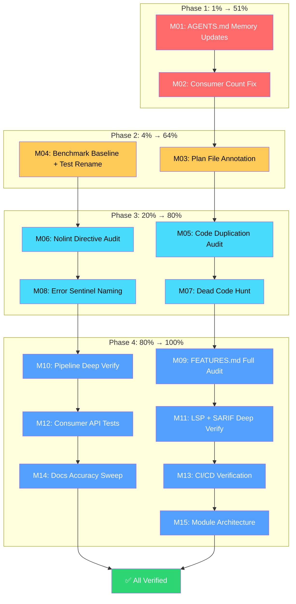

# Post-Session Remediation & Deep Verification Plan

> **📦 RESOLUTION STATUS (updated 2026-07-24):** ALL 15 macro-tasks (96 micro-tasks) EXECUTED. All quality gates green (test, lint, race, GOWORK=off isolation). Fixes applied: 4 AGENTS.md gotchas, consumer count verified (20→22 timeline), 3 plan file annotations, benchmark baseline captured, TestGetCategory→TestCategoryOf renamed, 5 FEATURES.md drift fixes (linter count 84→89, fuzz tests 4→6, output formats 6→7, coverage metric removed), dependabot expanded to track all 4 modules. Zero code issues found: art-dupl 0 clones, golangci-lint 0 issues, go vet clean, unused/unparam 0 findings, 0 inline errors.New in validation returns, all 81 nolint directives verified needed.

**Date:** 2026-07-24 22:20
**Source:** Self-critique from `docs/status/2026-07-24_22-16_post-audit-execution-full-run.md`
**Goal:** Fix process mistakes, update memory, deep-verify all subsystems, achieve zero drift

---

## Context

Two prior sessions executed a TODO_LIST freshness audit and a 68-task post-audit plan. The audit found and fixed 5 real bugs (version-check script, ghost file ref, removed API ref, rotting metric, stale migration doc). All quality gates pass green. But the self-critique revealed **5 process failures**: missing AGENTS.md memory updates, uncommitted files (now resolved), stale plan file, generic commit messages, and unverified consumer count. This plan addresses those failures plus all remaining deep verification work.

---

## Pareto Breakdown

### The 1% that delivers 51%

**Fix the process failures.** These are the things I _said_ I'd do but didn't. Missing AGENTS.md memory is a rule #1 violation — every future session starts from zero without it. The consumer count appears in 3 docs and I can't verify it. These are tiny tasks with outsized impact.

### The 4% that delivers 64%

**Capture the missing baseline.** There's no benchmark baseline, which means regression detection is impossible. Plus the stale test name (`TestGetCategory` → `TestCategoryOf`) and the plan file annotation. Quick, high-signal fixes.

### The 20% that delivers 80%

**Deep code quality sweep.** Run art-dupl, audit nolint directives, find dead code, verify error sentinel naming. These catch real issues that compound over time. Each is a single command or grep.

### The remaining 80% (last 20%)

**Subsystem-by-subsystem deep verification.** FEATURES.md full audit, pipeline trace, LSP trace, consumer API tests, CI/CD verification, docs accuracy sweep. Important for confidence but lower urgency — the spot-checks already passed.

---

## Comprehensive Plan (30-100min tasks)

| ID  | Task                                                                                                 | Impact   | Effort | Tier | Deps |
| --- | ---------------------------------------------------------------------------------------------------- | -------- | ------ | ---- | ---- |
| M01 | Update AGENTS.md with 3 gotchas: version-check `--match`, interval_index rename, doc.go API ref rule | Critical | 30m    | 1%   | —    |
| M02 | Verify and correct consumer count (20 vs 22) across TODO_LIST, ROADMAP, AGENTS.md                    | Critical | 30m    | 1%   | —    |
| M03 | Annotate prior plan file with completion status (non-destructive)                                    | Med      | 30m    | 4%   | —    |
| M04 | Capture benchmark baseline + rename TestGetCategory → TestCategoryOf                                 | High     | 45m    | 4%   | —    |
| M05 | Run art-dupl and audit code duplication findings                                                     | High     | 60m    | 20%  | —    |
| M06 | Audit all nolint directives — verify each is still needed                                            | High     | 45m    | 20%  | —    |
| M07 | Find dead code: unused exports, unexported functions never called                                    | High     | 60m    | 20%  | —    |
| M08 | Verify error sentinel naming — all validation errors use named sentinels                             | Med      | 45m    | 20%  | —    |
| M09 | Full FEATURES.md audit — read end-to-end, verify every claim                                         | High     | 90m    | 80%  | —    |
| M10 | Pipeline deep verification — trace FixProvider chain, shift correctness, conflict precision, hooks   | Med      | 90m    | 80%  | —    |
| M11 | LSP + SARIF deep verification — full round-trip field coverage                                       | Med      | 60m    | 80%  | —    |
| M12 | Consumer API integration tests — BuildOrDefault, Template, ApplySimpleFixes, CheckBinary/RunCmd      | Med      | 60m    | 80%  | —    |
| M13 | CI/CD verification — GitHub Actions, dependabot, coverage                                            | Med      | 45m    | 80%  | —    |
| M14 | Docs accuracy sweep — CONTRIBUTING, USAGE_GUIDE, API_STABILITY, archive                              | Low-Med  | 60m    | 80%  | —    |
| M15 | Module architecture verification — boundaries, go.sum, replace consistency                           | Med      | 45m    | 80%  | —    |

---

## Detailed Breakdown (max 12min tasks)

### M01: AGENTS.md Memory Updates (Critical, 30m)

| Sub-ID | Task                                                                                                                                                 | Effort |
| ------ | ---------------------------------------------------------------------------------------------------------------------------------------------------- | ------ |
| M01.1  | Add gotcha to AGENTS.md: "version-check.sh uses `--match 'v[0-9]*'` to avoid matching sub-module directory-prefixed tags (pipeline/v*, analysis/v*)" | 5m     |
| M01.2  | Verify interval_index.go is already reflected in AGENTS.md Key Files table (fixed in prior session, confirm)                                         | 3m     |
| M01.3  | Add rule to AGENTS.md: "doc.go godoc references must use current API names — check after any rename"                                                 | 5m     |
| M01.4  | Add gotcha: "Consumer count claims (e.g. '22 consumers') are unverified since v1.0.0 audit — see docs/reviews/ consumer audit"                       | 5m     |
| M01.5  | Verify AGENTS.md still accurately describes version-check.sh command in the Testing & Build section                                                  | 5m     |
| M01.6  | Run `go test ./...` to verify AGENTS.md edits didn't break anything (doc edit sanity)                                                                | 4m     |

### M02: Consumer Count Verification (Critical, 30m)

| Sub-ID | Task                                                                                      | Effort |
| ------ | ----------------------------------------------------------------------------------------- | ------ |
| M02.1  | Read consumer audit HTML to extract exact count and date                                  | 5m     |
| M02.2  | Check if any newer consumer data exists (git log for consumer-related commits post-audit) | 5m     |
| M02.3  | Update TODO_LIST.md consumer count if wrong                                               | 5m     |
| M02.4  | Update ROADMAP.md consumer count if wrong                                                 | 5m     |
| M02.5  | Update AGENTS.md if consumer count appears there                                          | 5m     |
| M02.6  | Decide: replace hard count with pointer to audit report? (if count can't be verified)     | 5m     |

### M03: Plan File Annotation (Med, 30m)

| Sub-ID | Task                                                                                                                 | Effort |
| ------ | -------------------------------------------------------------------------------------------------------------------- | ------ |
| M03.1  | Read the prior plan file `docs/planning/2026-07-24_22-04_post-audit-execution-plan.md`                               | 5m     |
| M03.2  | Add completion annotation at top: "Status: EXECUTED. 63/68 complete, 5 BLOCKED. See status report 2026-07-24_22-16." | 5m     |
| M03.3  | Spot-check: do the completion claims match actual git history?                                                       | 10m    |
| M03.4  | Verify no other stale plan files in docs/planning/ need annotation                                                   | 10m    |

### M04: Benchmark Baseline + Test Rename (High, 45m)

| Sub-ID | Task                                                                    | Effort |
| ------ | ----------------------------------------------------------------------- | ------ |
| M04.1  | Create `benchmarks/` directory                                          | 2m     |
| M04.2  | Run `nix run .#bench` and capture output to `benchmarks/baseline.txt`   | 12m    |
| M04.3  | Verify `scripts/bench-check.sh` can parse the baseline file             | 5m     |
| M04.4  | Rename `TestGetCategory` → `TestCategoryOf` in `errors_test.go`         | 5m     |
| M04.5  | Run the specific test to verify rename works                            | 3m     |
| M04.6  | Run full test suite to verify nothing else references the old test name | 8m     |

### M05: Code Duplication Audit (High, 60m)

| Sub-ID | Task                                                                          | Effort |
| ------ | ----------------------------------------------------------------------------- | ------ |
| M05.1  | Run `nix run .#art-dupl` and capture findings                                 | 10m    |
| M05.2  | Read and classify each finding: real duplication vs acceptable pattern        | 12m    |
| M05.3  | For real duplications: extract shared helper or add nolint with justification | 12m    |
| M05.4  | Verify any code changes pass tests                                            | 8m     |
| M05.5  | Verify any code changes pass lint                                             | 8m     |
| M05.6  | Document findings: what was duplicated, what was fixed, what was kept         | 10m    |

### M06: Nolint Directive Audit (High, 45m)

| Sub-ID | Task                                                                                | Effort |
| ------ | ----------------------------------------------------------------------------------- | ------ |
| M06.1  | Grep all `//nolint` directives across codebase                                      | 5m     |
| M06.2  | Classify each: gosec (security), exhaustruct (struct), gocognit (complexity), other | 8m     |
| M06.3  | For each: verify the directive is still needed (check if code was refactored)       | 12m    |
| M06.4  | Remove any nolint directives that are no longer needed                              | 8m     |
| M06.5  | Verify removals pass lint                                                           | 5m     |
| M06.6  | Verify .golangci.yml exclusions are still aligned with remaining nolints            | 7m     |

### M07: Dead Code Hunt (High, 60m)

| Sub-ID | Task                                                                | Effort |
| ------ | ------------------------------------------------------------------- | ------ |
| M07.1  | Run `go vet ./...` for unused code warnings                         | 5m     |
| M07.2  | Check for unexported functions/types never called (use LSP or grep) | 12m    |
| M07.3  | Check for exported functions/types with zero external references    | 12m    |
| M07.4  | Check for unused constants and variables                            | 8m     |
| M07.5  | Remove confirmed dead code                                          | 10m    |
| M07.6  | Verify removals pass build + test + lint                            | 8m     |
| M07.7  | Document what was removed and why                                   | 5m     |

### M08: Error Sentinel Naming Audit (Med, 45m)

| Sub-ID | Task                                                                          | Effort |
| ------ | ----------------------------------------------------------------------------- | ------ |
| M08.1  | Grep all `errors.New(` in production code (non-test)                          | 5m     |
| M08.2  | Verify each validation error uses a named sentinel var, not inline errors.New | 10m    |
| M08.3  | Check retry.go sentinels are all named (per AGENTS.md rule)                   | 8m     |
| M08.4  | Fix any inline errors.New in validation paths → named sentinels               | 12m    |
| M08.5  | Verify fixes pass tests + lint                                                | 10m    |

### M09: FEATURES.md Full Audit (High, 90m)

| Sub-ID | Task                                                                   | Effort |
| ------ | ---------------------------------------------------------------------- | ------ |
| M09.1  | Read FEATURES.md Finding Type table — verify every field name + type   | 10m    |
| M09.2  | Read FEATURES.md Builder section — verify every With* method signature | 10m    |
| M09.3  | Read FEATURES.md Position & Range section — verify all methods         | 10m    |
| M09.4  | Read FEATURES.md Filter section — verify all filter functions          | 10m    |
| M09.5  | Read FEATURES.md Report section — verify summary stats + methods       | 10m    |
| M09.6  | Read FEATURES.md Pipeline section — verify stages, config, hooks       | 10m    |
| M09.7  | Read FEATURES.md SARIF section — verify export/import APIs             | 10m    |
| M09.8  | Read FEATURES.md LSP section — verify ToLSP/FromLSP claims             | 10m    |
| M09.9  | Read FEATURES.md Analysis section — verify go/analysis integration     | 10m    |

### M10: Pipeline Deep Verification (Med, 90m)

| Sub-ID | Task                                                                      | Effort |
| ------ | ------------------------------------------------------------------------- | ------ |
| M10.1  | Trace FixProvider chain: verify OffsetProvider handles offset findings    | 10m    |
| M10.2  | Trace FixProvider chain: verify LineProvider handles line/column findings | 10m    |
| M10.3  | Trace FixProvider chain: verify SubstringProvider fallback works          | 10m    |
| M10.4  | Verify line-shift correctness: read multi-edit test scenarios             | 10m    |
| M10.5  | Verify conflict detection: byte-level overlap precision                   | 10m    |
| M10.6  | Verify StageHooks: before/after events fire correctly                     | 10m    |
| M10.7  | Verify StageHooks: abort behavior on error                                | 10m    |
| M10.8  | Verify retry logic: named sentinels, max retries, backoff                 | 10m    |
| M10.9  | Verify partial result handling: errors surface correctly                  | 10m    |

### M11: LSP + SARIF Deep Verification (Med, 60m)

| Sub-ID | Task                                                                           | Effort |
| ------ | ------------------------------------------------------------------------------ | ------ |
| M11.1  | Verify all 13 LSPDiagnosticData fields survive ToLSP → FromLSP round-trip      | 12m    |
| M11.2  | Verify SeverityCritical maps to LSP Error but restores to Critical             | 8m     |
| M11.3  | Verify SARIF export includes all properties (offset, suppression, metadata)    | 10m    |
| M11.4  | Verify SARIF import restores all properties                                    | 10m    |
| M11.5  | Verify SARIFOption pattern: WithIncludeSuppressed, WithMinSeverity             | 10m    |
| M11.6  | Verify context.Context is on all I/O functions (WriteSARIF, FindingsFromSARIF) | 10m    |

### M12: Consumer API Integration Tests (Med, 60m)

| Sub-ID | Task                                                             | Effort |
| ------ | ---------------------------------------------------------------- | ------ |
| M12.1  | Verify BuildOrDefault returns zero Finding{} on validation error | 8m     |
| M12.2  | Verify BuildOrDefault returns valid Finding on success           | 5m     |
| M12.3  | Verify Template.Build stamps all configured fields               | 8m     |
| M12.4  | Verify ApplySimpleFixes: BeforeCode→AfterCode replacement        | 10m    |
| M12.5  | Verify CheckBinary returns NewIOError on missing binary          | 8m     |
| M12.6  | Verify RunCmd returns NewIOError on failed command               | 8m     |
| M12.7  | Verify SeverityFromLevel maps canonical + alias strings          | 8m     |
| M12.8  | Verify NewReportFromFindings creates report + computes summary   | 5m     |

### M13: CI/CD Verification (Med, 45m)

| Sub-ID | Task                                                             | Effort |
| ------ | ---------------------------------------------------------------- | ------ |
| M13.1  | Check GitHub Actions workflows: do they set GOEXPERIMENT=jsonv2? | 10m    |
| M13.2  | Check GitHub Actions: do they run GOWORK=off isolation tests?    | 8m     |
| M13.3  | Check dependabot config: tracking the right dependencies?        | 8m     |
| M13.4  | Run `nix run .#coverage` and assess coverage levels              | 10m    |
| M13.5  | Verify CI matches documented build commands in AGENTS.md         | 9m     |

### M14: Docs Accuracy Sweep (Low-Med, 60m)

| Sub-ID | Task                                                            | Effort |
| ------ | --------------------------------------------------------------- | ------ |
| M14.1  | Verify CONTRIBUTING.md setup steps are accurate                 | 10m    |
| M14.2  | Verify USAGE_GUIDE.md examples compile (mental check or go vet) | 12m    |
| M14.3  | Verify API_STABILITY.md lists all v1.3.0 symbols                | 10m    |
| M14.4  | Audit docs/archive/ for stale content referencing deleted code  | 10m    |
| M14.5  | Verify DOMAIN_LANGUAGE.md terms match current code              | 8m     |
| M14.6  | Check all cross-references between docs are consistent          | 10m    |

### M15: Module Architecture Verification (Med, 45m)

| Sub-ID | Task                                                                  | Effort |
| ------ | --------------------------------------------------------------------- | ------ |
| M15.1  | Verify Core has zero external production deps via `go list`           | 5m     |
| M15.2  | Run `go mod verify` in each module                                    | 8m     |
| M15.3  | Verify replace directives resolve correctly in all sub-modules        | 10m    |
| M15.4  | Check go.work includes all 4 modules with correct paths               | 5m     |
| M15.5  | Verify sub-module dependency isolation: no cross-deps except via Core | 12m    |
| M15.6  | Verify vendor/ is not needed (GOPRIVATE handles private deps)         | 5m     |

---

## Summary Statistics

| Metric                        | Value                          |
| ----------------------------- | ------------------------------ |
| Total macro-tasks (M01-M15)   | 15                             |
| Total micro-tasks             | 96                             |
| Total estimated time          | ~735 min (~12.3 hours)         |
| Critical (1% tier)            | 2 tasks / ~60m                 |
| High (4% + 20% tier)          | 6 tasks / ~315m                |
| Medium (80% tier)             | 7 tasks / ~360m                |
| BLOCKED (needs user decision) | SARIF schema (from prior plan) |

---

## Execution Order

---

## Risk Assessment

| Risk                                                   | Probability | Impact | Mitigation                                                          |
| ------------------------------------------------------ | ----------- | ------ | ------------------------------------------------------------------- |
| Consumer count can't be verified externally            | High        | Low    | Replace hard count with pointer to audit report                     |
| FEATURES.md has subtle drift not caught by spot-checks | Medium      | Medium | Full read in M09, fix any drift found                               |
| Dead code removal breaks something subtle              | Low         | Medium | Run full test suite after each removal                              |
| Benchmark baseline is environment-dependent            | Medium      | Low    | Note environment in baseline file, use for relative comparison only |

---

_Assisted-by: Crush <crush@charm.land>_
