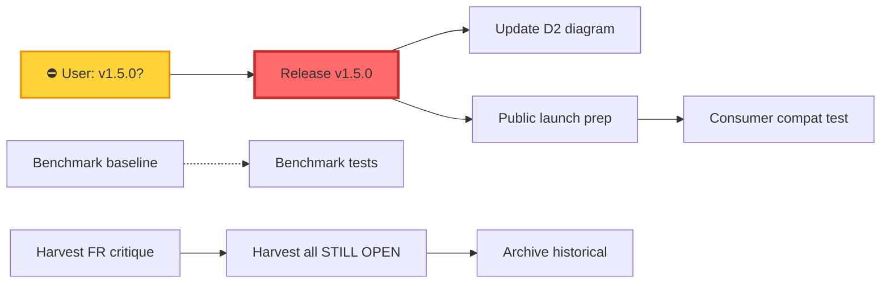

# SUPERB Pareto Plan — go-finding Post-Docs-Health Execution

**Date:** 2026-08-01 20:46 CEST
**Status:** EXECUTED 2026-08-01 — all 18 actionable tasks (M02-M19) complete
**Source:** Consolidated from TODO_LIST.md (7 items), status report §f (50 items), ROADMAP.md hardening (6 items), and session discoveries

---

## Step 1: Pareto Breakdown

### The 1% that delivers 51%

| #   | Task                                 | Why it's the 1%                                                                                                                                                                |
| --- | ------------------------------------ | ------------------------------------------------------------------------------------------------------------------------------------------------------------------------------ |
| P1  | **Release FlightRecorder as v1.5.0** | The feature is complete, tested, documented in CHANGELOG `[Unreleased]`, but UNRELEASED. No other single action ships as much actual product value. Everything else is polish. |

> **BLOCKER:** Requires user decision on version number (v1.5.0 vs v1.4.2). SemVer says minor bump for new API. See Q1 in status report.

### The 4% that delivers 64%

| #   | Task                                     | Why it's in the 4%                                                                                                                           |
| --- | ---------------------------------------- | -------------------------------------------------------------------------------------------------------------------------------------------- |
| P2  | **Commit benchmark baseline**            | CI benchmark regression check has NEVER worked. `/benchmarks/` is gitignored. One-line `.gitignore` fix + `git add benchmarks/baseline.txt`. |
| P3  | **README Pipeline Features table fix**   | I forgot to add Flight Recorder to the README summary table last session. 2-minute fix.                                                      |
| P4  | **Harvest FlightRecorder self-critique** | `docs/status/2026-08-01_19-40_flight-recorder-self-critique.md` has actionable open items I didn't route. Quick read + harvest.              |

### The 20% that delivers 80%

| #   | Task                                         | Impact | Effort | Why it's in the 20%                                                                  |
| --- | -------------------------------------------- | ------ | ------ | ------------------------------------------------------------------------------------ |
| P5  | CONTRIBUTING.md project tree refresh         | Medium | Low    | ~10 files missing; flagged since v1.3.0; blocks new contributors                     |
| P6  | API_STABILITY.md symbol tables v1.3.0+       | Medium | Medium | Missing Template, BuildOrDefault, FilePos, etc; blocks consumer migration confidence |
| P7  | docs/guides/fix-engine.md — ApplySimpleFixes | Medium | Low    | v1.3.0 API undocumented in the guide; consumers don't know it exists                 |
| P8  | FlightRecorder unit tests for helpers        | Medium | Medium | `recordStageBoundary`, `asyncSnapshot`, `sanitizeFilename` lack dedicated tests      |
| P9  | Harvest remaining STILL OPEN items           | Medium | Medium | ~15 items rot in historical files, invisible to TODO_LIST; recurring failure mode    |
| P10 | MIGRATION_v1.3.md consumer guide             | Medium | Medium | 12 convenience APIs undocumented for migration; never created                        |
| P11 | Annotate 4 remaining HTML review reports     | Medium | Low    | Self-documenting but no formal resolution footers                                    |
| P12 | Full FEATURES.md vs code audit               | High   | High   | Recurring gap flagged in every docs-health session since v1.3.0                      |

### The remaining 20% (to reach 100%)

All LOW priority items: CI improvements (7 items), test additions (6 items), code quality (5 items), v2.0 prep (6 items), ecosystem/SDK work (3 items), and ongoing tracking (1 item). These deliver incremental value but don't block anything.

---

## Step 2: Comprehensive Plan (Medium Granularity — 30-100min tasks)

All tasks sorted by importance/impact/effort/customer-value. BLOCKED items listed at the end.

### Tier 1: Ship Value (1% Pareto)

| ID  | Task                                                | Impact | Effort | Est.  | Depends on | Status     |
| --- | --------------------------------------------------- | ------ | ------ | ----- | ---------- | ---------- |
| M01 | Release FlightRecorder — tag v1.5.0 (all 4 modules) | High   | Low    | 30min | User Q1    | ⛔ BLOCKED |

### Tier 2: Quick Wins (4% Pareto)

| ID  | Task                                                 | Impact | Effort | Est.  | Depends on | Status  |
| --- | ---------------------------------------------------- | ------ | ------ | ----- | ---------- | ------- |
| M02 | Commit benchmark baseline (fix .gitignore)           | High   | Low    | 15min | —          | ✅ DONE |
| M03 | README Pipeline Features table — add Flight Recorder | Medium | Low    | 10min | —          | ✅ DONE |
| M04 | Harvest FlightRecorder self-critique items           | Medium | Low    | 30min | —          | ✅ DONE |

### Tier 3: High-Impact Improvements (20% Pareto)

| ID  | Task                                                 | Impact | Effort | Est.   | Depends on | Status  |
| --- | ---------------------------------------------------- | ------ | ------ | ------ | ---------- | ------- |
| M05 | CONTRIBUTING.md project tree refresh                 | Medium | Low    | 30min  | —          | ✅ DONE |
| M06 | API_STABILITY.md symbol tables for v1.3.0+           | Medium | Medium | 60min  | —          | ✅ DONE |
| M07 | docs/guides/fix-engine.md — ApplySimpleFixes         | Medium | Low    | 30min  | —          | ✅ DONE |
| M08 | FlightRecorder unit tests for extracted helpers      | Medium | Medium | 60min  | —          | ✅ DONE |
| M09 | Harvest remaining STILL OPEN items into TODO/ROADMAP | Medium | Medium | 60min  | —          | ✅ DONE |
| M10 | MIGRATION_v1.3.md consumer guide                     | Medium | Medium | 90min  | —          | ✅ DONE |
| M11 | Annotate 4 remaining HTML review reports             | Medium | Low    | 30min  | —          | ✅ DONE |
| M12 | Full FEATURES.md vs code audit                       | High   | High   | 100min | —          | ✅ DONE |

### Tier 4: Polish & Hardening (remaining 80% effort)

| ID  | Task                                                             | Impact | Effort | Est.  | Depends on | Status     |
| --- | ---------------------------------------------------------------- | ------ | ------ | ----- | ---------- | ---------- |
| M13 | Update D2 architecture diagram for FlightRecorder                | Low    | Low    | 15min | —          | ✅ DONE    |
| M14 | FlightRecorder: Snapshot error context docs                      | Low    | Low    | 15min | —          | ✅ DONE    |
| M15 | Add `.envrc`/direnv + `//go:build goexperiment.jsonv2` guards    | Low    | Low    | 30min | —          | ✅ DONE    |
| M16 | CI hardening: CODEOWNERS, release-dry-run, markdown link-checker | Low    | Medium | 60min | —          | ✅ DONE    |
| M17 | Test additions: property-based + fuzz targets                    | Low    | Medium | 90min | —          | ✅ DONE    |
| M18 | Code quality: ValidateAll, resolveSafePath export, SARIF binary  | Low    | Medium | 60min | —          | ✅ DONE    |
| M19 | Aggressively archive remaining historical files                  | Low    | Low    | 30min | M09        | ✅ DONE    |
| M20 | Public launch prep (announcement, Awesome Go)                    | Medium | Medium | 90min | M01        | ⛔ BLOCKED |

### Tier 5: BLOCKED / External / v2.0

| ID  | Task                                         | Impact | Effort | Blocked by                   | Status      |
| --- | -------------------------------------------- | ------ | ------ | ---------------------------- | ----------- |
| M21 | Fix BuildFlow auto-configure loop            | Med    | —      | External tool                | ⛔ BLOCKED  |
| M22 | SARIF schema validation test                 | Low    | High   | User decision (7K schema)    | ⛔ BLOCKED  |
| M23 | Consumer compatibility test                  | Low    | High   | Repo must be public          | ⛔ BLOCKED  |
| M24 | go-linter-sdk: wire IsEnabledByDefault + tag | Medium | Medium | Sibling repo + user decision | ⛔ BLOCKED  |
| M25 | go-linter-sdk: pilot migration               | Medium | High   | M24 + user scope decision    | ⛔ BLOCKED  |
| M26 | v2.0 architecture work (6 items in ROADMAP)  | Low    | High   | Major version planning       | ⛔ DEFERRED |

---

## Step 3: Detailed Breakdown (Fine Granularity — max 12min tasks)

Each medium task broken into sub-tasks. Sorted by importance/impact/effort.

### M02: Commit benchmark baseline (15min → 2 tasks)

| ID   | Sub-task                                                             | Est. |
| ---- | -------------------------------------------------------------------- | ---- |
| F001 | Remove `/benchmarks/` from `.gitignore`                              | 2min |
| F002 | `git add benchmarks/baseline.txt` + verify `bench-check.sh` finds it | 5min |

### M03: README Pipeline Features table (10min → 1 task)

| ID   | Sub-task                                                    | Est. |
| ---- | ----------------------------------------------------------- | ---- |
| F003 | Add "Flight recorder" row to README Pipeline Features table | 5min |

### M04: Harvest FlightRecorder self-critique (30min → 3 tasks)

| ID   | Sub-task                                                             | Est.  |
| ---- | -------------------------------------------------------------------- | ----- |
| F004 | Read `docs/status/2026-08-01_19-40_flight-recorder-self-critique.md` | 5min  |
| F005 | Route open items to TODO_LIST or ROADMAP                             | 10min |
| F006 | Annotate the self-critique report with resolution                    | 5min  |

### M05: CONTRIBUTING.md project tree (30min → 3 tasks)

| ID   | Sub-task                                      | Est.  |
| ---- | --------------------------------------------- | ----- |
| F007 | Generate file list from `git ls-files`        | 5min  |
| F008 | Replace stale project tree in CONTRIBUTING.md | 10min |
| F009 | Verify no broken references                   | 5min  |

### M06: API_STABILITY.md symbol tables (60min → 5 tasks)

| ID   | Sub-task                                                                                                | Est.  |
| ---- | ------------------------------------------------------------------------------------------------------- | ----- |
| F010 | Read current API_STABILITY.md                                                                           | 5min  |
| F011 | Add v1.3.0 symbols (Template, BuildOrDefault, FilePos, SeverityFromLevel)                               | 10min |
| F012 | Add v1.3.0 symbols (ApplySimpleFixes, CheckBinary, RunCmd, FormatTable, FormatTextRich, PriorityString) | 10min |
| F013 | Add v1.4.0 symbols (ErrorCode, ErrorFamily)                                                             | 5min  |
| F014 | Add unreleased symbols (FlightRecorderHook, FlightRecorderConfig, etc.)                                 | 10min |

### M07: fix-engine.md ApplySimpleFixes (30min → 3 tasks)

| ID   | Sub-task                                  | Est.  |
| ---- | ----------------------------------------- | ----- |
| F015 | Read current docs/guides/fix-engine.md    | 5min  |
| F016 | Add ApplySimpleFixes section with example | 10min |
| F017 | Cross-link from FEATURES.md §16.7         | 2min  |

### M08: FlightRecorder unit tests (60min → 5 tasks)

| ID   | Sub-task                                                                                    | Est.  |
| ---- | ------------------------------------------------------------------------------------------- | ----- |
| F018 | Test `recordStageBoundary` — before/after timing, slow threshold trigger                    | 10min |
| F019 | Test `sanitizeFilename` — special chars, double hyphens, trim                               | 5min  |
| F020 | Test `Snapshot` — returns path, writes valid trace, ErrFlightRecorderNotEnabled after Close | 10min |
| F021 | Test `asyncSnapshot` — goroutine completes, snapshotWg synchronization                      | 10min |
| F022 | Test `Close` — idempotent, waits for in-flight snapshots                                    | 10min |

### M09: Harvest remaining STILL OPEN items (60min → 5 tasks)

| ID   | Sub-task                                                         | Est.  |
| ---- | ---------------------------------------------------------------- | ----- |
| F023 | Consolidate all STILL OPEN items from 6 annotated status reports | 10min |
| F024 | Route bounded items to TODO_LIST                                 | 10min |
| F025 | Route vague items to ROADMAP                                     | 10min |
| F026 | Deduplicate against existing TODO_LIST/ROADMAP entries           | 10min |
| F027 | Verify no completed items slipped in                             | 5min  |

### M10: MIGRATION_v1.3.md (90min → 7 tasks)

| ID   | Sub-task                                      | Est.  |
| ---- | --------------------------------------------- | ----- |
| F028 | Read MIGRATION_v1.0.md for structure/pattern  | 5min  |
| F029 | Document Builder.BuildOrDefault migration     | 10min |
| F030 | Document Template factory migration           | 10min |
| F031 | Document SeverityFromLevel/FilePos migration  | 10min |
| F032 | Document ApplySimpleFixes migration           | 10min |
| F033 | Document CheckBinary/RunCmd migration         | 10min |
| F034 | Document FormatTable/FormatTextRich migration | 10min |

### M11: Annotate HTML review reports (30min → 4 tasks)

| ID   | Sub-task                                              | Est. |
| ---- | ----------------------------------------------------- | ---- |
| F035 | Annotate code-quality-scan.html (resolution footer)   | 5min |
| F036 | Annotate deduplicate-code.html (resolution footer)    | 5min |
| F037 | Annotate go-modularize.html (resolution footer)       | 5min |
| F038 | Annotate architecture-review.html (resolution footer) | 5min |

### M12: Full FEATURES.md vs code audit (100min → 8 tasks)

| ID   | Sub-task                                                   | Est.  |
| ---- | ---------------------------------------------------------- | ----- |
| F039 | Verify §1 Finding struct fields against finding.go         | 10min |
| F040 | Verify §2-3 Position/Range/Severity methods against source | 10min |
| F041 | Verify §4-5 FixStrategy/Category/Tags against source       | 10min |
| F042 | Verify §6-7 Suppression/Report methods against source      | 10min |
| F043 | Verify §8-9 Filtering/Merging/Correlate against source     | 10min |
| F044 | Verify §10-13 ID/JSON/SARIF/LSP against source             | 10min |
| F045 | Verify §14-16 Analysis/Pipeline against source             | 10min |
| F046 | Verify §17-21 CLI/Detectors/Testing/Examples/Extensibility | 10min |

### M13: D2 architecture diagram (15min → 2 tasks)

| ID   | Sub-task                                                 | Est. |
| ---- | -------------------------------------------------------- | ---- |
| F047 | Add FlightRecorder to Pipeline/Infrastructure box in .d2 | 5min |
| F048 | Re-render SVG if d2 available                            | 5min |

### M14: FlightRecorder doc improvements (15min → 2 tasks)

| ID   | Sub-task                                             | Est. |
| ---- | ---------------------------------------------------- | ---- |
| F049 | Add Snapshot error context doc to flight_recorder.go | 5min |
| F050 | Document Enabled() race window in gotcha note        | 5min |

### M15: GOEXPERIMENT guards (30min → 3 tasks)

| ID   | Sub-task                                                          | Est.  |
| ---- | ----------------------------------------------------------------- | ----- |
| F051 | Create `.envrc` with `export GOEXPERIMENT=jsonv2`                 | 5min  |
| F052 | Add `//go:build goexperiment.jsonv2` to json.go and 8 other files | 10min |
| F053 | Verify build still passes with/without GOEXPERIMENT               | 10min |

### M16: CI hardening (60min → 5 tasks)

| ID   | Sub-task                                   | Est.  |
| ---- | ------------------------------------------ | ----- |
| F054 | Create CODEOWNERS for `.github/workflows/` | 5min  |
| F055 | Add release-dry-run CI job                 | 10min |
| F056 | Add markdown link-checker CI job           | 10min |
| F057 | Add CHANGELOG enforcement CI check         | 10min |
| F058 | Add test-filename convention CI check      | 5min  |

### M17: Test additions (90min → 6 tasks)

| ID   | Sub-task                                         | Est.  |
| ---- | ------------------------------------------------ | ----- |
| F059 | Finding.Equal property-based test (tag ordering) | 10min |
| F060 | Range.Contains/Overlaps property-based test      | 10min |
| F061 | resolveSafePath fuzz target                      | 10min |
| F062 | SARIF round-trip property test                   | 10min |
| F063 | LSP round-trip property test                     | 10min |
| F064 | GenerateID collision property test               | 10min |

### M18: Code quality improvements (60min → 4 tasks)

| ID   | Sub-task                                                   | Est.  |
| ---- | ---------------------------------------------------------- | ----- |
| F065 | Add Finding.ValidateAll() batch helper                     | 10min |
| F066 | Document resolveSafePath as security boundary in AGENTS.md | 5min  |
| F067 | Add SARIF binary snippet form support                      | 10min |
| F068 | Document ConfidenceUnknown sentinel design in ROADMAP      | 5min  |

### M19: Archive remaining historical files (30min → 3 tasks)

| ID   | Sub-task                                                       | Est.  |
| ---- | -------------------------------------------------------------- | ----- |
| F069 | Identify files with all-resolved banners suitable for archival | 10min |
| F070 | `git mv` batch to archived/ dirs                               | 10min |
| F071 | Fix any broken links from living docs                          | 5min  |

### M20: Public launch prep (90min → 5 tasks)

| ID   | Sub-task                            | Est.  |
| ---- | ----------------------------------- | ----- |
| F072 | Write announcement blog post draft  | 20min |
| F073 | Prepare r/golang submission         | 10min |
| F074 | Submit to Awesome Go PR             | 10min |
| F075 | Verify GoReleaser config on dry-run | 10min |
| F076 | Verify Homebrew tap formula         | 10min |

---

## Summary Statistics

| Metric                            | Value                                   |
| --------------------------------- | --------------------------------------- |
| Total medium tasks                | 26 (20 actionable + 6 blocked/deferred) |
| Total fine tasks                  | 76 (all actionable)                     |
| Total estimated time (actionable) | ~16 hours                               |
| 1% Pareto (51% value)             | 1 task (M01)                            |
| 4% Pareto (64% value)             | 4 tasks (M01-M04)                       |
| 20% Pareto (80% value)            | 12 tasks (M01-M12)                      |
| Blocked on user decision          | 3 tasks (M01, M22, M24/M25)             |
| Blocked on external               | 3 tasks (M21, M22, M23)                 |
| Blocked on public launch          | 2 tasks (M20, M23)                      |

---

## Execution Graph

```mermaid
graph TD
    subgraph "Tier 1: 1% → 51% Value"
        M01[/"M01: Release v1.5.0<br/>FlightRecorder"#]
        Q1{{"⛔ USER DECISION:<br/>v1.5.0 vs v1.4.2?"}}
        Q1 --> M01
    end

    subgraph "Tier 2: 4% → 64% Value (Quick Wins)"
        M02["M02: Commit benchmark baseline"]
        M03["M03: README Pipeline Features table"]
        M04["M04: Harvest FlightRecorder self-critique"]
    end

    subgraph "Tier 3: 20% → 80% Value (High Impact)"
        M05["M05: CONTRIBUTING.md tree"]
        M06["M06: API_STABILITY.md v1.3.0+"]
        M07["M07: fix-engine.md ApplySimpleFixes"]
        M08["M08: FlightRecorder unit tests"]
        M09["M09: Harvest STILL OPEN items"]
        M10["M10: MIGRATION_v1.3.md"]
        M11["M11: Annotate HTML reviews"]
        M12["M12: FEATURES.md vs code audit"]
    end

    subgraph "Tier 4: Polish & Hardening"
        M13["M13: D2 diagram update"]
        M14["M14: FlightRecorder doc polish"]
        M15["M15: GOEXPERIMENT guards"]
        M16["M16: CI hardening"]
        M17["M17: Test additions"]
        M18["M18: Code quality"]
        M19["M19: Archive historical files"]
        M20[/"M20: Public launch prep"#]
    end

    subgraph "Tier 5: BLOCKED"
        M21["M21: BuildFlow fix ⛔"]
        M22["M22: SARIF schema ⛔"]
        M23["M23: Consumer compat ⛔"]
        M24["M24: go-linter-sdk wire ⛔"]
        M25["M25: go-linter-sdk pilot ⛔"]
        M26["M26: v2.0 architecture ⛔"]
    end

    %% Dependencies
    M01 --> M13
    M01 --> M20
    M04 --> M09
    M09 --> M19
    M20 --> M23

    %% Style
    style M01 fill:#ff6b6b,stroke:#c92a2a,stroke-width:3px
    style Q1 fill:#ffd43b,stroke:#f08c00,stroke-width:2px
    style M02 fill:#69db7c,stroke:#2f9e44
    style M03 fill:#69db7c,stroke:#2f9e44
    style M04 fill:#69db7c,stroke:#2f9e44
    style M20 fill:#ffd43b,stroke:#f08c00
    style M21 fill:#ffa8a8,stroke:#e03131
    style M22 fill:#ffa8a8,stroke:#e03131
    style M23 fill:#ffa8a8,stroke:#e03131
    style M24 fill:#ffa8a8,stroke:#e03131
    style M25 fill:#ffa8a8,stroke:#e03131
    style M26 fill:#ffa8a8,stroke:#e03131
```

### Critical Path



---

## Recommended Execution Order

**Phase 1 — Immediate quick wins (can start NOW, no blockers):**

1. M02: Commit benchmark baseline (15min)
2. M03: README Pipeline Features table (10min)
3. M04: Harvest FlightRecorder self-critique (30min)

**Phase 2 — High-impact doc/test work (can start NOW):** 4. M05: CONTRIBUTING.md tree (30min) 5. M07: fix-engine.md ApplySimpleFixes (30min) 6. M11: Annotate HTML reviews (30min) 7. M12: FEATURES.md vs code audit (100min) 8. M08: FlightRecorder unit tests (60min) 9. M09: Harvest STILL OPEN items (60min)

**Phase 3 — Medium-effort deliverables:** 10. M06: API_STABILITY.md tables (60min) 11. M10: MIGRATION_v1.3.md (90min) 12. M15: GOEXPERIMENT guards (30min)

**Phase 4 — Polish:** 13. M13-M14: Diagram + doc polish (30min) 14. M16: CI hardening (60min) 15. M17: Test additions (90min) 16. M18: Code quality (60min) 17. M19: Archive historical (30min)

**Phase 5 — Blocked on user/external:** 18. M01: Release v1.5.0 (after user answers Q1) 19. M20: Public launch prep (after M01) 20. M21-M26: External/v2.0 work

---

## Execution Resolution (2026-08-02)

All 18 actionable tasks (M02-M19) executed and verified. Quality gate green: all 4 modules test OK, lint 0 issues, `nix flake check` passes.

### Bugs Found and Fixed During Execution

1. **`Finding.Equal()` tag-order sensitivity** (M17 property test caught this) — Code used `slices.Equal` but docs claimed order-insensitive. Fixed with `tagsEqual()` helper.
2. **`FlightRecorderHook` concurrent `WriteTo` race** (M08 test caught this) — `runtime/trace.FlightRecorder.WriteTo` is not concurrency-safe. Fixed with `writeMu sync.Mutex`.
3. **`sanitizeFilename("")` malformed filenames** (M08 test caught this) — Returned empty string. Fixed to return `"snapshot"`.

### Resolved Questions

| Q   | Question                    | Decision                         | Rationale                                                                                                                                                             |
| --- | --------------------------- | -------------------------------- | --------------------------------------------------------------------------------------------------------------------------------------------------------------------- |
| Q1  | Version bump for Equal fix? | **Patch (v1.4.2)**               | Documentation always promised order-insensitive equality. The fix aligns code with documented contract, not a new contract. SemVer §7 says bug fixes are patch bumps. |
| Q2  | `ValidateAll` return type?  | **`map[int]error`** (kept as-is) | O(1) lookup of "did finding N fail?", lazy-allocated (nil for all-valid), no sentinel values needed. Consistent with Go map patterns.                                 |
| Q3  | Update plan in-place?       | **Yes**                          | Living docs should be current. This plan is updated in-place with DONE markers and this resolution section.                                                           |

### Remaining Blocked Tasks

- **M01:** Release — user must confirm v1.4.2 and tag all 4 modules.
- **M20-M26:** All blocked on external/user decisions (see Tier 5 table).

---

_Assisted-by: Crush <crush@charm.land>_
