# Consumer API Improvement Plan: go-finding → go-linter-sdk → go-humanize-linter

**Date:** 2026-08-08 10:55
**Goal:** Make go-humanize-linter do the same (or more) with less code by improving go-finding and go-linter-sdk.

---

## Pareto Breakdown

### The 1% that delivers 51%

**`RuleFunc.NewFinding(msg, pos) *Builder`** in go-linter-sdk. Pre-fills rule ID, tool name, severity, and category from RuleMeta into a returned builder. Every rule in go-humanize-linter repeats these 4 fields in every `NewBuilder` call. This single method eliminates the most boilerplate.

### The 4% that delivers 64%

1. The above `NewFinding` factory
2. `ToolName` field on `RuleMeta` (so `NewFinding` has the tool name)
3. `Registry.WithToolName()` (so the tool name flows into Report metadata)
4. Refactor go-humanize-linter to use all three

### The 20% that delivers 80%

All code changes across all 3 repos:

- go-finding: Polish (CHANGELOG, lint, examples) — API changes already done
- go-linter-sdk: 5 new APIs (NewFinding, ToolName, Filter, ExitCodeByConfidence, IsEnabledByDefault docs)
- go-humanize-linter: 6 deletions (confidence.go, makeFindingWithConfidence, buildRegistry, filterRules, exitCodeFromReport, findingToTokenPos)

### The other 20% (to reach 100%)

Lint verification, benchmark checks, version tagging, docs updates across all repos.

---

## Execution Graph

```mermaid
graph TD
    subgraph "Phase 1: go-finding Polish"
        A1[Run lint on new code] --> A2[Add CHANGELOG entry]
        A2 --> A3[Add examples to example_test.go]
        A3 --> A4[Update doc.go prose]
    end

    subgraph "Phase 2: go-linter-sdk Improvements"
        B1[Add ToolName to RuleMeta] --> B2[Add RuleFunc.NewFinding factory]
        B2 --> B3[Add Registry.WithToolName option]
        B3 --> B4[Add FilterRules helper]
        B4 --> B5[Add ExitCodeByConfidence]
        B5 --> B6[Document IsEnabledByDefault as metadata-only]
        B6 --> B7[Write tests for all 5 additions]
    end

    subgraph "Phase 3: go-humanize-linter Refactor"
        C1[Bump go.mod deps] --> C2[Delete confidence.go → ParseConfidence]
        C2 --> C3[Delete makeFindingWithConfidence → Template.Builder]
        C3 --> C4[Add ToolName to all RuleMeta]
        C4 --> C5[Use RuleFunc.NewFinding in rules]
        C5 --> C6[Delete buildRegistry + filterRules → SDK Filter]
        C6 --> C7[Delete exitCodeFromReport → SDK ExitCodeByConfidence]
        C7 --> C8[Replace findingToTokenPos → gotoken.LineColToPos]
    end

    subgraph "Phase 4: Verify & Ship"
        D1[Run tests in all 3 repos] --> D2[Run lint in all 3 repos]
        D2 --> D3[Update CHANGELOGs]
        D3 --> D4[Commit and push all repos]
    end

    A4 --> B1
    B7 --> C1
    C8 --> D1
```



---

## Phase 1: go-finding Polish (30 min)

These tasks are for the go-finding changes already implemented (`ParseConfidence`, `Template.Builder`).

| #   | Task                                                                      | Impact | Effort | Status  |
| --- | ------------------------------------------------------------------------- | ------ | ------ | ------- |
| 1.1 | Run `golangci-lint run ./...` on go-finding                               | Medium | 5 min  | Pending |
| 1.2 | Add `[Unreleased]` CHANGELOG entry for ParseConfidence + Template.Builder | Medium | 5 min  | Pending |
| 1.3 | Add ParseConfidence + Template.Builder examples to `example_test.go`      | Low    | 10 min | Pending |
| 1.4 | Update `doc.go` Confidence prose to mention String/ParseConfidence        | Low    | 5 min  | Pending |

## Phase 2: go-linter-sdk Improvements (90 min)

| #   | Task                                                                          | Impact  | Effort | Status  |
| --- | ----------------------------------------------------------------------------- | ------- | ------ | ------- |
| 2.1 | Add `ToolName finding.ToolName` to `RuleMeta`                                 | HIGH    | 5 min  | Pending |
| 2.2 | Add `RuleFunc.NewFinding(msg, pos) *finding.Builder`                          | HIGHEST | 10 min | Pending |
| 2.3 | Add `WithToolName(name)` option to `NewRegistry` + stamp on Register          | HIGH    | 15 min | Pending |
| 2.4 | Add `FilterRules(all []RuleFunc, enable, disable map[string]bool) []RuleFunc` | Medium  | 10 min | Pending |
| 2.5 | Add `ExitCodeByConfidence(report, threshold) int`                             | Medium  | 10 min | Pending |
| 2.6 | Document `IsEnabledByDefault` as metadata-only (godoc)                        | Low     | 5 min  | Pending |
| 2.7 | Write tests for all additions                                                 | HIGH    | 30 min | Pending |
| 2.8 | Update SDK examples to show new patterns                                      | Low     | 5 min  | Pending |

## Phase 3: go-humanize-linter Refactor (90 min)

| #   | Task                                                            | Impact       | Effort | Status  |
| --- | --------------------------------------------------------------- | ------------ | ------ | ------- |
| 3.1 | Add `replace` directives for local go-finding + go-linter-sdk   | Prerequisite | 5 min  | Pending |
| 3.2 | Delete `confidence.go` → `finding.ParseConfidence`              | Medium       | 10 min | Pending |
| 3.3 | Delete `makeFindingWithConfidence` → `finding.Template.Builder` | HIGH         | 15 min | Pending |
| 3.4 | Add `ToolName` to all 9 `RuleMeta` literals + use `NewFinding`  | HIGH         | 20 min | Pending |
| 3.5 | Delete `buildRegistry` + `filterRules` → `linter.FilterRules`   | Medium       | 15 min | Pending |
| 3.6 | Delete `exitCodeFromReport` → `linter.ExitCodeByConfidence`     | Medium       | 10 min | Pending |
| 3.7 | Replace `findingToTokenPos` → `gotoken.LineColToPos`            | Low          | 10 min | Pending |
| 3.8 | Run tests and fix any regressions                               | HIGH         | 15 min | Pending |

## Phase 4: Verify & Ship (30 min)

| #   | Task                                             | Impact   | Effort | Status  |
| --- | ------------------------------------------------ | -------- | ------ | ------- |
| 4.1 | Run full test suites in all 3 repos              | HIGH     | 10 min | Pending |
| 4.2 | Commit and push all repos                        | HIGH     | 10 min | Pending |
| 4.3 | Verify no Verschlimmbesserung (things got worse) | CRITICAL | 10 min | Pending |

---

## 12-Minute Task Breakdown

Each task below is ≤12 min of focused work.

### Phase 1 (go-finding)

| ID   | Task                                                                         | Est   |
| ---- | ---------------------------------------------------------------------------- | ----- |
| 1.1a | Run `golangci-lint run ./...`                                                | 3 min |
| 1.1b | Fix any lint issues found                                                    | 5 min |
| 1.2  | Add CHANGELOG `[Unreleased]` section with ParseConfidence + Template.Builder | 5 min |
| 1.3a | Write ParseConfidence example in example_test.go                             | 5 min |
| 1.3b | Write Template.Builder example in example_test.go                            | 5 min |
| 1.4  | Update doc.go confidence prose                                               | 3 min |

### Phase 2 (go-linter-sdk)

| ID   | Task                                                                 | Est    |
| ---- | -------------------------------------------------------------------- | ------ |
| 2.1  | Add `ToolName finding.ToolName` field to RuleMeta struct             | 3 min  |
| 2.2  | Implement `RuleFunc.NewFinding(msg, pos) *finding.Builder`           | 8 min  |
| 2.3a | Add `RegistryOption` type + `WithToolName` option                    | 5 min  |
| 2.3b | Update `NewRegistry` to accept options + stamp tool name on Register | 8 min  |
| 2.3c | Update `Registry.Run` to use registry tool name for Report           | 5 min  |
| 2.4  | Implement `FilterRules` standalone function                          | 5 min  |
| 2.5  | Implement `ExitCodeByConfidence`                                     | 5 min  |
| 2.6  | Update godoc on `IsEnabledByDefault` to document metadata-only       | 3 min  |
| 2.7a | Write tests for NewFinding + ToolName                                | 10 min |
| 2.7b | Write tests for FilterRules + ExitCodeByConfidence                   | 10 min |
| 2.8  | Update example linters to show NewFinding                            | 5 min  |

### Phase 3 (go-humanize-linter)

| ID   | Task                                                                   | Est    |
| ---- | ---------------------------------------------------------------------- | ------ |
| 3.1  | Add replace directives in go.mod for local deps                        | 5 min  |
| 3.2  | Delete confidence.go, replace all ParseConfidenceLevel calls           | 8 min  |
| 3.3  | Replace makeFindingWithConfidence with Template.Builder pattern        | 10 min |
| 3.4a | Add ToolName to all 9 RuleMeta literals                                | 8 min  |
| 3.4b | Switch builder calls in rules to use NewFinding where possible         | 10 min |
| 3.5a | Replace buildRegistry with linter.FilterRules in main.go               | 8 min  |
| 3.5b | Replace filterRules with linter.FilterRules in plugin.go               | 8 min  |
| 3.6  | Replace exitCodeFromReport with linter.ExitCodeByConfidence in main.go | 8 min  |
| 3.7  | Replace findingToTokenPos with gotoken.LineColToPos in plugin.go       | 10 min |
| 3.8  | Run tests, fix regressions                                             | 10 min |

### Phase 4 (Verify & Ship)

| ID   | Task                                        | Est    |
| ---- | ------------------------------------------- | ------ |
| 4.1a | Run go-finding tests                        | 3 min  |
| 4.1b | Run go-linter-sdk tests                     | 3 min  |
| 4.1c | Run go-humanize-linter tests                | 5 min  |
| 4.2a | Commit go-finding                           | 3 min  |
| 4.2b | Commit go-linter-sdk                        | 3 min  |
| 4.2c | Commit go-humanize-linter                   | 3 min  |
| 4.3  | Final diff review — did anything get worse? | 10 min |

---

## API Design Decisions

### RuleMeta.ToolName (additive, backward compatible)

```go
type RuleMeta struct {
    ID          string
    Name        string
    Description string
    Cat         Category
    Sev         finding.Severity
    ToolName    finding.ToolName  // NEW — empty = fallback to "linter"
}
```

### RuleFunc.NewFinding

```go
func (r RuleFunc) NewFinding(message string, pos finding.Position) *finding.Builder {
    tool := r.Meta.ToolName
    if tool == "" {
        tool = "linter"
    }
    return finding.NewBuilder(
        finding.RuleName(r.Meta.ID),
        tool,
        message,
        r.Meta.Sev,
        pos,
    ).WithCategory(finding.Category(r.Meta.Cat))
}
```

### Registry.WithToolName

```go
func WithToolName(name string) RegistryOption {
    return func(r *Registry) { r.toolName = finding.ToolName(name) }
}
```

Register auto-stamps ToolName onto RuleFunc rules if registry has one and rule doesn't.

### FilterRules

```go
func FilterRules(all []RuleFunc, enable, disable map[string]bool) []RuleFunc
```

### ExitCodeByConfidence

```go
func ExitCodeByConfidence(report *finding.Report, threshold finding.Confidence) int
```

Returns 0 if clean, 1 if any finding at/above threshold, 2 if only below-threshold findings.

---

## Verschlimmbesserung Guardrails

- **Never change existing method signatures** — all additions are new methods/functions
- **Never remove existing behavior** — ToolName defaults to empty → "linter" fallback
- **Run tests after EVERY change** — not at the end
- **If a refactor makes code longer, revert it** — the goal is LESS code
- **Don't touch code I don't understand** — suppression parsing, pattern detection stay as-is
