# Pareto Master Plan: Quality Gates, Distribution, v1.7.0 — and the Long Tail

**Date:** 2026-09-08 04:12 CEST
**Scope:** ALL known TODOs — `TODO_LIST.md`, session findings (status report `docs/status/2026-09-07_23-55_feedback-gaps-issues-27-28-status.md`), "pushed too long" analysis, and ROADMAP deferred items.
**Method:** Pareto (1% → 51%, 4% → 64%, 20% → 80%, remaining 80% → 100%), then two granularity levels (30–100 min tasks; ≤12 min subtasks).

> Format note: the pareto-planning skill's canonical output is styled HTML. The user explicitly requested Markdown + mermaid/d2 — honored here; not propagated back into the skill.

---

## 0.1 Execution Findings (2026-09-08 05:xx CEST, L1-03 complete)

| Finding | Evidence | Resolution |
|---|---|---|
| **CI workflow was `disabled_manually`, not just billing-blocked** | `gh api .../actions/workflows` → ci.yml state `disabled_manually` | Re-enabled via `gh workflow enable ci.yml` (commit `722b0d9`). |
| **Billing broke AGAIN after a brief working window** | Release run 31125816682 (2026-08-06): `test` job PASSED in 2m53s — Actions worked that day. Fresh CI run 34182192491 (2026-09-08): every job failed in seconds with "job was not started because recent account payments have failed or your spending limit needs to be increased" | **L1-01 remains USER-OWNED and is THE blocker.** Nothing else in Phase 0/A is verifiable until billing is settled. |
| **v1.5.0 release failure root cause = cosign v3 signing, not a 4h hang** | `--log-failed`: GoReleaser `signs:` used cosign v2 flags `--output-certificate`/`--output-signature` (+ explicit oidc-issuer); cosign v3 (installed by cosign-installer v4) rejects the combination: "cannot specify service URLs and use signing config". All builds/SBOMs/checksums had already succeeded (2m22s into the release step); the 4h08m run total includes a ~3.5h queue/wait tail. | Fixed in commit `722b0d9`: `.goreleaser.yml` now uses the cosign v3 bundle format (`sign-blob --bundle=${signature} --yes` + `signature: "${artifact}.sigstore.json"`), per GoReleaser's cosign v3 migration note. |
| **v1.6.0 tags produced no Release run because the workflows were disabled/ billing-dead at push time (2026-08-08)** — the tagged commit has no `[skip ci]` | `git log -1 8fbd332` (clean message); release.yml `on.push.tags` patterns match all 4 tags; zero runs exist for them | Added `workflow_dispatch:` to release.yml; when D6=backfill is chosen, re-run with `gh workflow run release.yml --ref v1.6.0` (also possible per sub-module tag). Same trigger added to ci.yml so CI can be started manually without code churn. |
| Dependabot is ALIVE and noisy (PR bumps + dynamic updates failing/succeeding daily) | `gh run list` shows Dependabot Updates entries on 2026-09-06/08 | Dependabot PRs will pile up while CI is dead; don't merge any until L1-02 green. |

**Net effect on the plan:** L1-03 DONE (diagnosis + mechanical fixes shipped). L1-01/02 frozen on user billing action. All CI-dependent verification (L1-02, L1-08 observation, release re-runs L1-05/06/11) queues behind it. Local work (benchmarks, lint debt, Phase-B tests, docs) proceeds.

---

## 0. Research Findings (root causes discovered this session)

| Finding | Evidence | Consequence for the plan |
|---|---|---|
| **CI is dead because of GitHub Actions BILLING**, not YAML | `gh run view 29539788627`: every job `X in 2s` — "The job was not started because recent account payments have failed or your spending limit needs to be increased" (since 2026-07-16) | The #1 fix is a **billing/spending-limit action (user-owned)**, not a code fix. Everything gated on CI is frozen behind it. |
| **v1.5.0 release FAILED after 4h08m**; v1.6.0 has **no release run at all**; `v1.4.0` is still "Latest" | `gh run list --workflow=release.yml`; `gh release view v1.6.0` → "release not found" | Release pipeline needs diagnosis (4h = hang/timeout pattern) + a strategy decision (backfill vs forward-only). |
| dprint `--no-verify` bypass since 2026-05-21 (109 days) | `git log -S "no-verify" -- TODO_LIST.md` | Commit gate decorative; devShell packaging task. |
| Lint debt (6 pipeline + 18 CLI) invisible because CI lints root only | TODO_LIST + commit `4809b49` (2026-08-08) | Lint matrix + debt fixes are cheap once billing is fixed. |
| Indirect dep bumps (x/mod, x/net, x/text, x/tools) landed via auto-commits | commit `c04af34` | Needs a confirm-or-revert decision task. |
| `go-arch-lint check` passes locally (ran this session) | session run: "OK - No warnings found" | TODO_LIST row "never run locally" is now DONE — harvest/cleanup task. |

---

## 1. Pareto Breakdown

Universe: **49 Level-1 tasks** (~50 h) across 6 phases + 7 user decisions + 2 blocked items.

### 🔑 The 1% that delivers 51% — 1 task (~30 min)

| ID | Task | Why it is 51% |
|---|---|---|
| **L1-01** | **Fix GitHub Actions billing/spending limit (USER ACTION), then re-run CI on master** (incl. L1-02 verification) | Every quality gate (test, lint, race, govulncheck, arch-check, structural-checks, docs-freshness, coverage, stress, module-isolation) has been **dark since 2026-07-16**. Nothing merged since can be trusted as "verified". One billing action re-arms the entire safety net — the single highest-leverage act in the repo. |

### 🔑 The 4% that delivers 64% — 2 tasks (~2 h)

| ID | Task | Added value |
|---|---|---|
| L1-01 | (above) | 51% |
| **L1-03** | **Diagnose release.yml failure** (v1.5.0 failed after 4h08m; v1.6.0 never ran) + **L1-04/L1-05 strategy + repair** | Gates verify quality; releases **distribute** it. With releases broken since v1.5.0, consumers cannot get anything newer than v1.4.0 — including this session's issue #27/#28 fixes. Restoring distribution unlocks: GoReleaser binary, Homebrew path, pkg.go.dev, Make-Public launch. |

### 🔑 The 20% that delivers 80% — 11 tasks (~10 h)

L1-01, L1-03/04/05 (above) plus:

| ID | Task | Tier rationale |
|---|---|---|
| L1-07 | dprint into devShell, kill `--no-verify` bypass | Oldest debt (109 d); restores commit-time gate for every future change |
| L1-08 | CI lint matrix (pipeline + CLI) | Makes the lint debt *visible* in CI instead of invisible |
| L1-09 + L1-10 | Fix 6 pipeline + 18 CLI lint issues | Zeroes the debt the matrix will expose; unblocks strict lint gating |
| L1-11 | Post-release verification closure | Converts the month-old silent failures into checked facts |
| L1-14 | Benchmark regression check + `BenchmarkApplyWithOutcomes` | This session's engine rework added allocations on a hot path — unmeasured. Protects every consumer of `--fix` |
| L1-21 | Ship v1.7.0 (version bump, tags, release) | Delivers GroupID + fix outcomes + rollback policy to consumers; requires D1 decision |
| L1-22 | Consumer comms + bump go-humanize-linter / go-linter-sdk | 22 consumers must learn about the rollback default change |
| L1-12 | Run `nix flake check`, fix findings | The documented quality gate "consistently skipped across sessions" — including by me today |

### The remaining 80% of work → 100% (~38 h)

Phases C (docs truthfulness), D (hardening/features), E (ROADMAP design spikes), decisions, and blocked items — tabled below. They matter, but none of them gates trust or distribution.

---

## 2. Level-1 Comprehensive Plan (30–100 min tasks, ALL todos, sorted by impact)

Global sort: importance/impact/effort/customer-value. `D#` = user decision gate. Rank = execution order.

### Phase 0 — UNBLOCK (billing)

| Rank | ID | Task | Min | Depends | Value |
|---|---|---|---|---|---|
| 1 | L1-01 | Fix Actions billing/spending limit (user), re-trigger CI on master | 10+20 | — | 🔥 51% |
| 2 | L1-02 | Verify ALL CI jobs green on master (test, lint, coverage, benchmark, govulncheck, stress, module-isolation, dupl) | 30 | L1-01 | 🔥 |
| 3 | L1-03 | Diagnose `release.yml`: fetch v1.5.0 failed-run logs (4h08m), check GoReleaser multi-module config + timeouts | 60 | — | 🔥 64% |
| 4 | L1-04 | **D6**: Decide release strategy — backfill v1.5.0/v1.6.0 releases vs forward-only v1.7.0 | 30 | L1-03 | High |

### Phase A — Distribution & gates (20% core)

| Rank | ID | Task | Min | Depends | Value |
|---|---|---|---|---|---|
| 5 | L1-05 | Repair release pipeline per L1-03 findings; create v1.6.0 (and/or v1.5.0) releases | 100 | L1-03, L1-04 | 🔥 |
| 6 | L1-06 | Verify GoReleaser CLI binary asset + `HOMEBREW_TAP_GITHUB_TOKEN` secret exists | 30 | L1-05 | Med |
| 7 | L1-07 | Add dprint to flake devShell; remove `--no-verify` bypass; verify hook executes | 60 | — | High (109 d old) |
| 8 | L1-08 | CI lint job matrix for pipeline + CLI modules | 30 | L1-01 | Med |
| 9 | L1-09 | Fix 6 pipeline lint issues (contextcheck, gosec×2, nilnil, revive×2) | 60 | L1-08 | Med |
| 10 | L1-10 | Fix 18 CLI lint issues (dupl, err113×2, exhaustruct, gocognit, goconst×5, gosec×2, nestif×2, varnamelen×2, wrapcheck) | 100 | L1-08 | Med |
| 11 | L1-11 | Post-release verification closure: CI green on all 4 tags, releases exist, binary asset, proxy resolution — write results into TODO_LIST | 30 | L1-05 | High |
| 12 | L1-12 | Run `nix flake check`; fix findings; add to release procedure | 60 | — | Med |
| 13 | L1-13 | Run stress tests (`ginkgo --repeat=20 -race`); make mandatory release gate or remove step | 60 | L1-12 | Med |

### Phase B — v1.7.0 release train (session work: GroupID, outcomes, rollback)

| Rank | ID | Task | Min | Depends | Value |
|---|---|---|---|---|---|
| 14 | L1-14 | Benchmark regression check (`scripts/bench-check.sh`) + add `BenchmarkApplyWithOutcomes`; investigate outcome-bookkeeping allocations | 60 | — | High |
| 15 | L1-15 | **D1→ADR**: rollback policy default (per-file) — write `docs/architecture-decisions.md` entry | 30 | D1 | High |
| 16 | L1-16 | Golden JSON wire tests: `groupId` field, `go-finding/groupId`, `go-finding/lsp-diagnostic-tags` | 60 | — | Med |
| 17 | L1-17 | E2E config test `fixRollbackAllFiles` + `-fix-rollback-all` CLI flag | 60 | — | Med |
| 18 | L1-18 | Rollback-policy tests: context-cancel + backup-failure keep earlier files (default) | 60 | — | Med |
| 19 | L1-19 | Fuzz `ApplyWithOutcomes` + `errors.Is` chain assertions (`ErrPositionUnresolvable`) | 60 | — | Med |
| 20 | L1-20 | Comment on issues #27/#28 with fix links; close per **D2** | 30 | L1-21 (or now) | Med |
| 21 | L1-21 | **v1.7.0 release**: bump version, stamp CHANGELOGs, tag core + 3 sub-modules, push, verify release | 100 | L1-05, L1-14..19 | 🔥 |
| 22 | L1-22 | Consumer comms (rollback default change) + bump go-humanize-linter, go-linter-sdk to v1.7.0 | 60 | L1-21 | High |

### Phase C — Docs truthfulness (80%→100% tail)

| Rank | ID | Task | Min | Depends | Value |
|---|---|---|---|---|---|
| 23 | L1-23 | API_STABILITY.md: add all v1.5.0+ symbols | 60 | — | Med |
| 24 | L1-24 | CONTRIBUTING.md project tree regenerate from `git ls-files` | 30 | — | Low |
| 25 | L1-25 | FEATURES.md vs code full walk (signatures, statuses, defaults) | 100 | — | Med |
| 26 | L1-26 | DOMAIN_LANGUAGE.md: outcome, refused, rollback policy, group, clone group | 30 | — | Low |
| 27 | L1-27 | doc.go overview + README features + usage-guide sections (grouping, outcomes) | 60 | — | Med |
| 28 | L1-28 | Consumer migration guide (Template.Builder, ParseConfidence, ResolveSafePath, outcomes) | 60 | L1-21 | Med |
| 29 | L1-29 | Docs housekeeping: archive 3 annotated reports, resolve 6 docs-freshness warnings, HARVEST this plan → TODO_LIST/ROADMAP, mark arch-lint row DONE | 60 | — | Med |

### Phase D — Hardening & features (session backlog long tail)

| Rank | ID | Task | Min | Depends | Value |
|---|---|---|---|---|---|
| 30 | L1-30 | Metrics: outcome counts (`RecordOutcome`) + CLI fix summary output | 60 | — | Med |
| 31 | L1-31 | Deterministic JSON for `FixOutcome`/`FixApplyResult` + `FindingError`-typed outcome errors | 60 | — | Low |
| 32 | L1-32 | GroupID: validation decision (**D7**), deterministic `GroupFindings` option, `Template.WithGroupID` | 60 | D7 | Low |
| 33 | L1-33 | Test-hardening bundle: provider-precedence, shift-map mixed outcomes, `RolledBack` in error text, `LSPDiagnosticData` wire golden | 60 | — | Low |
| 34 | L1-34 | `OnFix` carries outcome status (**D3**: breaking vs new callback) | 30 | D3 | Low |
| 35 | L1-35 | art-dupl integration spike: `cloneGroupToFindings` adapter (feedback doc example) | 100 | L1-21 | Med |
| 36 | L1-36 | go-cqrs-lint `--fix`: adopt `ApplyWithReport`/`FailedOutcomes`; verify UX (external repo) | 100 | L1-21 | Med |
| 37 | L1-37 | Research: SARIF clone-group representation (codeFlow/run props) + LSP grouping recipe doc | 60 | — | Low |
| 38 | L1-38 | Review unintended indirect dep bumps (x/mod, x/net, x/text, x/tools): confirm or revert; document | 30 | — | Low |
| 39 | L1-39 | `ApplyDryRun` (resolve outcomes without writing) for plan/apply UX (**D4** continue-on-error folds in here) | 60 | D4 | Low |
| 40 | L1-41 | `examples/`: outcomes + rollback example; dedupe provider test stubs into `testutil_test.go` | 60 | — | Low |

### Phase E — ROADMAP design spikes (deferred breaking changes) + launch

| Rank | ID | Task | Min | Depends | Value |
|---|---|---|---|---|---|
| 41 | L1-42 | Spike: Position sentinel redesign (Offset=-1 convention) | 60 | — | Low |
| 42 | L1-43 | Spike: FixStrategy closed union | 60 | — | Low |
| 43 | L1-44 | Spike: pointer-as-state cleanup | 60 | — | Low |
| 44 | L1-45 | Spike: Tags → TagSet | 60 | — | Low |
| 45 | L1-46 | Spike: Finding sub-struct composition | 60 | — | Low |
| 46 | L1-47 | FlightRecorder future triage: rotation, gzip, pprof, OTel bridge, trace diff, AI analysis | 60 | — | Low |
| 47 | L1-48 | Make-Public finish: pkg.go.dev render check, announcement post, Awesome Go, Homebrew verify | 60 | L1-05, L1-06 | Med |
| 48 | L1-49 | **D5/D8**: GAP-7 final answer (registry vs IsStandard split) + GAP-3 revisit trigger; annotate feedback doc | 30 | D5, D8 | Low |

### Blocked (not scheduled)

| Item | Blocker |
|---|---|
| BuildFlow auto-configure loop | External tool scoring artifact |
| Consumer compatibility matrix (22 consumers) | Private repo / `GOPRIVATE`; unblocks at Make-Public |
| Track json/v2 stabilization | Go 1.27+ release (ongoing watch) |

### Decision gates (user)

| Gate | Question | Blocks |
|---|---|---|
| D1 | Rollback default: per-file (my rec) vs legacy all-or-nothing | L1-15, L1-21 |
| D2 | Close #27/#28 now vs at release | L1-20 |
| D3 | `OnFix` signature change allowed? | L1-34 |
| D4 | Add continue-on-hard-error option? | L1-39 |
| D5 | GAP-7: registry vs IsStandard split — final? | L1-49 |
| D6 | Release strategy: backfill vs forward-only | L1-04/L1-05 |
| D7 | GroupID free-form vs format-validated | L1-32 |
| D8 | GAP-3 revisit trigger condition | L1-49 |

**Totals:** 49 tasks, ≈ 49.5 h. Sorted globally by rank column.

---

## 3. Level-2 Breakdown (≤ 12 min per task, ALL todos)

### L1-01 — Fix Actions billing (51%)

| # | Subtask (min) |
|---|---|
| 1 | Open GitHub → Settings → Billing & plans; check failed payment / spending limit (5) |
| 2 | Settle payment or raise spending limit; confirm Actions enabled for the repo (5) |
| 3 | `gh workflow run ci.yml` (or push empty commit) and confirm jobs actually START (5) |
| 4 | Watch one full master CI run to green; record result in TODO_LIST row (5) |

### L1-02 — Verify all CI jobs (30)

| # | Subtask (min) |
|---|---|
| 1 | `gh run list --workflow=ci.yml` — confirm fresh run, all 10+ jobs present (5) |
| 2 | Check test matrix (1.26 × ubuntu/macos) + coverage + benchmark green (5) |
| 3 | Check govulncheck, stress, module-isolation, dupl green (5) |
| 4 | Check structural-checks (replace-audit, version-drift, test-naming, go-work-sync), arch-check, docs-freshness, json-deterministic green (10) |
| 5 | If any job fails: capture log, create fix TODO with evidence (5) |

### L1-03 — Diagnose release.yml (60)

| # | Subtask (min) |
|---|---|
| 1 | `gh run view 31125816682 --log-failed` — identify the step that burned 4h (10) |
| 2 | Read `.github/workflows/release.yml` + GoReleaser config for multi-module correctness (10) |
| 3 | Check for timeout/hang pattern: goreleaser retry, Homebrew step waiting, Go proxy 404 (10) |
| 4 | Compare with successful `analysis/v1.5.0` run (1h34m) — what differs (10) |
| 5 | Check why v1.6.0 push produced no Release run at all (tag filter in `on.push.tags`?) (10) |
| 6 | Write findings summary + fix proposal into plan annotation (10) |

### L1-04 — D6 release strategy (30)

| # | Subtask (min) |
|---|---|
| 1 | List options: backfill v1.5.0+v1.6.0 releases vs forward-only v1.7.0 (5) |
| 2 | Check proxy/pkg.go.dev impact of backfilled tags (releases are cosmetic to Go proxy) (10) |
| 3 | Present recommendation to user; record decision (15) |

### L1-05 — Repair release pipeline (100)

| # | Subtask (min) |
|---|---|
| 1 | Apply fix from L1-03 findings to release.yml/goreleaser config (20) |
| 2 | Test on a throwaway tag (e.g. `pipeline/v1.6.1-rc.1`) if safe; else dry-run `goreleaser release --snapshot` locally (20) |
| 3 | Create v1.6.0 release from existing tag (`gh release create v1.6.0 --target v1.6.0 --notes from CHANGELOG`) if D6=backfill (15) |
| 4 | Same for v1.5.0 if D6=backfill (10) |
| 5 | Re-run Release workflow; watch to completion (20) |
| 6 | Verify 4 releases exist + notes render; update TODO_LIST rows (15) |

### L1-06 — GoReleaser binary + Homebrew secret (30)

| # | Subtask (min) |
|---|---|
| 1 | Check v1.6.0 (or new) release assets for CLI binary (10) |
| 2 | Check repo secrets for `HOMEBREW_TAP_GITHUB_TOKEN` (`gh secret list`) (10) |
| 3 | If missing: document requirement in Make-Public checklist (10) |

### L1-07 — dprint devShell (60)

| # | Subtask (min) |
|---|---|
| 1 | Read `.pre-commit-config`/hook script + flake devShell packages (10) |
| 2 | Add dprint to flake devShell packages (10) |
| 3 | `nix develop -c dprint --version`; fix config if version drift (10) |
| 4 | Run `dprint check`; fix or baseline formatting deltas across md/nix/ts files (20) |
| 5 | Make a throwaway commit WITHOUT `--no-verify` to prove hook runs; amend away (10) |

### L1-08 — CI lint matrix (30)

| # | Subtask (min) |
|---|---|
| 1 | Read ci.yml lint job; add strategy matrix (root, pipeline, cmd/go-finding, analysis) (10) |
| 2 | Decide: fail-CI now vs allow-degrade until L1-09/10 land (5) |
| 3 | Commit + push; observe lint job on CI (15) |

### L1-09 — Pipeline lint debt (60)

| # | Subtask (min) |
|---|---|
| 1 | `golangci-lint run` in pipeline with matrix config; capture the 6 findings (10) |
| 2 | Fix contextcheck on asyncSnapshot + add justified nolint if intentional (10) |
| 3 | Fix gosec×2 (test Chmod patterns) (10) |
| 4 | Fix nilnil on ResolveFlightRecorder (or nolint with rationale) (10) |
| 5 | Fix revive×2 missing doc comments (10) |
| 6 | Re-run lint + tests; commit (10) |

### L1-10 — CLI lint debt (100)

| # | Subtask (min) |
|---|---|
| 1 | Capture 18 findings list (10) |
| 2 | Fix goconst×5 (extract constants) (20) |
| 3 | Fix gosec×2 + wrapcheck (20) |
| 4 | Fix varnamelen×2 + nestif×2 (early returns) (20) |
| 5 | Fix err113×2 (sentinel errors), exhaustruct, gocognit run=47 (split function) (20) |
| 6 | Fix dupl e2e test (extract helper) (5) |
| 7 | Re-run lint + CLI tests; commit (5) |

### L1-11 — Post-release verification closure (30)

| # | Subtask (min) |
|---|---|
| 1 | Re-run `gh run list` for each of the 4 v1.6.0 tags; record conclusions (10) |
| 2 | `gh release list` + `go list -m -versions` per module via proxy (10) |
| 3 | Update TODO_LIST post-release table with ✅/❌ per row (10) |

### L1-12 — nix flake check (60)

| # | Subtask (min) |
|---|---|
| 1 | Run `nix flake check` (10) |
| 2 | Fix flake-level findings (apps, devShell, checks) (20) |
| 3 | Re-run until green; add `nix flake check` to release-procedure checklist (15) |
| 4 | Note: this session also skipped it — verify `nix run .#test`/`.#lint` parity while here (15) |

### L1-13 — Stress tests gate (60)

| # | Subtask (min) |
|---|---|
| 1 | Run `ginkgo --repeat=20 -race ./...` (core + pipeline) (25) |
| 2 | Triage any flake: fix or file with seed/repro (20) |
| 3 | Decide D-gate: mandatory in release procedure vs remove step; edit docs/release-procedure.md (15) |

### L1-14 — Benchmarks (60)

| # | Subtask (min) |
|---|---|
| 1 | `go test -bench=FixEngine -benchmem` baseline on master (10) |
| 2 | Add `BenchmarkApplyWithOutcomes` (+ grouped variants) to fix_engine_bench_test.go (15) |
| 3 | Compare vs pre-rework baseline (git stash or tag); quantify outcome-bookkeeping cost (15) |
| 4 | If >5% regression on ApplyWithConflicts path: optimize (reconcile only when conflicts/invalid exist) (15) |
| 5 | Run `scripts/bench-check.sh baseline current 25`; record (5) |

### L1-15 — ADR rollback default (30)

| # | Subtask (min) |
|---|---|
| 1 | Draft ADR-016: context, decision (per-file default), alternatives, consequences (15) |
| 2 | Get D1 confirmation from user; finalize + link from CHANGELOG Unreleased (10) |
| 3 | Cross-link from fix_applier.go godoc (5) |

### L1-16 — Golden JSON wire tests (60)

| # | Subtask (min) |
|---|---|
| 1 | Golden: Finding JSON with `groupId` present + absent (byte-exact) (15) |
| 2 | Golden: SARIF properties `go-finding/groupId` export/import (15) |
| 3 | Golden: `Metadata["go-finding/lsp-diagnostic-tags"]` spelling + ToLSP tags array (15) |
| 4 | Wire goldens into a `_golden_test.go` (naming-compliant location) (15) |

### L1-17 — E2E config + CLI flag (60)

| # | Subtask (min) |
|---|---|
| 1 | E2E: config file with `fixRollbackAllFiles: true` → pipeline Config → applier policy (flight-recorder-style test) (25) |
| 2 | Add `-fix-rollback-all` flag to cmd/go-finding (15) |
| 3 | Wire flag → Config override; unit test precedence (flag > config) (15) |
| 4 | Update configuration guide flag table (5) |

### L1-18 — Cancel/backup-failure policy tests (60)

| # | Subtask (min) |
|---|---|
| 1 | Test: cancel mid-run (default) → earlier files keep fixes; AllFiles → rolled back (20) |
| 2 | Test: backup failure (default) → earlier files keep fixes; AllFiles → rolled back (20) |
| 3 | Test: write-failure leaves no `.bak` orphans; Close() cleans up (20) |

### L1-19 — Fuzz + error chains (60)

| # | Subtask (min) |
|---|---|
| 1 | Extend fix_engine_fuzz_test.go: ApplyWithOutcomes invariants (outcomes count == inputs, content valid) (20) |
| 2 | Fuzz parseLSPDiagnosticTags (no panics on garbage) (10) |
| 3 | Assertion: failed outcome Err → `errors.Is(..., ErrPositionUnresolvable)` (15) |
| 4 | Run `go test -fuzz` briefly (30s each); record (15) |

### L1-20 — Issues #27/#28 (30)

| # | Subtask (min) |
|---|---|
| 1 | Draft comment: root cause + fix summary + `FixApplyResult` example + release link (10) |
| 2 | Apply D2 decision: post now vs post at release; close/reopen accordingly (10) |
| 3 | Cross-link the two issues (both fixed by the same train) (10) |

### L1-21 — v1.7.0 release (100)

| # | Subtask (min) |
|---|---|
| 1 | Confirm D1; stamp CHANGELOG Unreleased → 1.7.0 with date (15) |
| 2 | Bump version.go + cross-module version references (scripts/version-check.sh green) (15) |
| 3 | Final pre-release: full tests -race, lint all modules, bench-check (20) |
| 4 | Tag v1.7.0 + pipeline/v1.7.0 + analysis/v1.7.0 + cmd/go-finding/v1.7.0; push (15) |
| 5 | Watch Release workflow per tag; verify 4 releases + binary asset (20) |
| 6 | `go get github.com/larsartmann/go-finding@v1.7.0` smoke test (10) |
| 7 | Update TODO_LIST + AGENTS.md release row (5) |

### L1-22 — Consumer comms (60)

| # | Subtask (min) |
|---|---|
| 1 | Draft migration note: rollback default change, GroupID, outcomes API (20) |
| 2 | Bump go-humanize-linter to v1.7.0; run its tests (15) |
| 3 | Bump go-linter-sdk to v1.7.0; run its tests (15) |
| 4 | Sweep remaining 12 Go consumers via audit doc; note stragglers (10) |

### L1-23 — API_STABILITY.md (60)

| # | Subtask (min) |
|---|---|
| 1 | Diff public API v1.4.0 → HEAD (`go doc` / api-diff) (20) |
| 2 | Add v1.5.0 symbols: FlightRecorderHook, ValidateAll, ParseConfidence, Template.Builder, ResolveSafePath, Degraded (20) |
| 3 | Add v1.7.0 symbols: GroupID, ApplyWithOutcomes, FixApplyResult, RollbackPolicy, ApplyWithReport (15) |
| 4 | Add deterministic-output guarantee note (5) |

### L1-24 — CONTRIBUTING tree (30)

| # | Subtask (min) |
|---|---|
| 1 | Regenerate tree from `git ls-files` (10) |
| 2 | Replace stale section; verify count vs reality (10) |
| 3 | Note module layout (4 go.mod modules) in the tree intro (10) |

### L1-25 — FEATURES walk (100)

| # | Subtask (min) |
|---|---|
| 1 | Sections 1–9: verify signatures/status vs code (25) |
| 2 | Sections 10–16: same (25) |
| 3 | Sections 16.x pipeline: same (25) |
| 4 | Fix drifted rows; never round up statuses (15) |
| 5 | Re-run docs-freshness.sh; confirm no new warnings (10) |

### L1-26 — DOMAIN_LANGUAGE.md (30)

| # | Subtask (min) |
|---|---|
| 1 | Add: Fix Outcome, Applied/Refused/Failed/Invalid, Rollback Policy, Group, Clone Group (15) |
| 2 | Cross-link from fix_outcome.go + fix_applier.go godoc (15) |

### L1-27 — doc.go/README/usage guide (60)

| # | Subtask (min) |
|---|---|
| 1 | doc.go: GroupID + outcomes API in package overview (15) |
| 2 | README: GroupID + fix outcomes in feature list (15) |
| 3 | USAGE_GUIDE.md: grouping + per-finding outcomes sections (20) |
| 4 | Check AGENTS.md API-name references still accurate (10) |

### L1-28 — Consumer migration guide (60)

| # | Subtask (min) |
|---|---|
| 1 | Sketch guide: before/after for Template.Builder, ParseConfidence, ResolveSafePath (20) |
| 2 | Add outcomes adoption section (ApplyWithOutcomes vs ApplyWithConflicts) (20) |
| 3 | Add rollback-policy section for `--fix` consumers (15) |
| 4 | Link from README + docs/guides (5) |

### L1-29 — Docs housekeeping (60)

| # | Subtask (min) |
|---|---|
| 1 | `git mv` 3 resolved reports to docs/status/archived/ (10) |
| 2 | Resolve 6 docs-freshness warnings (stale refs from READINESS/PRO_CONTRA/v1.0-criteria docs) (20) |
| 3 | HARVEST: plan outcomes → TODO_LIST (delete done: arch-lint row; add survivors) (20) |
| 4 | ROADMAP: file D-spike outcomes + non-short-term survivors (10) |

### L1-30 — Metrics outcomes (60)

| # | Subtask (min) |
|---|---|
| 1 | Add `Metrics.RecordOutcome(FixOutcomeStatus)` with mutex-safe map (15) |
| 2 | Wire into pipeline fix stage (15) |
| 3 | CLI: print applied/refused/failed/conflict summary after fix stage (20) |
| 4 | Tests + docs snapshot in metrics godoc (10) |

### L1-31 — Outcome JSON + typed errors (60)

| # | Subtask (min) |
|---|---|
| 1 | MarshalJSON/FixOutcome JSON tags; use marshalOpts (deterministic CI script rule!) (20) |
| 2 | FindingError-typed outcome failures (position, errorfamily classification) (25) |
| 3 | Round-trip test + json-deterministic-check.sh green (15) |

### L1-32 — GroupID follow-ups (60)

| # | Subtask (min) |
|---|---|
| 1 | D7 decision: free-form vs `^[a-z0-9-]+$` (10) |
| 2 | Implement chosen validation in validateSpatial/identity validator (15) |
| 3 | `GroupFindingsSorted()` or option for deterministic order + test (15) |
| 4 | `Template.WithGroupID` + test (20) |

### L1-33 — Test hardening bundle (60)

| # | Subtask (min) |
|---|---|
| 1 | Provider-precedence test: provider A refuses → provider B applies (15) |
| 2 | Shift-map test: file with applied+refused findings maps correctly (15) |
| 3 | `RolledBack` paths embedded in error message text (15) |
| 4 | `LSPDiagnosticData` JSON wire golden (15) |

### L1-34 — OnFix outcome (30)

| # | Subtask (min) |
|---|---|
| 1 | D3 decision: break `OnFix(finding, applied)` vs add `OnFixOutcome` (10) |
| 2 | Implement chosen path + update pipeline call site (15) |
| 3 | Update config docs + tests (5) |

### L1-35 — art-dupl spike (100)

| # | Subtask (min) |
|---|---|
| 1 | Clone art-dupl; map CloneGroup → Finding fields incl. GroupID/Related/Range (25) |
| 2 | Implement `cloneGroupToFindings` from feedback-doc example, compile-checked (25) |
| 3 | Round-trip: findings → SARIF → import → verify group survives (25) |
| 4 | Write spike findings into feedback doc appendix (25) |

### L1-36 — go-cqrs-lint adoption (100)

| # | Subtask (min) |
|---|---|
| 1 | Bump go-cqrs-lint to go-finding v1.7.0 (15) |
| 2 | Replace ApplyWithShiftMap with ApplyWithReport; surface FailedOutcomes in CLI (25) |
| 3 | Verify the original #28 scenario: unresolvable finding no longer nukes clean fixes (25) |
| 4 | Run its E2E `--fix` suite (20) |
| 5 | Note remaining gaps; feed back upstream (15) |

### L1-37 — SARIF/LSP group research (60)

| # | Subtask (min) |
|---|---|
| 1 | Read SARIF 2.1.0 spec: codeFlow/threadFlow vs properties for groups (20) |
| 2 | Prototype group export variant (20) |
| 3 | LSP: document how clients group by Data.GroupID; recipe into docs/guides (20) |

### L1-38 — Dep bumps review (30)

| # | Subtask (min) |
|---|---|
| 1 | `git show c04af34 -- go.mod pipeline/go.mod cmd/go-finding/go.mod` — enumerate bumps (10) |
| 2 | Decide keep/revert; if keep: note in CHANGELOG Unreleased (deps section) (10) |
| 3 | Full test pass to re-confirm (10) |

### L1-39 — ApplyDryRun (60)

| # | Subtask (min) |
|---|---|
| 1 | D4 decision folded in: continue-on-hard-error option shape (10) |
| 2 | Implement `engine.DryRun(content, fixes) FixApplyResult`-equivalent (resolve without apply) (20) |
| 3 | Applier-level `DryRun` walking files read-only (20) |
| 4 | Tests + guide snippet (10) |

### L1-41 — Examples + testutil (60)

| # | Subtask (min) |
|---|---|
| 1 | examples/outcomes: ApplyWithOutcomes + RollbackPolicy demo program (25) |
| 2 | Compile-check via go.work build (10) |
| 3 | Move erroring/static/saboteur provider stubs → pipeline testutil_test.go (15) |
| 4 | Re-run test-naming.sh (10) |

### L1-42..46 — ROADMAP spikes (5 × 60, same shape)

| # | Subtask per spike (min) |
|---|---|
| 1 | Restate the deferred design from ROADMAP "Hardening (owner decisions pending)" (10) |
| 2 | Sketch v2 API + migration table (20) |
| 3 | Estimate blast radius across 4 modules + consumers (20) |
| 4 | Write go/no-go recommendation into ROADMAP (10) |

### L1-47 — FlightRecorder triage (60)

| # | Subtask (min) |
|---|---|
| 1 | Score 6 ideas (rotation, gzip, pprof, OTel, diff, AI) by value/cost (20) |
| 2 | Pick top 1–2; write ROADMAP graduation notes (20) |
| 3 | File remainder as won't-for-now with reasons (20) |

### L1-48 — Make-Public finish (60)

| # | Subtask (min) |
|---|---|
| 1 | Verify pkg.go.dev renders v1.7.0 (all modules) (10) |
| 2 | Draft announcement (blog/r/golang/Slack/X) (25) |
| 3 | Awesome Go PR draft (10) |
| 4 | Homebrew tap verify after public tag (15) |

### L1-49 — GAP-7/GAP-3 decisions (30)

| # | Subtask (min) |
|---|---|
| 1 | Present GAP-7 options; record D5 verdict in feedback doc status table (15) |
| 2 | Define GAP-3 trigger (2nd consumer needing relationship metadata); annotate (15) |

---

## 4. Execution Graph

```mermaid
flowchart TD
    subgraph P0["Phase 0 — UNBLOCK (1% → 51%)"]
        BILLING["L1-01 Fix Actions billing<br/>(USER: payment / spending limit)"]
        CIVERIFY["L1-02 Verify CI green on master"]
        RELDIAG["L1-03 Diagnose release.yml<br/>(v1.5.0 failed 4h; v1.6.0 never ran)"]
        RELSTRAT["L1-04 D6: backfill vs forward-only"]
        BILLING --> CIVERIFY
        RELDIAG --> RELSTRAT
    end

    subgraph PA["Phase A — Distribution & Gates (20% → 80%)"]
        RELFIX["L1-05 Repair release pipeline<br/>+ create releases"]
        BIN["L1-06 Binary + Homebrew secret"]
        DPRINT["L1-07 dprint in devShell<br/>(kill 109-day --no-verify)"]
        LINTMAT["L1-08 CI lint matrix"]
        LINTP["L1-09 Fix 6 pipeline lints"]
        LINTC["L1-10 Fix 18 CLI lints"]
        CLOSE["L1-11 Post-release verification"]
        FLAKE["L1-12 nix flake check"]
        STRESS["L1-13 Stress gate"]
        RELFIX --> BIN
        RELFIX --> CLOSE
        LINTMAT --> LINTP --> LINTC
        FLAKE --> STRESS
    end

    subgraph PB["Phase B — v1.7.0 train (session work)"]
        BENCH["L1-14 Benchmarks"]
        ADR["L1-15 ADR rollback default<br/>(D1)"]
        GOLDEN["L1-16 Golden wire tests"]
        E2E["L1-17 E2E config + CLI flag"]
        POLT["L1-18 Policy tests"]
        FUZZ["L1-19 Fuzz + error chains"]
        ISSUES["L1-20 Issues #27/#28 (D2)"]
        REL7["L1-21 Ship v1.7.0"]
        COMMS["L1-22 Consumer comms + bumps"]
        BENCH --> REL7
        ADR --> REL7
        GOLDEN --> REL7
        E2E --> REL7
        POLT --> REL7
        FUZZ --> REL7
        REL7 --> ISSUES
        REL7 --> COMMS
    end

    subgraph PC["Phase C — Docs truthfulness"]
        DOCS["L1-23..29 API_STABILITY · CONTRIBUTING<br/>FEATURES walk · DOMAIN_LANGUAGE<br/>doc.go/README/guides · migration guide<br/>housekeeping + HARVEST"]
    end

    subgraph PD["Phase D — Hardening & features"]
        HARD["L1-30..41 metrics · outcome JSON<br/>GroupID follow-ups · test hardening<br/>OnFix (D3) · art-dupl spike<br/>go-cqrs-lint · SARIF/LSP research<br/>dep review · DryRun (D4) · examples"]
    end

    subgraph PE["Phase E — ROADMAP spikes + launch"]
        SPIKES["L1-42..46 Position · FixStrategy<br/>pointer-state · TagSet · sub-struct"]
        FR["L1-47 FlightRecorder triage"]
        LAUNCH["L1-48 Make-Public finish"]
        GAPS["L1-49 GAP-7/GAP-3 (D5/D8)"]
    end

    BLOCKED["BLOCKED: BuildFlow loop · consumer matrix<br/>(private repo) · json/v2 watch"]

    CIVERIFY --> RELFIX
    RELSTRAT --> RELFIX
    CIVERIFY --> DPRINT
    CIVERIFY --> LINTMAT
    RELFIX --> REL7
    REL7 --> DOCS
    REL7 --> HARD
    REL7 --> SPIKES
    LAUNCH -.->|"requires public tag"| BLOCKED
```

---

## 5. Verschlimmbesserung Guardrails (what this plan deliberately does NOT do)

1. **No git history rewrite** (squashing the heuristic auto-commits) — would need force-push; not worth the risk. Accepted as-is.
2. **No default-flip** of the rollback policy without D1 sign-off — the change is already documented; a flip without decision would churn consumers twice.
3. **No TODO_LIST/ROADMAP mass-edit before HARVEST verification** — items get deleted only when verified done (e.g., arch-lint row), survivors carry evidence.
4. **No casual dependency downgrades** to "undo" the accidental bumps — verify + document instead (L1-38); churn is worse than benign indirect bumps.
5. **No new features before L1-14 benchmarks** — the engine rework must be measured before more code lands on it.
6. **CI lint matrix lands before lint fixes** (L1-08 → L1-09/10) so fixes are enforced, not aspirational.

---

## 6. Source Mapping (completeness proof)

| Source | Coverage |
|---|---|
| TODO_LIST.md HIGH: v1.6.0 verification (4 rows) | L1-01/02/05/06/11, L1-22 |
| TODO_LIST.md HIGH: lint debt (3 rows) | L1-08/09/10 |
| TODO_LIST.md HIGH: dprint | L1-07 |
| TODO_LIST.md HIGH: Make-Public P2/P3 (5 rows) | L1-48, L1-06, blocked/jsonv2 watch |
| TODO_LIST.md MEDIUM (9 rows) | L1-12/13 (flake, stress), blocked (BuildFlow), L1-25 (FEATURES), L1-23 (API_STABILITY), L1-24 (CONTRIBUTING), L1-28 (migration guide), L1-29 (archive), L1-12 (flake-in-release-proc), L1-13 (stress gate) |
| TODO_LIST.md LOW (5 rows) | blocked (consumer compat), DONE row, L1-49-adjacent arch-lint (done → cleanup in L1-29), L1-29 (freshness warnings), L1-09/10 (nolint justifications) |
| Status report (f) items 1–50 | L1-14, L1-03/05, L1-21, L1-15, L1-20, L1-29 (harvest), L1-17, L1-18, L1-16, L1-19, L1-38, L1-30, L1-31, L1-32, L1-33, L1-34, L1-35, L1-36, L1-37, L1-39, L1-41, L1-42..46, L1-47, L1-48, L1-49, L1-23..28 |
| "Pushed too long" analysis (10 rows) | L1-01 (billing/CI), L1-05 (releases), L1-07 (dprint), L1-08..10 (lint), L1-23 (API_STABILITY), L1-22 (consumers), L1-12/13 (skipped gates), L1-25/24 (v1.3.0-flagged docs) |
| ROADMAP deferred breaking changes (5) | L1-42..46 |
| ROADMAP FlightRecorder ideas (6) | L1-47 |

**Nothing known is unaccounted for.**

---

*Point-in-time plan. On completion or drift, use docs-health ANNOTATE (inline markers), then HARVEST survivors back into TODO_LIST/ROADMAP.*
