# SUPERB Pareto Plan — Release Truth, Gate Revival, and the Long Tail (2026-09-23 15:01)

> **Input:** `TODO_LIST.md` (rebuilt 2026-09-23, 100% open work) + the 50-item tail of
> `docs/status/archived/2026-09-23_14-50_docs-health-sweep-annotate-archive-and-ci-go-pin-fix.md`
>
> - ROADMAP Open questions. Every item is folded into the tables below — nothing dropped.
>   **Operator-gated actions are marked 🔒** (tag pushes, trash, repo settings). This plan
>   does not execute them without an explicit go.

## Context (why this plan looks like this)

The September chain found one keystone fact: **master CI is red on GitHub and v1.13.0 has
no GitHub Release** because the workflow Go pins (1.26) lagged the toolchain floor (1.27).
The fix is committed but unpushed. Everything user-visible — green badge, Latest release
pointing at real code, consumers able to adopt the multi-edit feature, erraudit's migration,
the CLI split-brain kill — sits downstream of **push + release completion**. Hence the Pareto
tiers below are a dependency chain, not just a value sort.

## Step 1 — Pareto breakdown

| Tier     | Tasks (of 27)          | Share of tasks | Cumulative value | Why                                                                                                                                                                                                                    |
| -------- | ---------------------- | -------------- | ---------------- | ---------------------------------------------------------------------------------------------------------------------------------------------------------------------------------------------------------------------- |
| **1%**   | T1                     | 1 task         | **~51%**         | `git push`: makes the Go-pin fix effective (CI green), publishes the docs sweep, and is the precondition for the Release rerun. One command, half the outcome.                                                         |
| **4%**   | T1 + T2 + T3           | 3 tasks        | **~64%**         | Release truth (v1.13.0 actually released, Latest correct, CLI resync, pkg.go.dev renders `Edits`) + issue #36 closed with evidence.                                                                                    |
| **20%**  | T1–T9 (+T4 resolution) | 9 tasks        | **~80%**         | The whole release-integrity cluster: one-tag-per-push procedure, tag-set preflight, CHANGELOG-drift gate, README stamp sweep, CI nix job. These five gates make every September failure class mechanically impossible. |
| **last** | T10–T27                | 18 tasks       | **→100%**        | Multi-edit follow-ups, fuzz/bench, consumer ecosystem, launch hardening, docs tails, hygiene, forward design.                                                                                                          |

## Step 2 — Comprehensive plan (medium granularity, 30–100 min each, 27 tasks, ALL TODOs)

Sorted by impact ÷ effort (customer-value first). 🔒 = operator-gated.

| #   | Task                                                                                                                                                             | Tier | Impact | Effort | Customer value                                | Depends on                 |
| --- | ---------------------------------------------------------------------------------------------------------------------------------------------------------------- | ---- | ------ | ------ | --------------------------------------------- | -------------------------- |
| T1  | Push master (9 commits incl. Go-pin fix) and verify CI runs green under go 1.27                                                                                  | 1%   | Crit   | S      | Trust: badge, docs, fixes visible             | —                          |
| T2  | Complete v1.13.0 OR fold into v1.14.0 🔒 (Release rerun, 3 sibling tags, CLI resync, proxy + pkg.go.dev verify)                                                  | 4%   | Crit   | M      | Consumers can `go get` the multi-edit feature | T1 + owner decision        |
| T3  | Comment + close issue #36 (github-voice; evidence: end-to-end Edits, tests, bench fix)                                                                           | 4%   | High   | S      | Issue hygiene; public proof                   | — (best after T2 decision) |
| T4  | Resolve the 4 provisional "(v1.14.0)" doc spots per the T2 outcome                                                                                               | 20%  | High   | S      | Doc truth at tag time                         | T2                         |
| T5  | release-procedure.md: one-tag-per-push + serialized re-run flow (kill ≤3-batch rule)                                                                             | 20%  | High   | S      | Releases stop cancelling each other           | —                          |
| T6  | Preflight tag-set completeness (all 5 tags incl. toolsdk) + selftest injection class                                                                             | 20%  | High   | M      | Incomplete trains impossible                  | —                          |
| T7  | New gate: CHANGELOG-drift check (every release tag ↔ module CHANGELOG section)                                                                                   | 20%  | High   | M      | No silent changelog gaps                      | —                          |
| T8  | docs-api-check: sweep ALL README version literals (module table)                                                                                                 | 20%  | High   | S      | Version stamps can't lag                      | —                          |
| T9  | CI nix job (`nix flake check` + `nix run .#lint`) with runner-runtime budget                                                                                     | 20%  | High   | M      | Local-only gates stop rotting                 | T1                         |
| T10 | error-audit.sh maturity: nolint-audit phase + erraudit version pin + FAIL-noise filter                                                                           | last | Med    | M      | Error gate self-contained                     | —                          |
| T11 | `scripts/release-train.sh` + post-release verification script (proxy ×5, go get ×5, assets, pkg.go.dev backoff)                                                  | last | Med    | L      | Release cost drops, verification mechanical   | T5–T7                      |
| T12 | erraudit T13/T14 migration onto tagged sibling APIs 🔒(after T2)                                                                                                 | last | High   | M      | Consumer adopts Edits                         | T2                         |
| T13 | Edits ↔ BeforeCode/AfterCode consistency: decide + implement or document-loose                                                                                   | last | Med    | M      | No false contract for producers               | —                          |
| T14 | Tests: mixed multi/single-edit `Applied` ordering; applied-AND-conflicts semantics + doc                                                                         | last | Med    | S      | Accounting edge cases pinned                  | —                          |
| T15 | EditListProvider benchmark + bench-check.sh awk-escape fix                                                                                                       | last | Med    | S      | New hot path measured                         | —                          |
| T16 | Fuzz `TextEdit.Validate` + `EditListProvider` (30s+ campaigns, not seeds-only)                                                                                   | last | Med    | M      | Parser/applier robustness                     | —                          |
| T17 | Export `ResolveFlightRecorderConfig`; CLI delegates; unify duration-error wording 🔒(after T2)                                                                   | last | Med    | M      | Kills a documented split brain                | T2                         |
| T18 | Consumer issue filings: BuildFlow, branching-flow, go-business-rules, art-dupl GAP-2                                                                             | last | Med    | M      | Ecosystem honesty upstream                    | —                          |
| T19 | Consumer compatibility matrix as CI job                                                                                                                          | last | Med    | M      | Public promise validated                      | T1                         |
| T20 | Consumer bumps to v1.13.x + ecosystem.md re-sweep (recount, fresh table)                                                                                         | last | Med    | M      | Matrix tells the truth                        | T2                         |
| T21 | Launch hardening: branch protection, tag protection, private vulnerability reporting, boundary READMEs                                                           | last | Med    | S      | Public-repo supply-chain hygiene              | T1                         |
| T22 | Announcement finalization + Awesome Go submission                                                                                                                | last | Med    | S      | Adoption                                      | T2 (green story)           |
| T23 | Docs accuracy tails: finding-groups.md refresh, DOMAIN_LANGUAGE edit-list entries, CLI edit-list docs, examples/multi-edit, GenerateID note                      | last | Low    | M      | Docs match the new surface                    | —                          |
| T24 | Testing-quality bundle: modtime-tie, hostile-dir fuzz campaign, formatter matrix, IntervalIndex 99%, full `-race`, nearestBy tie, FR wording pin, CLI `-version` | last | Low    | M      | Coverage where it's thin                      | —                          |
| T25 | Hygiene: trash `./go` toolchain 🔒, post-dprint marker recheck, pkg.go.dev marker amend, dropped-item routing, ROADMAP raw-ideas structure                       | last | Low    | S      | Ledger clean                                  | —                          |
| T26 | Evaluate dropping `GOEXPERIMENT=jsonv2` (floor is already go 1.27)                                                                                               | last | Med    | M      | Biggest adoption friction gone                | —                          |
| T27 | Forward design: v2.0 spike agenda, sampling review date, CONTRIBUTING page, brew/nix + backfill OQ proposals                                                     | last | Low    | L      | Roadmap fed                                   | —                          |

## Step 3 — Detailed breakdown (≤12 min each, ALL TODOs)

Execution rank = strict work order within dependency limits. 🔒 = operator.

| Rank | ID     | Task (≤12 min)                                                                                                      | Depends   |
| ---- | ------ | ------------------------------------------------------------------------------------------------------------------- | --------- |
| 1    | F1.1   | Final pre-push gate: `nix flake check` green + `git status` clean (9 commits staged by daemon)                      | —         |
| 2    | F1.2   | `git push origin master` (authorized)                                                                               | 1         |
| 3    | F1.3   | Watch CI: confirm the `test` job passes setup under go 1.27 (previously died at ~5s)                                | 2         |
| 4    | F1.4   | If red → triage logs; if green → record run id + date in this plan's annotation log                                 | 3         |
| 5    | F3.1   | Load github-voice skill; draft #36 closing comment (fix summary + tag-dependency note)                              | —         |
| 6    | F3.2   | Post comment; close #36 as completed; strike the TODO row                                                           | 5         |
| 7    | F5.1   | Rewrite release-procedure "Tag pushing" section: one tag per push + serialized rerun flow                           | —         |
| 8    | F5.2   | Update AGENTS.md tagging gotcha cross-reference (≤3 rule superseded)                                                | 7         |
| 9    | F5.3   | Gates: docs-freshness + dprint on the two docs                                                                      | 8         |
| 10   | F6.1   | release-preflight: post-tag mode expects all 5 tags (core, pipeline, analysis, toolsdk, cmd)                        | —         |
| 11   | F6.2   | Mid-cycle tag-list config so expected-missing tags don't false-FAIL                                                 | 10        |
| 12   | F6.3   | Selftest 4th injection: missing toolsdk tag → assert exact FAIL line                                                | 11        |
| 13   | F6.4   | Run selftest end-to-end; record 4/4 PASS                                                                            | 12        |
| 14   | F7.1   | Write `scripts/changelog-drift.sh`: map each `v*`/`<prefix>/v*` tag to its module CHANGELOG section                 | —         |
| 15   | F7.2   | Add OK/FAIL verdict line; prove FAIL path by temporarily renaming a section                                         | 14        |
| 16   | F7.3   | Wire into ci.yml structural-checks job + preflight docs gates                                                       | 15        |
| 17   | F8.1   | Extend docs-api-check: sweep all `vX.Y.Z` literals in README against version.go allowlist                           | —         |
| 18   | F8.2   | Injection test: stale module-table cell → exit 1 (dead-gate rule)                                                   | 17        |
| 19   | F9.1   | Add CI nix job: `nix flake check` + `nix run .#lint`, nix installed via Determinate installer action                | 4         |
| 20   | F9.2   | State runner-runtime budget + job timeout (gotcha: 2-core runners, ~45min benchmark precedent)                      | 19        |
| 21   | F9.3   | actionlint + dispatch + watch first green                                                                           | 20        |
| 22   | F2.1   | 🔒 Owner decision: complete v1.13.0 vs fold into v1.14.0 (ROADMAP OQ)                                               | 4         |
| 23   | F2.2   | (completion) `gh workflow run Release --ref v1.13.0`; watch to success (assets present)                             | 22        |
| 24   | F2.3   | (completion) Create 3 annotated sibling tags (pipeline, analysis, cmd) at the release commit                        | 22        |
| 25   | F2.4   | (completion) Push tags ONE PER PUSH; run cancelled releases strictly serialized if any                              | 24        |
| 26   | F2.5   | Bump CLI go.mod requires to v1.13.0 + `go mod tidy` + resync commit                                                 | 25        |
| 27   | F2.6   | Verify proxy ×4, Release assets, pkg.go.dev renders `TextEdit`/`Edits`                                              | 26        |
| 28   | F2.7   | (fold-in alternative) version.go 1.14.0, CHANGELOG cuts, preflight `--bench --stress`, serialized tags              | 22        |
| 29   | F4.1   | Locate the 4 provisional "(v1.14.0)" spots (README heading, ADR #19, AGENTS, CHANGELOG target)                      | 22        |
| 30   | F4.2   | Apply the decision (confirm labels or rename); docs-api-check + dprint green                                        | 29        |
| 31   | F12.1  | erraudit: pin new sibling versions, read T13/T14 tickets                                                            | 27        |
| 32   | F12.2  | Migrate erraudit T13 (analysis API) onto tagged version                                                             | 31        |
| 33   | F12.3  | Migrate erraudit T14 (pipeline API) onto tagged version                                                             | 32        |
| 34   | F12.4  | Test + upstream PR to erraudit (`gh -R` discipline)                                                                 | 33        |
| 35   | F17.1  | Pipeline: export `ResolveFlightRecorderConfig(FlightRecorderFileConfig)` + doc                                      | 27        |
| 36   | F17.2  | CLI: `flightRecorderFileConfig.resolve()` → delegation; delete the mirrored parser                                  | 35        |
| 37   | F17.3  | Unify duration-error wording family (CLI "invalid" vs pipeline "parse")                                             | 36        |
| 38   | F17.4  | Pin the wording in a test (config branch + validate)                                                                | 37        |
| 39   | F13.1  | Decide Edits↔display-pair rule: validate vs document-loose (design note in ADR #19 addendum)                        | —         |
| 40   | F13.2  | Implement validator OR write the "intentionally loose" doc contract                                                 | 39        |
| 41   | F13.3  | Tests for the chosen rule                                                                                           | 40        |
| 42   | F14.1  | Test: mixed multi/single-edit findings → `Applied` ordering semantics                                               | —         |
| 43   | F14.2  | Test: partial-edit conflict → finding appears in applied AND conflicts                                              | 42        |
| 44   | F14.3  | Document both semantics in `docs/guides/fix-engine.md`                                                              | 43        |
| 45   | F15.1  | BenchmarkEditListProvider (offset + line/col paths)                                                                 | —         |
| 46   | F15.2  | Compare vs baseline; regenerate baseline only if gate-justified (rationale in benchmarks/README)                    | 45        |
| 47   | F15.3  | Fix bench-check.sh awk escape-sequence warning                                                                      | 46        |
| 48   | F16.1  | FuzzTextEditValidate: seed review + 30s campaign                                                                    | —         |
| 49   | F16.2  | FuzzEditListProvider: content+coordinate corpus + 30s campaign                                                      | 48        |
| 50   | F16.3  | Triage any findings; file or fix                                                                                    | 49        |
| 51   | F18.0  | For every filing below: `gh repo view` first (cross-repo discipline)                                                | —         |
| 52   | F18.1  | BuildFlow: capture `TestNoLintPathExclusions` output; file issue                                                    | 51        |
| 53   | F18.2  | branching-flow: fresh pkg/errors + pkg/fs build output; file issue                                                  | 51        |
| 54   | F18.3  | go-business-rules: fresh test-failure output; file issue                                                            | 51        |
| 55   | F18.4  | art-dupl: file GAP-2 GroupID integration intent (cross-link feedback doc)                                           | 51        |
| 56   | F19.1  | Consumer matrix script: clone/build/test known consumer set, allowlist known-broken                                 | 4         |
| 57   | F19.2  | CI job wrapper + timeout budget; first run + triage                                                                 | 56        |
| 58   | F20.1  | ecosystem.md re-sweep: recount consumers, fresh version table, date stamp                                           | 27        |
| 59   | F20.2  | Bump lead consumers (go-linter-sdk, golangci-lint-auto-configure) to v1.13.x; verify builds                         | 58        |
| 60   | F20.3  | Update sweep heading (drop "post-v1.9.0"); note v1.13 additive                                                      | 59        |
| 61   | F21.1  | Branch protection ruleset: require green CI on master                                                               | 4         |
| 62   | F21.2  | Tag protection rules (core `v*` vs sub-module prefixes)                                                             | 61        |
| 63   | F21.3  | Enable private vulnerability reporting; verify SECURITY.md intake instructions                                      | 61        |
| 64   | F21.4  | Boundary READMEs for docs/status, docs/reviews, docs/planning (public-journal effect)                               | —         |
| 65   | F22.1  | Finalize launch announcement draft (post-green CI + correct Latest release)                                         | 27        |
| 66   | F22.2  | Submit Awesome Go PR                                                                                                | 65        |
| 67   | F23.1  | finding-groups.md: refresh vs sarif_export.go edit-list changes (clears freshness warning)                          | —         |
| 68   | F23.2  | DOMAIN_LANGUAGE.md: edit list / insertion / span entries                                                            | —         |
| 69   | F23.3  | CLI docs: `-fix-provider edit-list` (default chain, registry names)                                                 | —         |
| 70   | F23.4  | `pipeline/examples/multi-edit` + example_compile_test entry                                                         | —         |
| 71   | F23.5  | GenerateID doc note: Edits excluded deliberately                                                                    | —         |
| 72   | F23.6  | `Preview()` multi-hunk support                                                                                      | —         |
| 73   | F23.7  | `Conflict.ConflictsWith` dedup on multi-edit overlap                                                                | —         |
| 74   | F23.8  | Silence stale gopls "unused: editsEqual" warning                                                                    | —         |
| 75   | F24.1  | modtime-tie case in concurrent-rotation test (assert count, not identity)                                           | —         |
| 76   | F24.2  | `FuzzPruneSnapshotsHostileDir` real 30s+ campaign                                                                   | —         |
| 77   | F24.3  | Formatter partial-write matrix: FormatTextRich failAt=1                                                             | —         |
| 78   | F24.4  | IntervalIndex/correlate uncovered stmts → 99% or documented accept                                                  | —         |
| 79   | F24.5  | Full-workspace `-race` pass (all modules, all packages)                                                             | —         |
| 80   | F24.6  | nearestBy tie-break table test (ties keep earliest)                                                                 | —         |
| 81   | F24.7  | CLI `-version` output verification (what does the binary print?)                                                    | —         |
| 82   | F25.1  | 🔒 `trash ./go` stray toolchain + add `go/` to `.gitignore`                                                         | —         |
| 83   | F25.2  | Post-dprint marker recheck across ALL 14 archived reports (grep + check-rows)                                       | —         |
| 84   | F25.3  | Fetch 4 remaining v1.12.0 pkg.go.dev pages; amend the 09-17 marker to encode true evidence scope                    | —         |
| 85   | F25.4  | Route dropped launch nice-to-haves (social preview, Discussions, pin, FUNDING, retro) to ROADMAP or Won't-implement | —         |
| 86   | F25.5  | Structure multi-edit feature candidates as ROADMAP "Raw Ideas" entries                                              | —         |
| 87   | F26.1  | Check Go 1.27 release notes: encoding/json/v2 stability                                                             | —         |
| 88   | F26.2  | If stable: sweep GOEXPERIMENT from flake/workflows/README/AGENTS; full test matrix                                  | 87        |
| 89   | F26.3  | If not: update ROADMAP watch wording with the 1.27 finding                                                          | 87        |
| 90   | F27.1  | v2.0 design spike agenda (Position sentinel, FixStrategy union, TagSet, sub-structs)                                | —         |
| 91   | F27.2  | Sampling NO-GO: set calendar review date (e.g. 2027-01) in ROADMAP                                                  | —         |
| 92   | F27.3  | CONTRIBUTING / public release-runbook page                                                                          | —         |
| 93   | F27.4  | Brew/nix distribution + v1.5–v1.8 backfill: written proposals for both Open questions                               | —         |
| 94   | F10.1  | error-audit.sh: add `nolint-audit .` phase with verdict line                                                        | —         |
| 95   | F10.2  | error-audit.sh: erraudit version check (decide pin mechanism; binary reports `dev`)                                 | 94        |
| 96   | F10.3  | Filter `[feature:logger]` stderr noise on FAIL output                                                               | 95        |
| 97   | F10.4  | Prove FAIL path once (inject a violation, assert exit 1 + clean verdict)                                            | 96        |
| 98   | F11.1  | `scripts/release-train.sh` skeleton: prep → verify → tag → push → rerun → resync → postflight stages                | 9, 13, 16 |
| 99   | F11.2  | Post-release verification script: proxy ×5, clean-dir `go get` ×5, assets, pkg.go.dev backoff                       | 98        |
| 100  | F11.3  | Self-test + link from release-procedure; first dry run                                                              | 99        |
| 101  | F27.4b | gomend/licenseforge #1/#46 watch note (blocked upstream; no action until owner moves)                               | —         |

## Execution graph

```mermaid
flowchart TD
    subgraph TIER1["1% → 51%"]
        T1["T1 Push master + CI green (F1.1-F1.4)"]
    end
    subgraph TIER4["4% → 64%"]
        T2["T2 Complete v1.13.0 OR fold v1.14.0 🔒 (F2.x)"]
        T3["T3 Close #36 (F3.x)"]
    end
    subgraph TIER20["20% → 80%: release-integrity gates"]
        T5["T5 one-tag-per-push doc (F5.x)"]
        T6["T6 tag-set preflight (F6.x)"]
        T7["T7 CHANGELOG-drift gate (F7.x)"]
        T8["T8 README stamp sweep (F8.x)"]
        T9["T9 CI nix job (F9.x)"]
        T4["T4 v1.14.0 labels (F4.x)"]
    end
    subgraph LAST["→ 100%: the long tail"]
        T10["T10 error-audit maturity"]
        T11["T11 release-train.sh"]
        T12["T12 erraudit migration 🔒"]
        T13["T13 Edits consistency"]
        T14["T14 ordering+conflict tests"]
        T15["T15 EditList bench"]
        T16["T16 fuzz TextEdit/EditList"]
        T17["T17 FR resolver export 🔒"]
        T18["T18 consumer filings"]
        T19["T19 consumer matrix CI"]
        T20["T20 consumer bumps + ecosystem"]
        T21["T21 launch hardening"]
        T22["T22 announcement"]
        T23["T23 docs tails"]
        T24["T24 testing bundle"]
        T25["T25 hygiene"]
        T26["T26 json/v2 drop eval"]
        T27["T27 forward design"]
    end
    T1 --> T2
    T1 --> T9
    T1 --> T19
    T1 --> T21
    T2 --> T4
    T2 --> T12
    T2 --> T17
    T2 --> T20
    T2 --> T22
    T3
    T5 --> T11
    T6 --> T11
    T7 --> T11
    T9 --> T11
    T13 --> T15
    T14 --> T16
```

## Verschlimmbesser guards (do no harm)

1. **No tag pushes without the owner** — the v1.12.0 batch-push cancellation incident is the precedent; one-tag-per-push lands as a procedure BEFORE any future batch.
2. **No gate weakened to make a task pass** — every new gate (T6–T8, T10) must prove its FAIL path once (dead-gate rule) before it counts.
3. **No baseline regeneration without a failed-gate justification** recorded in `benchmarks/README.md`.
4. **CHANGELOG stays append-only**; archived reports get ANNOTATE-mode edits only.
5. **Version labels**: FEATURES must never claim a version beyond `version.go` (docs-api-check enforces; `(unreleased)` is the mid-cycle word).

## Annotation log (plan is a snapshot; annotate, never rewrite)

- 2026-09-23 15:01 — plan created from TODO_LIST @ post-sweep state + 14:50 status report.

- 2026-09-23 15:20 — **T1 EXECUTED**: master pushed (`22299d0..9605441`, then `..0856287`).
  CI run `35864784734` verified the Go-pin fix (`test (1.27, ubuntu)` SUCCESS; the
  go.work-requires-1.27 setup failure class is gone) but surfaced three previously-masked
  failures. Two fixed the same hour: `lint (analysis)` (varnamelen + wsl_v5 in
  `analysis_diagnostic_test.go`; lint 0 issues, tests race-green) and
  `markdown-link-check` (depth-broken `../../ROADMAP.md` link in the archived 07-27
  report after today's git mv; now `../../../`). The third, `structural-checks`, is the
  EXPECTED red: `version-drift.sh` fails on `cmd/go-finding` requiring `pipeline v1.12.0`
  vs expected v1.13.0 — by design until T2 (folding the require forward now would trade a
  visible failure for an unresolvable consumer breakage).
- 2026-09-23 15:35 — **verification run `35866986437`**: lint ×5 SUCCESS,
  markdown-link-check SUCCESS, and arch/coverage/docs-api/docs-freshness/dupl/
  go-work-sync/govulncheck/module-isolation/preflight-selftest/version-check/test ×2 all
  SUCCESS. Only `structural-checks` red (T2-gated, expected); benchmark + stress pending.
- 2026-09-23 15:40 — F25.2 done: all 14 archived reports re-checked post-dprint (markers
  4-57, none lost). F25.3 done: all 5 pkg.go.dev v1.12.0 pages fetched and render; the
  09-17 marker amended to encode full evidence scope. F25.4/F25.5 done: ROADMAP gained
  the multi-edit follow-ups raw-ideas block + parked-launch-nice-to-haves note.
