# Execution Plan: go-finding v0.5.0 → v0.6.0

**Date:** 2026-06-08 04:32
**Scope:** 26 tasks (Phase 1-3), broken into 82 micro-tasks
**Pareto:** 1%→51%, 4%→64%, 20%→80%

---

## Pareto Analysis

### 1% → 51% (3 tasks, ~30min total)

| #  | Task                                    | Impact            |
| -- | --------------------------------------- | ----------------- |
| T1 | Fix `lsp_test.go` raw string → constant | Code hygiene      |
| T2 | Update `FEATURES.md` v0.5.0             | Honest status     |
| T3 | Mark stale TODO items done              | Accurate tracking |

### 4% → 64% (4 tasks, ~2h total)

| #  | Task                                     | Impact             |
| -- | ---------------------------------------- | ------------------ |
| T4 | `FixStrategy` empty string normalization | Type safety        |
| T5 | FixApplier symlink resolution            | Robustness         |
| T6 | Wire GoReleaser release workflow         | Shipping           |
| T7 | v1.0 ADR for `Report.Findings`           | Strategic decision |

### 20% → 80% (7 tasks, ~8h total)

| #   | Task                          | Impact          |
| --- | ----------------------------- | --------------- |
| T8  | Named string types            | API safety      |
| T9  | Fuzz seed corpus              | Resilience      |
| T10 | Pipeline config file support  | Usability       |
| T11 | Split oversized files         | Maintainability |
| T12 | SubstringProvider improvement | Correctness     |
| T13 | Streaming merge via iterator  | Performance     |
| T14 | Spatial index for Correlate   | Performance     |

### Remaining 80% → 20% (12 tasks)

T15-T26: Plugin architecture, pipeline middleware, GroupID, examples coverage, benchmark CI, pkg.go.dev, watch mode prep, API surface audit, migration guide, RecordFix removal, streaming JSON, GoReleaser signing.

---

## Execution Graph

```mermaid
graph TD
    subgraph P1["Phase 1: 1% → 51%"]
        T1[T1: lsp_test constant fix]
        T2[T2: FEATURES.md update]
        T3[T3: TODO stale items]
    end

    subgraph P2["Phase 2: 4% → 64%"]
        T4[T4: FixStrategy normalization]
        T5[T5: FixApplier symlinks]
        T6[T6: GoReleaser wiring]
        T7[T7: Report.Findings ADR]
    end

    subgraph P3["Phase 3: 20% → 80%"]
        T8[T8: Named string types]
        T9[T9: Fuzz seed corpus]
        T10[T10: Pipeline config YAML]
        T11[T11: Split oversized files]
        T12[T12: SubstringProvider]
        T13[T13: Streaming merge]
        T14[T14: Spatial index]
    end

    subgraph P4["Phase 4: Remaining"]
        T15[T15: Plugin architecture]
        T16[T16: Pipeline middleware]
        T17[T17: GroupID concept]
        T18[T18: Examples coverage]
        T19[T19: Benchmark CI gate]
        T20[T20: pkg.go.dev setup]
        T21[T21: API surface audit]
        T22[T22: Migration guide]
        T23[T23: RecordFix removal]
        T24[T24: Streaming JSON]
        T25[T25: GoReleaser signing]
        T26[T26: Coverage thresholds review]
    end

    P1 --> P2 --> P3 --> P4
```

---

## Phase 1: Detailed Tasks (1% → 51%)

| ID   | Task                                                                                                                         | Effort | Files          | Status  |
| ---- | ---------------------------------------------------------------------------------------------------------------------------- | ------ | -------------- | ------- |
| T1.1 | Fix `lsp_test.go:133` — use `LSPSeverityKey` constant                                                                        | 2min   | `lsp_test.go`  | pending |
| T1.2 | Run `go test ./...` to verify                                                                                                | 1min   | —              | pending |
| T1.3 | Commit: fix lsp_test raw string                                                                                              | 1min   | —              | pending |
| T2.1 | Read current `FEATURES.md`                                                                                                   | 2min   | `FEATURES.md`  | pending |
| T2.2 | Add v0.5.0 features: DeduplicateBy.String(), flake.nix fix, Correlate docs, Position docs, metadata namespacing, maintainers | 5min   | `FEATURES.md`  | pending |
| T2.3 | Mark stale items correctly                                                                                                   | 3min   | `FEATURES.md`  | pending |
| T2.4 | Commit: update FEATURES.md                                                                                                   | 1min   | —              | pending |
| T3.1 | Mark TODO_LIST.md line 31 `.golangci.yml` as done                                                                            | 1min   | `TODO_LIST.md` | pending |
| T3.2 | Mark TODO_LIST.md line 134 gosec/staticcheck as done                                                                         | 1min   | `TODO_LIST.md` | pending |
| T3.3 | Mark TODO_LIST.md line 148 go-structure-linter as deferred external                                                          | 1min   | `TODO_LIST.md` | pending |
| T3.4 | Commit: audit TODO stale items                                                                                               | 1min   | —              | pending |

---

## Phase 2: Detailed Tasks (4% → 64%)

| ID   | Task                                                                             | Effort | Files                                            | Status  |
| ---- | -------------------------------------------------------------------------------- | ------ | ------------------------------------------------ | ------- |
| T4.1 | Read `fix_strategy.go` and `finding.go` Validate()                               | 2min   | `fix_strategy.go`, `finding.go`                  | pending |
| T4.2 | Normalize: `FixStrategyNone` zero-value, reject empty in `FixStrategy.IsValid()` | 5min   | `fix_strategy.go`                                | pending |
| T4.3 | Update `Finding.Validate()` to use normalized behavior                           | 3min   | `finding.go`                                     | pending |
| T4.4 | Update tests for FixStrategy normalization                                       | 5min   | `finding_valid_test.go`                          | pending |
| T4.5 | Run tests                                                                        | 1min   | —                                                | pending |
| T4.6 | Commit: normalize FixStrategy empty string                                       | 1min   | —                                                | pending |
| T5.1 | Read `fix_applier.go` path validation                                            | 2min   | `pipeline/fix_applier.go`                        | pending |
| T5.2 | Add `filepath.EvalSymlinks` to `resolveEdits` path validation                    | 5min   | `pipeline/fix_applier.go`                        | pending |
| T5.3 | Add test for symlink path traversal prevention                                   | 5min   | `pipeline/fix_applier_test.go`                   | pending |
| T5.4 | Run tests                                                                        | 1min   | —                                                | pending |
| T5.5 | Commit: FixApplier symlink resolution                                            | 1min   | —                                                | pending |
| T6.1 | Read `.github/workflows/release.yml`                                             | 2min   | `.github/workflows/release.yml`                  | pending |
| T6.2 | Verify GoReleaser config triggers on v0.5.0 tag                                  | 5min   | `.goreleaser.yml`                                | pending |
| T6.3 | Fix any issues found in release workflow                                         | 10min  | `.github/workflows/release.yml`                  | pending |
| T6.4 | Commit: wire GoReleaser release workflow                                         | 1min   | —                                                | pending |
| T7.1 | Write ADR: `Report.Findings` encapsulation strategy                              | 10min  | `docs/adr/0010-report-findings-encapsulation.md` | pending |
| T7.2 | Commit: ADR for Report.Findings                                                  | 1min   | —                                                | pending |

---

## Phase 3: Detailed Tasks (20% → 80%)

| ID    | Task                                                                                        | Effort | Files                              | Status  |
| ----- | ------------------------------------------------------------------------------------------- | ------ | ---------------------------------- | ------- |
| T8.1  | Define named types: `type ToolName string`, `type RuleName string`, `type FindingID string` | 5min   | `finding.go`                       | pending |
| T8.2  | Update `NewFinding` signature                                                               | 10min  | `finding.go`, `finding_builder.go` | pending |
| T8.3  | Update `GenerateID` signature                                                               | 5min   | `id.go`                            | pending |
| T8.4  | Update `FindByID`, `ByTool`, `ByRule`, `ByFile`                                             | 5min   | `report.go`, `filter.go`           | pending |
| T8.5  | Update all callers in pipeline/, cmd/, analysis/, internal/                                 | 15min  | multiple                           | pending |
| T8.6  | Update tests                                                                                | 15min  | multiple test files                | pending |
| T8.7  | Run tests                                                                                   | 1min   | —                                  | pending |
| T8.8  | Commit: named string types                                                                  | 1min   | —                                  | pending |
| T9.1  | Identify all 20 fuzz targets                                                                | 3min   | `*_fuzz_test.go`                   | pending |
| T9.2  | Craft seed values for each target                                                           | 15min  | `testdata/fuzz/`                   | pending |
| T9.3  | Run fuzz targets 30s each to verify seeds                                                   | 15min  | —                                  | pending |
| T9.4  | Commit: fuzz seed corpus                                                                    | 1min   | —                                  | pending |
| T10.1 | Design YAML config struct                                                                   | 10min  | `pipeline/config.go`               | pending |
| T10.2 | Implement `LoadConfig(path) (Config, error)`                                                | 15min  | `pipeline/config_yaml.go`          | pending |
| T10.3 | Add YAML round-trip test                                                                    | 10min  | `pipeline/config_yaml_test.go`     | pending |
| T10.4 | Run tests                                                                                   | 1min   | —                                  | pending |
| T10.5 | Commit: pipeline config file support                                                        | 1min   | —                                  | pending |
| T11.1 | Split `finding.go` (509 lines) → `finding.go` + `finding_methods.go`                        | 10min  | `finding.go`, `finding_methods.go` | pending |
| T11.2 | Split `position.go` (444 lines) → `position.go` + `range.go`                                | 10min  | `position.go`, `range.go`          | pending |
| T11.3 | Split `merge_test.go` (411 lines) → `merge_test.go` + `merge_dedup_test.go`                 | 5min   | test files                         | pending |
| T11.4 | Run tests                                                                                   | 1min   | —                                  | pending |
| T11.5 | Commit: split oversized files                                                               | 1min   | —                                  | pending |
| T12.1 | Implement nearest-position heuristic in SubstringProvider                                   | 15min  | `pipeline/fix_provider.go`         | pending |
| T12.2 | Add test for multi-match scenario                                                           | 10min  | `pipeline/fix_provider_test.go`    | pending |
| T12.3 | Run tests                                                                                   | 1min   | —                                  | pending |
| T12.4 | Commit: SubstringProvider improvement                                                       | 1min   | —                                  | pending |
| T13.1 | Implement `Report.AllIter()` with zero-copy iterator                                        | 15min  | `report.go`                        | pending |
| T13.2 | Add streaming merge benchmark                                                               | 5min   | `bench_test.go`                    | pending |
| T13.3 | Run tests + bench                                                                           | 1min   | —                                  | pending |
| T13.4 | Commit: streaming merge iterator                                                            | 1min   | —                                  | pending |
| T14.1 | Implement sweep-line algorithm for Correlate                                                | 20min  | `merge.go`                         | pending |
| T14.2 | Add benchmark comparing old vs new                                                          | 5min   | `bench_test.go`                    | pending |
| T14.3 | Run tests + bench                                                                           | 1min   | —                                  | pending |
| T14.4 | Commit: spatial index for Correlate                                                         | 1min   | —                                  | pending |

---

## Phase 4: Remaining (80% → 20%)

| ID  | Task                                                         | Effort | Status  |
| --- | ------------------------------------------------------------ | ------ | ------- |
| T15 | Plugin architecture — `RegisterDetector` interface expansion | 4h     | pending |
| T16 | Pipeline middleware — pre/post stage transforms              | 4h     | pending |
| T17 | GroupID concept — N-way clone group type                     | 3h     | pending |
| T18 | Examples compile-test in CI                                  | 30min  | pending |
| T19 | Benchmark regression CI gate                                 | 1h     | pending |
| T20 | pkg.go.dev documentation setup                               | 30min  | pending |
| T21 | API surface audit — verify exports                           | 2h     | pending |
| T22 | v1.0 migration guide                                         | 2h     | pending |
| T23 | Remove `RecordFix()` deprecated method                       | 15min  | pending |
| T24 | Streaming JSON for Report                                    | 1h     | pending |
| T25 | GoReleaser cosign signing verification                       | 30min  | pending |
| T26 | Coverage thresholds review                                   | 30min  | pending |

---

## Summary

| Phase           | Tasks  | Micro-tasks | Est. Time | Impact                              |
| --------------- | ------ | ----------- | --------- | ----------------------------------- |
| **1** (1%→51%)  | 3      | 12          | ~25min    | Quick wins, code hygiene            |
| **2** (4%→64%)  | 4      | 16          | ~2h       | Type safety, robustness, strategy   |
| **3** (20%→80%) | 7      | 30          | ~5h       | API quality, performance, usability |
| **4** (80%→20%) | 12     | 24          | ~19h      | Polish, v1.0 prep, long-term        |
| **Total**       | **26** | **82**      | **~26h**  | —                                   |

---

_Assisted-by: Crush <crush@charm.land>_
