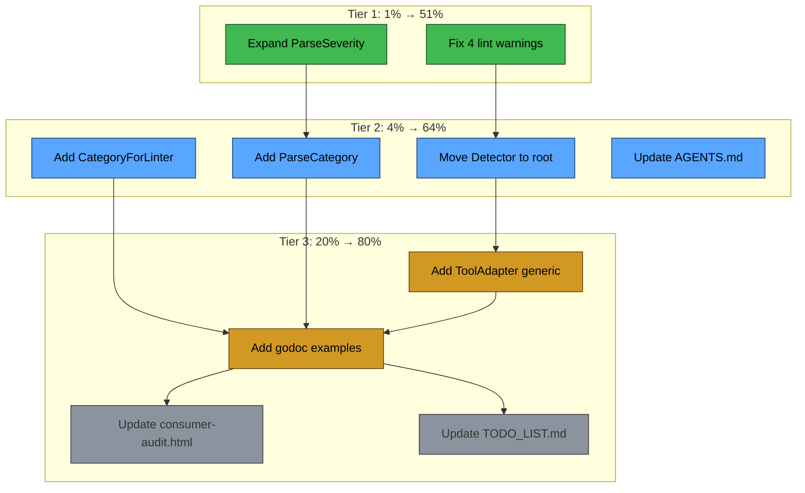

# Execution Plan — Consumer-Audit-Driven Improvements

_Date: 2026-06-09 17:20_

_Based on: Full consumer audit of 15 projects, 200+ files, 109 field settings, every exported symbol_

---

## Pareto Breakdown

### The 1% That Delivers 51% of the Result

| # | Task                                       | Why                                                        |
| - | ------------------------------------------ | ---------------------------------------------------------- |
| 1 | Fix 4 lint warnings → zero-lint codebase   | Professional quality bar; blocks nothing but signals trust |
| 2 | Expand `ParseSeverity` with common aliases | Eliminates 7 duplicated switch statements immediately      |

### The 4% That Delivers 64% of the Result (adds to 1%)

| # | Task                                                               | Why                                                              |
| - | ------------------------------------------------------------------ | ---------------------------------------------------------------- |
| 3 | Move `Detector`/`DetectorFunc`/`NamedDetectorFunc` to root package | 3 consumers can drop pipeline import; most-used pipeline concept |
| 4 | Add `CategoryForLinter()` registry function                        | Consolidates 3 identical lookup tables across repos              |
| 5 | Add `ParseCategory()` + `MustParseCategory()`                      | 3+ consumers parse category strings from config                  |
| 6 | Update AGENTS.md with audit findings                               | Knowledge persistence for future sessions                        |

### The 20% That Delivers 80% of the Result (adds to 4%)

| #  | Task                                             | Why                                                   |
| -- | ------------------------------------------------ | ----------------------------------------------------- |
| 7  | Add `ToolAdapter[O any]` generic converter       | Eliminates ~30 files of boilerplate across 5 projects |
| 8  | Add godoc examples for new APIs                  | Discoverability                                       |
| 9  | Update consumer-audit.html with field usage data | Complete the research artifact                        |
| 10 | Update TODO_LIST.md with new audit items         | Planning persistence                                  |

---

## Execution Graph

---

## Comprehensive Task List (~27 tasks, 7-30min each)

| #  | Task                                                                  | Impact          | Effort | Tier |
| -- | --------------------------------------------------------------------- | --------------- | ------ | ---- |
| 1  | Add godoc to `Finding.Validate()` (revive lint)                       | Lint fix        | 5min   | 1%   |
| 2  | Fix `merge.go:134` goconst — add `dedupStrategyRule` constant         | Lint fix        | 10min  | 1%   |
| 3  | Fix `pipeline/fix_applier.go:105,109` noinlineerr                     | Lint fix        | 10min  | 1%   |
| 4  | Verify zero lint warnings after fixes                                 | Quality         | 5min   | 1%   |
| 5  | Add `severityAliases` map to `severity.go`                            | Consumer DRY    | 10min  | 1%   |
| 6  | Update `ParseSeverity` to check aliases map                           | Consumer DRY    | 10min  | 1%   |
| 7  | Add `SeverityAliases` exported var for introspection                  | Discoverability | 5min   | 1%   |
| 8  | Add tests for alias-based ParseSeverity                               | Correctness     | 15min  | 1%   |
| 9  | Create `detector.go` in root package with Detector interface          | Architecture    | 15min  | 4%   |
| 10 | Move `DetectorFunc`, `NamedDetectorFunc`, `namedDetector` to root     | Architecture    | 15min  | 4%   |
| 11 | Update `pipeline/adapters.go` — re-export from root (backward compat) | Backward compat | 10min  | 4%   |
| 12 | Add `CategoryForLinter()` function with golangci-lint mappings        | Consumer DRY    | 15min  | 4%   |
| 13 | Add `RegisterLinterCategory()` for custom mappings                    | Extensibility   | 10min  | 4%   |
| 14 | Add tests for `CategoryForLinter` + `RegisterLinterCategory`          | Correctness     | 15min  | 4%   |
| 15 | Add `ParseCategory()` + `MustParseCategory()` functions               | Consumer DRY    | 10min  | 4%   |
| 16 | Add tests for `ParseCategory`                                         | Correctness     | 10min  | 4%   |
| 17 | Update AGENTS.md with audit findings                                  | Knowledge       | 15min  | 4%   |
| 18 | Design `ToolAdapter[O any]` type in new `adapter.go`                  | Architecture    | 20min  | 20%  |
| 19 | Implement `ToolAdapter.Run` method                                    | Feature         | 20min  | 20%  |
| 20 | Add tests for `ToolAdapter`                                           | Correctness     | 20min  | 20%  |
| 21 | Add `ToolResult` helper type for common JSON shapes                   | Convenience     | 15min  | 20%  |
| 22 | Add godoc examples for ParseSeverity, CategoryForLinter, ToolAdapter  | Discoverability | 15min  | 20%  |
| 23 | Update consumer-audit.html with field usage data                      | Research        | 15min  | 20%  |
| 24 | Update TODO_LIST.md with new audit-driven items                       | Planning        | 15min  | 20%  |
| 25 | Update FEATURES.md with new features                                  | Documentation   | 10min  | 20%  |
| 26 | Run full test suite + race detector                                   | Verification    | 5min   | All  |
| 27 | Run lint — verify zero warnings                                       | Verification    | 5min   | All  |

---

## Micro-Task Breakdown (~80 tasks, max 15min each)

### Block A: Fix Lint Warnings (Tasks 1-3, 30min)

| #   | Micro-Task                                                         | File                      | Time |
| --- | ------------------------------------------------------------------ | ------------------------- | ---- |
| M01 | Add godoc comment to `Finding.Validate()`                          | `finding_validate.go:8`   | 2min |
| M02 | Add `dedupByRule` constant in `merge.go`                           | `merge.go:134`            | 3min |
| M03 | Replace `"rule"` literal with constant in `DeduplicateBy.String()` | `merge.go:134`            | 2min |
| M04 | Refactor `fix_applier.go:105` to plain assignment                  | `pipeline/fix_applier.go` | 3min |
| M05 | Refactor `fix_applier.go:109` to plain assignment                  | `pipeline/fix_applier.go` | 3min |
| M06 | Run lint, verify 0 issues                                          | CLI                       | 3min |
| M07 | Run tests, verify pass                                             | CLI                       | 2min |

### Block B: Expand ParseSeverity (Tasks 5-8, 40min)

| #   | Micro-Task                                                | File               | Time |
| --- | --------------------------------------------------------- | ------------------ | ---- |
| M08 | Define `severityAliases` map in `severity.go`             | `severity.go`      | 5min |
| M09 | Add `SeverityAliases` exported var (copy of internal map) | `severity.go`      | 2min |
| M10 | Update `ParseSeverity` to check `severityAliases`         | `severity.go`      | 5min |
| M11 | Update `ParseSeverity` error message to mention aliases   | `severity.go`      | 3min |
| M12 | Write test: `ParseSeverity("warn") == SeverityWarning`    | `severity_test.go` | 3min |
| M13 | Write test: `ParseSeverity("high") == SeverityError`      | `severity_test.go` | 3min |
| M14 | Write test: `ParseSeverity("fatal") == SeverityCritical`  | `severity_test.go` | 3min |
| M15 | Write test: `ParseSeverity("note") == SeverityInfo`       | `severity_test.go` | 3min |
| M16 | Write test: `ParseSeverity("advice") == SeverityInfo`     | `severity_test.go` | 3min |
| M17 | Write test: `ParseSeverity("unknown") returns error`      | `severity_test.go` | 2min |
| M18 | Run tests, verify pass                                    | CLI                | 2min |

### Block C: Move Detector to Root Package (Tasks 9-11, 40min)

| #   | Micro-Task                                           | File                   | Time |
| --- | ---------------------------------------------------- | ---------------------- | ---- |
| M19 | Create `detector.go` with `Detector` interface       | `detector.go` (new)    | 5min |
| M20 | Add `DetectorFunc` type + `Detect`/`Name` methods    | `detector.go`          | 5min |
| M21 | Add `NamedDetectorFunc` + `namedDetector`            | `detector.go`          | 5min |
| M22 | Update `pipeline/adapters.go` — type aliases to root | `pipeline/adapters.go` | 5min |
| M23 | Verify pipeline tests still pass (backward compat)   | CLI                    | 5min |
| M24 | Verify cmd/go-finding still compiles                 | CLI                    | 3min |
| M25 | Verify analysis package still compiles               | CLI                    | 3min |
| M26 | Run full test suite                                  | CLI                    | 3min |

### Block D: Add CategoryForLinter (Tasks 12-14, 40min)

| #   | Micro-Task                                                   | File                       | Time  |
| --- | ------------------------------------------------------------ | -------------------------- | ----- |
| M27 | Create `category_linter.go` with `linterCategories` map      | `category_linter.go` (new) | 5min  |
| M28 | Add golangci-lint linter→category mappings                   | `category_linter.go`       | 10min |
| M29 | Add ESLint/oxlint plugin→category mappings                   | `category_linter.go`       | 5min  |
| M30 | Add Go standard analyzer mappings (vet, staticcheck)         | `category_linter.go`       | 3min  |
| M31 | Implement `CategoryForLinter(name string) Category`          | `category_linter.go`       | 5min  |
| M32 | Implement `RegisterLinterCategory(name, cat)`                | `category_linter.go`       | 3min  |
| M33 | Add `init()` to populate default mappings                    | `category_linter.go`       | 2min  |
| M34 | Write test: `CategoryForLinter("gosec") == CategorySecurity` | `category_linter_test.go`  | 3min  |
| M35 | Write test: `CategoryForLinter("revive") == CategoryStyle`   | `category_linter_test.go`  | 2min  |
| M36 | Write test: `CategoryForLinter("unknown") returns default`   | `category_linter_test.go`  | 2min  |
| M37 | Write test: `RegisterLinterCategory` override                | `category_linter_test.go`  | 3min  |
| M38 | Run tests                                                    | CLI                        | 2min  |

### Block E: Add ParseCategory (Tasks 15-16, 20min)

| #   | Micro-Task                                                       | File               | Time |
| --- | ---------------------------------------------------------------- | ------------------ | ---- |
| M39 | Add `ParseCategory(s string) (Category, error)` in `category.go` | `category.go`      | 5min |
| M40 | Add `MustParseCategory(s string) Category` in `category.go`      | `category.go`      | 3min |
| M41 | Write test: `ParseCategory("security") == CategorySecurity`      | `category_test.go` | 3min |
| M42 | Write test: `ParseCategory("unknown") returns error`             | `category_test.go` | 2min |
| M43 | Write test: `MustParseCategory` panics on invalid                | `category_test.go` | 2min |
| M44 | Run tests                                                        | CLI                | 2min |

### Block F: ToolAdapter Generic (Tasks 18-21, 75min)

| #   | Micro-Task                                                 | File               | Time  |
| --- | ---------------------------------------------------------- | ------------------ | ----- |
| M45 | Create `adapter.go` with `ToolAdapter[O any]` struct       | `adapter.go` (new) | 5min  |
| M46 | Define `ToolRunFunc` type                                  | `adapter.go`       | 2min  |
| M47 | Define `ToolConvertFunc[O any]` type                       | `adapter.go`       | 2min  |
| M48 | Implement `NewToolAdapter` constructor                     | `adapter.go`       | 5min  |
| M49 | Implement `ToolAdapter.Name()` method                      | `adapter.go`       | 2min  |
| M50 | Implement `ToolAdapter.Detect()` method                    | `adapter.go`       | 10min |
| M51 | Add `ToolResult` helper type for common shapes             | `adapter.go`       | 5min  |
| M52 | Add context cancellation support in Detect                 | `adapter.go`       | 5min  |
| M53 | Add error wrapping with `NewIOError`                       | `adapter.go`       | 3min  |
| M54 | Implement `ToolAdapter` satisfies `Detector` compile check | `adapter.go`       | 2min  |
| M55 | Write test: basic ToolAdapter end-to-end                   | `adapter_test.go`  | 10min |
| M56 | Write test: empty output returns nil                       | `adapter_test.go`  | 3min  |
| M57 | Write test: parse error wrapped correctly                  | `adapter_test.go`  | 5min  |
| M58 | Write test: context cancellation                           | `adapter_test.go`  | 5min  |
| M59 | Write test: ToolResult helper                              | `adapter_test.go`  | 3min  |
| M60 | Run tests                                                  | CLI                | 3min  |

### Block G: Godoc Examples (Task 22, 15min)

| #   | Micro-Task                                  | File                      | Time |
| --- | ------------------------------------------- | ------------------------- | ---- |
| M61 | Add `ExampleParseSeverity` godoc test       | `severity_test.go`        | 3min |
| M62 | Add `ExampleParseSeverity_alias` godoc test | `severity_test.go`        | 3min |
| M63 | Add `ExampleCategoryForLinter` godoc test   | `category_linter_test.go` | 3min |
| M64 | Add `ExampleToolAdapter` godoc test         | `adapter_test.go`         | 5min |

### Block H: Documentation Updates (Tasks 17, 23-25, 45min)

| #   | Micro-Task                                                                                 | File                                | Time  |
| --- | ------------------------------------------------------------------------------------------ | ----------------------------------- | ----- |
| M65 | Update AGENTS.md: add consumer audit findings section                                      | `AGENTS.md`                         | 10min |
| M66 | Update AGENTS.md: add new features (ParseSeverity aliases, CategoryForLinter, ToolAdapter) | `AGENTS.md`                         | 5min  |
| M67 | Update consumer-audit.html: add field usage table                                          | `docs/research/consumer-audit.html` | 10min |
| M68 | Update TODO_LIST.md: add new items from audit                                              | `TODO_LIST.md`                      | 10min |
| M69 | Update FEATURES.md: add new features                                                       | `FEATURES.md`                       | 5min  |

### Block I: Final Verification (Tasks 26-27, 10min)

| #   | Micro-Task                                      | File | Time |
| --- | ----------------------------------------------- | ---- | ---- |
| M70 | Run `nix run .#test` — all packages pass        | CLI  | 3min |
| M71 | Run `go test -race -count=1 ./...` — race clean | CLI  | 3min |
| M72 | Run `nix run .#lint` — zero warnings            | CLI  | 2min |
| M73 | Verify all new files have copyright headers     | CLI  | 2min |

---

## What Still Needs To Get Done (After This Plan)

1. **Pipeline extraction** to sub-module — large architectural change, needs ownership decision
2. **Deprecate dead API** — Suppression, Related, BeforeCode, filter combinators (pre-v1.0)
3. **Report.Findings encapsulation migration** — execute ADR 10
4. **FixApplier goroutine safety** for single-use guard
5. **Resolve Offset=0 semantic ambiguity** — API clarity
6. **Add benchmarks** for pipeline, merge, diff, filter
7. **External consumer outreach** strategy
8. **v1.0 release criteria** review and planning
9. **Code-Quality-Agent** v0.4.2 → v0.6.1 migration
10. **README overhaul** with consumer-audit-informed messaging
11. **Migration guide** for consumers with hand-rolled findings
12. **Confidence field** promotion or simplification decision
13. **Analysis subpackage** repositioning (move into pipeline or standalone)
14. **SARIF import** — invest or remove
15. **FixStrategyAI/NeedsAI** — keep, implement, or remove decision
