# SUPERB Pareto Plan — go-finding CI Hardening & Growth Execution

> **Disposition (docs-health pass 2026-09-08):** Phases 1–6 (T1–T19) fully
> executed and shipped in v1.6.0. Unmarked tasks are Phase 7 launch-track
> (TODO_LIST.md "Make Repo Public"), Phase 8/9 growth ideas (ROADMAP.md
> "FlightRecorder future directions", "Tooling integrations", "Language
> expansion", "Consumer ecosystem"), and Phase 10 v2.0 designs (ROADMAP.md
> "Hardening (owner decisions pending)"). Superseded as a tracking document by
> the 2026-09-08 master plan.

**Date:** 2026-08-08 10:55 CEST
**Source:** Consolidated from TODO_LIST.md (12 open items), status report 2026-08-08 §B-D (8 gaps), status report §F (50 next items), ROADMAP.md (20+ raw ideas)

---

## Context: Where We Are

v1.5.0 shipped (2026-08-06) with FlightRecorder, deterministic JSON, batch validation. The last session (2026-08-08) completed 11 TODO items: FlightRecorder ConfigFile integration, user guide, godoc examples, E2E tests, TOCTOU tests, 4 CI scripts, LSP benchmarks. But left gaps: AGENTS.md stale, missing CLI test, CI scripts unwired, no CHANGELOG for the new work.

The project has 22 known consumers (14 with Go code), is API-stable since v1.0.0, but the repo is **still private**. The multi-module architecture (4 Go modules) has replace directives and version sync that must be protected automatically.

---

## Step 1: Pareto Breakdown

### The 1% that delivers 51%

| #  | Task                              | Why it's the 1%                                                                                                                                                                                                                                                                         |
| -- | --------------------------------- | --------------------------------------------------------------------------------------------------------------------------------------------------------------------------------------------------------------------------------------------------------------------------------------- |
| P1 | **Wire 4 CI scripts into ci.yml** | The scripts exist, pass, and protect the multi-module architecture (replace directives, version drift, test naming, workspace sync). They are DEAD until wired. Adding 4 job blocks to existing YAML = instant automated quality gates. ~20 min for 51% of the structural safety value. |

### The 4% that delivers 64%

| #  | Task                                          | Why it's in the 4%                                                                                                                                                                    |
| -- | --------------------------------------------- | ------------------------------------------------------------------------------------------------------------------------------------------------------------------------------------- |
| P2 | **CHANGELOG entry for unreleased work**       | The FlightRecorder config-file integration, CI scripts, TOCTOU tests, and LSP benchmarks have NO CHANGELOG entry. Without it, the next release (v1.5.1 or v1.6.0) cannot happen.      |
| P3 | **AGENTS.md updates (3 new gotchas)**         | Every future AI session starts confused without these. The new `FlightRecorderFileConfig`, `ResolveFlightRecorder()`, config-file fallback, and CI scripts are invisible to sessions. |
| P4 | **Fix session debt (test + doc.go + script)** | Missing CLI validation test, doc.go godoc-unfriendly path, version-drift.sh grep imprecision. Quick fixes that prevent false confidence.                                              |

### The 20% that delivers 80%

| #   | Task                                         | Impact | Effort | Why it's in the 20%                                                                                                           |
| --- | -------------------------------------------- | ------ | ------ | ----------------------------------------------------------------------------------------------------------------------------- |
| P5  | GOWORK=off per-module isolation verification | High   | Low    | CI does this but we never verified locally. Replace directives could be silently broken for consumers.                        |
| P6  | FlightRecorderFileConfig field parity        | Med    | Low    | Pipeline has 5 fields, CLI has 3. Either align or document the decision. Prevents consumer confusion.                         |
| P7  | Docs-freshness CI check                      | Med    | Medium | Stale docs are the #1 recurring complaint in every docs-health session. Automate the detection.                               |
| P8  | Per-module CHANGELOG entries                 | Med    | Medium | 4 modules, 0 per-module changelogs. Sub-module consumers have no visibility into module-specific changes.                     |
| P9  | go-arch-lint module boundary CI              | High   | Medium | The multi-module architecture's #1 structural risk is cross-module coupling. Automated boundary enforcement = safety.         |
| P10 | docs/guides/configuration.md                 | Med    | Medium | Config-file format is documented piecemeal across flight-recorder.md, fix-engine.md, and code comments. No central reference. |
| P11 | Multi-module vs monolith benchmark           | Low    | Medium | Quantify the modularization overhead. Data-driven answer to "should we re-monolith?"                                          |

### The remaining 20% (to reach 100%)

Everything else: additional tests, FlightRecorder enhancements, public launch track, documentation, code quality refactors, v2.0 hardening, ecosystem expansion. Important but not on the critical path.

---

## Step 2: Execution Graph

```mermaid
graph TD
    subgraph "Phase 1: Fix Session Debt [URGENT]"
        T1[T1: AGENTS.md 3 gotchas]
        T2[T2: CLI validation error-path test]
        T3[T3: doc.go + version-drift.sh fixes]
        T4[T4: GOWORK=off verification]
    end

    subgraph "Phase 2: CI Activation [1%/51%]"
        T5[T5: Wire 4 CI scripts into ci.yml]
    end

    subgraph "Phase 3: Release Prep"
        T6[T6: CHANGELOG unreleased entry]
        T7[T7: FlightRecorderFileConfig parity decision]
    end

    subgraph "Phase 4: CI Quality Hardening"
        T8[T8: Docs-freshness CI check]
        T9[T9: Per-module CHANGELOGs]
        T10[T10: go-arch-lint boundary CI]
        T11[T11: Multi-module benchmark]
    end

    subgraph "Phase 5: Documentation"
        T12[T12: docs/guides/configuration.md]
        T13[T13: docs/guides/troubleshooting.md]
        T14[T14: README.md FlightRecorder mention]
        T15[T15: docs/DOMAIN_LANGUAGE.md]
    end

    subgraph "Phase 6: Testing Gaps"
        T16[T16: resolveSafePath edge cases]
        T17[T17: FlightRecorder edge cases]
        T18[T18: sanitizeFilename fuzz]
        T19[T19: SARIF schema validation]
    end

    subgraph "Phase 7: Public Launch"
        T20[T20: GoReleaser + Homebrew verification]
        T21[T21: pkg.go.dev verification]
        T22[T22: Launch announcement]
        T23[T23: Submit to Awesome Go]
    end

    subgraph "Phase 8: FlightRecorder v2"
        T24[T24: Trace file rotation + gzip]
        T25[T25: pprof capture + context propagation]
        T26[T26: OTel bridge + trace diff]
    end

    subgraph "Phase 9: Ecosystem Expansion"
        T27[T27: Consumer migration guide]
        T28[T28: More ToolAdapter recipes]
        T29[T29: LSP code action support]
        T30[T30: Language providers Rust/TS/Python]
        T31[T31: AI remediation backend]
    end

    subgraph "Phase 10: v2.0 Hardening"
        T32[T32: Position sentinel redesign]
        T33[T33: FixStrategy closed union]
        T34[T34: Tags to TagSet]
        T35[T35: Finding sub-struct composition]
    end

    T1 --> T5
    T2 --> T5
    T3 --> T5
    T4 --> T5
    T5 --> T6
    T6 --> T7
    T7 --> T8
    T7 --> T12
    T6 --> T20
    T5 --> T10
    T8 --> T9
    T10 --> T11

    T12 --> T13
    T13 --> T14
    T14 --> T15

    T16 --> T17
    T17 --> T18
    T18 --> T19

    T20 --> T21
    T21 --> T22
    T22 --> T23

    T24 --> T25
    T25 --> T26

    T27 --> T28
    T28 --> T29
    T29 --> T30
    T30 --> T31

    T32 --> T33
    T33 --> T34
    T34 --> T35
```

---

## Step 3: Comprehensive Task Plan (30–100 min tasks)

Sorted by impact/effort/customer-value. ALL open work items included.

| #        | Phase                                                                | Task                                                                                                             | Impact       | Effort     | Customer Value           | Depends On |
| -------- | -------------------------------------------------------------------- | ---------------------------------------------------------------------------------------------------------------- | ------------ | ---------- | ------------------------ | ---------- |
| ~~T1~~   | ~~1~~ done — 11-47 session A, AGENTS.md gotchas                      | ~~AGENTS.md: add 3 gotchas (FlightRecorderFileConfig, ResolveFlightRecorder, config-file fallback, CI scripts)~~ | ~~Critical~~ | ~~30 min~~ | ~~Every future session~~ | ~~—~~      |
| ~~T2~~   | ~~1~~ done — 11-47 session T2, TestPipelineConfigFile_Validate       | ~~CLI config validation error-path test (invalid slowStageThreshold)~~                                           | ~~High~~     | ~~30 min~~ | ~~Correctness~~          | ~~—~~      |
| ~~T3a~~  | ~~1~~ done — v1.6.0 CHANGELOG, doc.go section                        | ~~doc.go: fix FlightRecorder guide reference (godoc-friendly)~~                                                  | ~~Low~~      | ~~10 min~~ | ~~Docs quality~~         | ~~—~~      |
| ~~T3b~~  | ~~1~~ done — v1.6.0 CHANGELOG, version-drift.sh                      | ~~version-drift.sh: exclude `// indirect` lines from grep~~                                                      | ~~Low~~      | ~~10 min~~ | ~~CI correctness~~       | ~~—~~      |
| ~~T4~~   | ~~1~~ done — 11-47 session T4, all 4 modules PASS                    | ~~GOWORK=off per-module isolation test run (all 4 modules)~~                                                     | ~~High~~     | ~~30 min~~ | ~~Consumer safety~~      | ~~—~~      |
| ~~T5~~   | ~~2~~ done — 11-47 session T5, structural-checks + go-work-sync jobs | ~~Wire 4 CI scripts into .github/workflows/ci.yml~~                                                              | ~~Critical~~ | ~~45 min~~ | ~~Automated quality~~    | ~~T1, T2~~ |
| ~~T6~~   | ~~3~~ done — v1.6.0 CHANGELOG                                        | ~~CHANGELOG.md: add [Unreleased] entry for all new work~~                                                        | ~~Critical~~ | ~~45 min~~ | ~~Release readiness~~    | ~~T5~~     |
| ~~T7~~   | ~~3~~ done — 12-16 session T7, full parity                           | ~~FlightRecorderFileConfig: align CLI fields with pipeline or document omission~~                                | ~~Medium~~   | ~~30 min~~ | ~~API consistency~~      | ~~T6~~     |
| ~~T8~~   | ~~4~~ done — v1.6.0 CHANGELOG, scripts/docs-freshness.sh             | ~~Docs-freshness CI check script + ci.yml job~~                                                                  | ~~Medium~~   | ~~60 min~~ | ~~Doc accuracy~~         | ~~T5~~     |
| ~~T9~~   | ~~4~~ done — 12-16 session T9, per-module CHANGELOGs                 | ~~Per-module CHANGELOG.md (pipeline/, analysis/, cmd/go-finding/)~~                                              | ~~Medium~~   | ~~60 min~~ | ~~Consumer visibility~~  | ~~T6~~     |
| ~~T10~~  | ~~4~~ done — 12-44 session T10, arch-check job                       | ~~go-arch-lint module boundary enforcement (script + ci.yml)~~                                                   | ~~High~~     | ~~90 min~~ | ~~Architecture safety~~  | ~~T5~~     |
| ~~T11~~  | ~~4~~ done — docs/reports/2026-08-08_multi-module-vs-monolith.md     | ~~Multi-module vs monolith benchmark comparison~~                                                                | ~~Low~~      | ~~60 min~~ | ~~Data for decisions~~   | ~~T5~~     |
| ~~T12~~  | ~~5~~ done — docs/guides/configuration.md                            | ~~docs/guides/configuration.md (central config reference)~~                                                      | ~~Medium~~   | ~~60 min~~ | ~~Onboarding~~           | ~~T7~~     |
| ~~T13~~  | ~~5~~ done — docs/guides/troubleshooting.md                          | ~~docs/guides/troubleshooting.md (common pipeline errors)~~                                                      | ~~Medium~~   | ~~90 min~~ | ~~Support reduction~~    | ~~—~~      |
| ~~T14~~  | ~~5~~ done — README.md flight recorder row                           | ~~README.md: add FlightRecorder to feature table~~                                                               | ~~Low~~      | ~~30 min~~ | ~~Discoverability~~      | ~~—~~      |
| ~~T15~~  | ~~5~~ done — v1.6.0 CHANGELOG, DOMAIN_LANGUAGE                       | ~~docs/DOMAIN_LANGUAGE.md (pipeline domain terms glossary)~~                                                     | ~~Medium~~   | ~~90 min~~ | ~~Shared vocabulary~~    | ~~—~~      |
| ~~T16~~  | ~~6~~ done — v1.6.0 CHANGELOG, symlink edge tests                    | ~~resolveSafePath: circular symlinks, dangling symlinks, root-is-symlink tests~~                                 | ~~Medium~~   | ~~45 min~~ | ~~Security~~             | ~~—~~      |
| ~~T17~~  | ~~6~~ done — v1.6.0 CHANGELOG, FR edge tests                         | ~~FlightRecorder: disk-full error path, last-stage threshold, concurrent detector tests~~                        | ~~Medium~~   | ~~60 min~~ | ~~Correctness~~          | ~~—~~      |
| ~~T18~~  | ~~6~~ done — FuzzSanitizeFilename                                    | ~~sanitizeFilename property-based / fuzz test~~                                                                  | ~~Low~~      | ~~30 min~~ | ~~Correctness~~          | ~~—~~      |
| ~~T19~~  | ~~6~~ done — lightweight variant, sarif_properties_test.go           | ~~SARIF schema validation test (vendor schema or lightweight validator)~~                                        | ~~Low~~      | ~~90 min~~ | ~~Interop safety~~       | ~~—~~      |
| T20      | 7                                                                    | Verify GoReleaser + Homebrew tap works on public tag                                                             | High         | 45 min     | Distribution             | T6         |
| T21      | 7                                                                    | Verify pkg.go.dev renders after first public tag                                                                 | Medium       | 30 min     | Discoverability          | T20        |
| T22      | 7                                                                    | Write launch announcement (blog/r/golang/Slack)                                                                  | High         | 90 min     | Adoption                 | T21        |
| T23      | 7                                                                    | Submit to Awesome Go                                                                                             | Low          | 30 min     | Discoverability          | T22        |
| T24a     | 8                                                                    | FlightRecorder trace file rotation (max-files/max-bytes)                                                         | Medium       | 90 min     | Operability              | —          |
| T24b     | 8                                                                    | FlightRecorder compressed trace output (gzip)                                                                    | Low          | 45 min     | Disk efficiency          | T24a       |
| T25a     | 8                                                                    | FlightRecorder automatic pprof capture alongside traces                                                          | Low          | 60 min     | Diagnostics              | —          |
| ~~T25b~~ | ~~8~~ done — v1.6.0 CHANGELOG, Snapshot ctx                          | ~~FlightRecorder context propagation in writeSnapshot~~                                                          | ~~Low~~      | ~~45 min~~ | ~~Cancellation~~         | ~~—~~      |
| ~~T25c~~ | ~~8~~ done — v1.6.0 CHANGELOG, Degraded mode                         | ~~FlightRecorder multiple recorder graceful degradation~~                                                        | ~~Low~~      | ~~60 min~~ | ~~Robustness~~           | ~~—~~      |
| T26a     | 8                                                                    | FlightRecorder OpenTelemetry bridge                                                                              | Low          | 120 min    | Distributed tracing      | —          |
| T26b     | 8                                                                    | FlightRecorder trace diff tool                                                                                   | Low          | 120 min    | Diagnostics              | —          |
| ~~T27~~  | ~~9~~ done — docs/guides/consumer-migration-v1.7.md + v1.3           | ~~Consumer migration guide (v1.3/v1.4 APIs simplified)~~                                                         | ~~Medium~~   | ~~60 min~~ | ~~Adoption~~             | ~~—~~      |
| T28      | 9                                                                    | More ToolAdapter[O] recipes (revive, errcheck, etc.)                                                             | Low          | 90 min     | Ecosystem                | —          |
| T29      | 9                                                                    | LSP code action support (LSPCodeAction wire types)                                                               | Medium       | 90 min     | IDE integration          | —          |
| T30a     | 9                                                                    | Language provider: Rust (syn-based)                                                                              | Low          | 120 min    | Language expansion       | —          |
| T30b     | 9                                                                    | Language provider: TypeScript (tree-sitter)                                                                      | Low          | 120 min    | Language expansion       | —          |
| T30c     | 9                                                                    | Language provider: Python (ast/libcst)                                                                           | Low          | 120 min    | Language expansion       | —          |
| T31      | 9                                                                    | AI-assisted remediation backend (AIProvider interface)                                                           | High         | 120 min    | Core product vision      | —          |
| T32      | 10                                                                   | v2.0: Position sentinel redesign (Option[T] generics)                                                            | High         | 120 min    | Type safety              | —          |
| T33      | 10                                                                   | v2.0: FixStrategy closed union (interface-based)                                                                 | Medium       | 90 min     | Type safety              | —          |
| T34      | 10                                                                   | v2.0: Tags to TagSet (map[Tag]struct{})                                                                          | Medium       | 90 min     | Type safety              | —          |
| T35      | 10                                                                   | v2.0: Finding sub-struct composition                                                                             | High         | 120 min    | Data model               | —          |

**Total: 42 tasks, ~40 hours estimated**

---

## Step 4: Micro-Task Breakdown (≤12 min each)

Each task from Step 3 decomposed into actionable micro-steps. Sorted within each task by execution order.

| Task       | Step  | Micro-Task                                                                                                      | Est.   |
| ---------- | ----- | --------------------------------------------------------------------------------------------------------------- | ------ |
| **T1**     | 1.1   | Read AGENTS.md "Important Behaviors" section, find insertion point                                              | 2 min  |
|            | 1.2   | Write FlightRecorderFileConfig/ResolveFlightRecorder gotcha entry                                               | 5 min  |
|            | 1.3   | Write CLI config-file flight recorder fallback gotcha entry                                                     | 4 min  |
|            | 1.4   | Write CI scripts (replace-audit, version-drift, test-naming, go-work-sync) gotcha entry                         | 5 min  |
|            | 1.5   | Update CLI Features section with config-file flightRecorder mention                                             | 3 min  |
|            | 1.6   | Update Key Files table with config_file.go FlightRecorder fields                                                | 2 min  |
|            | 1.7   | Verify build + lint still pass                                                                                  | 3 min  |
| **T2**     | 2.1   | Read cmd/go-finding/config.go validate() method                                                                 | 2 min  |
|            | 2.2   | Read cmd/go-finding/integration_run_test.go test patterns                                                       | 2 min  |
|            | 2.3   | Write TestLoadConfig_InvalidFlightRecorderSlowStage test                                                        | 5 min  |
|            | 2.4   | Run test, verify it fails on the validation error                                                               | 2 min  |
| **T3a**    | 3.1   | Read doc.go FlightRecorder section                                                                              | 2 min  |
|            | 3.2   | Replace `docs/guides/flight-recorder.md` with godoc-safe phrasing                                               | 3 min  |
|            | 3.3   | Verify `go doc` still renders                                                                                   | 2 min  |
| **T3b**    | 3.4   | Read scripts/version-drift.sh                                                                                   | 2 min  |
|            | 3.5   | Update grep pattern to exclude `// indirect` lines                                                              | 5 min  |
|            | 3.6   | Run script, verify still passes                                                                                 | 2 min  |
| **T4**     | 4.1   | Run `cd . && GOWORK=off GOEXPERIMENT=jsonv2 go build ./...`                                                     | 2 min  |
|            | 4.2   | Run `cd . && GOWORK=off GOEXPERIMENT=jsonv2 go test ./...`                                                      | 5 min  |
|            | 4.3   | Run same for pipeline/ module                                                                                   | 5 min  |
|            | 4.4   | Run same for analysis/ module                                                                                   | 3 min  |
|            | 4.5   | Run same for cmd/go-finding/ module                                                                             | 5 min  |
|            | 4.6   | Document results in AGENTS.md if any issues                                                                     | 5 min  |
| **T5**     | 5.1   | Read .github/workflows/ci.yml structure                                                                         | 3 min  |
|            | 5.2   | Add `replace-audit` job (checkout + run script)                                                                 | 5 min  |
|            | 5.3   | Add `version-drift` job (checkout + run script)                                                                 | 5 min  |
|            | 5.4   | Add `test-naming` job (checkout + run script)                                                                   | 5 min  |
|            | 5.5   | Add `go-work-sync` job (checkout + setup-go + run script)                                                       | 5 min  |
|            | 5.6   | Add `paths-ignore` check (only run on Go/config changes)                                                        | 3 min  |
|            | 5.7   | Validate ci.yml YAML syntax                                                                                     | 2 min  |
|            | 5.8   | Push and verify CI runs the new jobs                                                                            | 5 min  |
|            | 5.9   | Fix any CI failures                                                                                             | 12 min |
| **T6**     | 6.1   | Read CHANGELOG.md [Unreleased] section                                                                          | 2 min  |
|            | 6.2   | List all commits since v1.5.0 tag                                                                               | 3 min  |
|            | 6.3   | Draft Added section (FlightRecorderFileConfig, ResolveFlightRecorder, CI scripts, TOCTOU tests, LSP benchmarks) | 8 min  |
|            | 6.4   | Draft Changed section (CLI config fallback, version-drift.sh fix)                                               | 4 min  |
|            | 6.5   | Insert into CHANGELOG.md under [Unreleased]                                                                     | 5 min  |
|            | 6.6   | Verify markdown formatting                                                                                      | 2 min  |
| **T7**     | 7.1   | Read pipeline FlightRecorderFileConfig (5 fields)                                                               | 2 min  |
|            | 7.2   | Read CLI flightRecorderFileConfig (3 fields)                                                                    | 2 min  |
|            | 7.3   | Decision: add minAge + maxBytes to CLI config, or document omission                                             | 5 min  |
|            | 7.4   | Execute decision (add fields or add doc comment)                                                                | 5 min  |
|            | 7.5   | Update docs/guides/flight-recorder.md config table if needed                                                    | 5 min  |
|            | 7.6   | Verify build + test                                                                                             | 3 min  |
| **T8**     | 8.1   | Design docs-freshness check: find files >N days without git log touch                                           | 5 min  |
|            | 8.2   | Write scripts/docs-freshness.sh                                                                                 | 10 min |
|            | 8.3   | Test script locally                                                                                             | 3 min  |
|            | 8.4   | Add ci.yml job                                                                                                  | 5 min  |
|            | 8.5   | Push and verify                                                                                                 | 5 min  |
| **T9**     | 9.1   | Create pipeline/CHANGELOG.md skeleton                                                                           | 3 min  |
|            | 9.2   | Create analysis/CHANGELOG.md skeleton                                                                           | 3 min  |
|            | 9.3   | Create cmd/go-finding/CHANGELOG.md skeleton                                                                     | 3 min  |
|            | 9.4   | Populate each with [Unreleased] entries from git log                                                            | 10 min |
|            | 9.5   | Add cross-reference from root CHANGELOG.md                                                                      | 3 min  |
|            | 9.6   | Update AGENTS.md Project Documentation Files table                                                              | 3 min  |
| **T10**    | 10.1  | Research go-arch-lint capabilities and config format                                                            | 10 min |
|            | 10.2  | Write go-arch-lint config defining module boundaries                                                            | 10 min |
|            | 10.3  | Run go-arch-lint locally, fix violations                                                                        | 12 min |
|            | 10.4  | Add ci.yml job                                                                                                  | 5 min  |
|            | 10.5  | Push and verify                                                                                                 | 5 min  |
| **T11**    | 11.1  | Create single-module variant (temp: flatten go.work)                                                            | 10 min |
|            | 11.2  | Run benchmark on multi-module                                                                                   | 5 min  |
|            | 11.3  | Run benchmark on single-module                                                                                  | 5 min  |
|            | 11.4  | Compare with benchstat                                                                                          | 5 min  |
|            | 11.5  | Write results to docs/reports/                                                                                  | 10 min |
| **T12**    | 12.1  | Inventory all config-file options across all modules                                                            | 5 min  |
|            | 12.2  | Write docs/guides/configuration.md covering all options                                                         | 10 min |
|            | 12.3  | Add YAML + JSON examples for each config section                                                                | 10 min |
|            | 12.4  | Cross-reference from README and other guides                                                                    | 5 min  |
| **T13**    | 13.1  | Collect common error messages from pipeline code                                                                | 10 min |
|            | 13.2  | Write troubleshooting entries (what/why/fix format)                                                             | 12 min |
|            | 13.3  | Add to docs/guides/troubleshooting.md                                                                           | 10 min |
| **T14**    | 14.1  | Read README.md feature table                                                                                    | 2 min  |
|            | 14.2  | Add FlightRecorder row                                                                                          | 3 min  |
|            | 14.3  | Add config-file integration mention                                                                             | 3 min  |
| **T15**    | 15.1  | Read existing code for domain terms (Finding, Report, Pipeline, etc.)                                           | 10 min |
|            | 15.2  | Write docs/DOMAIN_LANGUAGE.md with glossary                                                                     | 12 min |
|            | 15.3  | Add ubiquitous language section                                                                                 | 5 min  |
| **T16**    | 16.1  | Write circular symlink test                                                                                     | 5 min  |
|            | 16.2  | Write dangling/broken symlink test                                                                              | 5 min  |
|            | 16.3  | Write root-is-symlink test                                                                                      | 5 min  |
|            | 16.4  | Run + verify                                                                                                    | 3 min  |
| **T17**    | 17.1  | Write disk-full error path test (mock or tmpfs quota)                                                           | 10 min |
|            | 17.2  | Write SlowStageThreshold on last-stage test                                                                     | 10 min |
|            | 17.3  | Write concurrent detector + flight recorder test                                                                | 10 min |
|            | 17.4  | Run + verify                                                                                                    | 5 min  |
| **T18**    | 18.1  | Write fuzz test for sanitizeFilename                                                                            | 10 min |
|            | 18.2  | Run fuzz for 1 minute                                                                                           | 2 min  |
| **T19**    | 19.1  | Evaluate SARIF schema vendoring vs lightweight JSON validator                                                   | 10 min |
|            | 19.2  | Implement chosen approach                                                                                       | 12 min |
|            | 19.3  | Write test that validates ToSARIF output against schema                                                         | 10 min |
|            | 19.4  | Run + verify                                                                                                    | 5 min  |
| **T20**    | 20.1  | Read .github/workflows/release.yml                                                                              | 3 min  |
|            | 20.2  | Verify GoReleaser config exists and is valid                                                                    | 5 min  |
|            | 20.3  | Check HOMEBREW_TAP_GITHUB_TOKEN secret exists                                                                   | 5 min  |
|            | 20.4  | Dry-run or test on a pre-release tag                                                                            | 10 min |
| **T21**    | 21.1  | After repo goes public, trigger `go get`                                                                        | 5 min  |
|            | 21.2  | Check pkg.go.dev renders                                                                                        | 5 min  |
|            | 21.3  | Fix any godoc rendering issues                                                                                  | 10 min |
| **T22**    | 22.1  | Draft blog post outline                                                                                         | 10 min |
|            | 22.2  | Write announcement body                                                                                         | 12 min |
|            | 22.3  | Post to r/golang, Slack, Twitter                                                                                | 5 min  |
| **T23**    | 23.1  | Find Awesome Go submission process                                                                              | 3 min  |
|            | 23.2  | Submit PR to awesome-go repo                                                                                    | 10 min |
| **T24a**   | 24a.1 | Design rotation config fields (MaxFiles, MaxTotalBytes)                                                         | 5 min  |
|            | 24a.2 | Implement rotation logic in flight_recorder.go                                                                  | 10 min |
|            | 24a.3 | Write rotation tests                                                                                            | 10 min |
| **T24b**   | 24b.1 | Add gzip compression to writeSnapshot                                                                           | 8 min  |
|            | 24b.2 | Update file extension to .trace.gz                                                                              | 4 min  |
| **T25a**   | 25a.1 | Add pprof capture alongside trace snapshot                                                                      | 10 min |
|            | 25a.2 | Test pprof + trace coexistence                                                                                  | 5 min  |
| **T25b**   | 25b.1 | Add context.Context to writeSnapshot signature                                                                  | 8 min  |
|            | 25b.2 | Update callers                                                                                                  | 5 min  |
| **T25c**   | 25c.1 | Detect pre-existing recorder, degrade gracefully                                                                | 10 min |
|            | 25c.2 | Test degradation behavior                                                                                       | 5 min  |
| **T26a**   | 26a.1 | Design OTel span mapping from trace data                                                                        | 10 min |
|            | 26a.2 | Implement bridge                                                                                                | 12 min |
| **T26b**   | 26b.1 | Design trace diff algorithm                                                                                     | 10 min |
|            | 26b.2 | Implement diff tool                                                                                             | 12 min |
| **T27**    | 27.1  | List all v1.3/v1.4 convenience APIs                                                                             | 5 min  |
|            | 27.2  | Write migration examples for each                                                                               | 10 min |
|            | 27.3  | Publish as docs/guides/consumer-migration-v1.5.md                                                               | 5 min  |
| **T28**    | 28.1  | Pick 3 linters (revive, errcheck, ineffassign)                                                                  | 3 min  |
|            | 28.2  | Write ToolAdapter for each                                                                                      | 12 min |
|            | 28.3  | Write tests                                                                                                     | 10 min |
| **T29**    | 29.1  | Design LSPCodeAction wire type                                                                                  | 10 min |
|            | 29.2  | Implement ToCodeActions() on Finding                                                                            | 12 min |
| **T30a-c** | 30.1  | Design provider interface for non-Go languages                                                                  | 10 min |
|            | 30.2  | Implement chosen language provider (per language)                                                               | 12 min |
| **T31**    | 31.1  | Design AIProvider interface                                                                                     | 10 min |
|            | 31.2  | Implement sandboxed apply + verification                                                                        | 12 min |
| **T32**    | 32.1  | Design Option[T] position type                                                                                  | 10 min |
|            | 32.2  | Migrate all constructors                                                                                        | 12 min |
| **T33**    | 33.1  | Design Fix interface union                                                                                      | 8 min  |
|            | 33.2  | Migrate FixStrategy constants                                                                                   | 10 min |
| **T34**    | 34.1  | Implement TagSet type                                                                                           | 10 min |
|            | 34.2  | Update Equal() to use TagSet                                                                                    | 5 min  |
| **T35**    | 35.1  | Design Identity/Location/Classification/Fix sub-structs                                                         | 12 min |
|            | 35.2  | Update JSON marshaling                                                                                          | 12 min |

---

## Execution Priority Order

### Do First (Critical Path — Blocks Everything)

1. **T1** — AGENTS.md (prevents session confusion)
2. **T2** — CLI validation test (correctness)
3. **T3a+T3b** — doc.go + version-drift.sh fixes (quality)
4. **T4** — GOWORK=off verification (consumer safety)
5. **T5** — Wire CI scripts (the 1%/51%)
6. **T6** — CHANGELOG entry (release readiness)

### Do Next (High Value)

7. **T7** — FlightRecorderFileConfig parity
8. **T10** — go-arch-lint module boundaries
9. **T16** — resolveSafePath edge cases
10. **T17** — FlightRecorder edge cases
11. **T8** — Docs-freshness CI
12. **T9** — Per-module CHANGELOGs

### Do Later (Medium Value)

13. **T12** — Configuration guide
14. **T11** — Multi-module benchmark
15. **T13** — Troubleshooting guide
16. **T14** — README update
17. **T15** — Domain language
18. **T18** — Fuzz test

### Do When Ready (Launch Track — Needs Repo Public)

19. **T20** — GoReleaser verification
20. **T21** — pkg.go.dev verification
21. **T22** — Launch announcement
22. **T23** — Awesome Go submission
23. **T19** — SARIF schema validation

### Do Eventually (Strategic)

24-35: FlightRecorder enhancements, ecosystem expansion, v2.0 hardening

---

## Risk Assessment: What Could Go Wrong (Verschlimmbessern Check)

| Risk                                                | Mitigation                                             |
| --------------------------------------------------- | ------------------------------------------------------ |
| CI script jobs slow down CI pipeline                | All scripts are <1s; only go-work-sync takes ~10s      |
| Adding minAge/maxBytes to CLI config confuses users | Keep the 3-field default, document advanced knobs      |
| go-arch-lint false positives on test packages       | Configure allow-rules for `_test.go` cross-module refs |
| Per-module CHANGELOGs drift from root CHANGELOG     | Root CHANGELOG references sub-module CHANGELOGs        |
| Trace file rotation deletes needed traces           | Default to keep-all, opt-in rotation                   |
| LSP code action changes break existing consumers    | Feature-flagged, additive only                         |

---

_Assisted-by: Crush <crush@charm.land>_
