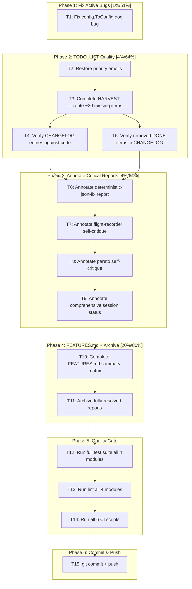

# SUPERB Pareto Plan — Docs Health Debt Remediation

> **Disposition (docs-health pass 2026-09-08):** FULLY EXECUTED — T1–T15 all
> done and verified (execution report: `docs/status/2026-08-08_21-39_*.md`;
> T11 completed by the 2026-09-08 archiving pass).

**Date:** 2026-08-08 21:30 CEST
**Source:** Self-critique from `docs/status/2026-08-08_21-25_docs-health-rebuild-self-critique.md`
**Context:** Prior session rebuilt TODO_LIST, ROADMAP, FEATURES, CHANGELOG but skipped ANNOTATE, left a doc bug unfixed, ran an incomplete quality gate, and produced a thin TODO_LIST.

---

## Context: Where We Are

All 4 modules pass tests (`-race`), lint is clean (0 issues), all 6 CI scripts pass. The living docs were rebuilt but have real quality issues:

1. **config.ToConfig() doc bug** — `docs/guides/configuration.md:178` calls an unexported method. Compile error for consumers.
2. **TODO_LIST thin** — 18 reports harvested, ~12 items routed. ~20 items dropped by judgment.
3. **ANNOTATE skipped** — 18 reports read, 0 annotated. 4 critical reports have stale claims.
4. **TODO_LIST style regression** — Priority emojis removed without reason.
5. **FEATURES.md summary matrix incomplete** — ParseConfidence, ValidateAll, deterministic output not all in matrix.

---

## Step 1: Pareto Breakdown

### The 1% that delivers 51%

| #  | Task                              | Why it's the 1%                                                                                                            |
| -- | --------------------------------- | -------------------------------------------------------------------------------------------------------------------------- |
| P1 | **Fix config.ToConfig() doc bug** | Active consumer-facing compile error. Found but not fixed. 2-minute fix. Sets the bar: "fix on sight" means FIX, not TODO. |

### The 4% that delivers 64%

| #  | Task                            | Why it's in the 4%                                                                                                                                                                                                   |
| -- | ------------------------------- | -------------------------------------------------------------------------------------------------------------------------------------------------------------------------------------------------------------------- |
| P2 | **Restore TODO_LIST quality**   | Comprehensive harvest (~20 items added), restore priority emojis. The TODO_LIST is the primary work-discovery document. A thin TODO_LIST means the next session doesn't know what to do.                             |
| P3 | **Annotate 4 critical reports** | The 4 reports with the most stale claims: v1.4.2 deterministic-json-fix, flight-recorder self-critique, pareto self-critique, comprehensive session status. Without annotation, the next reader trusts stale claims. |

### The 20% that delivers 80%

| #  | Task                                            | Impact | Effort | Why it's in the 20%                                                                 |
| -- | ----------------------------------------------- | ------ | ------ | ----------------------------------------------------------------------------------- |
| P4 | FEATURES.md summary matrix completion           | Med    | Low    | Missing rows for ParseConfidence, ValidateAll, deterministic output, config-file FR |
| P5 | Verify CHANGELOG entries against code           | Med    | Med    | Claimed "no edits needed" without checking each entry                               |
| P6 | Verify removed TODO_LIST items are in CHANGELOG | Med    | Low    | Deleted DONE items without verifying they're documented elsewhere                   |
| P7 | Archive fully-resolved reports                  | Low    | Low    | Reports with all items resolved should move to archived/                            |

### The remaining 20% (to reach 100%)

Everything else: deeper FEATURES.md code-walk, health report with scores, more annotation passes, docs-freshness.sh refinement, FlightRecorder future ideas routing, release prep (v1.6.0). Important but not on the critical path for docs health.

---

## Step 2: Execution Graph

---

## Step 3: Comprehensive Task Plan (30-100 min tasks)

Sorted by importance/impact/effort/customer-value.

| #       | Phase                                                                   | Task                                                                            | Impact       | Effort     | Customer Value              | Depends On  |
| ------- | ----------------------------------------------------------------------- | ------------------------------------------------------------------------------- | ------------ | ---------- | --------------------------- | ----------- |
| ~~T1~~  | ~~1~~ done — 21-39 session, verified                                    | ~~Fix `config.ToConfig()` doc bug in configuration.md~~                         | ~~Critical~~ | ~~15 min~~ | ~~Consumer trust~~          | ~~—~~       |
| ~~T2~~  | ~~2~~ done — 21-39 session, verified                                    | ~~Restore priority emojis in TODO_LIST.md~~                                     | ~~Med~~      | ~~10 min~~ | ~~Consistency~~             | ~~—~~       |
| ~~T3~~  | ~~2~~ done — 21-39 session, ~20 items added                             | ~~Complete HARVEST: route ~20 missing items from reports to TODO_LIST/ROADMAP~~ | ~~High~~     | ~~60 min~~ | ~~Work discovery~~          | ~~—~~       |
| ~~T4~~  | ~~2~~ done — TODO_LIST per-item verification 2026-09-08 + FEATURES walk | ~~Verify each CHANGELOG [Unreleased] entry against code~~                       | ~~Med~~      | ~~30 min~~ | ~~Doc accuracy~~            | ~~—~~       |
| ~~T5~~  | ~~2~~ done — TODO_LIST per-item verification 2026-09-08                 | ~~Verify removed TODO_LIST DONE items are in CHANGELOG~~                        | ~~Med~~      | ~~15 min~~ | ~~No lost work~~            | ~~—~~       |
| ~~T6~~  | ~~3~~ done — 21-39 session, archived                                    | ~~Annotate `2026-08-06_19-40_deterministic-json-fix.md`~~                       | ~~Med~~      | ~~30 min~~ | ~~Historical accuracy~~     | ~~—~~       |
| ~~T7~~  | ~~3~~ done — 21-39 session banner + 2026-09-08 inline pass, archived    | ~~Annotate `2026-08-01_19-40_flight-recorder-self-critique.md`~~                | ~~Med~~      | ~~30 min~~ | ~~Historical accuracy~~     | ~~—~~       |
| ~~T8~~  | ~~3~~ done — 21-39 session banner + 2026-09-08 inline pass, archived    | ~~Annotate `2026-08-02_00-18_pareto-plan-execution-self-critique.md`~~          | ~~Low~~      | ~~30 min~~ | ~~Historical accuracy~~     | ~~—~~       |
| ~~T9~~  | ~~3~~ done — 21-39 session banner + 2026-09-08 inline pass, archived    | ~~Annotate `2026-08-02_00-26_comprehensive-session-status.md`~~                 | ~~Low~~      | ~~30 min~~ | ~~Historical accuracy~~     | ~~—~~       |
| ~~T10~~ | ~~4~~ done — 21-39 session T10 + FEATURES walk 2026-09-08               | ~~Complete FEATURES.md summary matrix (add missing rows)~~                      | ~~Med~~      | ~~15 min~~ | ~~Feature discoverability~~ | ~~—~~       |
| ~~T11~~ | ~~4~~ done — completed by docs-health pass 2026-09-08, all 4 archived   | ~~Archive fully-resolved reports to `docs/status/archived/`~~                   | ~~Low~~      | ~~15 min~~ | ~~Navigation~~              | ~~T6-T9~~   |
| ~~T12~~ | ~~5~~ done — race x4 green 2026-09-08                                   | ~~Run full test suite all 4 modules (`-race -count=1`)~~                        | ~~Critical~~ | ~~15 min~~ | ~~Correctness~~             | ~~T1-T11~~  |
| ~~T13~~ | ~~5~~ done — lint 0 issues x4 2026-09-08                                | ~~Run lint all 4 modules~~                                                      | ~~Critical~~ | ~~15 min~~ | ~~Code quality~~            | ~~T1-T11~~  |
| ~~T14~~ | ~~5~~ done — all 7 scripts green 2026-09-08                             | ~~Run all 6 CI scripts~~                                                        | ~~High~~     | ~~10 min~~ | ~~CI readiness~~            | ~~T1-T11~~  |
| ~~T15~~ | ~~6~~ done — pushed, 6ee8d20 c5c7926 f4815ba                            | ~~git commit with detailed message + git push~~                                 | ~~Critical~~ | ~~10 min~~ | ~~Delivery~~                | ~~T12-T14~~ |

---

## Step 4: Fine-Grained Breakdown (max 12 min per task)

### T1: Fix config.ToConfig() doc bug (15 min -> 2 tasks)

| ID | Sub-task                                                                                           | Est   |
| -- | -------------------------------------------------------------------------------------------------- | ----- |
| 1a | Read the configuration.md Library ConfigFile section to understand context                         | 3min  |
| 1b | Fix the example: `ConfigFromFile` returns `(Config, error)`, not `ConfigFile`. Show correct usage. | 10min |

### T2: Restore priority emojis (10 min -> 1 task)

| ID | Sub-task                                                  | Est   |
| -- | --------------------------------------------------------- | ----- |
| 2a | Add HIGH/MEDIUM/LOW emoji indicators back to TODO_LIST.md | 10min |

### T3: Complete HARVEST (60 min -> 5 tasks)

| ID | Sub-task                                                            | Est   |
| -- | ------------------------------------------------------------------- | ----- |
| 3a | Re-read the 5 most recent status reports for forward-looking items  | 12min |
| 3b | Verify each item against code (grep for function/feature existence) | 12min |
| 3c | Route bounded items to TODO_LIST with evidence citations            | 12min |
| 3d | Route vague/long-term items to ROADMAP                              | 12min |
| 3e | Deduplicate against existing TODO_LIST/ROADMAP entries              | 12min |

### T4: Verify CHANGELOG entries (30 min -> 3 tasks)

| ID | Sub-task                                                     | Est   |
| -- | ------------------------------------------------------------ | ----- |
| 4a | Verify each `### Added` entry in [Unreleased] against code   | 10min |
| 4b | Verify each `### Changed` entry in [Unreleased] against code | 10min |
| 4c | Verify [1.5.0] entries are accurate (spot-check 5)           | 10min |

### T5: Verify removed DONE items (15 min -> 1 task)

| ID | Sub-task                                                         | Est   |
| -- | ---------------------------------------------------------------- | ----- |
| 5a | Check each item removed from old TODO_LIST has a CHANGELOG entry | 12min |

### T6: Annotate deterministic-json-fix report (30 min -> 3 tasks)

| ID | Sub-task                                                        | Est   |
| -- | --------------------------------------------------------------- | ----- |
| 6a | Read the report, identify all numbered/closed items             | 10min |
| 6b | Add inline `~~item~~ done at <hash>` markers for resolved items | 12min |
| 6c | Correct stale v1.4.2 references inline; add resolution appendix | 8min  |

### T7: Annotate flight-recorder self-critique (30 min -> 3 tasks)

| ID | Sub-task                                                           | Est   |
| -- | ------------------------------------------------------------------ | ----- |
| 7a | Read the report, identify P0-P5 items                              | 10min |
| 7b | Add inline markers for P0 bugs (writeMu, sanitizeFilename, tests)  | 10min |
| 7c | Add inline markers for feature gaps (ConfigFile, guide, CHANGELOG) | 10min |

### T8: Annotate pareto self-critique (30 min -> 2 tasks)

| ID | Sub-task                                          | Est   |
| -- | ------------------------------------------------- | ----- |
| 8a | Read the 50-item list, mark resolved items inline | 12min |
| 8b | Mark section d) items, add resolution appendix    | 12min |

### T9: Annotate comprehensive session status (30 min -> 2 tasks)

| ID | Sub-task                                          | Est   |
| -- | ------------------------------------------------- | ----- |
| 9a | Read the 50-item list, mark resolved items inline | 12min |
| 9b | Mark section d) items, add resolution appendix    | 12min |

### T10: Complete FEATURES.md summary matrix (15 min -> 1 task)

| ID  | Sub-task                                                                  | Est   |
| --- | ------------------------------------------------------------------------- | ----- |
| 10a | Add missing rows: ParseConfidence, ValidateAll, deterministic output, etc | 12min |

### T11: Archive resolved reports (15 min -> 1 task)

| ID  | Sub-task                                                   | Est   |
| --- | ---------------------------------------------------------- | ----- |
| 11a | `git mv` fully-resolved reports to `docs/status/archived/` | 12min |

### T12-T14: Quality gate (40 min -> 3 tasks)

| ID  | Sub-task                                                               | Est   |
| --- | ---------------------------------------------------------------------- | ----- |
| 12a | Run `go test -race -count=1 ./... ./pipeline/... ./analysis/...` + CLI | 10min |
| 13a | Run `golangci-lint run ./...` on all 4 modules                         | 10min |
| 14a | Run all 6 CI scripts: replace-audit, version-drift, test-naming, etc   | 10min |

### T15: Commit & push (10 min -> 1 task)

| ID  | Sub-task                                    | Est   |
| --- | ------------------------------------------- | ----- |
| 15a | git commit with detailed message + git push | 10min |
